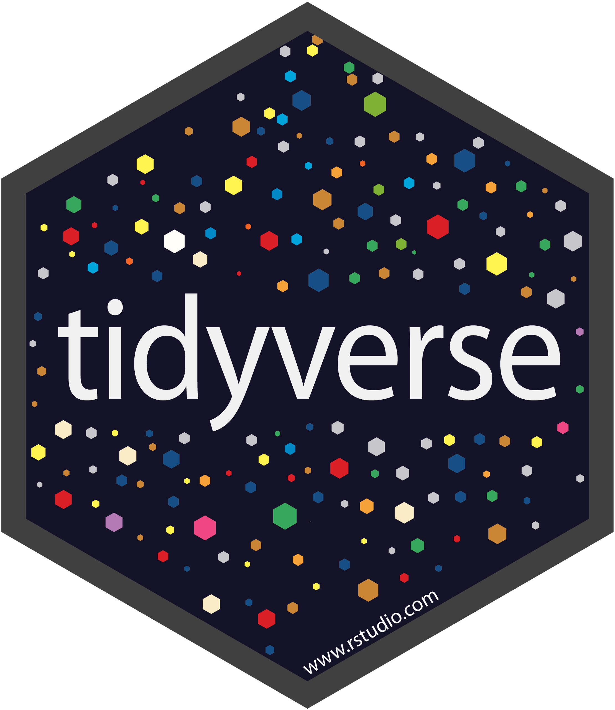
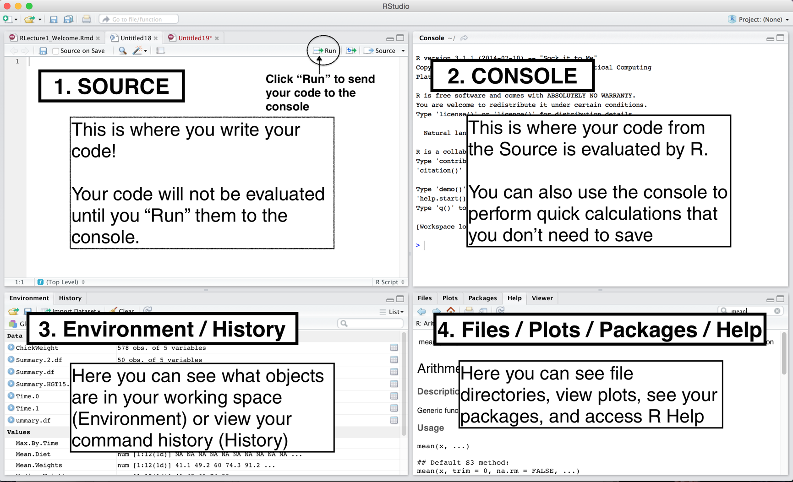
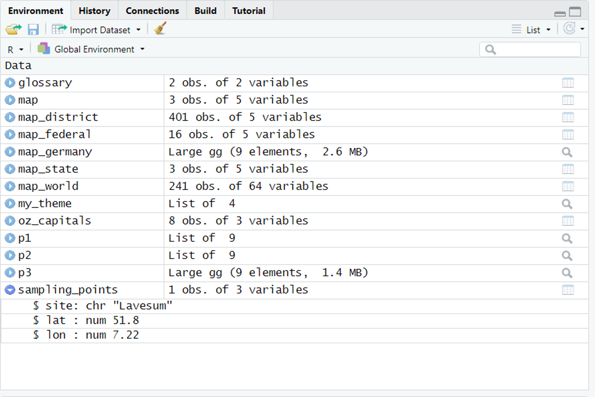
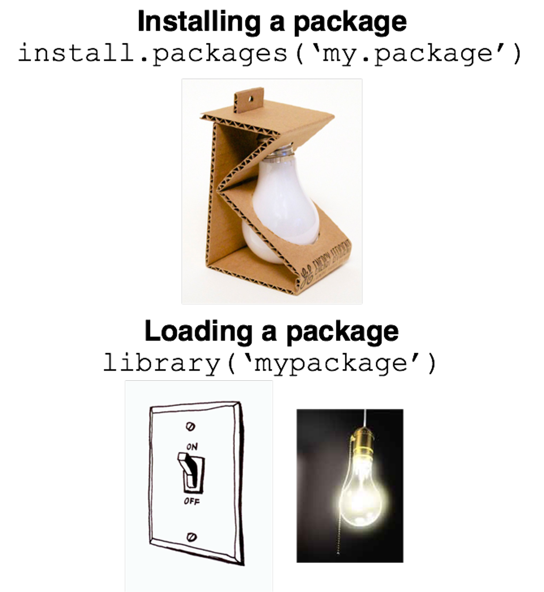
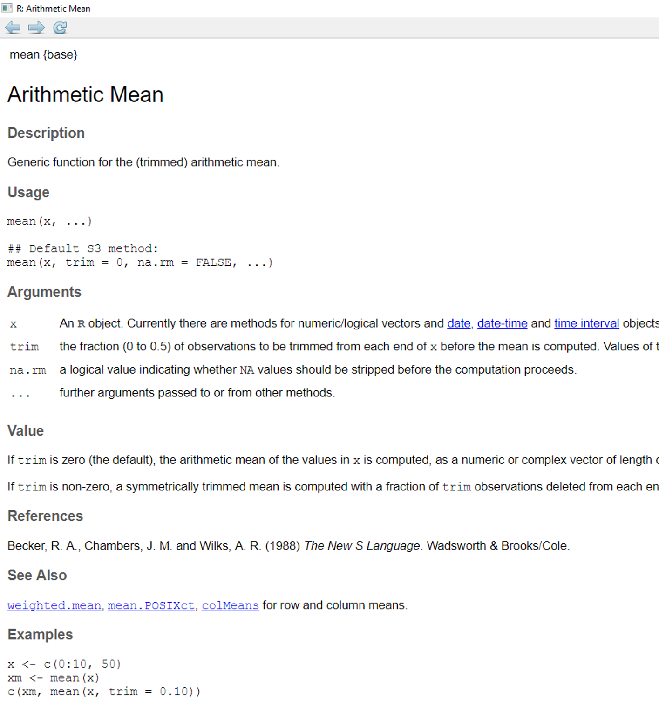
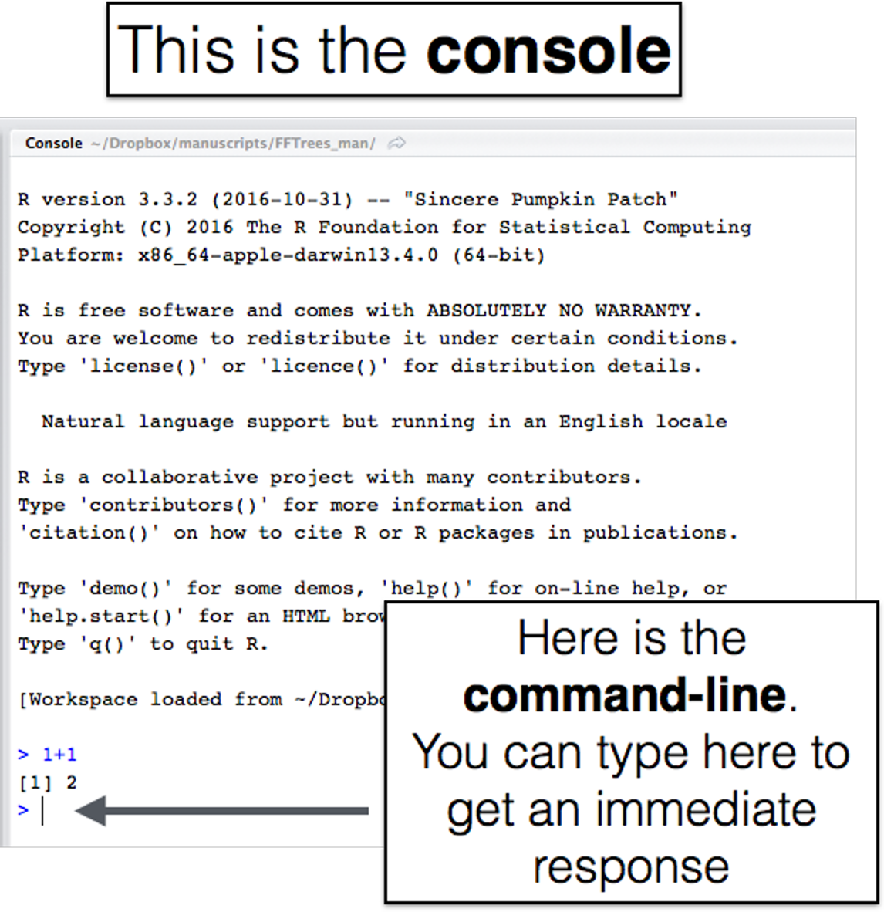
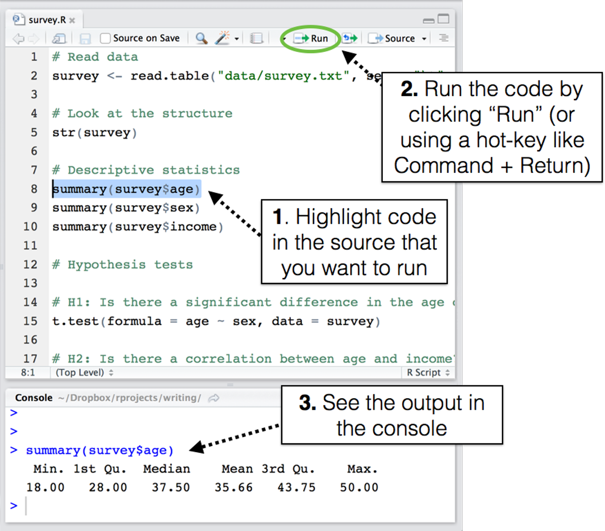
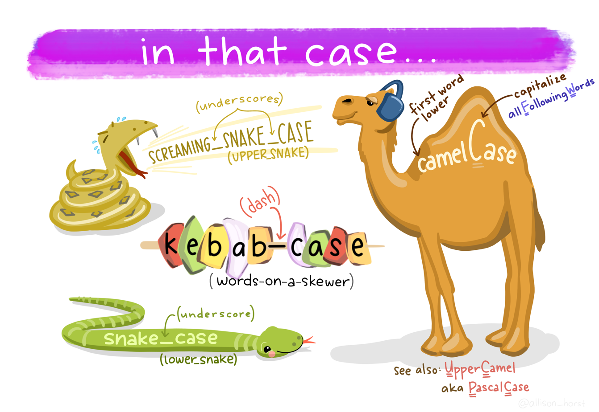

---
output:
  pdf_document: default
  html_document: default
---
# Erste Schritte mit R

*Der Beitrag wurde das letzte mal am `r format(Sys.time(), '%d %B, %Y')` editiert*

```{r include=FALSE}
# define global options for chunks
knitr::opts_chunk$set(fig.align = "center", collapse = T, echo = TRUE, message = FALSE, warning = FALSE)

# With collapse = TRUE the Source and output lived together happily ever in knitr.
# https://github.com/yihui/knitr-examples/blob/master/039-merge.md

# loading multiple packages at once with `pacman`
# create a vector name
packages <- c("tidyverse", "markdown", "knitr", "matrixStats", "patchwork", "lubridate", "plotly",  "naniar", "stlplus", "gt", "dygraphs", "htmltools", "zoo", "xts", "ggpmisc", "forcats", "RColorBrewer", "Kendall", "rstudioapi", "multcompView", "plyr", "bookdown", "janitor")
 
# Load the packages vector 
pacman::p_load(packages, character.only = T)

# Load custom theme
my_theme <- theme(
  panel.background = element_rect(fill = "white", color = "black"),
  panel.grid.major = element_blank(), 
  panel.grid.minor = element_blank(), 
  panel.border = element_blank())

```

R ist eine Programmiersprache für Datenanalyse mit vielen Möglichkeiten der Darstellung. Es  hat sich als weit verbreitetes Hilfsmittel in der Wissenschaft aber auch Wirtschaft durchgesetzt und belegt unter den Standardsprachen (bspw. TIOBE-Index) Rang 9. Um die Benutzerfreundlichkeitt zu erhöhen wird weiterhin die Oberfläche RStudio angeboten. Das Desgin geht im Wesentlichen auf den Entwickler Ross Ihaka im Jahr 1993 zurück.

## Installation

Bevor wir starten müssen noch einige Dinge installiert werden. Ein Tutorial dazu findet ihr auch hier:

```{r echo=F}
knitr::include_url("https://www.youtube.com/watch?v=NZxSA80lF1I&t=53s")
```

### R

```{r echo=FALSE, fig.cap="R logo", fig.width=6, out.width="50%"}

```

R kann unter CRAN (comprehensive R archive network) heruntergeladen werden. CRAN setzt sich aus weltweit verteilten  Servern zusammen, welche die Verteilung von R mit den dazugehörigen packages ermöglicht. Jedes Jahr gibt es ein größeres Update von R mit einigen kleineren. Man sollte daher regelmäßig R aktualisieren. Um base-R zu installieren bitte den folgenden Link klicken und den Instruktionen folgen.


|Betriebssystem|Link|
|:--|:--|
|Windows|[http://cran.r-project.org/bin/windows/base/](http://cran.r-project.org/bin/windows/base/)|
|Mac|[http://cran.r-project.org/bin/macosx/](http://cran.r-project.org/bin/macosx/)|

### RStudio

```{r echo=FALSE, fig.cap="RStudio logo", fig.width=6, out.width="50%"}

```

RStudio ist eine integrierte Benutzeroberfläche (IDE), welches das Arbeiten mit R vereinfacht. RStudio kann unter dem folgenden Link heruntergeladen werden: [https://www.rstudio.com/products/rstudio/download/](https://www.rstudio.com/products/rstudio/download/)


### Packages - das tidyverse

```{r echo=FALSE, fig.cap="Tidyverse logo", fig.width=6, out.width="50%"}

```

Unter dem Begriff tidyverse ist eine Ansammlung von packages zu finden, welche vorallem vom RStudio Chefentwickler Hadly Wickham aufgesetzt wurden. Diese bilden die Grundlage zum Ausführen der Übungen in diesem Buch. Mit dem folgenden Befehl kann das tidyverse installiert werden. Dazu einfach in die Konsole eintippen und mit enter bestätigen
        
```{r eval = FALSE}
install.packages(tidyverse)
```

Um die Funktionen eines Packages jedoch zu nutzen muss es explizit aktiviert werden mit der Funktion library()
        
```{r eval = FALSE}
library(tidyverse)
```

💡 Ein package ist eine Ansammlung von Funktionen, Daten und einer Dokumentation, welche das Arbeiten mit R vereinfachen. Bevor man sich an eine aufwändige Analyse begibt sollte man überprüfen, ob es nicht ein Package gibt das einem das Problem direkt löst.

## RStudio Benutzeroberfläche

Die Benutzeroberfläche besteht aus vier wesentlichen Fenstern. 

```{r echo=FALSE, fig.cap = "Benutzeroberfläche RStudio. Source: https://bookdown.org/ndphillips/YaRrr/", fig.align='center'}

```

### Source

Im source Fenster kann ein Skript geschrieben oder editiert werden. Die Befehle in diesem Fenster werden jedoch nicht explizit ausgeführt, sondern erst nachdem sie durch Run aktiviert werden. Es ist dabei möglich einen Befehl pro Zeile auszuführen oder aber auch das komplette Skript durchlaufen zu lassen. 
Es gibt drei verschiedene Methoden Code aus dem Source Fenster in der Console auszuwerten
        - Copy+Paste des Befehls von dem source Fenster in die Konsole
        - Den Befehl im source Fenster markieren und mit "run" ausführen
        - Mit dem Hotkey "command + enter" wird die entsprechende Zeile direkt ausgeführt 
        
💡 Die Hotkey Variante ist empfohlen. 

### Konsole

Die Konsole ist das Herzstück von R. Code der hier geschrieben wird, wird auch direkt ausgeführt. Wenn man bspw. `1+1` in die Konsole tippt und mit enter bestätigt, so bekommt man als direkte Antwort `2` ausgegeben. 
    
```{r}
1+1
```

💡 Versuche so viel wie möglich im source Fenster zu arbeiten und nicht in der Konsole. Der Grund ist einfach: Code im source Fenster kann gespeichert werden und die Dokumentation bei mehreren Schritten ist übersichtlicher. 

### Environment 

Im Environment (Arbeitsumgebung) sind deine lokal gespreicherten R Objekte gespeichert. Dazu gehören, Vektoren, Matrizen oder spezielle Formate in R wie data frames oder tibbles. Weiterhin sind Daten hinterlegt wie groß das Objekt ist und wie die Anzahl an Variablen und Beobachtungen ist. 

```{r echo=FALSE, fig.cap="Tidyverse logo", fig.width=6, out.width="100%"}

```

### Files / Plots / Packages / Help

Unter Files werden die Dateien in deinem Projektordner angezeigt. Man kann hier ebenfalls Einstellungen an der Arbeitsumgebung durchführen. Wenn Abbildungen erstellt werden können diese optional unter deinem Code chunk angezeigt (siehe Abb. links) oder im Fenster "plots" (siehe Abb. rechts). Ich bevorzuge es die Abbildungen in einem seperaten Fenster angezeigt zu bekommen, da man Änderungen im code unmittelbar sieht. Falls der code nämlich sehr lang ist muss man immer aufwendig runterscrollen. 

```{r echo=FALSE,out.width="49%", out.height="20%", fig.cap="caption", fig.show='hold'}
knitr::include_graphics(c("images/009.png","images/010.png"))
```

Wenn R das erste mal heruntergeladen wird erscheinen nur packages die von den Entwicklern geschrieben wurden, bspw. die `mean()` und `hist()` Funktion. Möchte man jedoch auf Funktionen von anderen Autoren zurückgreifen ist es notwendig, dass man zuerst deren package herunterlädt. 

```{r echo=FALSE, fig.cap="Ein R package ist wie eine Glühbirne. Du musst sie mit install.packages() reindrehen, mit library() jedoch bei jeder neuen R Sitzung anschalten um sie zu nutzen. Source: https://bookdown.org/ndphillips/YaRrr/", fig.width=6, out.width="100%"}

```

Es gibt eine Möglichkeit ein heruntergeladenes Package temporär zu nutzen, und zwar durch die Notation `Package::Funktionsname()`. Ein Vorteil dieser Schreibweise ist es, dass dem Leser direkt die Möglichkeit gegeben wird zu erkennen von welchen package die Funktion stammt. Ein Nachteil ist jedoch, dass dies immer wieder von neuem geschrieben werden muss wenn das package nicht explizit mit `library("Package")` geladen wird.

Eine der wichtigsten Dinge ist das Hilfefenster. Hier kann man in den Dokumentationen zu den Packages nachlesen, welche Besonderheiten es gibt und was die Argumente bedeuten. In jeder Dokumentation gibt es auch eine Rubrik mit Beispielen. 

💡 Wenn man vor einen Befehl ein "?" schreibt und die Zeile ausführt erscheint automatisch die Dokumentation/Hilfe im Help Fenster.

```{r eval=FALSE}
?mean
```

```{r echo=FALSE, fig.cap = "Dokumentation zur Funktion mean() um einen Mittelwert zu bilden", fig.width=6, out.width="100%"}

```

## Code lesen und schreiben 

Code chunks sind eine großartige Sache (grau hinterlegte Box) und beinhalten *Code*, *Kommentare* und das *Ergebnis*. Kommentare werden mit einer Raute ("#") kenntlich gemacht und werden beim Ausführen des chunks nicht von R erkannt. Dies hat sehr große Vorteile! Der wichtigste ist, dass man seine Gedanken vor jeden Befehl schreibt, um noch nach Jahren (im besten Fall 😄) nachzuvollziehen was man eigentlich damit gemeint hat. Für Kollegen und einen selbst entsteht dadurch eine roadmap die zum Ziel führt. 

```{r echo=T}
# Definiere einen Vektor mit der Länge 1 bis 5 
vektor_a <- 1:5
# Zeige mir vektor_a
vektor_a
# Wie lautet der Mittelwert von vektor_a?
mean(vektor_a)
```

Der Inhalt eines code chunks sollte ohne Probleme in die eigene R Konsole kopiert und ausgeführt werden können. 

💡 Falls eine Fehlermeldung auftritt wurde ein vorausgehendes package oder eine Datenquelle vermutlich nicht geladen.

### Die Konsole

R code kann in jedem Texteditor oder Skriptfenster geschrieben werden. Um den Code auszuführen ist es jedoch wichtig ihn an die Kommandozeile (command-line; console) von R zu senden. 

```{r echo = F, fig.cap = "Die Konsole mit der Kommandozeile von R. Source: https://bookdown.org/ndphillips/YaRrr/", fig.width=6, out.width="100%"}

```

Die Kommandozeile in R startet mit dem `>` Symbol, auch *prompt* genannt. Prompt leitet sich von prompting (auffordern) ab. Man wird also dazu aufgefordert einen Befehl einzutippen. `1+1` gibt also direkt `## [1] 2` wieder. Die `[1]` steht dabei für den Index (mehr dazu später). 

### R Skript

Für einfache Befehle macht es Sinn direkt in die Konsole zu tippen. Code den man speichern möchte und komplexere Anfragen sollten jedoch in ein R script geschrieben haben (hat die Dateiendung `.R`). Ein R Skript ist eine Zusammenfassung an code welches in einer Datei zusammengefasst wurde. 
Um ein neues Skript zu speichern schreibe:

File - New file - R script

Um code in einem Skript auszuwerten muss es explizit an die Konsole gesendet werden. 

```{r echo = F, fig.cap = "Code vom Skript an die Konsole senden. Source: https://bookdown.org/ndphillips/YaRrr/", fig.width=6, out.width="100%"}

```

💡 Der shortcut strg+Enter wird euer bester Freund werden und ist meine bevorzugte Art.

### Good practice Code zu schreiben

Einen klaren Gedanken auf das Papier zu bringen ist nicht so einfach. Beim Schreiben von Code verhält es sich natürlich ähnlich. Damit anderen Menschen ebenfalls Freude daran haben den Weg zum Ziel zu verstehen, sollte man es Ihnen so einfach wie möglich machen. Hier sind ein paar Regeln:

* **#** = Kommentiere code so häufig wie möglich mit der Raute #. Mehr ist mehr!
* **Leerzeichen** = Findestduesbesserwennichsoschreibe oder wenn ich wieder normal schreibe?
* **Zeilenumbrüche** = Eine 100-seitige Abschlussarbeit in einem Absatz zu schreiben ist fürchterlich und würde keiner tun. Bei code verhält es sich ähnlich. 

💩 Beispiel

```{r echo=T, eval=F}
library(tidyverse)
df<-read.csv("data/data.csv", sep = ";")
ggplot2::ggplot(df, aes(wt,EH100b))+geom_point()
cor(df$wt, df$EH100a, use = "complete", method = "pearson")
```

💪 Beispiel

```{r echo=T, eval=F}
# Lade das package tidyverse
library(tidyverse)
# Lese den Datensatz "data" vom Speicherkoog ein
# Das Trennzeichen ist Semikolon
df <- read.csv("data/data.csv", sep = ";")
# Stelle den Grundwasserstand (wt; in cm) und das Redoxpotenzial in 100 cm Tiefe dar (in mV)
ggplot(data = df, aes(x = wt)) + 
    geom_histogram()
# Berechne Pearson Korrelationskoeffizient zwischen Grundwasserstand und Redoxpotenzial in 100 cm Tiefe.
# Entferne vorher fehlende Werte
cor(df$wt, df$EH100a, use = "complete", method = "pearson")
```

## Objekte und Funktionen

R arbeitet fast ausschließlich mit zwei Dingen: Objekte und Funktionen. Im Folgenden Beispiel definieren wir ein Objekt (5 gemessene Werte der Lufttemperatur) mit der Funktion `c()`.

```{r}
# Erstelle ein Objekt Lufttemperatur
lt <- c(13.5, 16.7, 18.3, 21.9, 3.9)
# Berechne die mittlere Lufttemperatur 
mean(lt)
```

Ein Objekt in R kann alles sein, bspw. ein 

* Datensatz (data frames im Englischen; eine Sonderform des data frame ist ein tibble aber dazu später mehr)
* statistische Zusammenfassung des Datensatzes
* statistischer Test
* Einfache Nummern
* Vektoren (wie in unserem Beispiel die 5 Messungen der Lufttemperatur)
* Buchstaben und Wörter
* Faktoren

Diese Objekte können verschiedene **Attribute** aufweisen, bspw. ein Längenattribut unseres `lt` Vektors oder bei einem T-Test alle statistischen Parameter.

Was ist eine Funktion?

Eine Funktion greift meist auf ein oder mehrere Objekte zurück (input), führt etwas mit diesen durch, um dann etwas neues dadurch auszugeben (output). Ein Beispiel ist die Funktion um den Mittelwert von einem Vektor auszurechnen mit der Funktion `mean()`. 

### Neue Objekte erstellen

Einer der wichtigsten Kommandos in R ist der Befehl ein bestimmtes Objekt zuzuweisen mit `<-`. 

```{r}
# Erstelle ein Objekt mit dem Namen a und weisen ihm einen Satz zu
a <- "Beste Norddeutschland Exkursion der Welt"
```

Schaue was passiert wenn du `a` in die Konsole eintippst. 

```{r}
a
```

Was passiert wenn du `aa` eintippst?

```{r eval=F}
aa
```

**Fehler: Objekt 'aa' nicht gefunden**

Richtig, wir haben das Objekt `aa` noch nicht definiert und daher kann es in unserer Arbeitsumgebung (Environment) auch nicht gefunden werden.

Objekte können auch miteinander verbunden werden:

```{r}
a <- 1
b <- 100
# Was ist a + b?
a+b
# Weise die Berechnung a + b dem Objekt c zu 
c <- a + b
# Was passiert wenn du c in die Konsole eintippst?
c
```

Bei der Bennenung von Objekten gibt es auch Fehlerpotentzial:

```{r echo = T, eval = F}
# Dies sind falsch benannte Objekte
Luft temperatur <- 23 # Hat ein Leerzeichen
5lufttemperatur <- 23 # Beginnt mit einer Zahl
lufttemperatur! <- 23 # Nicht gültiger character "!"
```

Darüber hinaus ist es wichtig zu wissen, dass R seeeeEeehr sensibel gegenüber Groß- und Kleinschreibung ist. Die folgenden Objekte sind alle individuell:

```{r echo = T}
# Dies sind drei verschiedene Objekte
test <- 1
TEST <- 100
tEsT <- 1000
```

💡 Große Buchstaben sollten bei der Benennung von Objekten nach Möglichkeit vermieden werden. Es dauert einfach länger `MYDATA` oder `MyData` zu tippen als `mydata` ohne Umschalttaste. 

Einige Dinge die man bei der Benennung von Objekten berücksichtigen sollte:

```{r eval = F}
# Gute Objektnamen
mittelwert <- 2.5
mein_alter <- 32
groesse_in_cm <- 175
# Schlechte Objektnamen
x1 <- 2.5
var2 <- 32
asdasdasd <- 175
```

Ich persönlich bevorzuge **snake_case** Wörter. Später lernen wir noch, dass sich diese Wörter durch ein Argument - den Namen Separator `name_sep` - trennen lassen. Dies wird beim Umstrukturieren von Daten wichtig. Egal welches Schema man auch wählt, einheitlich vorzugehen ist das Wichtigste.

💡 Gute Objektnamen sollten kurz und prägnant sein! Lange Namen sind nicht intuitiv und Buchstaben alleine sagen auch nichts aus. Als Beispiel: Die durchschnittliche Lufttemperatur im Speicherkoog für März kann man mit `airtemp_march_koog` abkürzen.

```{r echo=F, fig.cap = "Illustration von Allison Horst", fig.width=6, out.width="100%"}

```

### Beispiel: Umrechnen von °C in K

Der Mittelwert der Jahresdurchschnittstemperatur im Speicherkoog beträgt 10.14 °C. Mit Skalaren kann man einfache Rechenoperationen durchführen. 

```{r}
# Mittelwert der Lufttemperatur in °C
mittel_at <- 10.14
# Lasst uns die Lufttemperatur umrechnen von °C in K
# 0 °C sind 273.15 K
mittel_at + 273.15
```

Das Jahresmittel der Lufttemperatur beträgt also 283,3 K. 

```{r}
mittel_at
```

Ups....wieso wird `mittel_at` denn trotzdem in °C angezeigt ?! Denke daran: 

🚨 **Um ein Objekt zu ändern, muss es neu zugewiesen werden!**

```{r}
# Zuweisung des Jahresmittels der Lufttemperatur in K anstelle von °C
mittel_at_k <- mittel_at + 273.15
mittel_at_k
```

Wenn ihr bis hierhin gekommen seid, dann habt ihr schon eine ganze Menge verinnerlicht. Nicht das wir uns schon zurücklehnen wollen, aber ein ein wenig Grund zum Feiern ist es dennoch 🎉🍻. 

## Cheatsheets

Je öfter man mit bestimmten Funktionen, Befehlen und Argumenten in R arbeitet, desto leichter fällt es einem sie anzuwenden. Sich alle zu merken ist jedoch unmöglich und auch nicht zielführend. Was jedoch hilfreich ist sind sogenannte Cheatsheets oder auf gut deutsch gesagt **Spickzettel**. Eine Zusammenfassung von sinnvollen Cheats ist hier zu finden:

|Beschreibung|Link|
|:--|:--|
|Rstudio cheatsheets|[https://www.rstudio.com/resources/cheatsheets](https://www.rstudio.com/resources/cheatsheets/)|
|Rstudio Benutzeroberfläche|[https://raw.githubusercontent.com/rstudio/cheatsheets/master/rstudio-ide.pdf](https://raw.githubusercontent.com/rstudio/cheatsheets/master/rstudio-ide.pdf)|
|Rmarkdown|[https://www.rstudio.com/wp-content/uploads/2016/03/rmarkdown-cheatsheet-2.0.pdf](https://www.rstudio.com/wp-content/uploads/2016/03/rmarkdown-cheatsheet-2.0.pdf)
|Daten einlesen; readr::() und tidyr::()|[https://raw.githubusercontent.com/rstudio/cheatsheets/master/data-import.pdf](https://raw.githubusercontent.com/rstudio/cheatsheets/master/data-import.pdf)|
|Arbeiten mit Faktoren; forcats::()|[https://raw.githubusercontent.com/rstudio/cheatsheets/master/factors.pdf](https://raw.githubusercontent.com/rstudio/cheatsheets/master/factors.pdf)|
|Arbeiten mit Zeit und Datum; lubridate::()|[https://raw.githubusercontent.com/rstudio/cheatsheets/master/lubridate.pdf](https://raw.githubusercontent.com/rstudio/cheatsheets/master/lubridate.pdf)|
|Buchstabenmanipulation; stringr::()|[https://raw.githubusercontent.com/rstudio/cheatsheets/master/strings.pdf](https://raw.githubusercontent.com/rstudio/cheatsheets/master/strings.pdf)|
|Daten transformieren; dplyr::()|[https://raw.githubusercontent.com/rstudio/cheatsheets/master/data-transformation.pdf](https://raw.githubusercontent.com/rstudio/cheatsheets/master/data-transformation.pdf)|
|Dokumente erstellen; rmarkdown::()|[https://raw.githubusercontent.com/rstudio/cheatsheets/master/rmarkdown-2.0.pdf](https://raw.githubusercontent.com/rstudio/cheatsheets/master/rmarkdown-2.0.pdf)|
|Datenvisualisierung; ggplot2::()|[https://raw.githubusercontent.com/rstudio/cheatsheets/master/data-visualization-2.1.pdf](https://raw.githubusercontent.com/rstudio/cheatsheets/master/data-visualization-2.1.pdf)|
|Erstellen von Karten I; sf::()|[https://raw.githubusercontent.com/rstudio/cheatsheets/master/cartography.pdf](https://raw.githubusercontent.com/rstudio/cheatsheets/master/cartography.pdf)|
|Erstellen von Karten II; sf::()|[https://raw.githubusercontent.com/rstudio/cheatsheets/master/sf.pdf](https://raw.githubusercontent.com/rstudio/cheatsheets/master/sf.pdf)|
|shiny app|[https://raw.githubusercontent.com/rstudio/cheatsheets/master/shiny.pdf](https://raw.githubusercontent.com/rstudio/cheatsheets/master/shiny.pdf)|

