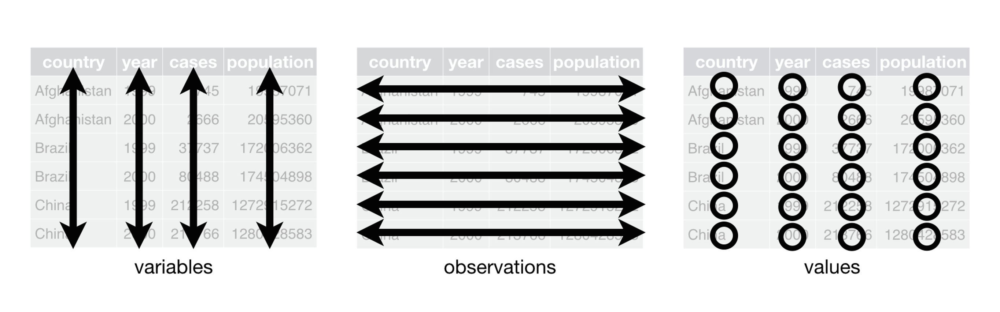
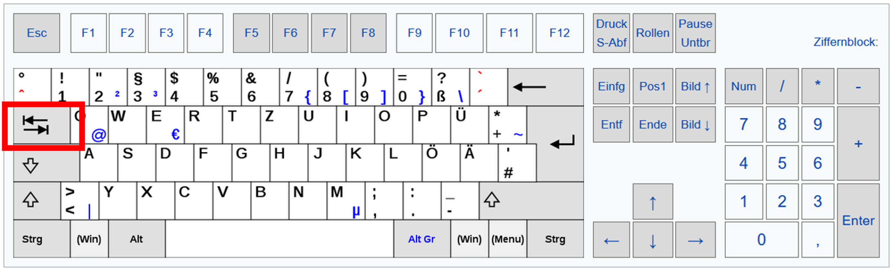

---
output:
  pdf_document: default
  html_document: default
---
# Wie lese ich Daten ein

*Der Beitrag wurde das letzte mal am `r format(Sys.time(), '%d %B, %Y')` editiert*

```{r include=FALSE}

knitr::opts_chunk$set(fig.align = "center", collapse = T, echo = TRUE, message = FALSE, warning = FALSE)

# With collapse = TRUE the Source and output lived together happily ever in knitr.
# https://github.com/yihui/knitr-examples/blob/master/039-merge.md

# loading multiple packages at once with `pacman`
# create a vector name
packages <- c("tidyverse", "markdown", "knitr", "matrixStats", "patchwork", "lubridate", "plotly",  "naniar", "stlplus", "gt", "dygraphs", "htmltools", "zoo", "xts", "ggpmisc", "forcats", "RColorBrewer", "Kendall", "rstudioapi", "multcompView", "plyr", "bookdown", "janitor")
 
# Load the packages vector 
pacman::p_load(packages, character.only = T)

my_theme <- theme(
  panel.background = element_rect(fill = "white", color = "black"),
  panel.grid.major = element_blank(), 
  panel.grid.minor = element_blank(), 
  panel.border = element_blank())
```

Wir sind immer noch nicht ganz bei dem Punkt angekommen, was es mit dem Begriff *tidy* auf sich hat. Soviel soll aber gesagt sein: Daten in der "freien Laufbahn" sind immer **dreckig** und NICHT **tidy**.

```{r echo = F, fig.cap="Schema der Datenanalyse in R"}
knitr::include_graphics("images/001.png")
```

Anwenden lässt sich das Paretoprinzip auf dieses Schema. 

> Bei der Datenanalyse werden 80% der Ergebnisse mit 20% des Aufwandes erreicht, die verbleibenden 20% mit 80% des Aufwandes.

In der Datenanylse wird sehr viel Zeit zu Beginn verwendet

* Daten zu erheben
* zu finden
* zu importieren
* zu säubern
* zu transformieren
* zu modifizieren
* zu analysieren

Die echte Analyse der Daten ist dann verhältnismäßig schnell erledigt. 

## Tidy data

Daten in Tabellen können auf eine Vielzahl strukturiert und angezeigt werden. Das Konzept von **tidy data** is fundamental für das Arbeiten und die Visualisierung in R. Weiterhin sind konsistent aufbereitete Daten leichter zu lesen, zu verarbeiten, zu laden und zu speichern.

```{r echo = F, fig.cap="Konzept tidy data [R for Data Science](https://r4ds.had.co.nz/tidy-data.html)"}

```

1. Jede *Variable* hat eine eigene Spalte
2. Jede *Beobachtung* steht in einer eigenen Zeile
3. Jeder *Wert* steht in einer eigenen Zelle

## Dateiformate 

Es gibt eine Vielzahl von Dateiformaten, um nur wenige zu nennen: `.xls`, `.xlsx`, `.sav`, `.csv`, `.txt` ... 
Bei Dateien mit der Endung .xlsx von Microsoft oder .sav von SPSS handelt es sich um *proprietäre* Dateien, welche im Eigentum von Unternehmen stehen. Der Austausch zwischen diesen Formaten ist häufig problematisch, da Formatierungen verloren gehen können und eben nur spezfisch für das Dateiformat ist. Ein *offenes* und weit verbreitetes Format sind `.csv` Dateien für comma-separated-values. 

🚨 Im deutschsprachigen Raum wird auch `;` als Trennzeichen verwendet. 

```{r echo = F, fig.show='hold', fig.align='center', out.width="25%", fig.cap="Tidyverse Logos"}
knitr::include_graphics(c("images/022.png","images/023.png","images/024.png","images/025.png",
                          "images/026.png","images/027.png","images/028.png","images/029.png"))
```

Das Herzstück des tidyverse sind die packages mit dem dazugehörigen Namen im Logo. Es hat sich mit Bezug zum Datenhandling durchgesetzt. Das Designprinzip in den jeweiligen packages baut dabei aufeinander auf. 

> The tidyverse is an opinionated collection of R packages designed for data science. All packages share an underlying design philosophy, grammar, and data structures.

|Package|Beschreibung|
|:--|:--|
|ggplot2|Erstellen von Abbildungen basierend auf der *Grammar of Graphics*|
|dyplr|Stellt Funktionen bereit um Daten zu manipulieren, bspw. `filter()`|
|tidyr|Funktionen um *tidy data* zu erzeugen, bspw. `pivot_longer()`|
|readr|Schnelle und  effiziente Art Daten einzulesen und zu transformieren|
|tibble|Eine effektivere Darstellung eines dataframe|
|stringr|Vereinfacht das Arbeiten mit Textobjekten|
|forcats|Vereinfacht das Arbeiten mit Faktoren, bspw. `relevel()`|

Alle packages können automatisch heruntergeladen werden mit dem folgenden Befehl:

```{r eval = F}
install.packages("tidyverse") # Muss man nur einmal durchführen
library(tidyverse)            # Muss jedes mal wieder neu "angeschaltet" werden
``` 

## readr::read_delim()

Nun wollen wir lernen, einen großen Datensatz einzulesen. Dazu verwenden wir die Daten aus dem Speicherkoog. Es handelt sich um eine .csv Datei, die entweder mit der Funktion 

* `read_csv()` (liest CSV-Dateien, die ein Komma `,` als Spalten- und einen Punkt `.` als Dezimaltrennzeichen verwenden)
* `read_csv2()` (liest CSV-Dateien, die ein Semikolon `;` als Spalten- und das Komma `,` als Dezimaltrennzeichen verwenden)

eingelesen werden können. Dazu geben wir den Dateipfad relativ zu unserem Arbeitsverzeichnis an. Ich habe bspw. meine Daten zum einlesen in einem Unterordner `data`. Von der Datei selber wird der Pfad durch `/` getrennt angegeben. 

```{r}
# Laden der Daten mit der Funktion read_csv
koog_raw <- readr::read_csv("data/data.csv")
koog_raw
```

Ui, hier ist aber etwas schief gelaufen. Wir haben die Datei erfolgreich in unserer Arbeitsumgebung laden können aber 94537 observations bei nur einer Variable?! Schaut euch den Datensatz `koog_raw` mal genauer an, indem ihr auf das Symbol (rot umrandet) klickt: 

```{r echo = F, fig.cap="Environment"}
knitr::include_graphics("images/031.png")
```

Richtig, wir haben vergessen den Zahlenseparator richtig zu setzen. read_csv() und read_csv2 sind Spezialformen der Funktion `read_delim()`. Zukünftig werden wir `read_delim()` verwenden wenn nicht klar ist, wie die Trennzeichen in unseren Rohdaten hinterlegt sind. Bei uns ist es ein `;` und kein `,`. 

```{r}
koog_raw <- readr::read_delim("data/data.csv", delim = ";")
```

💡 Wenn ihr in der Klammer von read_delim() den Tab drückt (siehe unten) dann bekommt ihr einen Vorschlag, welche Argumente in der Funktion belegt werden können. 

```{r echo = F, fig.cap="Tab Taste"}

```

Schauen wir uns den Datensatz `koog_raw` etwas genauer an. 

```{r}
head(koog_raw, n = 10)
```

Wir haben ja bereits gesagt, dass es praktischer ist ausschließlich die Spalten mit Kleinbuchstaben (*snake_case*) zu belegen. Es gibt eine einfache Funktion mit `janitor::clean_names()`, welche automatisch die Spalten kohärent umcodiert und individuell vergibt:

```{r echo = F, fig.cap="Illustration von Allison Horst"}
knitr::include_graphics("images/034.png")
```

```{r}
koog_raw <- janitor::clean_names(koog_raw)
head(koog_raw, n = 5)
```

Tritt eine Variable 2x auf wie bspw. `pp`, so wird der zweite `pp` Eintrag um `pp_2` ergänzt. 

Wofür stehen die einzelnen Spalten also: 

|Spaltenname | Beschreibung| Einheit|
|:--|:--|:--|
|time   |Zeilennummer der observation (stündliches Messinterval| |
|date   |Datum + Zeitangabe der Messung | |
|st10:st150     |Bodentemperatur pro Tiefe (einfache Wiederholung)| °C |
|mp10:mp150     |Matrixpotenzial pro Tiefe (einfache Wiederholung)|log hPa|
|eh10a:eh150c   |Redoxpotentzial pro Tiefe (dreifache Wiederholung) |mV|
|wd |Windrichtung |°|
|ws |Windgeschwindigkeit |m s^-1^|
|at |Lufttemperatur |°C|
|rh |Relative Luftfeuchte |%|
|ap |Luftdruck |hPa|
|pp |Niederschlag |mm h^-1^|
|sr |Solarstrahlung |W m^-2^|
|wt |Grundwasserflurabstand |cm u GOK|
|ec |Elektrische Leitfähigkeit |mS cm^-1^|
|bat |Akkuleistung der Schaltschranks |V|
|lt |Loggertemperatur | °C|
|oxy10:oxy150 |Sauerstoffgehalt |%-Luftsättigung|


## Arbeiten mit Zeiten

In der Spalte `time` stehen die Zeilennummern und unter `date` finden wir das Datum, allerdings als `character` hinterlegt. Beim Einlesen der Daten denkt R, dass es sich um Text handelt aber wir wissen es besser. Wir müssen R nun explizit mitteilen wie unser Zeitstempel `date` codiert ist, nämlich mit `%Tag.%Monat.%Jahr %Stunde:%Minute`. In R wird ein Datum jedoch mit `r Sys.time()` angegeben. Wir tun also folgendes:

```{r}
koog_raw <- readr::read_delim("data/data.csv", delim = ";", 
                          col_types = readr::cols(
                            # date = überschreibt die Spalte mit der neuen Spezifikation
                            date = readr::col_datetime(format = "%d.%m.%Y %H:%M") 
  ))
head(koog_raw, n = c(5,2))
```

Super...nun haben wir ein sogenanntes `POSIXct` Objekt. Dies ist eine Datum+Zeitangabe in R und lässt sich mit einfachen Funktionen in eine andere Darstellungsform codieren. Welche Möglichkeiten es gibt Zeiten zu codieren könnt ihr unter `?strptime` nachlesen. Die gängisten Kürzel findet ihr aber hier aufgelistet:

* "%" is used as a separator between dates 🚨
* **%y** Year without century (00--99).
* **%Y** Year with century.
* **%m** Month as decimal number (01--12).
* **%d** Day of the month as decimal number (01--31).
* **%H** Hours as decimal number (00--23).
* **%M** Minute as decimal number (00--59).
* **%T** Equivalent to %H:%M:%S.


💡 Mit der Funktion `Sys.time()` könnt ihr euch das aktuell Datum + Uhrzeit anzeigen lassen

```{r echo = F, fig.cap="Illustration von Allison Horst"}
knitr::include_graphics("images/035.png")
```

```{r echo = F, fig.cap="Illustration von Allison Horst"}
knitr::include_graphics("images/036.png")
```

Aus dem Zeitstempel `date`können wir mit dem package `lubridate::` und den Funktionen ganz einfach aus dem `POSIXct` Objekt das Jahr, Monat, Tag, Stunde, Minute, ... extrahieren:

```{r}
# Jahr
koog_raw %>%
  select(date) %>%
  mutate(date = year(date)) %>% # Extrahiere das Jahr mit der Funktion `year()`
  head(n = 5)
# Monat
koog_raw %>%
  select(date) %>%
  mutate(date = month(date)) %>% # Extrahiere das Jahr mit der Funktion `month()`
  head(n = 5)
```

```{r echo = F}
koog_raw <- janitor::clean_names(koog_raw)
```
