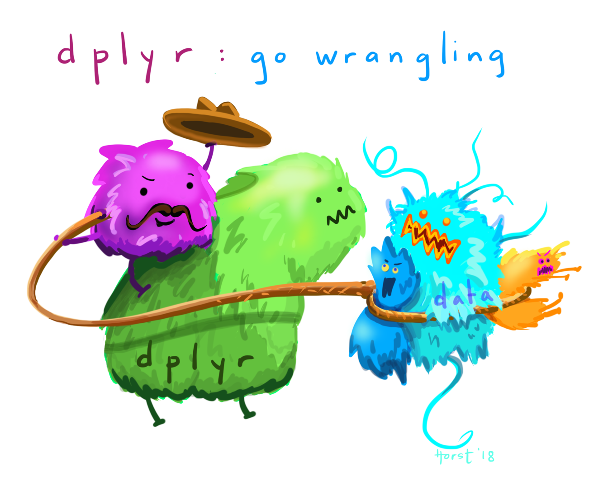
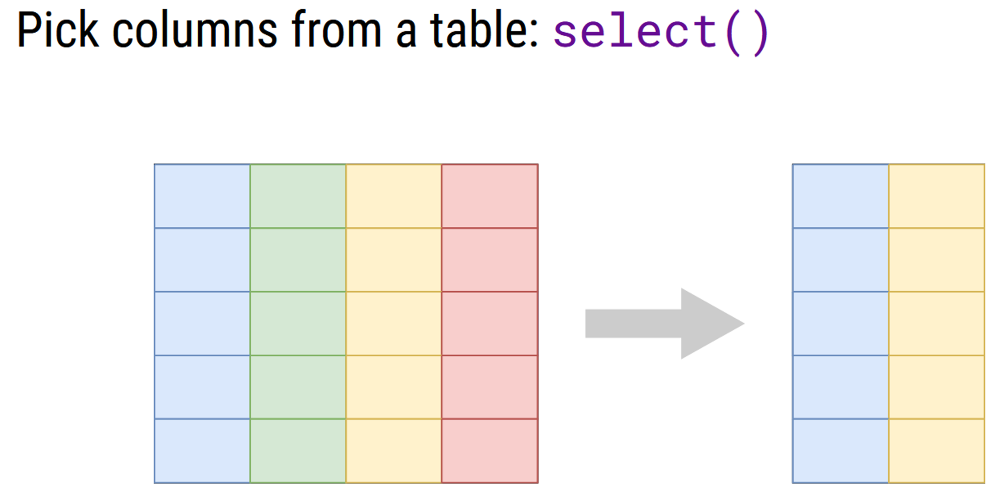
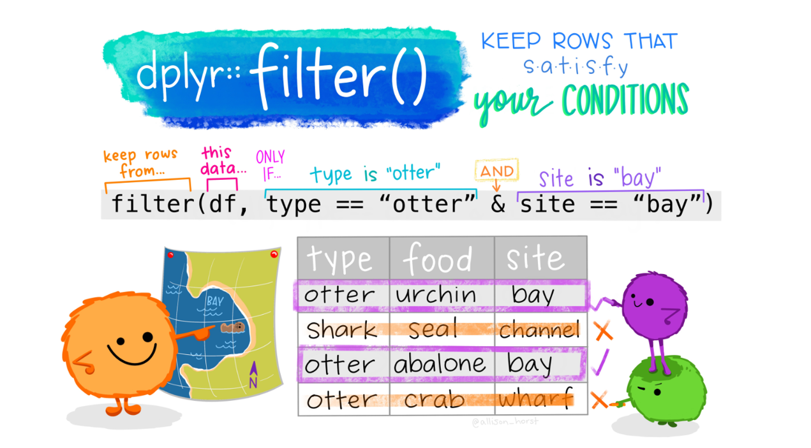
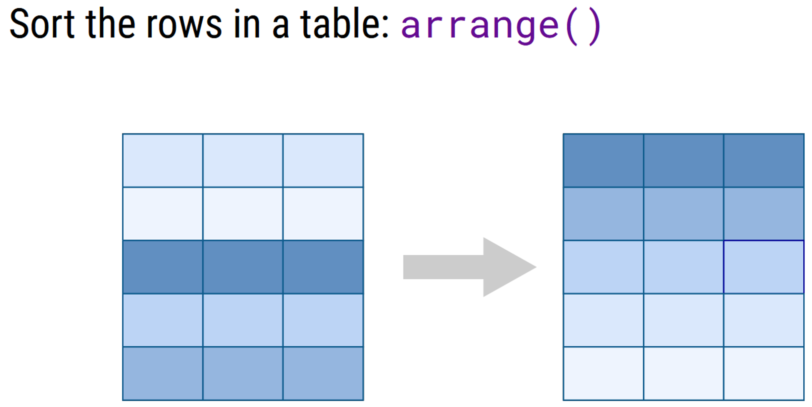
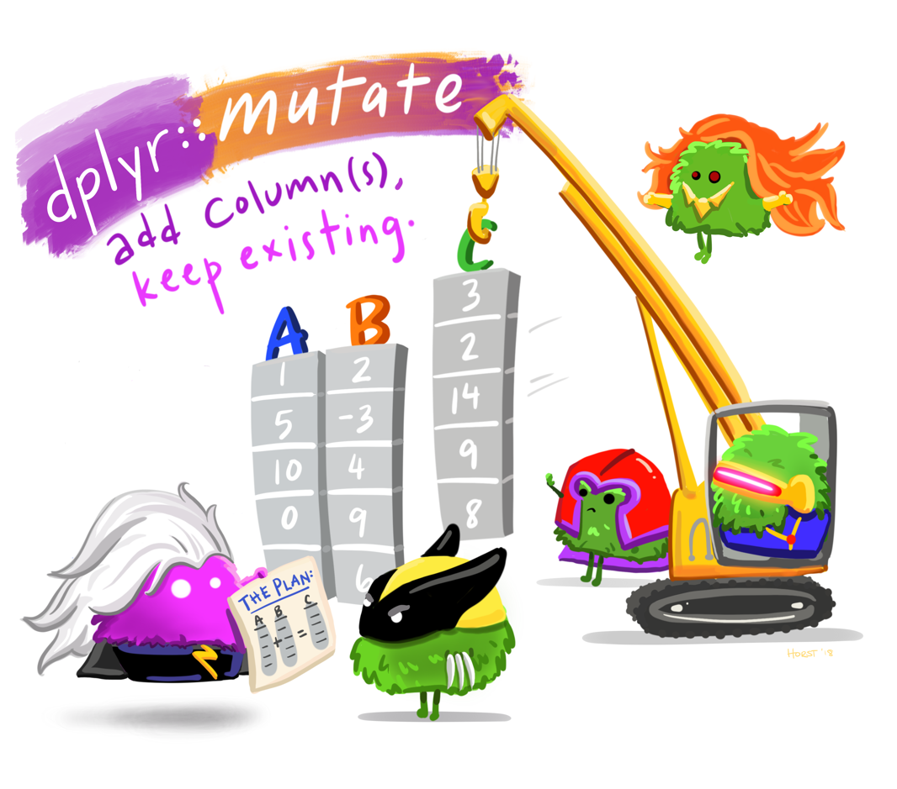
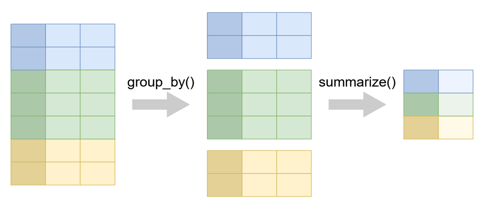
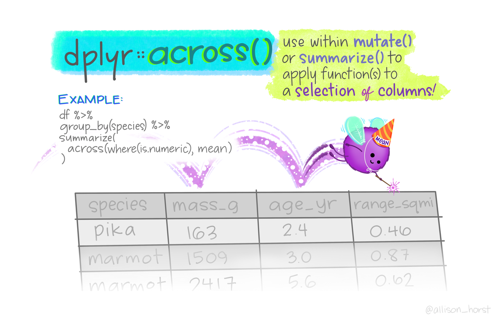
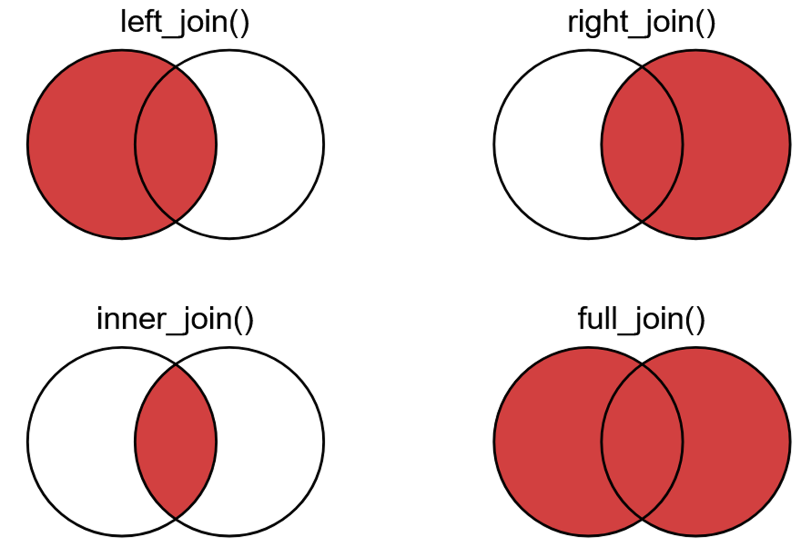
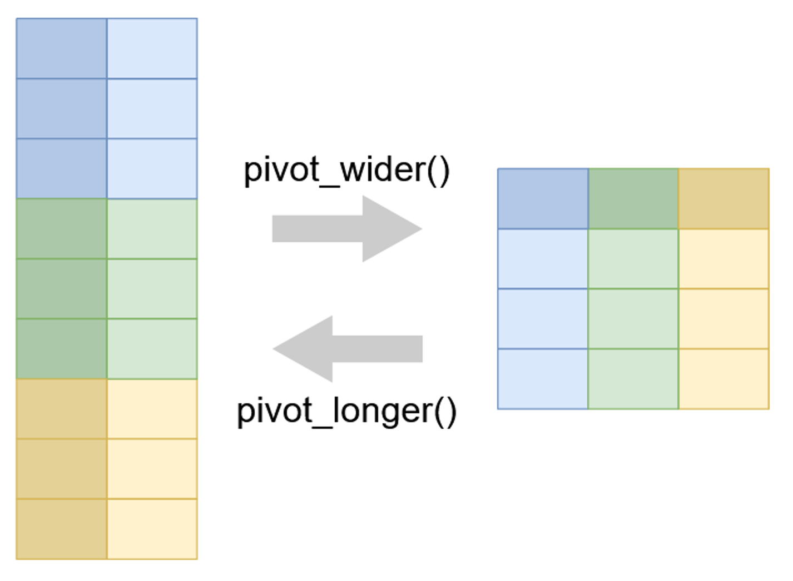

# Daten manipulieren

*Der Beitrag wurde das letzte mal am `r format(Sys.time(), '%d %B, %Y')` editiert*

```{r include=FALSE}

knitr::opts_chunk$set(fig.align = "center", collapse = T, echo = TRUE, message = FALSE, warning = FALSE)

# With collapse = TRUE the Source and output lived together happily ever in knitr.
# https://github.com/yihui/knitr-examples/blob/master/039-merge.md

# loading multiple packages at once with `pacman`
# create a vector name
packages <- c("tidyverse", "markdown", "knitr", "matrixStats", "patchwork", "lubridate", "plotly",  "naniar", "stlplus", "gt", "dygraphs", "htmltools", "zoo", "xts", "ggpmisc", "forcats", "RColorBrewer", "Kendall", "rstudioapi", "multcompView", "plyr", "bookdown", "janitor")
 
# Load the packages vector 
pacman::p_load(packages, character.only = T)


my_theme <- theme(
  panel.background = element_rect(fill = "white", color = "black"),
  panel.grid.major = element_blank(), 
  panel.grid.minor = element_blank(), 
  panel.border = element_blank())

```

```{r echo = F}
# Daten Speicherkoog einlesen
koog_raw <- readr::read_delim("data/data.csv", delim = ";", 
                          col_types = readr::cols(
                            # date = überschreibt die Spalte mit der neuen Spezifikation
                            date = readr::col_datetime(format = "%d.%m.%Y %H:%M") 
  ))
koog_raw <- janitor::clean_names(koog_raw)

# Daten Speicherkoog einlesen
koog_raw <- readr::read_delim("data/data.csv", delim = ";", 
                          col_types = readr::cols(
                            # date = überschreibt die Spalte mit der neuen Spezifikation
                            date = readr::col_datetime(format = "%d.%m.%Y %H:%M") 
  ))
koog_raw <- janitor::clean_names(koog_raw)
koog <- koog_raw %>%
  dplyr::mutate(across(contains("eh"), ~. + 207))
# Erstelle neue Spalten mit Zeitstempeln
koog <- koog %>%
  mutate(year = lubridate::year(date),
         month = lubridate::month(date),
         day = lubridate::day(date),
         hour = lubridate::hour(date), 
         daily = format(date, "%Y-%m-%d"),
         monthly = format(date, "%Y-%m"))

# Tagesmittelwerte
koog_day <- koog %>%
  group_by(daily) %>%
  summarise_if(is.numeric, mean, na.rm = T) %>%
  mutate(daily = as.Date(daily))

# Monatsmittelwerte
koog_month <- koog %>%
  group_by(monthly) %>%
  summarise_if(is.numeric, mean, na.rm = T)

# Jahresmittelwerte
koog_year <- koog %>%
  group_by(year) %>%
  summarise_if(is.numeric, mean, na.rm = T)
```

Mit Daten Manipulation meinen wir nicht unsere Daten so zu frisieren, dass etwas rauskommt was wir gerne hätten. Es bedeutet vielmehr die Daten so auszuwählen, dass wir aus einer großen Menge Daten selektieren können, um damit besser zu Arbeiten. Einer der wichtigsten Operatoren um eine Vielzahl an Auswahlmöglichkeiten zu treffen ist der `%>%` Operator (pipe). Ausgesprochen lautet die Funktion soviel wie "und dann". Mit dem `%>%` Operator können Daten in eine Funktion überführt werden oder zwei aufeinander aufbauende Funktionen miteinander verknüpft werden. 

```{r eval = F}
# Die folgenden Zeilen sind identisch
f(x)
x %>% f()
# Anhand einer Funktion
mean(x)
x %>% mean()
```

Für die Strukturierung und Transformation der Daten sind zwei packages ganz entscheidend, nämlich `dplyr::` und `tidyr::`. 

Die wichtigsten Funktionen aus dem `dplyr::` package lauten: 

* select()
* filter()
* arrange()
* mutate()
* transmute()
* summarize()
* group_by()
* across()
* joins

Die wichtigsten Funktionen aus dem `tidyr::` package lauten:

* pivot_longer()
* pivot_wider()

```{r echo = F, fig.cap="Illustration von @allison_horst: https://twitter.com/allison_horst"}

```

## select() - Variablen auswählen (spaltenweise)

```{r echo = F, fig.cap="Illustration von C.Wilke: https://wilkelab.org/SDS375/"}

```

Um aus unserem Speicherkoog Datensatz nur die Variablen der Bodentemperatur auszugeben, geben wir folgenden Befehl ein:

```{r}
koog_raw %>%
  select(date, st10, st20, st30, st60, st100, st150) %>%
  head(n = 5)
```

Die Variablen werden dazu ohne `""` ausgeschrieben und durch `,` getrennt. Möchte ich aus dem Datensatz nur eine Variable entfernen so genügt ein es ein `-` vor den Namen der Variable zu setzen:
 
```{r}
koog_raw %>%
  select(-date) %>%
  head(n = 5)
```
 
 In dem `select()` Aufruf kann ich auch direkt Variablen umbenennen:
 
```{r}
koog_raw %>%
  select(-date, wärmste_messtiefe = st10) %>%
  head(n = 5)
```
 
Alle Messtiefen immer auszuschreiben benötigt Zeit und ist fehleranfällig. Es gibt bei `dplyr::select()` sogenannte *helper functions*. Diese lauten `starts_with()`, `ends_with()` und `contains()`. Da wir einen string aus unseren Variablennamen (die Namen der Spalten) auswählen muss dieser Befehl allerdings in `""` gesetzt werden. In Kurz lautet die Auswahl der Bodentemperatur also:

```{r}
koog_raw %>%
  select(contains("st")) %>%
  head(n = 5)
```

Wollen wir eine bestimmte Abfolge auswählen, bspw. die Meteorologischen Parameter die in den Spalten `wd` bis `sr` stehen, dann geht dies über den folgenden Befehl:

```{r}
koog_raw %>%
  select(wd:sr) %>% # ":" bedeutet soviel wie "von bis"
  head(n = 5)
```

## filter() - Filtern von Variablen (zeilenweise)

```{r echo = F, fig.cap="Illustration von @allison_horst: https://twitter.com/allison_horst"}

```

Mithilfe der logischen Operatoren können wir aus dem Datensatz E~H~ Werte filtern die > 400 mV sind, also oxidierend. 

```{r}
# Redoxverlauf in 10 cm Tiefe
koog_raw %>%
  ggplot(aes(date, eh10a)) +
  geom_line() +
  coord_cartesian(ylim = c(100, 800))
# Lasst uns nur Werte filtern und darstellen > 400 mV
koog_raw %>%
  filter(eh10a > 400) %>%
  ggplot(aes(date, eh10a)) +
  geom_line() +
  coord_cartesian(ylim = c(100, 800))
```

`filter` Anfragen können auch miteinander verknüpft werden durch `!` für `NICHT`, `&` für `UND`, `|` für `ODER`. Die Bedingungen lassen sich durch ein `,` voneinander trennen. 

```{r}
# Lasst uns nur Werte filtern und darstellen zwischen 350 und 450 mV & bis 2012
koog_raw %>%
  filter(eh10a > 350 & eh10a < 450 & date < as.POSIXct("2012-12-31 23:00:00")) %>%
  ggplot(aes(date, eh10a)) +
  geom_line() +
  coord_cartesian(ylim = c(100, 800))
```
💡 Da es sich bei unserer Spalte date um ein `POSIXct` Objekt handelt müssen wir in dem `filter()`Befehl dies auch explizit angeben.

## arrange() - Sortieren des Datensatzes

```{r echo = F, fig.cap="Illustration von C.Wilke: https://wilkelab.org/SDS375/"}

```

```{r}
# Sortiere in aufsteigender Reihenfolge
koog_raw %>%
  arrange(st10) %>%
  select(date, st10) %>%
  head(5)
# Sortiere in absteigender Reihenfolge
koog_raw %>%
  arrange(desc(st10)) %>%
  select(date, st10) %>%
  head(5)
```

Wenn man mehrere Argumente angibt, dann wird zuerst nach der ersten Variable sortiert, dann innerhalb der ersten Variable nach der zweiten, usw. ...

## mutate() - Erstelle neue Variablen

```{r echo = F, fig.cap="Illustration von @allison_horst: https://twitter.com/allison_horst"}

```

Mit `mutate()` können neue Variablen dem Datensatz hinzugefügt werden. Wollen wir bspw. die gemessenen Redoxpotenziale gemessen mit der Silber-Silberchlorid Elektrode gegen die Standardwasserstoffelektrode korrigieren, dann müssen wir auf jede Variable in unserem Datensatz die den string "eh" enthält + 207 mV addieren. Es gibt eine kurze Version die dieses übernimmt:

```{r}
# Stelle die eh Werte in allen Tiefen dar
koog_raw %>%
  select(contains("eh")) %>%
  head(n = 5)

# Mit across() kann man eine Funktion auf die Variablen anwenden die in der Beschreibung
# das Kürzel "eh" tragen
koog <- koog_raw %>%
  dplyr::mutate(across(contains("eh"), ~. + 207)) 

# Stelle die korrigierten eh Werte da
koog %>%
  dplyr::select(contains("eh")) %>%
  head(n = 5)
```

Vielleicht ist es euch aufgefallen, dass wir unsere Datei `koog_raw` nun umbenannt haben zu `koog`. Dies hat folgenden Grund. **Rohdaten sollten Rohdaten bleiben**. Wenn wir die Daten komplexer umstrukturieren oder eben auch korrigieren (+207 mV) dann kann man immer wieder Bezug zu den Rohdaten nehmen. Ändern wir diese ist es nicht mehr möglich. Weiterer fun fact: Weisen wir mit der Funktion +207 mV nicht ein neues Objekt zu sondern überschreiben das bestehende, dann addieren wir immer wieder aufs neue 207 mV und der E~H~ steigt ins unendliche 🙃 

Wir können nicht nur Spalten hinzufügen durch Berechnungen, sondern auch indem wir aus bestehenden Vektoren Informationen extrahieren. Wenn wir im nächsten Kapitel Mittelwerte berechnen und Daten gruppieren wird dies besonders nützlich. Als Beispiel wollen wir aus dem date das Jahr, Monat, Tag, etc. in eine neue Spalte überführen und benennen diese neu:

```{r}
# Erstelle neue Spalten mit Zeitstempeln
koog <- koog %>%
  mutate(year = lubridate::year(date),
         month = lubridate::month(date),
         day = lubridate::day(date),
         hour = lubridate::hour(date), 
         daily = format(date, "%Y-%m-%d"),
         monthly = format(date, "%Y-%m"))

koog %>%
  select(date, year, month, day, hour, daily, monthly) %>%
  head(n = 5)
```

🚨 Die neue Spalten Jahr, Monat, etc, sind nach der Transformation keine `POSIXct` Objekt! 

Wir können in unserem Datensatz auch bestehende Variablen überschreiben, bspw. alle Werte der Bodentemperatur <= 6 °C. Dazu müssen wir nicht jede Spalte einzeln durchgehen sondern können den folgenden Befehl annwenden:

```{r}
koog_clean <- koog_day %>%
  filter(daily < as.Date("2010-04-05")) %>%
  select(daily, starts_with("st"))
head(koog_clean)

# Bereinige den Datensatz
koog_clean %>% 
  mutate_at(vars(contains("st")), ~ifelse(. <=6, NA, .))

```

Die `~` gibt an, welche Operation mit den Variablen zur Linken (alle die "st" im Namen tragen) durchgeführt werden soll. Die Funktion `ifelse()` ist ähnlich wie in Excel: *WENN* X = Y, *DANN*, *SONST* Z. Der `.` ist ein Platzhalter für die Variablen auf die das Kriterium "st" zutrifft. Mit diesem Befehl haben wir also alle Werte in 100 und 150 cm gelöscht. 

Einen Mittelwert aus mehrere Variablen pro Zeile zu generieren ist auch kein Problem:

```{r}
koog_day <- koog_day %>%
  rowwise() %>% # führe die folgende Berechnung Zeilenweise durch
  mutate(eh10_mean = mean(c(eh10a, eh10b, eh10c), na.rm = T),
         eh20_mean = mean(c(eh20a, eh20b, eh20c), na.rm = T),
         eh30_mean = mean(c(eh30a, eh30b, eh30c), na.rm = T),
         eh60_mean = mean(c(eh60a, eh60b, eh60c), na.rm = T),
         eh100_mean = mean(c(eh100a, eh100b, eh100c), na.rm = T),
         eh150_mean = mean(c(eh150a, eh150b, eh150c), na.rm = T)) 

koog_day %>%
  select(daily, contains("eh") & contains("mean")) %>%
  head(n = 5)
```

## summarize() - Zusammenfassung von Variablen

Mit `summarize()` können Daten zusammengefasst werden, indem wir eine Funktion auf eine beliebige Anzahl von Spalten anwenden. Schauen wir uns also den Verlauf der Bodentemperatur für den Speicherkoog in den unterschiedlichen Tiefen an:

```{r}
# Bodentemperatur für 2011
koog %>%
  filter(year == "2011") %>%
  pivot_longer(contains("st")) %>%
  mutate(name = fct_relevel(name, "st10","st20","st30","st60","st100","st150")) %>%
  ggplot(aes(date, value, color = name)) +
  geom_line() +
  scale_color_viridis_d()
```

Aus dem Verlauf der Daten können wir noch nicht viel ablesen. Eine zusammenfassende Statistik kann jedoch schnell und einfach unter Verwendung von `summarize()` erfolgen. 

```{r}
# Berechne den Mittelwert der Temperatur und speicher ihn in ein neues Objekt st_sum
st_sum <- koog %>%
  filter(year == "2011") %>%
  summarise(mean_10 = mean(st10, na.rm = T), # Nicht vergessen das Argument na.rm = T zu setzen!
            mean_20 = mean(st20, na.rm = T),
            mean_30 = mean(st30, na.rm = T),
            mean_60 = mean(st60, na.rm = T),
            mean_100 = mean(st100, na.rm = T),
            mean_150 = mean(st150, na.rm = T))
# Runde die Werte in st_sum auf die dritte Nachkommastelle
round(st_sum, 2)
```

Super. Mit diesen Werten können wir etwas anfangen und weiter arbeiten. Möchten man diese beschreibende Statistik für Variablen in einem dataframe mit einem bestimmten Merkmal durchführen gibt es auch shortcuts kürzere Befehle:

```{r}
# Mittelwert für die Spalten st10 und st20
koog %>%
  summarise_at(vars(st10, st20), mean, na.rm = T) 

# Mittelwert für die Spalten st10 bis st150
koog %>%
  summarise_at(vars(contains("st")), mean, na.rm = T)

# Mittelwert und SD für die Spalten st10 bis st150
# fn1 steht dabei für Funktion 1 = mean und fn2 für sd
koog %>%
  summarise_at(vars(contains("st")), list(mean, sd), na.rm = T) # Wir schreiben die Funktionen mean und sd in eine Liste 

# Umbenennen geht natürlich auch 
koog %>%
  summarise_at(vars(contains("st")), list(mean = mean, sd = sd), na.rm = T)
```

Erinnert ihr euch noch an unsere selbst geschriebene Funktion `descriptives`? Zusammen mit dem Verben aus dem tidyverse entstehen so unendlich viele Möglichkeiten mit mächtigen Werkzeugen der Datenanalyse:

```{r}
descriptives <- function(x, na.rm = TRUE) { # Default-Wert für 'na.rm' = TRUE
  descriptives_vector <- c(
    n = length(x),
    mean = mean(x, na.rm = na.rm), 
    sd = sd(x, na.rm = na.rm),     
    min = min(x, na.rm = na.rm),   
    max = max(x, na.rm = na.rm),
    median = median(x, na.rm = na.rm)
  )
  return(descriptives_vector)
}
# Wende unsere Funktion descriptives auf die Spalten Bodentemperatur an
koog %>%
  summarise_at(vars(st10), descriptives)
```

🤯 Mit diesem kurzen Befehl haben wir mit einem Streich `n`, `mean`, `sd`, `min`, `max`, und `median` berechnet für alle Tiefen! Stark. 

## group_by - Gruppiere Variablen 

```{r echo = F, fig.cap="Illustration von C.Wilke: https://wilkelab.org/SDS375/"}

```

Mit der Funktion `group_by()` können wir unsere Daten nach einer oder mehrerer Variablen gruppieren. zusammen mit der Funktion `summarise()` entstehen so sehr elegante Möglichkeiten explorative Datenanalyse zu betreiben. Möchten wir bspw. wissen wie die Bodentemperaturen in den Jahren sind können wir erst nach der Variable `year` gruppieren gefolgt von `summarise`:

```{r}
# Gruppiere nach Jahr und berechne den Mittelwert für st10
koog %>%
  dplyr::group_by(year) %>%
  dplyr::summarise(mean_st10 = round(mean(st10, na.rm = T), 2)) # Die Funktion round() rundet die Zahlen
```

2010 war also das wärmste Jahr im Mittel aber Vorsicht...wir haben in dem Jahr auch erst im April angefangen zu messen. Wir können die Gruppierung auch noch spezieller gestalten, indem wir uns ausschließlich den April in jedem Jahr ansehen:

```{r}
koog %>%
  dplyr::filter(month == "4") %>% # Zuerst suchen wir uns nur die Zeilen aus dem April raus
  dplyr::group_by(year, month) %>% # Dann gruppieren wir nach Jahr und Monat
  dplyr::summarise(mean_st10 = round(mean(st10, na.rm = T), 2)) # Mittelwert berechnen
```

April 2014 war überdurchschnittlich warm im Vergleich zu den anderen Jahren ☀️

Mit der Kombination aus `group_by()` und `summarize()` können wir aus einem SEHR großen Datensatz von stündlichen Messungen (n = 94537) einen kompakteren Datensatz auf Tagesbasis, Monatsbasis, und Jahresbasis bilden:

```{r}
# Tagesmittelwerte
koog_day <- koog %>%
  group_by(daily) %>%
  summarise_if(is.numeric, mean, na.rm = T)

koog_day %>%
  select(daily, st10) %>%
  head(n = 5)

# Monatsmittelwerte
koog_month <- koog %>%
  group_by(monthly) %>%
  summarise_if(is.numeric, mean, na.rm = T)

koog_month %>%
  select(monthly, st10) %>%
  head(n = 5)

# Jahresmittelwerte
koog_year <- koog %>%
  group_by(year) %>%
  summarise_if(is.numeric, mean, na.rm = T)

koog_year %>%
  select(year, st10) %>%
  head(n = 5)

```


## across() - Anwenden von Funktionen auf Spalten

```{r echo = F, fig.cap="Illustration von @allison_horst: https://twitter.com/allison_horst"}

```

Schöner als die graphische Darstellung der Funktion `across` durch [Allison Horst](https://twitter.com/allison_horst?lang=de) kann man es nicht in Worte fassen. Ein Beispiel dieser um den Mittelwert aus allen Spalten des Speicherkoog zu bilden, die numerisch sind (also quasi auf alle):

```{r}
koog %>%
  dplyr::summarize(
    dplyr::across(where(is.numeric), mean, na.rm = T)
    )
```

## joins

Es kann vorkommen, dass bestehende Datensätze miteinander verknüpft werden müssen. Dies kann mit den Funktionen 

* left_join()
* right_join()
* inner_join()
* full_join()

umgesetzt werden. 

```{r echo = F, fig.cap="Illustration von C.Wilke: https://wilkelab.org/SDS375/"}

```

```{r}
# Bandmitglieder
band_members <- tibble(
  name = c("Mick", "John", "Paul"), 
  band = c("Stones", "Beatles", "Beatles")
)

# Instrumente von Bandmitgliedern
band_instruments <- tibble(
  name = c("John", "Paul", "Keith"), 
  plays = c("guitar", "bass", "guitar")
)

band_members

band_instruments

# Verknüpfe Table rechts mit links
left_join(band_members, band_instruments)

# Verknüpfe Table links mit rechts
right_join(band_members, band_instruments)

# Verknüpfe die Schnittmengen
inner_join(band_members, band_instruments)

# Verknüpfe alle Fälle
full_join(band_members, band_instruments)

```

Es gibt auch eine Möglichkeit viele data.frames in R in Form einer Liste zu verknüpfen. Dazu wird das package `plyr::` benötigt und die FUnktion `join_all()` 

```{r eval = F}
# x,y,z sind die Dateinamen die verknüpft werden sollen
# by = ist die Spalte die verknüpft werden soll
# type = left bedeutet, dass alle neuen Spalten an data..frame x angepasst werden
plyr::join_all(list(x,y,z), by='Flag', type='left') 
```


## pivot_longer() - Long data format

```{r echo = F, fig.cap="Illustration von C.Wilke: https://wilkelab.org/SDS375/"}

```

Aktuell steht derselbe Wertetyp, nämlich die Bodentemperatur, nebeneinander. Man bezeichnet dies als  *wide format*. 

```{r}
koog %>%
  select(date, contains("st")) %>%
  head(n = 10)
```

Um Daten graphisch darzustellen und zu analysieren ist einer der häufigsten Schritte sie in eine bestimmte Art und Weise umzustrukturieren. Ein häufiger Schritt ist dabei das aneinanderknüpfen/verketten/vektorisieren (you name it) von Variablen. Dies kann mit dem Befehl `pivot_longer()` erfolgen. 

```{r}
koog %>%
  select(date, contains("st")) %>%
  pivot_longer(cols = contains("st"), names_to = "depth", values_to = "value", names_prefix = "st") %>%
  head(n = 10)
```

Welche Spalten man für `pivot_longer()` nutzen möchte muss nicht explizit geschrieben werden, sondern kann durch die helper functions contains(), starts_with(), ends_with() einfacher gestaltet werden. Ein paar Worte zu den Argumenten:

* `cols` definiert die Variablen, die verlängert werden sollen. Das Argument kann durch die select() helper Funktionen contains(), starts_with(), ends_with() erweitert werden. 
* `names_to` definiert den neuen Spaltennamen basierend auf den alten Bezeichnungen. Bezeichnet man diesen Wert nicht explizit ist der `default` Name *name*
* `values_to` analog zu `names_to`
* `names_prefix` ermöglicht es die Spaltennamen von bestimmten Buchstaben zu befreien. So wird durch unseren Befehl oben aus "st10" nun "10". 

Wir haben es also fast geschafft. Unsere Spalte `depth` ist allerdings vom Typ `character` und es wäre praktischer diesen in einem numerischen Format zu haben. Dies geht durch das zusätzliche Argument `names_transform`, wo in Form eine Liste angegeben werden kann wie der Objekttyp definiert werden soll. 

```{r}
koog %>%
  select(date, contains("st")) %>%
  pivot_longer(cols = contains("st"), names_to = "depth", values_to = "value", names_prefix = "st", names_transform = list(depth = as.integer)) %>%
  head(n = 10)
```

## pivot_wider() - wider data format

Die Syntax ist ähnlich wie bei `pivot_longer` aufgebaut, mit den Argumenten 

* data
* id_cols
* names_from
* names_prefix
* names_sep
* ...

```{r}
# Daten in einem long format
mtcars %>%
  rownames_to_column("name") %>%
  head(n = 5)
# Daten in einem wide format
mtcars %>%
  rownames_to_column("name") %>%
  select(name, mpg) %>%
  pivot_wider(names_from = name, values_from = mpg)
```
