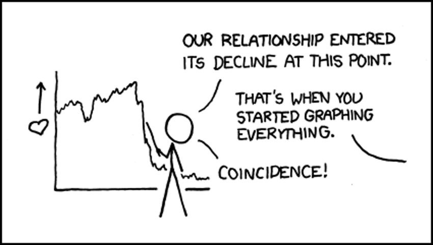
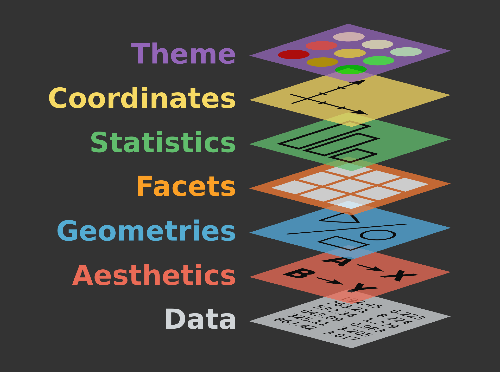
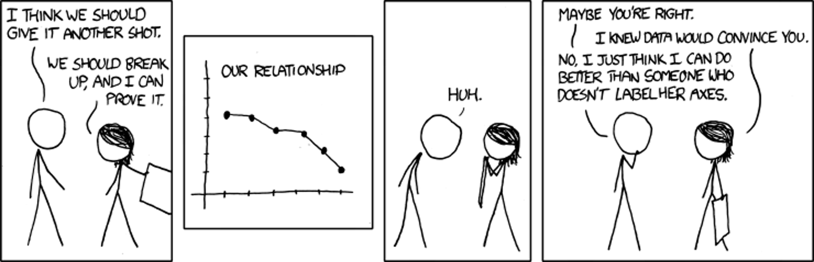
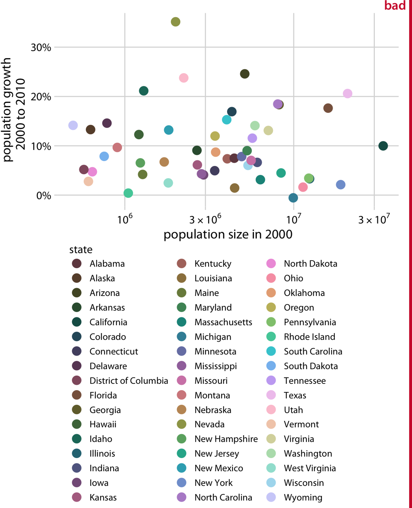
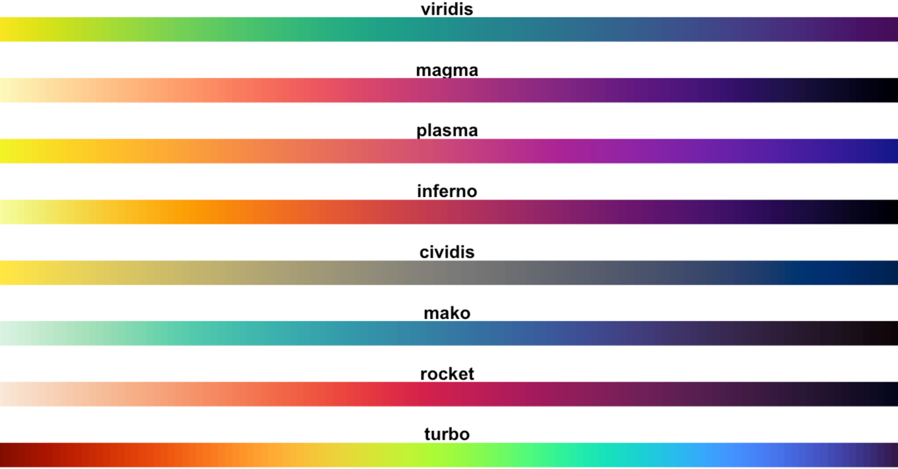
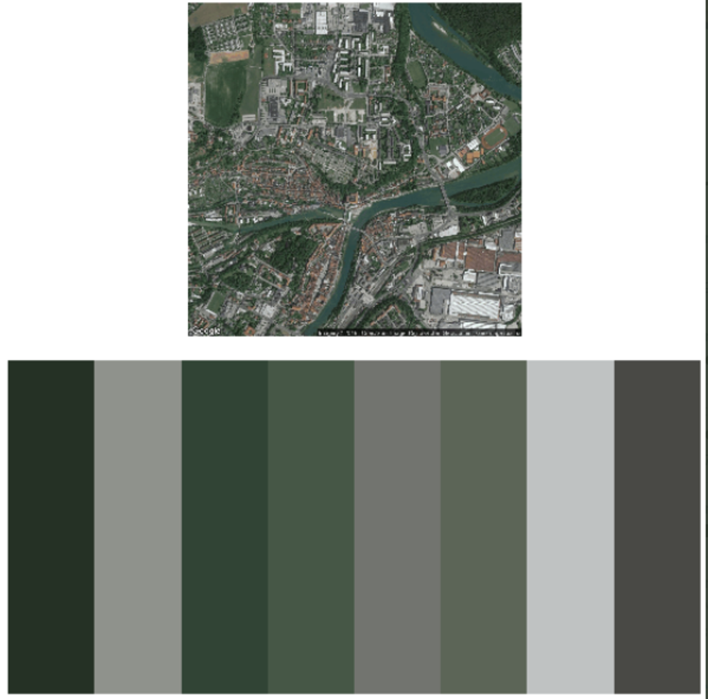
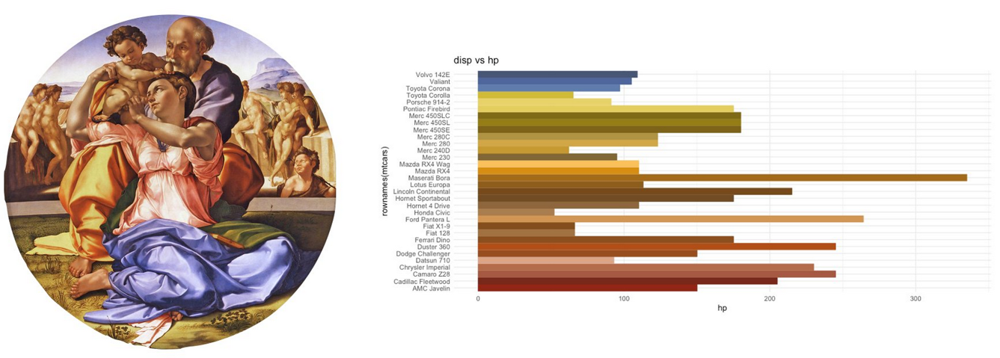
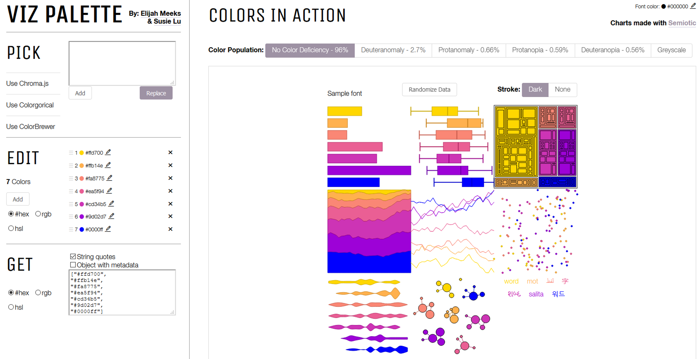

# Datenvisualisierung

*Der Beitrag wurde das letzte mal am `r format(Sys.time(), '%d %B, %Y')` editiert*

```{r include=FALSE}

knitr::opts_chunk$set(fig.align = "center", collapse = T, echo = TRUE, message = FALSE, warning = FALSE)

# With collapse = TRUE the Source and output lived together happily ever in knitr.
# https://github.com/yihui/knitr-examples/blob/master/039-merge.md

# loading multiple packages at once with `pacman`
# create a vector name
packages <- c("tidyverse", "markdown", "knitr", "matrixStats", "patchwork", "lubridate", "plotly",  "naniar", "stlplus", "gt", "dygraphs", "htmltools", "zoo", "xts", "ggpmisc", "forcats", "RColorBrewer", "Kendall", "rstudioapi", "multcompView", "plyr", "bookdown", "janitor", "rstatix", "ggpubr", "moments", "tweetrmd", "ggthemes", "hexbin", "ggridges", "ggstream", "openair", "treemapify", "MBA", "akima", "PlotSvalbard")
 
# Load the packages vector 
pacman::p_load(packages, character.only = T)


my_theme <- theme(
  panel.background = element_rect(fill = "white", color = "black"),
  panel.grid.major = element_blank(), 
  panel.grid.minor = element_blank(), 
  panel.border = element_blank())

```

```{r echo = F}
# Daten Speicherkoog einlesen
koog_raw <- readr::read_delim("data/data.csv", delim = ";", 
                          col_types = readr::cols(
                            # date = überschreibt die Spalte mit der neuen Spezifikation
                            date = readr::col_datetime(format = "%d.%m.%Y %H:%M") 
  ))
koog_raw <- janitor::clean_names(koog_raw)
koog <- koog_raw %>%
  dplyr::mutate(across(contains("eh"), ~. + 207))
# Erstelle neue Spalten mit Zeitstempeln
koog <- koog %>%
  mutate(year = lubridate::year(date),
         month = lubridate::month(date),
         day = lubridate::day(date),
         hour = lubridate::hour(date), 
         daily = format(date, "%Y-%m-%d"),
         monthly = format(date, "%Y-%m"))

# Tagesmittelwerte
koog_day <- koog %>%
  group_by(daily) %>%
  summarise_if(is.numeric, mean, na.rm = T) %>%
  mutate(daily = as.Date(daily))

# Monatsmittelwerte
koog_month <- koog %>%
  group_by(monthly) %>%
  summarise_if(is.numeric, mean, na.rm = T)

# Jahresmittelwerte
koog_year <- koog %>%
  group_by(year) %>%
  summarise_if(is.numeric, mean, na.rm = T)

```

🚨 Das folgende Kapitel mit Vorsicht genießen! Wenn ich meine Sache gut mache, dann ergibt sich ein großes Suchtpotenzial!

```{r echo = F, fig.cap="Source from: https://xkcd.com/523/", out.width="100%"}

```

🔍 Wie immer ist jedem die Literatur von Hadly Wickham ans Herz gelegt [ggplot2: Elegant Graphics for Data Analysis](https://ggplot2-book.org/introduction.html)

Über die Möglichkeiten eine Basis-Abbildung aufzupimpen ist dieser [Blogbeitrag](https://www.cedricscherer.com/2019/05/17/the-evolution-of-a-ggplot-ep.-1/) und dieser [Blogbeitrag](https://www.cedricscherer.com/2019/08/05/a-ggplot2-tutorial-for-beautiful-plotting-in-r/#colors) ans Herz gelegt. 

```{r echo = F, fig.cap="Source from: https://www.cedricscherer.com/", out.width="100%"}
knitr::include_graphics("images/053.png")
```

## ggplot2 - grammar of graphics

ggplot2 basiert auf der **g**rammar of **g**raphics und ist ein statistisches Paket um Daten zu visualisieren. Es bietet extrem viele Möglichkeiten, Daten auf verschiedenste Weise darzustellen und auch zu transformieren, ohne etwas an den Rohdaten zu verändern. Der Workflow bei ggplot2 folgt dabei einer Logik und Reihenfolge die es einem erlaubt, in einem iterativen Ansatz identische Abbildungen für ähnliche Probleme zu gestalten. 

Die Grammatik hinter `ggplot` zu verstehen ist dabei hilfreich um noch effektiver, schneller und anschaulicher Abbildungen zu erstellen. Das Prinzip sind **Layer**, also verschiedene Ebenen, die eine Abbildung aufbauen. 

```{r echo = F, fig.cap="Source from: http://bloggotype.blogspot.com/", out.width="100%"}

```

Alle Abbildungen bestehen aus **data** mit den Informationen, welche dargestellt werden und **mapping**, eine Beschreibung wie die Daten durch Aesthetics dargestellt werden. Es gibt fünf Komponenten für das mapping von Daten:

* **Layer** beinalten geometrische Elemente (**geom**s), bspw. `point`, `line`, `bar`, `boxplot`, ... und statistische Transformationen (**stat**s). 
* **Scales** beschreiben Werte im Datenraum und setzen sie zu den Aesthetics in Bezug. Dazu gehören die Verwendung von Farbe, Form, Größe. Scales beeinflussen ebenfalls die Legende und Achsen. 
* **Coord** beinhaltet das Koordinatensystem, bspw. ob Hilfslinien gezogen werden sollen oder ob neben dem klassischen Kartesischen Koordinatensystem Polar oder andere Kartenprojektionen verwendet werden. 
* **Facet** beschreibt wie Gruppen anhand der Daten verteilt und differenziert dargestellt werden sollen. 
* **Theme** modifiziert die Abbildungen um Textgröße, Position, Farbhintergrund und vieles vieles mehr.

### Schlüsselkomponenten

Jeder ggplot2 Aufruf benötigt drei Komponenten. 

1. **data**
2. **aesthetics** die beschreiben, wie die Daten im Koordinatenraum platziert werden. 
3. **geoms** zur Darstellung der Daten. 

Der Datensatz sollte und liegt in den meisten Fällen tabular vor, also mit Zeilen (= observations) und Spalten (=variables), wobei jede Zelle einen eigenen Wert codiert (= value). Das Datenobjekt in R nennt sich `data.frame` oder neuerdings auch als eine etwas besser verknüpfte Variante im tidyverse `tibble`. 

Hier ein simples Beispiel unter Verwendung des Speicherkoog Datensatzes:

```{r}
# Verwende den Speicherkoogdatensatz auf Tagesbasis
ggplot(data = koog_day)
```

Komisch? Wieso ist die Abbildung denn leer? 🤯 Ach ja, wir müssen bei den Aestehtics noch festlegen, welche Variablen auf welche Achse geplottet werden sollen. Dazu setzen wir das Argument `aes()` was x = und was y = sein soll. Nehmen wir mal Das Datum auf Tagesbasis und die Bodentemperatur in 10 cm:

```{r}
ggplot(data = koog_day, aes(x = daily, y = st10))
```

Häää? Immer noch leer. 

ggplot fehlt der **geom** Layer um zu wissen, wie die Daten in das Koordinatensstem übertragen werden sollen:


```{r}
ggplot(data = koog_day, aes(x = daily, y = st10)) +
  geom_point()
```

🎉 Herzlichen Glückwunsch zu deiner ersten ggplot Abbildung! Wir können diesen Abschnitt auch als eigenes Objekt speichern `ggplot(data = koog_day, aes(x = daily, y = st10))` und fortlaufend editieren. 

```{r}
p <- ggplot(data = koog_day, aes(x = daily, y = st10))
# Erstelle ein Liniendiagram
p + geom_line()
# Boxplotdiagram
p + geom_boxplot()
# Säulendiagram
p + geom_col()
# Flächendiagram
p + geom_area()
```

... und viele weitere. Man kann dabei auch mehrere geoms in einem Plot erstellen:

```{r}
p + geom_line() + geom_boxplot(aes(group = year))
```

O, viel kann man jetzt nicht erkennen. Der Layer mit dem Boxplot liegt über unserem Liniendiagramm. Was passiert wenn wir die Abfolge der Layer ändern?

```{r}
p + geom_boxplot(aes(group = year)) + geom_line()
```

Wir können das farblich noch etwas besser darstellen:

```{r}
ggplot(data = koog_day, aes(x = daily, y = st10, group = year)) +
  geom_boxplot(fill = "grey") +
  geom_line() +
    geom_point(data = koog_year, mapping = aes(as.Date(paste(year, 06, 15, sep = "-")), st10), shape = 21, fill = "white", size = 6) +
  theme_bw()
```

🚨 Alles was von den Daten visualisiert werden soll MUSS in den aes() Aufruf geschrieben werden.  

🚨 Die Reihenfolge der Layer ist entscheident, wie der Plot später aussieht. 

Das Jahr 2013 war also relativ kalt und das Jahr 2014 das wärmste in der Zeitreihe. 

Wollen wir bspw. die Bodentemperatur >= 10 °C in einer anderen Farbe darstellen, dann muss dies in den aes() Aufruf hinterlegt werden, da wir diese Informationen von den Daten extrahieren:

```{r}
# Das funktioniert nicht
ggplot(data = koog_day, aes(x = daily, y = st10), color = st10 > 10) +
  geom_point()
# Das funktioniert
ggplot(data = koog_day, aes(x = daily, y = st10, color = st10 > 10)) +
  geom_point()
```

Ähnlich verhält es sich bei der farblichen Darstellung einer Variable. Möchte ich der Bodentemperatur den fixen Wert einer Farbe blau zuordnen, dann MUSS dies außerhalb des aes() Aufrufes erfolgen:

```{r}
# Das funktinoert nicht
ggplot(data = koog_day, aes(x = daily, y = st10)) +
  geom_point(aes(color = "blue"))
# Das funktioniert
ggplot(data = koog_day, aes(x = daily, y = st10)) +
  geom_point(colour = "blue")
```

### Aesthetics (color, size, shape)

Um zusätzliche Informationen einem plot hinzuzufügen, kann man im `aes()` Argument folgende Befehle setzen:

```{r}
# Farbe
ggplot(koog_day, aes(daily, st10, color = st10)) +
  geom_point()
# Größe
koog_day %>%
  filter(daily < "2010-06-30") %>%
  ggplot(aes(daily, st10, size = st10)) +
  geom_point()

```

Die Form (**shape**) kann man auch beeinflussen, allerdings nicht mit einer kontinuierlichen Variable wie Bodentemperatur. Daher schauen wir uns den `mtcars` Datensatz an:

```{r}
# Stelle Allrad, Front- und Heckantriebler in unterschiedlichen Formen dar
ggplot(mpg, aes(displ, hwy, shape = drv)) + 
  geom_point()
```

### Smoothers and models

Manchmal ist ein Trend aus den Daten nicht unbedingt gut zu erkennen. Nehmen wir das Beispiel Grundwasserstand und E~H~ in 60 cm Tiefe:

```{r}
koog_day  %>%
  ggplot(aes(wt, eh100a)) +
  geom_point()
```

Die Funktion `geom_smooth()` plottet als default eine Loess Kurve, welches eine lokale Regression der Daten ist:

```{r}
koog_day  %>%
  ggplot(aes(wt, eh60a)) +
  geom_point(alpha = 0.1) + # Durch den Alpha Wert können wir den Punkten Transparenz geben
  geom_smooth(size = 2)
```

So lässt sich besser erkennen und filtern, dass bei 75 cm im Mittel das E~H~ beginnt abzusinken. Wollen wir anstelle der Loess Kurve eine lineare Regression verwenden müssen wir das als Argument definieren:

```{r}
koog_day  %>%
  ggplot(aes(wt, eh60a)) +
  geom_point(alpha = 0.1) + # Durch den Alpha Wert können wir den Punkten Transparenz geben
  geom_smooth(size = 2, method = "lm") # lm = linear model
```

E~H~ und Grundwasserstand sind also negativ korreliert. 

### Labels

```{r echo = F, fig.cap="Source from: https://xkcd.com/833/", out.width="100%"}

```

Bisher haben wir gesehen, dass ggplot als `default` die Achsenbezeichnung (Spaltenname) in den aesthetics benutzt, um die Achsen zu beschriften. 

```{r}
koog_day  %>%
  ggplot(aes(wt, eh60a)) +
  geom_point(alpha = 0.1) + # Durch den Alpha Wert können wir den Punkten Transparenz geben
  geom_smooth(size = 2, method = "lm") # lm = linear model
```

`wt` kann jedoch alles bedeuten und welche Einheit dahintersteckt erschließt sich auch nicht. Eine gute Achsenbeschriftung ist extrem wichtig und kann wie folgt umgesetzt werden:

```{r}
p <- koog_day  %>%
  ggplot(aes(wt, eh60a)) +
  geom_point(alpha = 0.1) + # Durch den Alpha Wert können wir den Punkten Transparenz geben
  geom_smooth(size = 2, method = "lm") +# lm = linear model
  labs(
    title = "Eine klasse Abbildung",
    x = "Grundwasserflurabstand (cm u. GOK)", 
    y = expression(paste(E[H], " (mV)"))
  )
```

Mit der Funktion `expression()` können wir Sonderzeichen setzen aber auch Zahlen hoch oder tiefstellen. Durch das Setzen der Zahl in eine eckige Klammer `[]` tiefstellen und durch `^` hochstellen. Wollen wir diese Sonderzeichen mit normalem Text verknüpfen, dann behelfen wir uns mit der Funktion `paste()`. Die Einzelnen Bauteile des Satzes werden durch `,` getrennt. 

🔍 [http://rchaeology.blogspot.com](http://rchaeology.blogspot.com/2012/11/combining-superscripts-subscripts-and.html)

### Themes

`ggplot2` hat bereits eine Vielzahl integrierter themes. Ein theme beeinflusst das Erscheinungsbild der Abbildung.

```{r}
# schwarz/weiß
p + theme_bw()
# klassisch
p + theme_classic()
# Cleveland
p + theme_cleveland()
# Komplett ohne Achsen etc. 
p + theme_void()
# Für die Excel Nostalgie
p + theme_excel()
```

Und noch eine weitere Vielzahl. Wir sind auf diese themese aber nicht begrenzt, sondern können alles editieren. Wollen wir die Farbe des Textes in rot ändern, müssen wir folgendes tun:

```{r}
p + theme(text = element_text(color = "red"))
```

Auf diese Art können wir alle Bestandteile einer Abbildung verändern:

```{r}
# Plotfarbe
p + theme(panel.background = element_rect(fill = "lightblue",
                                colour = "lightblue",
                                size = 0.5, linetype = "solid"))

# Hintergrundfarbe 
p + theme(plot.background = element_rect(fill = "lightblue",
                                colour = "lightblue",
                                size = 0.5, linetype = "solid"))
```

Zu Beginn einer R Session oder eines Skriptes kann man sich auch ein modifiziertes theme speichern und auf diese einfach zurückgreifen:

```{r}
# Setze das theme
kristofs_theme_des_jahres <- theme(
  panel.background = element_rect(fill = "yellow", color = "red"),
  panel.grid.major = element_blank(), 
  panel.grid.minor = element_blank(), 
  panel.border = element_blank())
# Wende es auf unseren Plot an
p + kristofs_theme_des_jahres
```

### Facets

Facets sind *multi-panel-plots* und lassen sich am besten auf diskrete Variablen übertragen. 

💡 Facets sind großartig um plots überschaulicher zu gestalten. 

```{r}
# Plotte Farbe zu den Daten
mtcars %>%
  ggplot(aes(hp, mpg, color = cyl)) +
  geom_point()
# Erstelle facets nach der Variable cyl (Zylinder)
mtcars %>%
  ggplot(aes(hp, mpg, color = cyl)) +
  geom_point() +
  facet_wrap(~cyl)
```

So ist es direkt ersichtlich, je mehr Zylinder desto mehr PS und desto höher ist der Verbrauch. Mit einem 8-Zylinder muss man beim Tanken schon etwas tiefer in die Tasche greifen. Die Variable nach der das facetting stattfindet wird mit der Tile `~` verknüpft. `facet_grid` ist am besten für viele Variablen in Form einer Matrix (m x n) und `facet_wrap` für eine Variable wobei die Anzahl der Spalten (`ncol`) und Zeilen (`nrow`) definiert werden kann. Auch ob die Skala an die Zahlen des facets angepasst werden sollen. 

```{r}
# Erstelle facets nach der Variable cyl (Zylinder)
mtcars %>%
  ggplot(aes(hp, mpg, color = cyl)) +
  geom_point() +
  facet_wrap(~cyl, nrow = 3, scales = "free_y") # Arrangiere die Plots untereinander und Autoskalierung
```

💡 Um die Variablennamen nach denen das facetting stattfindet nicht in den Rohdaten durchzuführen, gibt es das Argument `labbeler =`. Das ist praktisch um die Plot zu annotieren:

```{r}
# Erstelle einen Vektor (col_name) mit den Namen, die geändert werden sollen
col_name <- c("4" = "gut", "6" = "besser", "8" = "am besten")

# Erstelle facets nach der Variable cyl (Zylinder)
mtcars %>%
  ggplot(aes(hp, mpg, color = cyl)) +
  geom_point() +
  facet_wrap(~cyl, nrow = 3, scales = "free_y", labeller = as_labeller(col_name)) 
# Füge den col_name vector dem labeller Argument hinzu
```


### Coordinate system

Fast ausschließlich arbeitet man mit dem klassichen kartesischen Koordinatensystem. Ein Trick die Achsen zu vertauschen geht mit `coord_flip()`:

```{r}
# Normal
mtcars %>%
  ggplot(aes(mpg, hp)) +
  geom_point()
# Achsen tauschen
mtcars %>%
  ggplot(aes(mpg, hp)) +
  geom_point() +
  coord_flip()
```

Man kann auch in einen Teil des plots "zoomen", wobei mit `coord_cartesian()` keine Neuberechnung stattfindet gegenüber scale limits oder xlim:

```{r}
p <- ggplot(mpg, aes(displ, cty)) + geom_point() + geom_smooth()
p + geom_vline(xintercept = 4, linetype = 2) + geom_vline(xintercept = 6, linetype = 2)
p + xlim(c(4, 6)) + ggtitle("xlim")
p + scale_x_continuous(limits = c(4, 6)) + ggtitle("scale limits")
p + coord_cartesian(xlim = c(4, 6)) + ggtitle("coord_cartesian")
```

### Annotations

Die Funktion `annotate()` ist hilfreich, um Dinge hervorzuheben und dem Leser einen schnelleren Zugang zu der Hauptaussage einer Abbildung zu geben:

```{r}
ggplot(mpg, aes(displ, hwy)) +
  geom_point(data = subset(mpg, manufacturer == "subaru"), 
             colour = "orange",
             size = 3) +
  geom_point() + 
  annotate(geom = "curve", 
           x = 4, y = 35, xend = 2.65, yend = 27, 
           curvature = 0.3, arrow = arrow(length = unit(2, "mm"))) +
  annotate(geom = "text", x = 4.1, y = 35, label = "subaru", hjust = "left")
```

Farben über facets zu colorieren mit den Daten in grau als Hintergrund ist ebenfalls möglich:

```{r}
ggplot(mpg, aes(displ, hwy)) +
  geom_point(data = mpg[c("displ", "hwy")], color = "grey") +
  geom_point(aes(colour = factor(cyl))) +
  facet_wrap(~cyl)
```

## Verknüfpen von tidyverse und ggplot

`ggplot2::` ist ein package aus dem tidyverse und die ähnliche Syntax erlaubt es, Befehle der Datenmanipulation direkt mit der graphischen Darstellung in ggplot umzusetzen. Um die Befehle in einem ggplot Aufruf zu verknüpfen wird das `+` verwendet, welches anders ist als im restlichen tidyverse wo der pipe Operator verwendet wird (`%>%`). Wollen wir also unseren Datensatz der Bodentemperatur nur auf das Jahr 2011 begrenzen, geht dies folgendermaßen:

```{r}
# Filter für das Jahr 2011
koog_day %>%
  filter(daily > "2011-01-01" & daily < "2011-12-31") %>%
  ggplot(aes(daily, st10)) +
  geom_line()
```

Für manche Abbildung macht es Sinn die Datenbereinigung im Vorfeld durchzuführen und dies als eigenes Objekt zu speichern (bspw. `koog_day_2011` für das Jahr 2011; speziell wenn man auf diesen Datensatz häufiger zurückgreift) oder man verknüpft es immer wieder aufs Neue mit dem `%>%`. 

## Arbeiten mit Zeiten

Man hätte dieses Kapitel auch bei dem Kapitel Daten manipulieren bringen können. Habe ich aber nicht. Warum? Zeiten sind nicht nur wichtig um Daten zu gruppieren und Statistik damit zu betreiben, sondern auch die Darstellung bei einer Abbildung muss adäquat dargestellt werden. Das wichtigste package um mit Zeiten zu arbeiten lautet `lubridate::`. Schauen wir uns ein subset vom Speicherkoog an:

```{r}
time <- readr::read_delim("data/data.csv", delim = ";")
time <- time %>%
  select(date, ST10) %>%
  clean_names()

head(time, 5)
class(time$date)
```

Wir sehen, dass der Zeitstempel in unserem Objekt `time` `character` ist. In R ist dies kein gültiges Zeitformat, obwohl Zeitstempel in Rohdaten fast immer als `string` angegeben werden. Die drei grundlegenden Objekttypen für Zeiten in R lauten:

* `date` = Angabe als "<date>" in einem tibble. 
* `time` = Angabe als "<time>" in einem tibble.
* `date-time` = Angabe als "<dttm>" in einem tibble. Auch `POSIXct` genannt. 

💡 Verwende immer den einfachsten Zeittyp, der deine Voraussetzungen erfüllt. 

Es gibt drei Möglichkeiten, wo die Umwandlung zu einen `date` Objekt eine Rolle spielt. (i) Umwandlung von einem string, (ii) von individuellen Komponenten und (iii) von einem bestehenden date/time Objekt:

### strings

Im deutschen wäre eine Zeitangabe `01.04.2010` aber die internationale und in R codierte Art dieses wiederzugeben lautet `2010-04-01`. Die einfachste Art dies wiederzugeben lautet:

```{r}
time_char <- "01.04.2010"
class(time_char)

time_date <- lubridate::as_date(time_char, format = "%d.%m.%Y")
class(time_date)
```

Bei dem Argument `format = ...` haben wir angegeben, wie das Datum hinterlegt ist und nun haben wir erfolgreich ein `date` Objekt erstellt.

```{r}
time_char <- "01.04.2010 01:00:00"
class(time_char)

time_date <- lubridate::as_datetime(time_char, format = "%d.%m.%Y %H:%M:%S")
class(time_date)
```

Falls wir zursätzliche Zeitangaben zum Datum haben lautet die Funktion `as_datetime`. 

Die Liste wie Datumsangaben codiert sein können findet sich unter:

```{r eval = F}
?strptime
```

Ein shortcut in lubridate geht über das Arrangement von "y", "m", "d", um automatisch ein Datum zu erstellen. Die Position von y, m, d in Kombination mit einem Zeitstempel h, m, s, lässt sich flexibel verschieben:

```{r}
dmy_hms("01.04.2010 01:00:00")
#> [1] "2017-01-31"
mdy("January 31st, 2017")
#> [1] "2017-01-31"
dmy_h("31-Jan-2017 01")
#> [1] "2017-01-31"
```

Die Angabe einer Zeitzone ist auch möglich:

```{r}
ymd(20170131, tz = "UTC")
#> [1] "2017-01-31 UTC"
```

Falls in unseren Daten nur eine Jahreszahl als `character` angegeben wird, gibt es einen Trick ein dennoch gültiges Datum daraus zu formen. Mit dem Argument `truncated` lässt sich dennoch ein vollständiges Datum erstellen:

```{r}
yrs <- c(2001, 2002, 2002, 2002, 2003, 2005)
lubridate::ymd(yrs, truncated = 2L)
```

### Von individuellen Komponenten

Manachmal sind die Zeitangaben auch auf verschiedene Spalten verteilt. Eine Möglichkeit ist `make_date()` für Datum oder `make_datetime()` für zusätzliche Zeitangabe:

```{r}
time_char <- tibble(
  year = 2010,
  month = 4,
  day = 1, 
  hour = 1,
  minute = 0
)
time_char
# Erstelle ein Datum aus den einzelnen Spalten
time_char <- time_char %>%
  mutate(datetime = make_datetime(year,month,day,hour,minute))
time_char
```

### Ein bestehendes Objekt

Das ganze lässt sich natürlich auch Rückwärts gestalten, sodass ich aus einem bestehenden Objekt 

* year()
* month()
* mday() (day of the month)
* yday() (day of the year)
* wday() (day of the week)
* hour()
* minute()
* second()

extrahieren kann.

```{r}
datetime <- ymd_hms("2016-07-08 12:34:56")

year(datetime)
#> [1] 2016
month(datetime)
#> [1] 7
mday(datetime)
#> [1] 8

yday(datetime)
#> [1] 190
wday(datetime)
#> [1] 6
```

Für month() und wday() gibt es das Argument `label = T`, um den Namen anzuzeigen und mit `abbr = F` kann dieser  ausgeschrieben angezeigt werden. 

```{r}
month(datetime, label = TRUE)
#> [1] Jul
#> 12 Levels: Jan < Feb < Mar < Apr < May < Jun < Jul < Aug < Sep < ... < Dec
wday(datetime, label = TRUE, abbr = FALSE)
#> [1] Friday
#> 7 Levels: Sunday < Monday < Tuesday < Wednesday < Thursday < ... < Saturday
```

Zeiten können auch gerundet werden mit den Funktionen `floor_date()`, `round_date()` und `ceiling_date()`

```{r}
# Runden zur nächstmöglichen Einheit
x <- ymd_hms("2009-08-03 12:01:59.23")
round_date(x, "minute")
#> [1] "2009-08-03 12:01:00 UTC"

# Abrunden zur angegebenen Einheit
x <- ymd_hms("2009-08-03 12:01:59.23")
floor_date(x, "minute")
#> [1] "2009-08-03 12:01:00 UTC"

# Aufrunden 
x <- ymd_hms("2009-08-03 12:01:59.23")
ceiling_date(x, "minute")
#> "2009-08-03 12:02:00 UTC"
```

### Darstellung in Abbildungen

Im Folgenden schauen wir uns nun den Verlauf der Bodentemperatur in 10 cm Tiefe an. Die X Achse ist lesbar, lässt sich aber besser darstellen:

```{r}
p <- koog %>%
  filter(date < as.POSIXct("2010-04-30 23:00")) %>%
  ggplot(aes(date, st10)) +
  geom_line()
p
```

Die Funktion die wir dafür benötigen lautet 

* `scale_x_date`
* `scale_x_datetime`
* `scale_x_time`

```{r eval = F}
p + scale_x_date(date_breaks = "1 week")
# Fehler: Invalid input: date_trans works with objects of class Date only
```

🤯 Warum geht es nicht...richtig! Unsere Spalte `date` ist ein `datetime` Objekt und daher muss der Funktionsaufruf lauten:

```{r}
# Setze die breaks wöchentlich
p + scale_x_datetime(date_breaks = "1 week")
# Wöchentliche Skalierung und KW des Jahres
p + scale_x_datetime(date_breaks = "1 week", date_labels = "%W")
# Tagesbasis
p + scale_x_datetime(date_breaks = "1 day", date_labels = "%m-%d")
# Tagesbasis und jetzt auch lesbar
p + scale_x_datetime(date_breaks = "4 day", date_labels = "%m-%d")
# Tagesbasis und jetzt auch lesbar mit minor breaks auf Tagesbasis
p + scale_x_datetime(date_breaks = "4 day", date_labels = "%m-%d", minor_breaks = "1 day")
```

Für alle Jahre geht dies natürlich auch:

```{r}
# Default plot
koog_day %>%
  ggplot(aes(daily, st10)) +
  geom_line()
# Customized plot with proper labeling
koog_day %>%
  ggplot(aes(daily, st10)) +
  geom_line() +
  scale_x_date(date_breaks = "1 year", date_labels = "%Y", minor_breaks = "1 year")
```


## pivoting to longer format

Aktuell befindet sich jede Variable in **einer Spalte** und jede Messung entspricht einer Zeile. Was müssen wir also tun, wenn wir die Bodentemperatur aus allen Tiefen in **einer** Abbildung darstellen wollen und nicht in mehreren?!

💡 R basiert auf einer *long-format* Datendarstellung (auch gestapelt genannt), wohingegen Excel auf einem *wide-format* basiert. Das Transformieren zu einem *long-format* ist eine der häufigsten Datentransformationen um den Datensatz *tidy* zu bekommen.

Wir brauchen einen langen Vektor aller Bodentemperaturen, um diesen darzustellen und erreichen es mit der Funktion `pivot_longer()` aus dem `tidyr::` package. 

```{r}
# Erstelle einen langen Vektor der Bodentemperatur
koog_day %>%
  pivot_longer(cols = starts_with("st")) %>% # Durch helper functions können wir alle Spalten auswählen, die mit "st" beginnen
  ggplot(aes(daily, value, color = name)) +
  geom_line()
# Wähle nur die 10 und die 150 cm Tiefe aus durch Angabe der Spaltennamen
koog_day %>%
  pivot_longer(cols = c("st10", "st150")) %>% # Durch helper functions können wir alle Spalten auswählen, die mit "st" beginnen
  ggplot(aes(daily, value, color = name)) +
  geom_line()
```

Beim pivoting können wir uns Informationen in den Zeilennamen auch zunutze machen, um diese in den Neuen Variablenbezeichnungen zu integrieren. Dabei empfiehlt sich eine Spaltenbeschriftung zu wählen, die auf dieses Schema leicht übernommen werden kann. Eine Möglichkeit die Bodentemperatur in 10 cm Tiefe zu codieren wäre `st_10`. 

```{r}
# Erstelle ein tibble im wide format
test <- tibble(
  st_10 = rnorm(n = 10, mean = 10, sd = 1), 
  st_20 = rnorm(n = 10, mean = 9, sd = 1), 
  st_30 = rnorm(n = 10, mean = 8, sd = 1) 
)
test
# Erstelle tibble test_long im long format
test_long <- test %>%
  pivot_longer(cols = contains("st"), names_to = c("Parameter", "Depth"), values_to = "Wert", names_sep = "_") # Gebe an wie die Informationen im Spaltenname getrennt sind
test_long
```

## Good practices

🔍 [Fundamentals of Data Visualization - Claus O. Wilke](https://clauswilke.com/dataviz/index.html)

Ein nicht unerheblicher Teil der Menschen hat eine rot-grün Schwäche und darum ist es gut, diese Farben nicht explizit zu verwenden. Die [viridis](https://www.thinkingondata.com/something-about-viridis-library/) Farbpalette bietet tolle Farben die für ästhetische Abbildungen zusammengestellt wurden. Eine andere Möglichkeit ist das package `RColorBrwer`. 

```{r}
# default Farben
mtcars %>%
  ggplot(aes(hp, mpg, color = as.factor(gear))) +
  geom_point()
# Manuell gesetzte Farben (schlechte Farbwahl)
mtcars %>%
  ggplot(aes(hp, mpg, color = as.factor(gear))) +
  geom_point() +
  scale_color_manual(values = c("green", "orange", "red"))
# Benutze das viridis package
mtcars %>%
  ggplot(aes(hp, mpg, color = as.factor(gear))) +
  geom_point() +
  scale_color_viridis_d()
```

> “There are three fundamental use cases for color in data visualizations: (i) we can use color to distinguish groups of data from each other; (ii) we can use color to represent data values; and (iii) we can use color to highlight.” - Claus Wilke, Fundamentals of Data Visualization

🚨 Sei konsistent bei der Farbwahl in deinem Projekt, Manuskript, Abschlussarbeit. Das erleichtert es dem Leser deine Story oder die Aussage deiner Arbeit zu verstehen. 

🚨 Coloriere nur wenn es auch wirklich wichtig ist und es eine Bedeutung in der Abbildung hat. 

```{r echo = F, fig.cap="Source from: https://clauswilke.com/dataviz/index.html"}

```

> “Even if with a lot of effort we can figure out exactly which state is which, this visualization defeats the purpose of coloring. We should use color to enhance figures and make them easier to read, not to obscure the data by creating visual puzzles.”

## Speichern eines plots

`ggplot` Objekte sind wie alle Objekte in R anzusehen und können ebenfalls gespeichert werden. Die Funktion um eine Abb. (oder anderes Objekt) zu speichern ist `ggsave()`. 

```{r}
# Speichere die Abbildung als Objekt p
p <- mtcars %>%
  ggplot(aes(hp, mpg, color = as.factor(gear))) +
  geom_point()
# Speichere das Objekt p unter dem Pfad "images/temp/"
# Achte auf den "/" slash
ggsave(filename = "images/temp/test.png", plot = p, width = 5, height = 3)
```

Um zu sehen wie sich eine Abbildung entwickelt mag ich es auch, eine Ordner `temp` (für temporary) anzulegen und jede editierte Abbildung abzuspeichern. Das kann man auch automatisieren mit dem Zeitstempel des Computers als fortlaufenden Dateinamen.

```{r}
ggsave(paste0("images/temp/Title_of_file_", format(Sys.time(), "%Y-%m-%d_%H-%M-%S"), ".png"))
```

## Formen der Darstellung

### Overplotting

Bei mittleren bis großen Datensätzen läuft man Gefahr des "overplottings". Eine Möglichkeit ist es durch die Form oder Transparenz die Aussagekraft zu erhöhen:

```{r}
# Example from https://ggplot2-book.org/statistical-summaries.html#overplotting
df <- data.frame(x = rnorm(4000), y = rnorm(4000))
norm <- ggplot(df, aes(x, y)) + 
  labs(x = NULL, y = NULL) 

norm + geom_point()
norm + geom_point(shape = 1) # Hollow circles
norm + geom_point(shape = ".") # Pixel sized
norm + geom_point(alpha = 0.1) # Pixel sized
```

Hat man sehr großen Daten kann ein 2D Geometrien nützlich sein: 

```{r}
norm + geom_bin2d() + ggtitle("bin2d")
norm + geom_hex() + ggtitle("hex")
norm + geom_hex(bins = 10) + ggtitle("hex (bins = 10)")
norm + geom_density2d() + ggtitle("density2d")

# Für den Speicherkoog könnte ein overlay wie folgt aussehen:
koog_day %>%
  ggplot(aes(wt, eh60a)) +
  geom_point(alpha = 0.1) +
  geom_density_2d(bins = 10) +
  my_theme

```

### Positions Argument

Jedes `geom` hat auch ein Argument zur Auskunft der Position. Schauen wir es uns am Beispiel eines Säulendiagrams an:

```{r}
base <- ggplot(mpg, aes(cty, fill = class)) + 
  xlab(NULL) + ylab(NULL) + theme(legend.position = "none")

base + geom_bar() + ggtitle("stack") # the default
base + geom_bar(position = "dodge") + ggtitle("dodge")
base + geom_bar(position = "fill") + ggtitle("fill")
base + geom_bar(position = "identity") + ggtitle("identity") +
  theme(panel.background = element_rect(fill = "gray"))
```

Für Punkte gibt es nochmal speziellere Argumente, `identity`, `nudge`, `jitter`. 

```{r}
base <- ggplot(mpg, aes(displ, cty, color = class)) + 
  xlab(NULL) + ylab(NULL) + theme(legend.position = "none")

base + geom_point() + ggtitle("identity") # the default
base + geom_point(position = position_nudge(x = 2, y = -2)) + ggtitle("nudge")
base + geom_point(position = "jitter") + ggtitle("jitter")
```

`position_nudge()` verschiebt unsere Daten um -2 auf der y Achse und +2 auf der x Achse. 

🔍 [https://rpubs.com/bpbond/727258](https://rpubs.com/bpbond/727258)

### Inspirationen

🔍 [https://r-charts.com/](https://r-charts.com/)

Die folgenden Abbildungen spiegeln alle dasselbe wieder, unterscheiden sich jedoch durch das `geom` in der Darstellung:

```{r}
base <- ggplot(mpg, aes(fill = class)) +
  labs(x = NULL, y = NULL) +
  theme(legend.position = "none")

base + geom_histogram(aes(x = displ)) + ggtitle("histogram")
base + geom_density(aes(x = displ)) + ggtitle("density")
base + geom_freqpoly(aes(x = displ)) + ggtitle("freqpoly")
base + geom_boxplot(aes(x = class, y = displ)) + ggtitle("boxplot")
base + geom_violin(aes(x = class, y = displ)) + ggtitle("violin")
base + geom_dotplot(aes(x = class), stackratio = 0.35) + ggtitle("dotplot")
```

#### Linien 

Für quasi kontinuierliche Darstellungen eignen sich Liniendiagramme:

```{r}
koog_day %>%
  filter(daily > "2011-01-01" & daily < "2011-12-31") %>%
  ggplot(aes(daily, st10)) +
  geom_line()
```

#### Boxplot

Man kann die monatliche Variabilität aber auch als boxplot darstellen. Dazu setzen wir in dem Aufruf `geom_boxplot(aes(group = month))` um ggplot mitzuteilen, dass jede einzelne Box für den individuellen Monat in 2011 gezeigt werden soll. 

```{r}
koog_day %>%
  filter(daily > "2011-01-01" & daily < "2011-12-31") %>%
  ggplot(aes(daily, st10)) +
  geom_boxplot(aes(group = month))
```

Fehlt dieser Aufruf macht die Darstellung weniger Sinn 😎

```{r}
koog_day %>%
  filter(daily > "2011-01-01" & daily < "2011-12-31") %>%
  ggplot(aes(daily, st10)) +
  geom_boxplot()
```

#### Ridgeline plots

Auf der X Achse wird der numerische Wert geplottet und auf der Y Achse die Faktor Variable (in unserem Fall die Bodentemperatur in den Tiefen)

```{r}
p <- koog_day %>%
  pivot_longer(contains("st")) %>%
  mutate(name = factor(name, levels = c("st10","st20","st30","st60","st100","st150"))) %>%
  ggplot(aes(x = value, y = fct_rev(name))) +
  labs(
    x = "Bodentemperatur in °C", 
    y = "Bodentiefe"
  )

# Offene Dichteverteilung der Daten
p + geom_density_ridges()
# Geschlossene Dichteverteilung der Daten
p + geom_density_ridges2()
# Beschränke die Darstellung auf min und max der Tiefe
p + geom_density_ridges(rel_min_height = 0.01)
# Mit einheitlicher Farbe
p + geom_density_ridges(fill = "lightblue", alpha = 0.5)
# Farbe nach Gruppen
koog_day %>%
  pivot_longer(contains("st")) %>%
  mutate(name = factor(name, levels = c("st10","st20","st30","st60","st100","st150"))) %>%
  ggplot(aes(x = value, y = fct_rev(name), fill = name)) +
  labs(
    x = "Bodentemperatur in °C", 
    y = "Bodentiefe"
  ) +
  geom_density_ridges()
# Farbe nach Gradient
koog_day %>%
  pivot_longer(contains("st")) %>%
  mutate(name = factor(name, levels = c("st10","st20","st30","st60","st100","st150"))) %>%
  ggplot(aes(x = value, y = fct_rev(name), fill = stat(x))) +
  labs(
    x = "Bodentemperatur in °C", 
    y = "Bodentiefe"
  ) +
  geom_density_ridges_gradient() +
  scale_fill_viridis_c(option = "B")
```

#### Streamline plots

Streamline plots sind sinnvoll um Trends über die Zeit darzustellen oder 

```{r}
# Daten Aufbereitung
stream <- koog_day %>%
  mutate(day_of_year = yday(daily)) %>%
  filter(year == "2011") %>%
  pivot_longer(contains("st")) %>%
  mutate(name = factor(name, levels = c("st10","st20","st30","st60","st100","st150")))
p <- stream %>%
  ggplot(aes(x = day_of_year, y = value, fill = name))
# Default stream plot
p + geom_stream()

```

#### Lollipop charts

Diese Abbildung eignet sich für numerische Variablen die gegen eine kategorische geplottet werden sollen:

```{r}
# Data preparation
lolli <- koog_day %>%
  filter(daily < "2010-12-31") %>%
  summarise_at(vars(contains("eh")), mean, na.rm = T) %>%
  pivot_longer(everything())

col_names <- rev(c("eh10a","eh10b","eh10c",
                   "eh20a","eh20b","eh20c",
                   "eh30a","eh30b","eh30c",
                                           "eh60a","eh60b","eh60c",
                                           "eh100a","eh100b","eh100c",
                                           "eh150a","eh150b","eh150c"))
  


# Plot the data
p <- lolli %>%
  ggplot(aes(value, fct_relevel(name, col_names))) + # order the electrode names by the col_names vector
  geom_point() +
  geom_segment(aes(x = -300, xend = value, y = name, yend = name))
p
# Customization 
p <- p + geom_point(shape = 21, size = 8, fill = "white")
p
# Mithilfe von geom_text kann auch der Wert in den Kreis geplottet werden
p + geom_text(aes(label = round(value, 0)), size = 2)
# Mit fct_relevel aus dem forcats package kann nach Größe sortiert werden
lolli %>%
  ggplot(aes(value, fct_reorder(name, value))) + # order the electrode names by the col_names vector
  geom_point(shape = 21, size = 8, fill = "white") +
  geom_segment(aes(x = -300, xend = value, y = name, yend = name))

```

Speziell das sortieren von kategorischen Variablen ist häufig wichtig, um sofort einzusehen das der höchste E~H~ die Elektrode eh20c aufweist und der niedrigste Wert bei eh150b gemessen wurde. 

#### Windrose (radar chart)

🔍 [openair package](https://davidcarslaw.github.io/openair/reference/windRose.html)

In der Meteorologie werden auch Windrosen verwendet, um neben der Windrichtung auch die Geschwindigkeit zu codieren mit der im jährlichen Mittel der Wind weht. Das `openair::` package bietet Möglichkeiten dies umzusetzen. Alles was man braucht ist ein data frame mit einer Variable für die WIndrichtung (default `wd`) und der Windgeschwindigkeit (default `ws`). Durch das Argument `type = ` kann man ähnlich wie beim facetting angeben, wie die Daten aufgebrochen werden sollen (bspw. pro Jahr):

```{r}
# Restructure data
koog_wind <- koog_day %>%
  select(ws, wd, year) %>%
  filter(year < 2020 & year > 2011)

# Plot the data
koog_wind %>%
  windRose(ws = "ws", wd = "wd")

```

#### Treemaps

Treemaps visualisieren Beobachtungen durch Kacheln, wobei die Fläche der Kachel proportional zu dem Wert der Variable ist. Das package `treemapify::` kann dazu genutzt werden:

```{r}
# Create test data
df <- tibble(
  group = paste("Group", 1:9),
  subgroup = c("A", "C", "B", "A", "A","C", "C", "B", "B"),
  value = c(7, 25, 50, 5, 16,18, 30, 12, 41)
)

# Plot the data
df %>%
  ggplot(aes(area = value, fill = group)) +
  treemapify::geom_treemap()

# Fülle mit numerischen Daten
df %>%
  ggplot(aes(area = value, fill = value)) +
  treemapify::geom_treemap() +
  scale_fill_viridis_c()
 
# Label den plot mit Gruppenname und Wert
ggplot(df, aes(area = value, fill = value, label = paste(group, value, sep = "\n"))) +
  geom_treemap() +
  geom_treemap_text(colour = c(rep("white", 2),
                               1, rep("white", 6)),
                    place = "centre", size = 15) +
  scale_fill_viridis_c()

```

#### Contour plots

🔍 [https://fishandwhistle.net/post/2019/depth-time-heatmaps/](https://fishandwhistle.net/post/2019/depth-time-heatmaps/)

🔍 [https://theoceancode.netlify.app/post/odv_figures/](https://theoceancode.netlify.app/post/odv_figures/)

Die Messtiefen im Speicherkoog sind nahe an der Bodenoberfläche in einer höheren Auflösung und es kann auch zu Messausfällen kommen. Lücken in den Datensätzen vermitteln deswegen nicht unbedingt das räumliche und zeitliche Kontinuum, welches in naturwissenschaftlichen Datensätzen zu finden ist. Eine Möglichkeit dies wiederzuspiegeln bieten contour plots / heatmaps / Rasterabbildungen oder weitere Synonyme.  

```{r}

# Verlauf aller Elektroden
koog_day %>%
  pivot_longer(cols = contains("eh")) %>%
  filter(year == "2012") %>%
  ggplot(aes(daily, value, color = name, group = name)) +
  geom_line()
# Mittelwert bilden pro Tiefe
koog_day <- koog_day %>%
  rowwise() %>% # führe die folgende Berechnung Zeilenweise durch
  mutate(eh10_mean = mean(c(eh10a, eh10b, eh10c), na.rm = T),
         eh20_mean = mean(c(eh20a, eh20b, eh20c), na.rm = T),
         eh30_mean = mean(c(eh30a, eh30b, eh30c), na.rm = T),
         eh60_mean = mean(c(eh60a, eh60b, eh60c), na.rm = T),
         eh100_mean = mean(c(eh100a, eh100b, eh100c), na.rm = T),
         eh150_mean = mean(c(eh150a, eh150b, eh150c), na.rm = T))
# Verlauf der Mittelwerte 
koog_day %>%
  pivot_longer(contains("eh") & contains("mean")) %>%
  filter(year == "2012") %>%
  ggplot(aes(daily, value, color = name, group = name)) +
  geom_line()

```

Mit den Mittelwerten sieht es schon etwas aufgeräumter aus, wir sind aber immer noch nicht am Ziel. Unser Ziel ist es zum Erstellen der Konturabbildung die fehlenden Werte "aufzufüllen". Räumlich also alle Werte die zwischen den Elektroden 10 und 20 liegen (also hypothetische Messwerte in 11, 12, 13, ... cm Tiefe) und zeitlich die `NA`s im Dezember 2012. 

🚨 Die interpolierten Messwerte sollten nicht (!) für weitere statistische Verrechnungen genutzt werden, da E~H~ Messungen kleinräumig sehr variabel sind und wir keine Informationen über den Bereich zwischen den Messtiefen geben können. Nichtsdestotrotz sind Konturabbildungen ein tolles Tool um Daten ansprechend zu visualisieren und auch Trends hervorzuheben.

```{r}
# create data frame for interpolating
# The column names should be date, depth, value (e.g. redox data)
# NA, NaN, Inf values must be removed from the data frames
koog_contour <- koog_day %>%
  # separate by "_" and remove "eh"
  pivot_longer(contains("eh") & contains("mean"), names_to = c("depth", "mean"), names_sep = "_", names_prefix = "eh") %>% 
  filter(year == "2012") %>%
  mutate(date = daily) %>%
  select(date, depth, value) %>% 
  # remove NaN values from the data to NA values
  mutate(value = na_if(value, "NaN")) %>% 
  # remove all rows that contain a missing value, otherwise an error occurs during interpolation 
  drop_na() 

# Write function to interpolate between depths 
estimate_value_by_date <- function(target_date, target_depth) {
  data_for_date <- koog_contour %>% 
    filter(date == target_date) %>%
    arrange(depth)
  
  # approx() is one way to do a linear interpolation
  approx(data_for_date$depth, data_for_date$value, xout = target_depth)$y
}

# Test the function for four arbitraily set depths
estimate_value_by_date(ymd("2012-05-13"), c(0, 1, 1.5, 10, 21))


value_interp_depth <- crossing(
  # the same dates as koog_contour
  tibble(date = unique(koog_contour$date)),
  # depths can now be any value
  tibble(depth = seq(10, 150, length.out = 100)) # The depths must be specified according to the data
) %>%
  group_by(date) %>%
  dplyr::mutate(value = estimate_value_by_date(date[1], depth))


estimate_value_by_depth <- function(target_depth, target_date) {
  data_for_depth <- value_interp_depth %>% 
    filter(depth == target_depth) %>%
    arrange(date)
  approx(data_for_depth$date, data_for_depth$value, xout = target_date)$y
}


estimate_value_by_depth(
  target_depth = c(10,12), 
  target_date = seq(ymd("2012-05-12"), ymd("2012-05-15"), by = 1)
)


value_raster <- crossing(
  # dates can now be any value
  tibble(date = seq(ymd("2012-01-01"), ymd("2012-12-31"), by = 1)),
  # depths must be the same as in temp_interp_depth
  tibble(depth = unique(value_interp_depth$depth))
) %>%
  group_by(depth) %>%
  dplyr::mutate(value = estimate_value_by_depth(depth[1], date))

# Create a color palette
colours <- c("#feb483", "#d31f2a", "#ffc000", "#27ab19", "#0db5e6", "#7139fe", "#d16cfa")

p1 <- value_raster %>%
  ggplot(aes(date, depth, fill = value)) +
  geom_raster() +
  geom_contour(aes(z = value), breaks = 300, colour = "black") + # Label EH >= 300 mV with black
  coord_cartesian(ylim = c(150, 0), expand = 0) + # expand = 0 setzt die Grenze der Abbildung direkt an den Rand
  scale_fill_gradientn(colours = rev(colours), 
                       name = expression(E[H]),
                       breaks = seq(from = -400, to = 800, by = 200)) +
  scale_x_date(date_breaks = "1 month", date_labels = "%m", minor_breaks = "1 month") +
  labs(
    title = "Konturabbildung der Redoxpotenziale",
    subtitle = "Speicherkoog für das Jahr 2012",
    caption = "*Schwarze Linie trennt oxidierende (> 300 mV)\n und reduzierende Bedingungen",
    x = "Monat des Jahres",
    y = expression(paste(E[H], " (mV)"))
  ) + 
  my_theme

p2 <- koog_day %>%
  pivot_longer(contains("eh") & contains("mean")) %>%
  filter(year == "2012") %>%
  ggplot(aes(daily, value, color = name)) +
  geom_line()  +
  scale_x_date(date_breaks = "1 month", date_labels = "%m", minor_breaks = "1 month") +
  labs(
    title = "Verlauf der Redoxpotenziale",
    subtitle = "Speicherkoog für das Jahr 2012",
    x = "Monat des Jahres",
    y = expression(paste(E[H], " (mV)"))
  ) + 
  my_theme

p3 <- koog_day %>%
  filter(year == "2012") %>%
  ggplot(aes(daily, wt_2)) +
  geom_line() +
  scale_x_date(date_breaks = "1 month", date_labels = "%m", minor_breaks = "1 month") +
  labs(
    x = "Monat des Jahres",
    y = "Grundwasserflurabstand\n(cm u. GOK)"
  ) + 
  my_theme

p1 / p3  

ggsave("images/results/new_school.png", height = 6, width = 6)

p2 / p3

ggsave("images/results/old_school.png", height = 6, width = 6)

```

#### Warming stripes

🔍 [https://dominicroye.github.io/en/2018/how-to-create-warming-stripes-in-r/](https://dominicroye.github.io/en/2018/how-to-create-warming-stripes-in-r/)

Warming stripes haben in letzter Zeit größere Beliebtheit bekommen, um den Anstieg der globalen Durchschnittstemperatur zu visualisieren. Quasi erfunden wurden sie von Ed Hawkins:

```{r echo = F}
include_tweet("https://twitter.com/ed_hawkins/status/999242147135188993")
```

Als Beispieldatensatz schauen wir uns die Bodentemperatur in 5 cm Tiefe für eine Messstation des DWD in NRW an. Es handelt sich um die Station *Essen-Bredeney*. 

```{r}
# read data for the 5 cm soil depth
dh_005 <- readr::read_delim("data/data_TE05_MN002.csv", delim = ",")

# Define special theme for the plot
theme_strip <- theme_minimal()+
                 theme(axis.text.y = element_blank(),
                       axis.line.y = element_blank(),
                       axis.title = element_blank(),
                       panel.grid.major = element_blank(),
                       legend.title = element_blank(),
                       axis.text.x = element_text(vjust = 3),
                       panel.grid.minor = element_blank(),
                        plot.title = element_text(size = 14, face = "bold")
                       )

# Define colors to use for the plot
col_strip <- brewer.pal(11, "RdBu")

# For the final graphic we use the geometry geom_tile( ). Since the data does not have a specific value for the Y axis, we need a dummy value, here I used 1. Also, I adjust the width of the color bar in the legend.
dh_005 %>%
  ggplot(aes(x = as.Date(year), y = 1, fill = st)) +
  geom_tile() +
  scale_x_date(date_breaks = "5 years",
               date_labels = "%Y",
               expand = c(0, 0)) +
  scale_y_continuous(expand = c(0, 0)) +
  scale_fill_gradientn(colors = rev(col_strip)) +
  guides(fill = guide_colorbar(barwidth = 1)) +
  labs(
    title = "Entwicklung der Jahresmittelwerte der Bodentemperatur",
    subtitle = "In 5 cm Bodentiefe für die Station Essen-Bredeney",
    caption = "Quelle: Climate Data Center DWD", 
    y = NULL) +
  theme_strip

```

## Farbauswahl 

R bietet eine gigantische Auswahl an Farben, wo man schnell den Überblick verlieren kann. 
Das einfachste ist man wählt die Name über den Namen direkt aus, rot ist bspw. `"red"`. 

Eine große Auswahl gibt es über das Paket `RColorBrewer`, wo man auch das Argument setzen kann ausschließlich Farben zu wählen für Farbblinde:

```{r}
display.brewer.all(colorblindFriendly = T)
```

Ein weiteres Standardpaket ist `viridis`, wobei diese Farben alle für Farbblinde erstellt wurden. 

```{r echo = F, fig.cap="Source from: https://cran.r-project.org/web/packages/viridis/vignettes/intro-to-viridis.html"}

```

Eine weitere Möglichkeit Farben aus einem Bild, bspw. einem Luftbild, zu extrahieren geht mit dem package `earthtones`. 

```{r echo = F, fig.cap="Source from: https://cran.r-project.org/web/packages/earthtones/index.html"}

```

Richtig spannend ist auch das package `palleteR`, um Farben aus einem Bild zu extrahieren und zu verwenden. 

```{r echo = F, fig.cap="Source from: https://github.com/AndreaCirilloAC/paletter"}

```

Wer selber Hand anlegen möchte um Farben zu generieren, dem ist diese Seite wärmstens ans Herz gelegt [https://projects.susielu.com/viz-palette](https://projects.susielu.com/viz-palette). 

```{r echo = F, fig.cap="Source from: https://projects.susielu.com/viz-palette"}

```

### Beispiele für unterschiedliche Farben

```{r}
# select the data
lolli <- koog_day %>%
  pivot_longer(contains("eh") & !contains("mean"))

# create a name vector to sort the depth variables
col_names <- rev(c("eh10a","eh10b","eh10c",
                   "eh20a","eh20b","eh20c",
                   "eh30a","eh30b","eh30c",
                                           "eh60a","eh60b","eh60c",
                                           "eh100a","eh100b","eh100c",
                                           "eh150a","eh150b","eh150c"))
  
# Plot the data with default color
lolli %>%
  ggplot(aes(value, fct_relevel(name, col_names), color = name)) + 
  geom_boxplot() +
  labs(
    x = expression(paste("E" [H], " (mV)")),
    y = "Elektrode"
  ) +
  my_theme +
  theme(legend.position = "none")

# Plot the data with manual color
lolli %>%
  ggplot(aes(value, fct_relevel(name, col_names))) + 
  geom_boxplot(color = "red", fill = "blue") +
  labs(
    x = expression(paste("E" [H], " (mV)")),
    y = "Elektrode"
  ) +
  my_theme +
  theme(legend.position = "none")

# Plot the data with scale_fill_brewer and various palletes
lolli %>%
  ggplot(aes(value, fct_relevel(name, col_names), fill = name)) + 
  geom_boxplot() +
  labs(
    x = expression(paste("E" [H], " (mV)")),
    y = "Elektrode"
  ) +
  scale_fill_brewer(palette = "PuBu") +
  my_theme +
  theme(legend.position = "none")

# Plot the data with viridis color
lolli %>%
  ggplot(aes(value, fct_relevel(name, col_names), fill = name)) + 
  geom_boxplot() +
  labs(
    x = expression(paste("E" [H], " (mV)")),
    y = "Elektrode"
  ) +
  scale_fill_viridis_d() +
  my_theme +
  theme(legend.position = "none")


```


