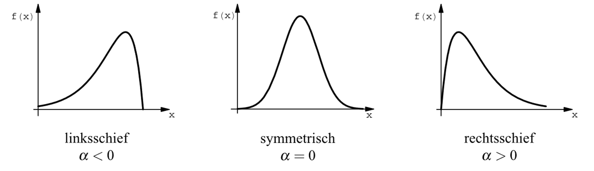
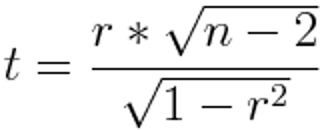
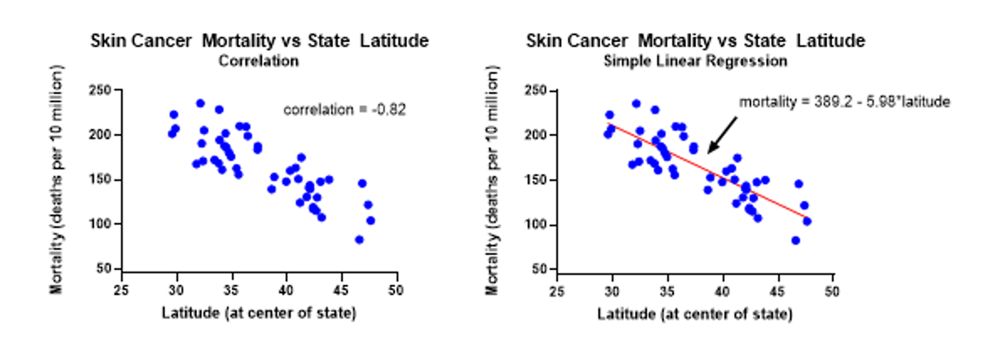

# Statistische Auswertungen

*Der Beitrag wurde das letzte mal am `r format(Sys.time(), '%d %B, %Y')` editiert*

```{r include=FALSE}

knitr::opts_chunk$set(fig.align = "center", collapse = T, echo = TRUE, message = FALSE, warning = FALSE)

# With collapse = TRUE the Source and output lived together happily ever in knitr.
# https://github.com/yihui/knitr-examples/blob/master/039-merge.md

# loading multiple packages at once with `pacman`
# create a vector name
packages <- c("tidyverse", "markdown", "knitr", "matrixStats", "patchwork", "lubridate", "plotly",  "naniar", "stlplus", "gt", "dygraphs", "htmltools", "zoo", "xts", "ggpmisc", "forcats", "RColorBrewer", "Kendall", "rstudioapi", "multcompView", "plyr", "bookdown", "janitor", "rstatix", "ggpubr", "moments", "tweetrmd", "ggthemes", "hexbin", "ggridges", "ggstream", "openair", "treemapify", "MBA", "akima", "PlotSvalbard", "sf", "rnaturalearth", "rnaturalearthdata", "rgeos", "ggspatial", "factoextra", "FactoMineR")
 
# Load the packages vector 
pacman::p_load(packages, character.only = T)


my_theme <- theme(
  panel.background = element_rect(fill = "white", color = "black"),
  panel.grid.major = element_blank(), 
  panel.grid.minor = element_blank(), 
  panel.border = element_blank())

```

```{r echo = F}
# Daten Speicherkoog einlesen
koog_raw <- readr::read_delim("data/data.csv", delim = ";", 
                          col_types = readr::cols(
                            # date = überschreibt die Spalte mit der neuen Spezifikation
                            date = readr::col_datetime(format = "%d.%m.%Y %H:%M") 
  ))
koog_raw <- janitor::clean_names(koog_raw)
koog <- koog_raw %>%
  dplyr::mutate(across(contains("eh"), ~. + 207))
# Erstelle neue Spalten mit Zeitstempeln
koog <- koog %>%
  mutate(year = lubridate::year(date),
         month = lubridate::month(date),
         day = lubridate::day(date),
         hour = lubridate::hour(date), 
         daily = format(date, "%Y-%m-%d"),
         monthly = format(date, "%Y-%m"))

# Tagesmittelwerte
koog_day <- koog %>%
  group_by(daily) %>%
  summarise_if(is.numeric, mean, na.rm = T)

# Monatsmittelwerte
koog_month <- koog %>%
  group_by(monthly) %>%
  summarise_if(is.numeric, mean, na.rm = T)

# Jahresmittelwerte
koog_year <- koog %>%
  group_by(year) %>%
  summarise_if(is.numeric, mean, na.rm = T)

```

## Verteilung der Daten

Auf die verschiedenen Darstellungsformen gehen wir noch nicht ein, aber die Verteilung der Daten spielt für statistische Tests eine große Rolle. Sich die Verteilung optisch anzusehen bietet sich durch ein Histogram oder eine Dichteverteilung der Häufigkeiten:

```{r}
# Als Histogram mit der Anzahl der observations
koog %>%
  ggplot(aes(st10)) +
  geom_histogram(bins = 100) # Die Anzahl der bins spiegelt die Klassen wieder. Default sind 30 

# Oder als Dichteverteilung
koog %>%
  ggplot(aes(st10)) +
  geom_density()
```

Optisch sieht es nach einer bimodalen Verteilung aus. Statistische Tests wie Korrelation, Regression, t-Test und Varianzanalyse setzen aber eine Normalverteilung voraus. Man nennt diese Tests auch **parametrische Tests**, da sie von der Verteilung der Daten abhängig sind. Eine reine visuelle Untersuchung ist häufig aber irreführend und sollte daher durch einen Test untermauert werden. Mit dem Shapiro-Wilk Test können wir in R untersuchen, ob die Daten normalverteilt sind. 

🚨 Test auf Normalität sind abhängig von der Stichprobengröße. Bei kleiner Stichprobenanzahl wird der Test besser bestanden als bei großer.

Die Null-Hypothese des Test besagt, dass die Probenverteilung normal ist. Ist der Test also signfikant, ist die Verteilung **nicht-normalverteilt**. 

```{r}

library(rstatix)
rstatix::shapiro_test(koog_day$at)

```
Die Daten der Lufttemperatur sind nicht normalverteilt, da der p Wert signfikant ist (p < 0.001). Wir müssen die Null-Hypothese also zurückweisen. Es gibt aber Möglichkeiten dennoch bestimmte Tests durchzuführen, auch wenn die Daten keine Normalverteilung aufweisen. Das Zauberwort lautet:

💡 **Datenfransformation**

## Datentransformation

🔍 Das folgende Kapitel bezieht sich auf [datanovia.com](https://www.datanovia.com/en/lessons/transform-data-to-normal-distribution-in-r/)

Um parametrische Tests (bspw. t-Test) durchzuführen, müssen die Daten normalverteilt vorliegen. Häufig liegen Daten aber auch links- oder rechtsschief vor. 

```{r echo=F, fig.cap="Schiefe einer Verteilung"}

```

Zuerst wollen wir uns die Dichteverteilung der Daten für die Lufttemperatur im Speicherkoog ansehen. Die rote Kurve spiegelt die perfekte Normalverteilung wieder. 

```{r}
koog_day %>%
  ggdensity(x = "at", fill = "lightgray", title = "Air temperature") +
  stat_overlay_normal_density(color = "red", linetype = "dashed")

```

Die Schiefe der Daten kann mit der Funktion `skewness` aus dem `moments::` package analysiert werden. Positive Schiefe (rechtsschief) Median < Mean und Negative Schiefe (linksschief) Median > Mean

```{r}
skewness(koog_day$at, na.rm = T)
```

* Eine **0** bedeutet keine Schiefe und Normalverteilung
* Negative Werte = negative Schiefe = linksschief
* Positive Werte = positive Schiefe = rechtsschief

Die Daten der Lufttemperatur haben also eine leichte linksschiefe. 

Häufig verwendet man eine Log-Transformation der Daten, um eine Normalverteilung zu erreichen. Dazu erstellen wir einen neuen Vektor und nennen ihn `at_log` 

```{r}
# Quadratwurzel für moderate Schiefe
#at_transform <- sqrt(koog_day$at) # Positive Schiefe
at_transform <- sqrt(max(koog_day$at + 1) - koog_day$at) # Negative Schiefe

# log für stärkere Schiefe
#at_transform <- log10(koog_day$at)
at_transform <- log10(max(koog_day$at+1, na.rm = T) - koog_day$at) 

# Invers für sehr starke Schiefe
at_transform <- 1/koog_day$at
at_transform <- (max(koog_day$at+1) - koog_day$at)


at_transform %>%
  ggdensity(fill = "lightgray", title = "Air temperature") +
  stat_overlay_normal_density(color = "red", linetype = "dashed")

skewness(at_transform, na.rm = T)

```

🚨 Wichtig! Eine Transformation ist nicht immer erfolgreich. In diesem Beispiel hat keine Methode zu einer Verbesserung geführt. 

Falls die Normalverteilung nicht gegeben ist und auch die Transformation keine Verbesserung bringt, kann man einen parametrischen Test an der transformierten und der nicht-transfomrierten Variante durchführen. Wenn beide Varianten zu dem selben Ergebniss kommen, ist das Arbeiten mit nicht transformierten Variablen zu bevorzugen. Die Vergelichbarkeit wird bei der Transfomration nämlich schlechter, bspw. bei dem Vergleich von zwei Gruppen kann man nach der Transformation nicht mehr ohne weiteres sagen, dass der Mittelwert von Gruppe 1 > Gruppe 2 ist. 

💡 Wenn die Stichprobenanzahl groß genug ist (> 30 - 40), ist die Wahrscheinlichkeit für Normalverteilung meist gegegeben oder zumindest nah genug dran, um mit parametrischen Tests weiterzuarbeiten ([Zentraler Grenzwertsatz](https://de.wikipedia.org/wiki/Zentraler_Grenzwertsatz))

## Korrelationen

🔍 [https://towardsdatascience.com/](https://towardsdatascience.com/eveything-you-need-to-know-about-interpreting-correlations-2c485841c0b8)

Eine Korrelation gehört zu den weit verbreitesten statistischen Maßen. Die Anwendung muss jedoch mit besonderem Augenmaß erfolgen, andernfalls gibt es auch Fehlerquellen. Eine vermeintliche Korrelation aus einer Population kann auch Zufall sein und muss nicht unbedingt durch das Prinzip Ursache-Wirkung verursacht sein. Daher sollte eine Korrelation immer mit einem Signifikanztest verknüpft werden. 

Korrelation beschreiben, wie sich Variablen in Abhängigkeit einer anderen Variable verhalten. Beispielsweise 

* Bildung und Einkommen
* Jahr des Tages und Lufttemperatur 
* Bierkonsum und Bauchumfang

```{r echo=F, fig.cap="Illustration von Z. Jaadi: https://towardsdatascience.com"}
knitr::include_graphics("images/055.png")
```

**Positive Korrelation**: Zwei Variablen gehen in diesselbe Richtung.
**Negative Korrelation**: Zwei Variablen bewegen sich in gegengesetzte Richtung.
**Neutrale Korrelation**: Es gibt keinen Zusammenhang zwischen den Variablen.

Die Form einer Korrelation kann unterschiedlich ausgeprägt sein:

```{r echo=F, fig.cap="Illustration von Z. Jaadi: https://towardsdatascience.com"}
knitr::include_graphics("images/056.png")
```

**Lineare Korrelation**: Variablen verändern sich in konstanter Rate und erfüllen die Gleichung Y = aX + b (Die Beziehung lässt sich als Gerade beschreiben).
**Nicht-lineare Korrelation**: Variablen verändern sich nicht in konstanter Rate. Die Form kann parabolisch, hyperbolisch, ... etc. sein. 
**Monotone Korrelation**: Die Variablen tendieren in diesselbe Richtung, jedoch nicht in gleicher Rate. Alle lineare Korrelationen sind also monoton, der umgekehrte Prozess muss jedoch nicht unbedingt richtig sein. 

Scatterplots oder Punktdiagramme sind sinnvoll, um visuell einen Überblick über die Verteilung der Daten zu bekommen. Nehmen wir mal das Beispiel Batteriespannung der Station im Speicherkoog und gemessene Solarstrahlung:

```{r}
koog_day %>%
  ggplot(aes(sr, bat)) +
  geom_point() +
  labs(
    x = "Solarstrahlung (W/m²)",
    y = "Batteriespannung (V)"
  )
```

### Pearson's Korrelationkoeffizient (r)

Dieses Maß wird verwendet um Stärke und Richtung eines linearen Zusammenhanges zwischen zwei Variablen vorherzusagen. Mathematisch lässt ausgedrückt teilt man die Co-Varianz von zwei Variablen mit dem Produkt der Standardabweichung:

```{r echo=F, fig.cap="Illustration von Z. Jaadi: https://towardsdatascience.com"}
knitr::include_graphics("images/057.png")
```

Die Werte von r variieren zwischen -1 und 1, wobei 1 einen perfekten positiven Zusammenhang darstellt und -1 einen einen perfekten negativen. Die Größe von Pearson's r könnnte wie folgt eingeteilt werden:

```{r echo=F, fig.cap="Illustration von Z. Jaadi: https://towardsdatascience.com"}
knitr::include_graphics("images/058.png")
```

In R können wir Pearson's r mit der Funktion `stats::cor()` berechnen:

```{r}
cor(koog_day$sr, koog_day$bat, use = "complete.obs", method = "pearson")
```

Mit dem Argument `method = ` können wir die drei Optionen nach Spearman, Pearson oder Kendall's Tau angeben. Falls wir fehlende Werte in unserem Datensatz haben, was bei uns der Fall ist, dann müssen wir dies im Argument angeben. Wir setzen das Argument `complete.obs` um Zeilenweise fehlende Werte aus dem Datensatz zu werfen und von der Korrelation auszuschließen.

### Signifikanztest

Die Beziehung zwischen zwei Variablen zu quantifizieren ist nur ein Teil der Geschichte. Häufig stellt man Korrelationen zwischen verschiedenen Variablen auf, wobei sich die Population dabei unterscheiden kann. Was wir wollen ist also ein Nachweis, dass unsere Beobachtung innerhalb der Population wahr oder falsch ist, welches wir durch aufstellen einer Testhypothese erreichen. 

Formulierung:

* Unsere Stichprobe ist n groß mit zwei Variablen x und y
* Der Korrelationskoeffizient r ist bekannt und kann berechnet werden
* Der Korrelationskoefffizient der Population ρ (Griech. Buchstabe “rho”) zwischen x und y ist unbekannt
* Ziel: Wir wollen eine Aussage über ρ anhand von r treffen

Der Hypothesen-Test lässt uns erkennen, ob ρ nah an 0 ist (kein signfikanter linearer Zusammenhang zwischen x und y in der Population) oder signifikant unterschiedlich von 0 (es gibt einen signfikanten linearern Zusammenhang zwischen x und y in der Population). 

**Schritt 1** 

Die *alternative Hypothese* ist immer das, was wir versuchen nachzuweisen (also in unserem Fall das der Zusammenhang signifikant ist mit ρ ≠ 0). Die *Null Hypothese* versuchen wir zurückzuweisen, also das es keinen signfikanten Zusammenhang gibt mit ρ = 0. 

**Schritt 2**

Wir wenden einen T-Test (auch Student's T-Test genannt) an um anhang des Stichprobenumfangs n Rückschlüsse über die Gesamte Population zu treffen. Der Wert t des Tests erhalten wir durch:

```{r echo=F, fig.cap="Illustration von Z. Jaadi: https://towardsdatascience.com"}

```

mit n = Stichprobenumfang und r = Korrelationskoeffizient. Je größer der T-Wert ist, desto wahrscheinlicher ist es das die Korrelation wiederholbar und damit signifikant ist. Aber wie groß ist groß genug? Das ist der nächste Schritt.

**Schritt 3**

Jeder T-Wert hat einen assoziierten p-Wert. Der p-Wert ist die Wahrscheinlichkeit, dass die Null-Hypothese wahr ist. In unserem Beispiel also die Wahrscheinlichkeit, dass die Korrelation zwischen x und y zufällig ist. Ein p-Wert von 0.05 bedeutet, dass die Wahrscheinlichkeit für eine zufällige Korrelation nur 5% beträgt, ein Wert von 0.01 sogar nur 1%. In den meisten Studien wird die Grenze zwischen signifikant und nicht-signfikant bei einem p-Wert von 0.05 gesetzt oder kleiner. Dieser Bereich ist der Signifikanzbereich α. Wir können unser Signfikanzlevel bei 0.05 setzen (α = 0.05) und den p-Wert finden. Dazu benötigen wir (i) den T-Wert (Schritt 2) und die Anzahl der Freiheitsgrade die berechnet werden können mit df = n - 2. Aus diesen beiden Werten kann der p-Wert mit einer Software oder durch nachschlagen in T-Tabellen erfolgen. 

* Wenn der p-Wert kleiner als das Signifikanzlevel (α = 0.05) ist, dann wird die Null-Hypothese zurückgewiesen. Die Korrelation ist also statistisch signifkant!
* Wenn der p-Wert größer ist, können wir die Null-Hypothese nicht zurückweisen und es gibt keinen signfikanten Zusammenhang zwischen den Variablen. 

In R können wir den p-Wert mit der Funktion `cor.test()` berechnen:

```{r}
cor.test(koog_day$sr, koog_day$bat, method = "pearson", na.action = "na.omit")
```

Unser p-Wert ist < 2.2e-16 und damit niedriger als unser Signfikanzlevel bei 0.05 (α = 0.05). Wir können die Null-Hypothese also zurückweisen es gibt einen signfikanten linearen Zusammenhang in unseren Variablen Solarstrahlung und Batteriespannung. 

### Korrelation vs. Regression

```{r echo=F, fig.cap="Illustration von Z. Jaadi: https://towardsdatascience.com"}

```

Diese Begriffe werden häufig durcheinander geworfen. Korrelation ist ein statistisches Maß um die Richtung und Stärke eines Zusammenhanges wiederzugeben. Regression ist eine Technik um die abhängige Variable y vorherzusagen basierend auf der bekannten Variable x und der Gleichung y = a + bx. 

## PCA

🔍 [sthda.com](http://www.sthda.com/english/articles/31-principal-component-methods-in-r-practical-guide/112-pca-principal-component-analysis-essentials/)

Eine Hauptkomponentenanalyse (engl. Principal component analysis; PCA) ist ein Verfahren der multivariaten Statistik. Dadurch können große Datensätze strukturiert und vereinfacht werden, durch eine möglichst geringe Zahl aussagekräftiger Linearkombinationen (**Hauptkomponenten**). PCA wird verwendet um Informationen von einer Vielzahl (inter-korrelierten) quantitativen Variablen zu extrahieren. Diese Informationen werden reduziert zu den genannten wenigen Hauptkomponenten (= principal components = PC). 

Das Ziel einer PCA ist es die Hauptachsen (PC) so zu arrangieren, dass die Variation der Daten maximiert wird. Einfach ausgedrückt kann man eine PCA als Rotation des Koordinatensystems verstehen:

```{r echo=F, fig.cap="Illustration von C.Wilke: https://wilkelab.org/SDS375/"}
knitr::include_graphics("images/046.png")
```

💡 Eine PCA ist besonders dann nützlich, wenn die Variablen in einem Datensatz stark korreliert sind. Korrelation bedeutet Redundanz und wegen dieser Redundanz kann eine PCA viele Variablen in eine geringere Anzahl an neuen Variablen (= PC) umwandeln, welche möglichst viel Varianz der ursprünglichen Daten erklären. 

In R gibt es mehrere Möglichkeiten eine PCA durchzuführen

* prcomp() and princomp() [built-in R stats package]
* PCA() [FactoMineR package]
* dudi.pca() [ade4 package]
* epPCA() [ExPosition package]

Egal welches package man verwendet, die Daten der PCA können auch mit dem `factoextra` package verarbeitet werden. Dies hat den Vorteil, dass die Visualisierung `ggplot2`-basiert ist. 


```{r}
# Laden des Datensatzes 
df_ec <- readr::read_delim("data/data_ecuador.csv", delim = ";", col_types = 
                          cols(
                            wsc = col_double(),
                            wsc_ma = col_double(),
                            wsc_som = col_double(),
                            hwsc = col_double(),
                            hwsc_ma = col_double(),
                            hwsc_som = col_double(),
                            wsc_hwsc_som = col_double(),
                            Fed = col_double(),
                            Feo = col_double(),
                            Feo_Fed = col_double(),
                            Fepyro = col_double(),
                            Mno = col_double(),
                            Alo = col_double(),
                            Sio = col_double(),
                            Alpyro = col_double()
                          )
                        )

# Laden der packages
library(factoextra)
library(FactoMineR)

```

### Datenauswahl

Zuerst wählen wir die Daten aus, welche wir in der PCA berücksichtigen wollen. 

```{r}
# Create one data frame with the data
df_pca <- df_ec %>%
  select(site_name, depth, som:P2O5, -mat_amorph, -index) %>%
  na.omit() # Mit dem Befehl werden NA Werte aus den Daten entfernt...wichtig (!) bevor die PCA durchgeführt werden kann

# Create one data frame 
df_var <- df_pca %>%
  select(site_name, depth)

head(df_pca, n = 5)

```

### Daten Standardisieren

Bei einer PCA werden die Daten häufig standardisiert, also skaliert. Dies ist besonders wichtig wenn die Einheiten stark unterschiedlich sind, bspw. in %, mg kg^-1^, etc. 

💡 Wenn man die Funktion `PCA()` im FactoMineR verwendet, gibt es das Argument die Daten zu standardisieren. Dies muss also nicht im Vorfeld durchgeführt werden. 

```{r}

pca <- PCA(df_pca[,-c(1:2)], scale.unit = T, ncp = 5, graph = F) # Makes the PCA but without the site_name and depth grouping value
pca

```

Das Ergebnis der Funktion `PCA()` ist eine Liste mit verschiedenen Komponenten. 

Wichtige FUnktionen in dem factoextra package lauten:


* get_eigenvalue(res.pca): Extrahiert Eigenvalues/Varianz der PC
* fviz_eig(res.pca): Visualisiert die Eigenvalues
* get_pca_ind(res.pca), get_pca_var(res.pca): Extrahiert das Ergenis spezieller Variablen
* fviz_pca_ind(res.pca), fviz_pca_var(res.pca): Visualisiert das Ergenis spezieller Variablen
* fviz_pca_biplot(res.pca): Biplot individueller Variablen

### Eigenvalues

Eigenvalues messen die Stärke der Variation jeder PC. 

```{r}

eig.val <- get_eigenvalue(pca)
eig.val %>%
  head(n = 5)

```

Für den Ecuador Datensatz erklären die Eigenvalues der ersten zwei PCs 83% der Varianz (das ist viel). Wieviele PCs für die Auswahl der PCA wichtig sind lässt sich nicht objektiv sagen. Eine Möglichkeit ist es einen Wert festzulegen, mit dem man selber zufrieden ist:

> You can also limit the number of component to that number that accounts for a certain fraction of the total variance. For example, if you are satisfied with 70% of the total variance explained then use the number of components to achieve that. (Kaiser 1961)

Eine graphische Darstellung der Eigenvalue ist auch eine Möglichkeit:

```{r}

fviz_eig(pca, addlabels = T, ylim = c(0,60))

```

In der Darstellung sind die EIgenvalues absteigend sortiert und man wählt den Punkt aus, wo die vebleibenden Eigenvalues gleichbleibend klein bleiben (in unserem Fall ab der dritten PC). 

### Darstellen der Ergebnisse

Die einfachste Methode ist mit der Funktion `get_pca_var()`. 

```{r}

var <- get_pca_var(pca)
var

```

Die vier verschiedenen Komponenten von `get_pca_var()` können genutzt werden um die Ergebnisse auf verschiedenen Art darzustellen:

```{r}
# Coordinates
head(var$coord)
# Cos2: Quality on the factore map
head(var$cos2)
# Contribution to the PCA
head(var$contrib)
```

#### Darstellung im Koordinatensystem

Um die Variablen im Koordinatensystem darzustellen eignet sich der folgende Befehl:

```{r}

fviz_pca_var(pca, repel = T)

```

Dieser Plot wird auch als **Variable correlation plot** bezeichnet und zeigt die Beziehung zwischen den Variablen:

* Positiv korrelierte Variablen clustern zusammen * Negativ korrelierte Variablen sind gegenüber positioniert (gegenüberliegende Quadranten)
* Der Abstand der Variable zum Zentrum des Kreises stellt die Qualität der Variable auf der factor map da. Weit entfernte Variablen werden auf der factor map besser dargestellt. 

Die Qualität der Darstellung wird über **cos2** definiert (quadrierter Cosinus, quadrierte Koordinaten). Darstellen kann man den Zusammenhang als barplot:

```{r}

fviz_cos2(pca, choice = "var")

```

Ein großer cos2 Wert bedeutet eine gute Repräsentation der Variable auf der PC. In diesem Fall ist die Variable nah am Kreisumfang positioniert. 
Ein niedriger co2 Wert bedeutet, dass die Variable nicht perfekt dargestellt wird, wobei die Variable näher am Zentrum des Kreises liegt. Die Summe des cos2 einer Variable auf allen PCs ist = 1. 
Wenn eine Variable also perfekt durch nur zwei PCs dargestellt wird, dann ist der cos2 Werte ~1 und die Variable liegt nah am Kreisumfang. Wozu ist der cos2 also wichtig?

* Beschreibt die QUalität der Darstellung
* Je näher die Variable am Kreisumfang desto besser wird diese Variable auf der factor map dargestellt. 
* Variablen nahe des Kreiszentrums tragen wenig zur ersten PC bei

Die QUalität der Variable kann auch farblich dargestellt werden:

```{r}

fviz_pca_var(pca, col.var = "cos2", gradient.cols = c("#00AFBB", "#E7B800", "#FC4E07"), 
             repel = TRUE # Avoid text overlapping
             )
```

#### Beitrag einer Variable zur PCA

Der Beitrag einer Variable für die Variabilität einer PC wird in % angegeben. 

* Variablen die mit PC1 (Dim.1) und PC2 (Dim.2) korreliert sind haben die größte Bedeutung um die Variabilität im Datensatz zu erklären. 
* Variablen die mit keiner PC korrelieren haben den geringsten Beitrag

💡 Um die Aussage einer PCA zu verstärken können Variablen mit einem geringen Beitrag von der Analyse ausgeschlossen werden. 

```{r}
# Show the variables contributing to PC1
fviz_contrib(pca, choice = "var", axes = 1)

# Show the variables contributing to PC2
fviz_contrib(pca, choice = "var", axes = 2)

# Show the variables contributing to PC1 AND PC2
fviz_contrib(pca, choice = "var", axes = 1:2)

```

SOM, pH und hwsc tragen am meisten zu PC1 und PC2 bei, die mineralogischen Kennwerte des Eisens spielen eine untergeordnete Rolle. 

```{r}

fviz_pca_var(pca, col.var = "contrib", repel = T, gradient.cols = c("#00AFBB", "#E7B800", "#FC4E07"))

```

Je näher der Pfeil am Kreisumfang positioniert ist, desto größer ist der Beitrag einer Variable für die Separierung der Daten. 

#### Darstellen der Individuen in der PCA

Die Informationen der Individuen können mit der Funktion `get_pca_ind()` abgerufen werden. 

```{r}

ind <- get_pca_ind(pca)

# Coordinates of individuals
head(ind$coord)
# Quality of individuals
head(ind$cos2)
# Contributions of individuals
head(ind$contrib)
```

Plots: Quality and contribution 

```{r}

fviz_pca_ind(pca, repel = T)

```

Individuen können auch nach dem cos2 Wert gruppiert werden

```{r}

# Group by color
fviz_pca_ind(pca, col.ind = "cos2", 
             gradient.cols = c("#00AFBB", "#E7B800", "#FC4E07"),
             repel = TRUE # Avoid text overlapping (slow if many points)
             )

```

💡 Individuen mit ähnlichen Eigenschaften werden zusammen gruppiert.

Um den Anteil (contribution) der ersten zwei PC (DIM.1 und DIM.2) darzustellen schreibe:

```{r}

fviz_contrib(pca, choice = "ind", axes = 1:2)

```

Die Proben 39,42,36,37 tragen am meisten für die Separierung der Daten bei, die Proben 2,3,5 am wenigsten. 

#### Farbliche Darstellung

Wie für Variablen können auch Individuen farblich dargestellt werden, bspw. nach Kategorien gruppiert werden (Standort, Tiefe). Argument `habillage` oder `col.ind` kann genutzt werden um Individuen nach Gruppen darzustellen. Um eine Ellipse zu erzeugen kann `addEllipses = T` gesetzt werden:

```{r}
# Create one data frame with the data
df_pca <- df_ec %>%
  select(site_name, depth, som:P2O5, -mat_amorph, -index) %>%
  na.omit() # Mit dem Befehl werden NA Werte aus den Daten entfernt...wichtig (!) bevor die PCA durchgeführt werden kann

# Create one data frame only for the grouping variable
df_var <- df_pca %>%
  select(site_name, depth)

pca <- PCA(df_pca[,-c(1:2)], scale.unit = T, ncp = 5, graph = F) # Makes the PCA but without the site_name and depth grouping value

# Gruppieren nach Standort
fviz_pca_ind(pca,
             col.ind = df_var$site_name, # color by site_name
             addEllipses = TRUE, # Concentration ellipses
             label= "var",
             legend.title = "Plot",
             repel = TRUE # to not have overlapping text in the figure
             )

# Gruppieren nach Tiefe
fviz_pca_ind(pca,
             geom.var = "arrow",
             col.ind = df_var$depth, # color by depth
             addEllipses = TRUE, # Concentration ellipses
             label= "var",
             legend.title = "Plot",
             repel = TRUE # to not have overlapping text in the figure
             )

```

In diese Darstellung fließen ALLE numerischen Variablen des Datensatzes ein. Die Paramo-Standorte clustern sehr schön zusammen und es gibt eine Separierung von AC1 und AC2. Besonders AC2 unterscheidet sich signifikant. Ein sehr schönes Ergebnis, dass den Einfluss von 100 Jahren landwirtschaftliche Nutzung hervorhebt.

#### Figure

```{r}

# Gruppieren nach Standort
p1 <- fviz_pca_ind(pca,
             col.ind = df_var$site_name, # color by site_name
             addEllipses = TRUE, # Concentration ellipses
             label= "var",
             legend.title = "Plot",
             repel = TRUE # to not have overlapping text in the figure
             )

# Gruppieren nach Tiefe
p2 <- fviz_pca_ind(pca,
             geom.var = "arrow",
             col.ind = df_var$depth, # color by depth
             addEllipses = TRUE, # Concentration ellipses
             label= "var",
             legend.title = "Depth",
             repel = TRUE # to not have overlapping text in the figure
             )

p1 + p2 + plot_annotation(tag_levels = "A")

ggsave("images/results/PCA_1.png", width = 12, height = 5)


fviz_pca_biplot(pca, repel = TRUE,#to not have overlapping text
                #variables
                col.var = "contrib",# colour variables according to their contribution to the variance between the axes
                gradient.cols = c("#00AFBB", "#E7B800", "#FC4E07"),
               #individuals
                geom.ind = "point",#using point shape for our indidividual data points
                fill.ind = df_var$site_name, col.ind = "black", #group and colour according to plot and black border of points
                pointshape = 21, pointsize = 2,#pointshape 21 is the circel with 2 differing colours important for visibility, pointsize can be adjusted if you want
                palette = c("red", "orange", "#c7e9c0","#41ab5d","#006d2c"),# maybe adjust the colour setting here, I tried to take similar colours to before
                addEllipses = TRUE,# addinf ellipses to our group of individual data points
               #supplements
                legend.title = list(fill="Plot",color = "Contribution"))#customizing our legend

ggsave("images/results/PCA_2.png", width = 9, height = 9)

```


