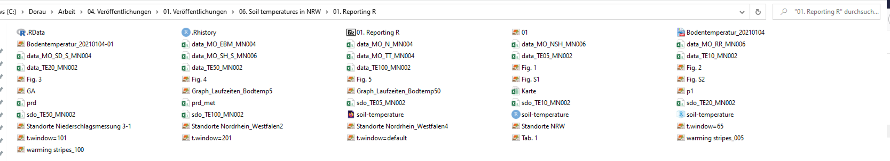

# Datenmanagement

*Der Beitrag wurde das letzte mal am `r format(Sys.time(), '%d %B, %Y')` editiert*

```{r include=FALSE}

knitr::opts_chunk$set(fig.align = "center", collapse = T, echo = TRUE, message = FALSE, warning = FALSE)

# With collapse = TRUE the Source and output lived together happily ever in knitr.
# https://github.com/yihui/knitr-examples/blob/master/039-merge.md

# loading multiple packages at once with `pacman`
# create a vector name
packages <- c("tidyverse", "markdown", "knitr", "matrixStats", "patchwork", "lubridate", "plotly",  "naniar", "stlplus", "gt", "dygraphs", "htmltools", "zoo", "xts", "ggpmisc", "forcats", "RColorBrewer", "Kendall", "rstudioapi", "multcompView", "plyr", "bookdown", "janitor", "rstatix", "ggpubr", "moments", "tweetrmd", "ggthemes", "hexbin", "ggridges", "ggstream", "openair", "treemapify", "MBA", "akima", "sf", "rnaturalearth", "rnaturalearthdata", "rgeos", "ggspatial", "factoextra", "FactoMineR")
 
# Load the packages vector 
pacman::p_load(packages, character.only = T)


my_theme <- theme(
  panel.background = element_rect(fill = "white", color = "black"),
  panel.grid.major = element_blank(), 
  panel.grid.minor = element_blank(), 
  panel.border = element_blank())

```

```{r echo = F}
include_tweet("https://twitter.com/vsbuffalo/status/323638476153167872")
```

🔍 [https://swcarpentry.github.io/r-novice-gapminder/02-project-intro/index.html](https://swcarpentry.github.io/r-novice-gapminder/02-project-intro/index.html)

Über den Satz bin ich kürzlich gestolpert und es steckt seeeehr viel Wahrheit darin. Eins meiner ersten Projekte in R hat sich mit der Entwicklung von Bodentemperaturen in NRW beschäftigt. Hier ein Screenshot über die Ordnerstruktur:

```{r echo = F, fig.cap="Datenstruktur in R"}

```

Es geht mit Sicherheit noch schlimmer, es geht aber mit Sicherheit auch besser! Im Laufe der Zeit wachsen die Dateien in einem Projekt und man verliert schnell den Überblick. Die wichtigsten Gründe warum man so ein Chaos vermeiden sollte:

1. Man kann nicht sagen, welche Daten Rohdaten sind und welche neu generiert wurden. 
2. Es wird sehr unübersichtlich, da verschiedene Dateitypen gemixt werden.
3. Es dauert lange die richtige Datei zu finden und/oder einer Analyse zuzuordnen. 

Die Vorteile einer guten Projektstruktur bietet also:

* Ein seriöseres Projektmanagement mit höheren Anspruch an die Daten
* Code oder Informationen mit Kollegen zu teilen geht schneller
* Nach einer Pause an dem Projekt gelingt es einem schneller wieder hereinzufinden

Eins der wichtigsten tools in RStudio ist das Anlegen eines **Projektes**. 

File -> New Project -> New Directory -> Klick New Project -> Vergebe einen Projektnamen -> Klick Create Project

Der einfachste Weg ein R Projekt zu öffnen (mit der Endung **.Rproj**) ist Doppelklick in dem Ordner in dem das Projekt hinterlegt wurde. 

💡 Alle Daten, Abbildunge, Skripte, ... werden mit diesem R Projekt verknüpft sein, dass bedeutet sie sind unabhängig von dem individuellen Pfad (bspw. `C:\Dorau\Arbeit\04. Veröffentlichungen\01. Veröffentlichungen\06. Soil temperatures in NRW\01. Reporting R`) sondern alles ist relativ zu der .Rproj Datei. 

Tipps für eine gutes Projektmanagement sind die folgenden:

* **read only** Excel oder andere Austauschformate sind Interaktiv und können manipuliert werden, bspw. durch Verknüpfungen in den Zellen. 
* **Daten bereinigen** ist ein wichtiger und zeitaufwändiger Schritt. Wenn man eine grobe Datenaufbereitung auch in Excel durchgeführt hat empfiehlt es sich, den ursprünglichen Datensatz als zweite Datei abzuspeichern die nur zum Einlesen der Daten in R verwendet wird. 
* **Analysen in einem Skript sollten reproduzierbar sein** Beim Schreiben von Skripten ist es das Ziel, Abbildungen und generell Metadaten zu erzeugen. Dieser Output sollte von jedem externen anwendbar sein, nur bei Bereitstellung des Skriptes und der Rohdaten. 
* Jedes Projekt sollte einen eigenen Ordner haben, der nach dem Projekt benannt ist. 
* Erstelle Unterordner in dem Projekt, bspw. um Abbildungen in ein Skript zu laden (`images`), Daten (`data`), Literatur (`doc`) und Ergebnisse der Analyse in einen Ergebnisordner (`results`). 
* Benenne alle Dateien so, dass sie einen Inhalt oder eine Funktion wiederspiegeln. 

Nun haben wir eine schöne Ordnerstruktur und können diese Nutzen, um Daten einzulesen. Unsere Daten sind relativ zu dem .Rproj abgespeichert. Wollen wir nun die Daten einlesen mit dem Namen `data.csv`, die im Ordner `data` abgespeichert sind müssen wir nur angeben:

```{r eval = F}
# Erstelle ein Objekt df mit den Daten data.csv
df <- read_delim("data/data.csv", delim = ";")
```

Viel Besser und reproduzierbarer im Gegensatz zu:

```{r eval = F}
df <- read_delim("C:\Dorau\Arbeit\04. Veröffentlichungen\01. Veröffentlichungen\06. Soil temperatures in NRW\01. Reporting R/data.csv", delim = ";")
```

Beim zweiten sind Fehlermeldungen vorprogrammiert und Herr oder Frau XY können auch nichts damit anfangen, da ihr Computer mit Sicherheit nicht *Dorau* heißt und auch die weiteren Pfade quatsch sind. 
