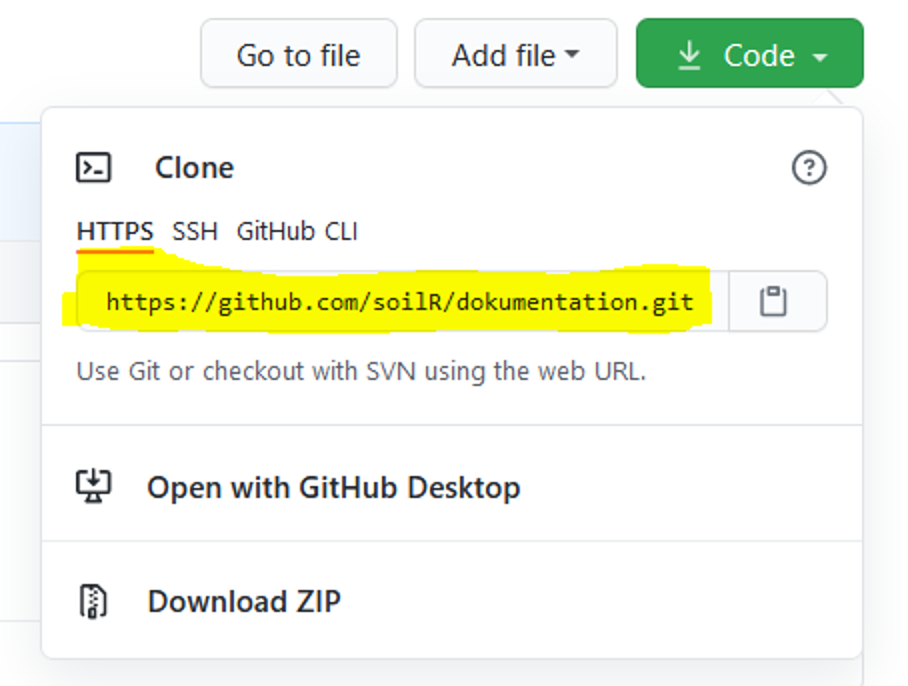
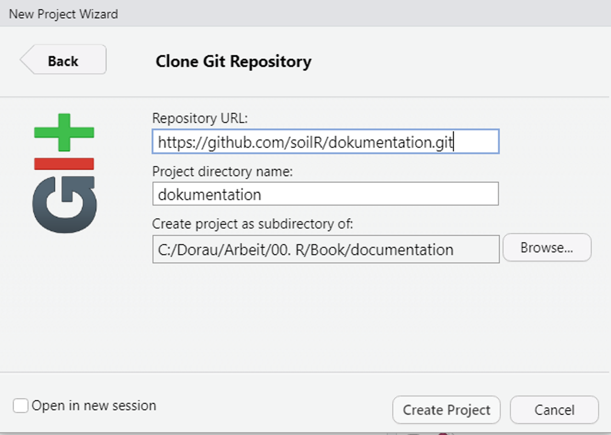
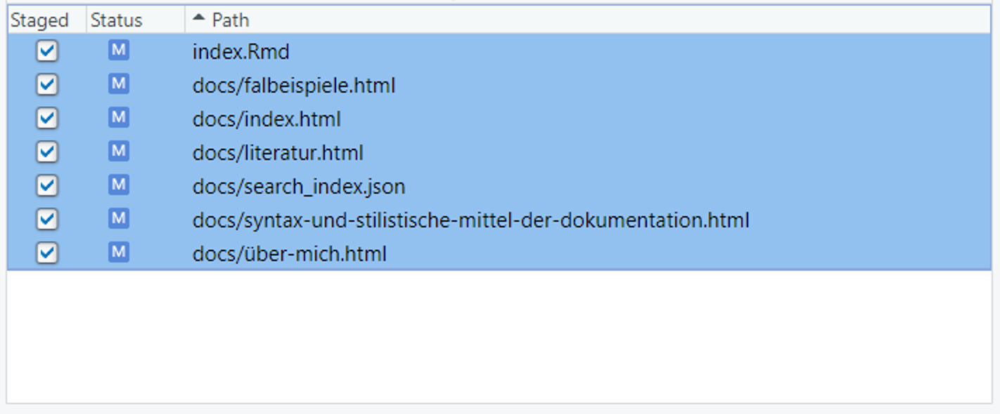

# Github

*Der Beitrag wurde das letzte mal am `r format(Sys.time(), '%d %B, %Y')` editiert*

```{r include=FALSE}

knitr::opts_chunk$set(fig.align = "center", collapse = T, echo = TRUE, message = FALSE, warning = FALSE)

# With collapse = TRUE the Source and output lived together happily ever in knitr.
# https://github.com/yihui/knitr-examples/blob/master/039-merge.md

# loading multiple packages at once with `pacman`
# create a vector name
packages <- c("tidyverse", "markdown", "knitr", "matrixStats", "patchwork", "lubridate", "plotly",  "naniar", "stlplus", "gt", "dygraphs", "htmltools", "zoo", "xts", "ggpmisc", "forcats", "RColorBrewer", "Kendall", "rstudioapi", "multcompView", "plyr", "bookdown", "janitor", "rstatix", "ggpubr", "moments", "tweetrmd", "ggthemes", "hexbin", "ggridges", "ggstream", "openair", "treemapify", "MBA", "akima", "PlotSvalbard", "sf", "rnaturalearth", "rnaturalearthdata", "rgeos", "ggspatial", "factoextra", "FactoMineR")
 
# Load the packages vector 
pacman::p_load(packages, character.only = T)


my_theme <- theme(
  panel.background = element_rect(fill = "white", color = "black"),
  panel.grid.major = element_blank(), 
  panel.grid.minor = element_blank(), 
  panel.border = element_blank()) 

```

Github ist ein sogenanntes *version control system*, freeware und wird vorallem bei der Softwareentwicklung genutzt. Der Vorteil ist, dass eine Vielzahl von Leuten an ein und demselben Projekt gleichzeitig arbeiten kann. Die Weiterentwicklung von Dateien und Projekten lassen sich mit github reproduzierbar nachvollziehen. Abgelegt werden Projekte in **repositories**, kurz **repos**. 

> Git manages the evolution of a set of files -- called a **repository** -- in a sane, highly structured way (such as "Track Changes" features from Microsoft Word on steroids)

Schritt 1:

- Installiere git für windows [here](https://gitforwindows.org/)
    -   NOTE: When asked about "Adjusting your PATH environment", make
        sure to select "Git from the command line and also from
        3rd-party software". Otherwise, we believe it is good to accept
        the defaults.
    -   Note that RStudio for Windows prefers for Git to be installed
        below C:/Program Files and this appears to be the default. This
        implies, for example, that the Git executable on my Windows
        system is found at C:/Program Files/Git/bin/git.exe. Unless you
        have specific reasons to otherwise, follow this convention.
-   Now: Introduce yourself to Git

```{r eval=F, echo=T}
# library(usethis)
## What user name should you give to Git? This does not have to be your GitHub user name, although it can be. Another good option is your actual first name and last name.

## What email should you give to Git? This must be the email associated with your GitHub account.
#use_git_config(user.name = "XY", user.email = "XY@gmx.de")

## Create a github tokken for secure access to github. Then, you don't need to access all the time your personal item
# usethis::create_github_token()

## Activate your tokken PAT = Personal Access Tokken
# library(gitcreds)
# gitcreds_set()
```

-   Use a Git client

    -   "Git" is really just a collection of individual commands you
        execute in the shell (Appendix A). This interface is not
        appealing for everyone. Some may prefer to do Git operations via
        a client with a graphical interface. Git and your Git client are
        not the same thing, just like R and RStudio are not the same
        thing. A Git client and an integrated development environment,
        such as RStudio, are not necessary to use Git or R,
        respectively.
    -   Sourcetree is a recommended option

-   The most basic commands are listed below:

    -   pwd (print working directory). Shows directory or "folder" you
        are currently operating in. This is not necessarily the same as
        the R working directory you get from getwd().

    -   ls (list files). Shows the files in the current working
        directory. This is equivalent to looking at the files in your
        Finder/Explorer/File Manager. Use ls -a to also list hidden
        files, such as .Rhistory and .git.

    -   cd (change directory). Allows you to navigate through your
        directories by changing the shell's working directory. You can
        navigate like so: go to subdirectory foo of current working
        directory: cd foo go to parent of current working directory: cd
        .. go to your "home" directory: cd \~ or simply cd go to
        directory using absolute path, works regardless of your current
        working directory: cd /home/my_username/Desktop. Windows uses a
        slightly different syntax with the slashes between the folder
        names reversed, , e.g. cd C:\Users\MY\_USERNAME\Desktop. - Pro
        tip 1: Dragging and dropping a file or folder into the terminal
        window will paste the absolute path into the window. - Pro tip
        2: Use the tab key to autocomplete unambiguous directory and
        file names. Hit tab twice to see all ambiguous options.

        -   Use arrow-up and arrow-down to repeat previous commands. Or
            search for previous commands with CTRL + r.

-   A few Git commands:

    -   git status is the most used git command and informs you of your
        current branch, any changes or untracked files, and whether you
        are in sync with your remotes.
    -   git remote -v lists all remotes. Very useful for making sure git
        knows about your remote and that the remote address is correct.
    -   git remote add origin GITHUB_URL adds the remote GITHUB_URL with
        nickname origin.
    -   git remote set-url origin GITHUB_URL changes the remote url of
        origin to GITHUB_URL. This way you can fix typos in the remote
        url.

-   Clone the new GitHub repository to your computer via RStudio

    -   In RStudio, start a new Project:
    -   File \> New Project \> Version Control \> Git.
    -   In "Repository URL", paste the URL of your new GitHub
        repository. It will be something like this
        <https://github.com/jennybc/myrepo.git>.


## Projekt erstellen

🚨 Wir erstellen ein Projekt in der Reihenfolge **"GitHub first, then
    RStudio"** Dadurch kopieren wird das Projekt von Github direkt auf den Computer und schalten `pulling` und `pushing` frei (äquivalent zu git clone).

Nachdem wir einen Github account für uns erstellt haben, fügen wir unserem account ein neues repository hinzu.

```{r echo=F, fig.cap="Neues repository erstellen", fig.width=6, out.width="100%"}
knitr::include_graphics("images/077.PNG")
```

```{r echo=F, fig.cap="Kurze und prägnante Namen sind gut", fig.width=6, out.width="100%"}
knitr::include_graphics("images/078.PNG")
```

In unserem repo klicken wir auf Code und kopieren den Link (siehe unten).

```{r echo=F, fig.cap="Kopieren der URL für das Verknüpfen des Projektes", fig.width=6, out.width="100%"}

```

Dann öffnen wir ein neues Projekt mit File --> New Project --> Version control --> Git. Dann kopieren wir die URL in das Feld **Repository URL** und et voila...mit create project ist unser repo bei github mit unserem lokalen Projekt in R verknüpft. 

```{r echo=F, fig.cap="Kopieren der URL für das Verknüpfen des Projektes", fig.width=6, out.width="100%"}

```

### Workflow

Unser Schema lautet absofort 

> **Make local changes, save, commit and push to github**

So sollte man immer vorgehen wenn man wichtige Dinge umgesetzt hat. Vorzugsweise mehrmals am Tag. Ein commit ist dabei wie ein snapshot aller Dateien, die editiert wurden. 

🚨 Der Text eines commits sollte daher individuell und nicht mehrmals vergeben werden, da es sonst zu Fehlermeldungen führen kann. 

🚨 Viele 100-1000 Dateien können zu abstürzen bei der RStudio Oberfläche führen. 

🚨 Dateien bei github dürfen nicht > 100 mb sein!

🚨 Auch Dateiendungen bei github pages sind case sensitive. `.png` ist also was anderes als `.PNG`

💡 Unter C: einen Ordner Bilder erstellen, dort alle Bilder reinkopieren. Dann in der Kommandoaufforderung von windows den Pfad der Bilder festlegen mit `cd c:\Bilder` und als nächstes mit `ren *.PNG *.png` automatisch alle Endungen umbenennen. 

### Synchronisieren vieler Dateien

Bei vielen 100 Dateien folgender Tipp: Markieren aller Einträge mit "strg + A" und dann strg gedrückt halten und ein freies Kästchen auswählen. 🎉

```{r echo = F, fig.cap="Commit von vielen Dateien", fig.width = 6, out.width = "100%"}

```

Eine andere Möglichkeit ist im Terminal einzugeben 

- `git add --all` 
- `git commit -m "TEXT"`
- `git push`

Falls Dateinamen zu lang sind können ebenfalls Probleme entstehen [stackoverflow](https://stackoverflow.com/questions/52699177/how-to-fix-filename-too-long-error-during-git-clone/52699496). Dann empfiehlt sich:

- `git clone -c core.longpaths=true <repo-url>` 

einzugeben. Dann wird die Option "lange Dateinnamen" für das spezielle repository deaktiviert. 

Falls Systemdateien sich auf dem lokalen Ordner befiden (bspw. `nul`) kann man diese entfernen mit:

- rechtsklick und "Git Bash Here"
- Schreibe: "rm nul" (oder die jeweilige *Dateiname.Dateiendung*...falls keine Dateiendung vorhanden wie bei diese MS-DOS Datei dann weglassen)

### Ordner lokal behalten aber auf Git löschen

Dazu kann man im Terminal eingeben `git rm -r --cached FOLDERNAME`. 

## Cache säubern 

[https://stackoverflow.com/questions/13716658/how-to-delete-all-commit-history-in-github](https://stackoverflow.com/questions/13716658/how-to-delete-all-commit-history-in-github)

Beispielsweise wenn eine Datei > 100 mb groß ist und dadurch eine commit Fehlermeldung auftritt. 

```{r eval = F}
# Type in Terminal
# Checkout
git checkout --orphan latest_branch
# Add all the files
git add -A 
# Commit the changes
git commit -am "commit message"
# Delete the branch
git branch -D main
# Rename the current branch to main
git branch -m main
# Finally, force update your repository
git push -f origin main
#PS: this will not keep your old commit history around
```


