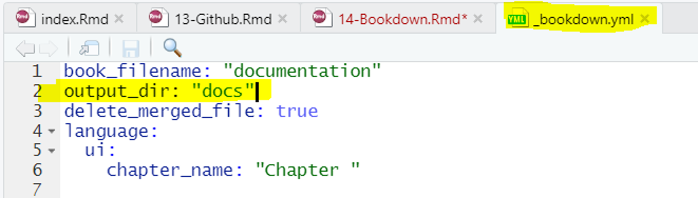
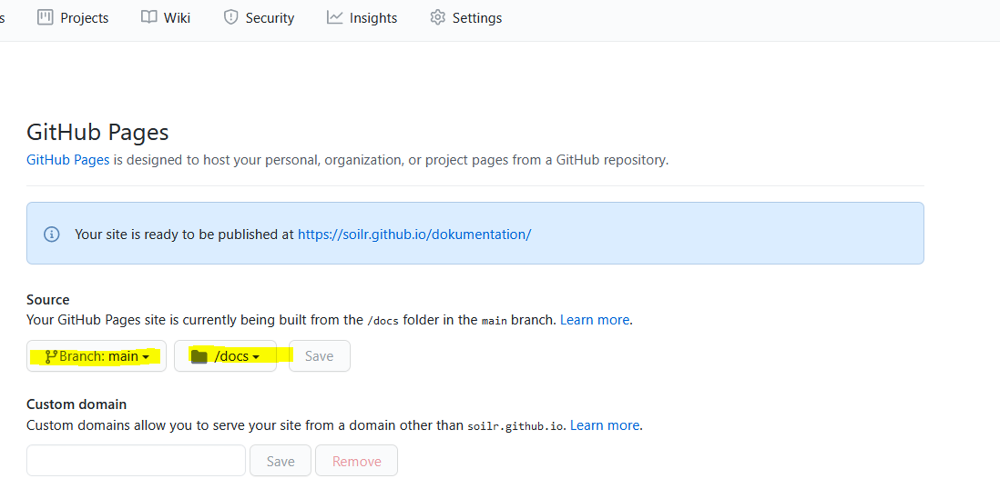

# Bookdown

*Der Beitrag wurde das letzte mal am `r format(Sys.time(), '%d %B, %Y')` editiert*

```{r include=FALSE}

knitr::opts_chunk$set(fig.align = "center", collapse = T, echo = TRUE, message = FALSE, warning = FALSE)

# With collapse = TRUE the Source and output lived together happily ever in knitr.
# https://github.com/yihui/knitr-examples/blob/master/039-merge.md

# loading multiple packages at once with `pacman`
# create a vector name
packages <- c("tidyverse", "markdown", "knitr", "matrixStats", "patchwork", "lubridate", "plotly",  "naniar", "stlplus", "gt", "dygraphs", "htmltools", "zoo", "xts", "ggpmisc", "forcats", "RColorBrewer", "Kendall", "rstudioapi", "multcompView", "plyr", "bookdown", "janitor", "rstatix", "ggpubr", "moments", "tweetrmd", "ggthemes", "hexbin", "ggridges", "ggstream", "openair", "treemapify", "MBA", "akima", "PlotSvalbard", "sf", "rnaturalearth", "rnaturalearthdata", "rgeos", "ggspatial", "factoextra", "FactoMineR")
 
# Load the packages vector 
pacman::p_load(packages, character.only = T)


my_theme <- theme(
  panel.background = element_rect(fill = "white", color = "black"),
  panel.grid.major = element_blank(), 
  panel.grid.minor = element_blank(), 
  panel.border = element_blank())

```

```{r echo = F, fig.cap="Source from: https://github.com/rstudio/bookdown"}

```

🔍 [https://bookdown.org/yihui/bookdown/](https://bookdown.org/yihui/bookdown/)

Bookdown wurde von Yihui Xie geschrieben und findet immer weiter Verbreitung. Es ist ein package um technische Reports, Bücher, Artikel etc. zu schreiben und mit Leichtigkeit zu formatieren (🤐 Frustpotenzial ist aber auch hier gegeben, da wie bei allen Dingen nichts auf Anhieb klappt). 

Das package basiert auf RMarkdown Dokumenten welches bedeutet, dass man Text als auch Code und den Output von Code (bspw. visualisiert als Abbildung oder Tabelle) nutzen kann. Das fertige book kann dabei in die Dateiformate *PDF*, *HTML*, *Word*, ... exportiert werden. Die Printversion als auch die Onlineversion des erstellten Buches sehen dabei sehr professionell aus. Beispiele von Büchern die mit `bookdown` geschrieben wurden findet ihr unter [https://bookdown.org/](https://bookdown.org/).

## Vorbereitung

Herunterladen von `pandoc`, `tinytex` und `bookdown`. `pandoc` und `tinytex` (Abwandlung von LaTeX) werden benötigt, um das book als .pdf file zu exportieren. 

```{r eval=F}
# installing/loading the package:
if(!require(installr)) { install.packages("installr"); require(installr)} #load / install+load installr
# Installing pandoc
install.pandoc()
# Download tinytex package
tinytex::install_tinytex()
# Download bookdown package
install.packages("bookdown")
```

Um alle `.Rmd` Dateien zu einem book zu binden muss der Befehl `render_book()` in die Konsole eingegeben werden. 

## Github pages

🔍 https://bookdown.org/yihui/bookdown/github.html
🔍 https://docs.github.com/en/pages/getting-started-with-github-pages/configuring-a-publishing-source-for-your-github-pages-site

Als Vorbereitung für die Veröffentlichung als eigenständige github pages müssen wir einige Anpassungen treffen. Die Dateien beim Rendering des Buches (alle `.html` Dateien) müssen in den Ordner `docs` verschoben werden. Dazu ergänzt man in der `_bookdown.yml` Datei den Befehl ergänzen:

```{r echo = F, fig.cap="Einstellungen in welchem Ordner das Book veröffentlicht werden soll"}

```

Als nächstes erstellen wir eine `.nojekyll` Datei und verschieben diese nach dem rendering des books in den `docs` Ordner. Dazu in der Konsole `file.create(".nojekyll")` eingeben.

Unsere Dokumentation mit bookdown besteht aus vielen .html Dateien und kann daher über das feature github pages als eigenständige website veröffentlicht werden. Dazu müssen wir in unserem repository folgendes tun:

Settings --> Pages --> Im drop down Menü *main* und als Ordner */docs* wählen --> save

```{r echo = F, fig.cap="Einstellungen für GitHub Pages"}

```

Falls sich github pages nicht aktualisiert kann es daran liegen, dass die `index.html` Datei aktualisiert werden muss (bei GitHub website zu finden). Das sollte das Problem beheben. 

Note: It can take up to 20 minutes for changes to your site to publish after you push the changes to GitHub. If your don't see your changes reflected in your browser after an hour, see "About Jekyll build errors for GitHub Pages sites."


## Emojiys

Emojiys können einfach in Bücher oder reports eingebunden werden. Eine große Übersicht ist [HIER](https://github.com/hadley/emo) zu finden. Für Literaturtipps bietet sich die Lupe an (🔍) oder für Tipps die Glühbirne (💡). Weitere emojiys die ich gerne verwenden sind:

* 🤐 (secret)
* 😎 (cool)
* 🚨 (alert)
* 💡 (tipp)
* 💩 (bad example)
* 💪 (good example)
* ⌚️ (time)
* 🍻 (time to celebrate)
* 🎉 (time to celebrate)
* 💯% (100%)
* 🤯 (shocked)
* 🙃
* ☀️
* 🔍 (literature)

