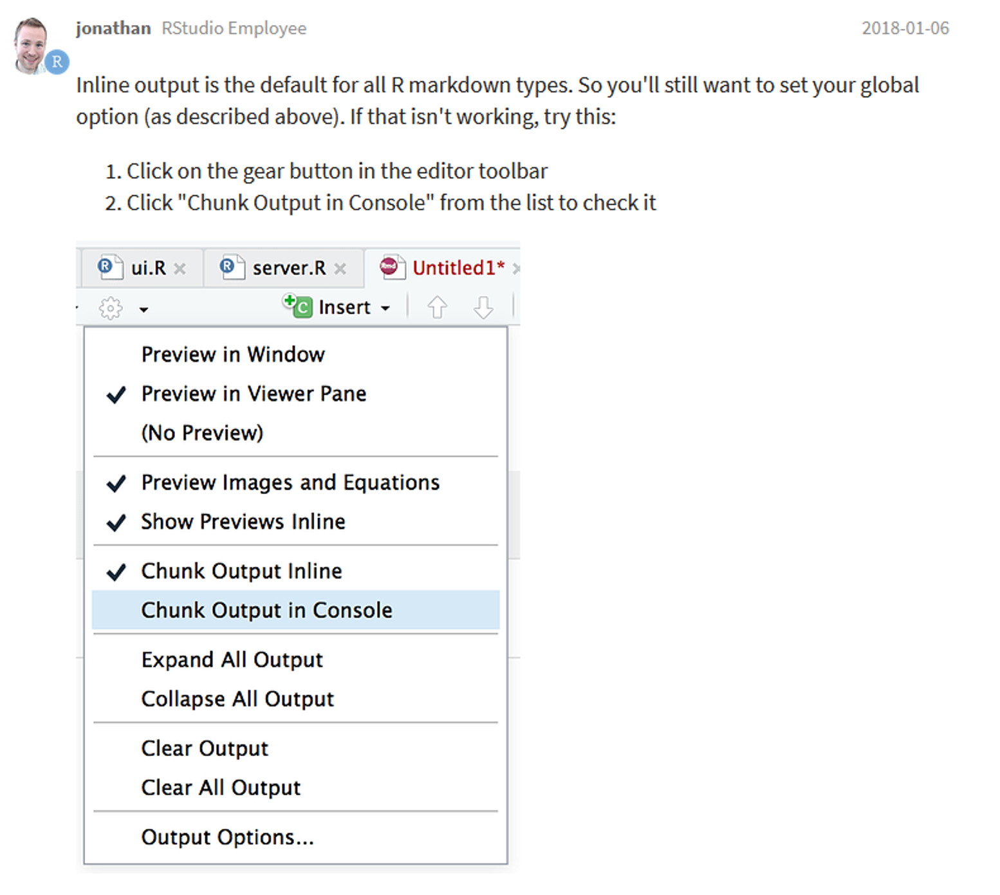
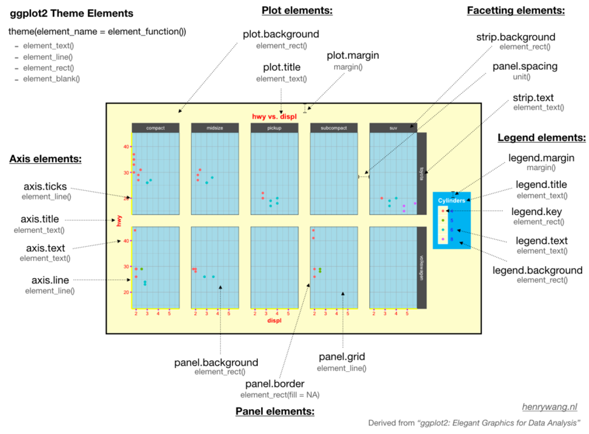

## Diverses 

*Der Beitrag wurde das letzte mal am `r format(Sys.time(), '%d %B, %Y')` editiert*

```{r include=FALSE}

knitr::opts_chunk$set(fig.align = "center", collapse = T, echo = TRUE, message = FALSE, warning = FALSE)

# With collapse = TRUE the Source and output lived together happily ever in knitr.
# https://github.com/yihui/knitr-examples/blob/master/039-merge.md

# loading multiple packages at once with `pacman`
# create a vector name
packages <- c("ggplot2", "tidyverse", "markdown", "knitr", "matrixStats", "patchwork", "lubridate", "plotly",  "naniar", "stlplus", "gt", "dygraphs", "htmltools", "ggpmisc", "forcats", "RColorBrewer", "Kendall", "rstudioapi", "multcompView", "plyr", "bookdown", "janitor", "ggpubr", "moments", "ggthemes", "hexbin", "ggridges", "ggstream", "openair", "treemapify", "MBA", "akima", "sf", "rnaturalearth", "rnaturalearthdata", "rgeos", "ggspatial", "factoextra", "FactoMineR", "gapminder", "calendR", "pacman")

# Load the packages vector 
pacman::p_load(packages, character.only = T)


my_theme <- theme(
  panel.background = element_rect(fill = "white", color = "black"),
  panel.grid.major = element_blank(), 
  panel.grid.minor = element_blank(), 
  panel.border = element_blank())


```

### Entfernen aller packages

* Falls es beim arbeiten mit R und den dazugehoerigen packages zu Problemen kommt hilft der folgende Befehl diese zu loeschen: 

[R bloggers](https://www.r-bloggers.com/2016/10/how-to-remove-all-user-installed-packages-in-r/)

```{r eval=F, echo=T}

# create a list of all installed packages
 ip <- as.data.frame(installed.packages())
 head(ip)
# if you use MRO, make sure that no packages in this library will be removed
 ip <- subset(ip, !grepl("MRO", ip$LibPath))
# we don't want to remove base or recommended packages either\
 ip <- ip[!(ip[,"Priority"] %in% c("base", "recommended")),]
# determine the library where the packages are installed
 path.lib <- unique(ip$LibPath)
# create a vector with all the names of the packages you want to remove
 pkgs.to.remove <- ip[,1]
 head(pkgs.to.remove)
# remove the packages
 sapply(pkgs.to.remove, remove.packages, lib = path.lib)

```

### Shortcuts

Was wäre das Leben ohne shortcuts. Für viele Anwendungen spart es wahnsinnig viel Zeit. 

Informationen koennen auf der [RStudio Homepage gefunden werden](https://support.rstudio.com/hc/en-us/articles/200711853-Keyboard-Shortcuts) oder direkt unter Tools -> Keyboard shortcuts help. 

💡 Der shortcut für die shortcuts lautet **Alt + shift + K**

```{r echo = F}
# Daten Speicherkoog einlesen
koog_raw <- readr::read_delim("data/data.csv", delim = ";", 
                          col_types = readr::cols(
                            # date = überschreibt die Spalte mit der neuen Spezifikation
                            date = readr::col_datetime(format = "%d.%m.%Y %H:%M") 
  ))
koog_raw <- janitor::clean_names(koog_raw)
koog <- koog_raw %>%
  dplyr::mutate(across(contains("eh"), ~. + 207))
# Erstelle neue Spalten mit Zeitstempeln
koog <- koog %>%
  mutate(year = lubridate::year(date),
         month = lubridate::month(date),
         day = lubridate::day(date),
         hour = lubridate::hour(date), 
         daily = format(date, "%Y-%m-%d"),
         monthly = format(date, "%Y-%m"))

# Tagesmittelwerte
koog_day <- koog %>%
  group_by(daily) %>%
  summarise_if(is.numeric, mean, na.rm = T) %>%
  mutate(daily = as.Date(daily))

# Monatsmittelwerte
koog_month <- koog %>%
  group_by(monthly) %>%
  summarise_if(is.numeric, mean, na.rm = T)
  
# Jahresmittelwerte
koog_year <- koog %>%
  group_by(year) %>%
  summarise_if(is.numeric, mean, na.rm = T)


```

## FAQs

### Kalender erstellen

🔍 [https://r-coder.com/calendar-plot-r/](https://r-coder.com/calendar-plot-r/)

Als erstes laden wir das `calendR` package:  

```{r}
# Load the package
library(calendR)

# Display the current year
calendR()

# Specifiy the year you prefer
calendR(year = 2020)

# start with monday
calendR(year = 2021, 
        start = "M")

# change the language compared with the operating system 
Sys.setlocale("LC_ALL", "English")
calendR(year = 2021, 
        start = "M", 
        special.days = c(9, 21,300, 365),
        special.col = "lightblue"
        )

# highlight all the weekends
calendR(year = 2021,
        start = "M",
        special.days = "weekend") # Color all weekends

```


### RStudio 

🔍 [https://community.rstudio.com/t/plots-not-showing-up-in-the-plots-pane-in-rstudio/3981/5](https://community.rstudio.com/t/plots-not-showing-up-in-the-plots-pane-in-rstudio/3981/5)

Falls die Plots nicht in im plots Fenster oder im Viewer der RStudio Benutzeroberfläche angezeigt werden, sondern aussschließlich unter dem code chunk, dann müssen die folgenden Einstellungen gesetzt werden:

```{r echo=F, fig.cap="Lage Standort Speicherkoog"}

```

### Datenmanipulation

#### Create decadal data

Ein schneller Schritt eine Spalte pro Dekade zu erstellen geht folgendermaßen:

```{r}
# Example with the gapminder data 
gapminder %>%
  select(year, country, pop) %>%
  head(n = 5)

# Use floor() and round to the nearest border
gapminder %>%
  mutate(
    decade = floor(year / 10),  
    decade = decade * 10, 
    decade = factor(decade)
  ) %>%
  select(year, decade, country, pop) %>%
  head(n = 5)


```


#### String manipulation 

🔍 [http://www.endmemo.com/r/gsub.php](http://www.endmemo.com/r/gsub.php)
🔍 [https://bookdown.org/rdpeng/rprogdatascience/r-nuts-and-bolts.html#summary](https://bookdown.org/rdpeng/rprogdatascience/r-nuts-and-bolts.html#summary)

Die wichtigsten R Funktionen um Strings zu bearbeiten sind:

* `grep()` und `grepl()`: Sucht nach einem regulären Ausdruck in einem String
* `regexpr()`, `gregexpr()` und `regexec()`: Sucht nach Treffern in einem regulären Ausdruck und geben die Indizes wieder, wo der Treffer auftrifft. 
* `sub()` und `gsub()`: Sucht nach einem regulären Ausdruck in einem String und ersetzt diesen

Das Muster ist dabei *pattern* - *replacement*: 

gsub(pattern, replacement, x, ignore.case = FALSE, perl = FALSE, fixed = FALSE, useBytes = FALSE)

```{r}
x <- "Eine tolle Exursion"
gsub("Eine tolle", "Die weltbeste", x)

```

#### Split a single column into multiple columns

🔍 [https://cmdlinetips.com/2018/03/how-to-split-text-in-a-column-in-data-frame-in-r/](https://cmdlinetips.com/2018/03/how-to-split-text-in-a-column-in-data-frame-in-r/)

Beim Anlegen von Variablennamen kann man Informationen in dem jeweiligen Namen bereits hinterlegen. Zum Beispiel die Codierung `01_10_st` kann vom Standort **01** in **10** cm Tiefe der Parameter **Bodentemperatur** sein. Möchte ich diese Spalteninformationen nun auf mehrer Spalten Verteilen eignet sich die Funktion `separate`. 

```{r}

x <- tibble(
  id = "01_10_st",
  value = 10.3
)
x

# Create new columns with the information from the id column
y <- x %>%
  separate(id, into = c("study_site", "depth", "parameter"))
y

```

Aber Achtung. R ist auch hier Anfällig gegenüber Groß- Kleinschreibung. 

```{r}
x <- "Eine tolle Exursion"
gsub("Eine Tolle", "Die weltbeste", x)
```

Ich kann aber auch das Argument setzen, dass Kleinschreibung egal ist mit:

```{r}
x <- "Eine tolle Exursion"
gsub("Eine Tolle", "Die weltbeste", x, ignore.case = T)
```

## Visualisation 

### Superscripts and subscripts

Um Zahlen an Plot labels hoch- oder tiefzustellen, bspw. Achsenbeschriftung oder Titel, kann man die Befehlen èxpression` und `paste` verwenden. Expression ermöglicht die Verwendung von Sonderzeichen und paste ermöglicht die Sonderzeichen mit *normalem* Text zu verknüpfen.

```{r}
# Erstelle willkürlich Daten a mit vier Gruppen in b
x <- tibble(
  a = rnorm(n = 100, mean = 50, sd = 2),
  b = rep(x = c("a","b","c","d"), 25)
)

x %>%
  ggplot(aes(a, b, group = b)) +
  geom_boxplot()

# [] Tiefstellen
x %>%
  ggplot(aes(a, b, group = b)) +
  geom_boxplot() +
  labs(
    title = "Eine tolle Überschrift",
    x = "Einheit (XY)",
    y = expression(E[H])
  )

# ^ Hochstellen
x %>%
  ggplot(aes(a, b, group = b)) +
  geom_boxplot() +
  labs(
    title = "Eine tolle Überschrift",
    x = "Einheit (XY)",
    y = expression(m^2)
  )

# Kombination + normaler Text
x %>%
  ggplot(aes(a, b, group = b)) +
  geom_boxplot() +
  labs(
    title = "Eine tolle Überschrift",
    x = "Einheit (XY)",
    y = expression(paste("Ca" ^"2+", " Verteilung (g ", cm^-3, ")"))
  )

# Bei langen Beschriftungen eignen sich auch Zeilenumbrüche, die mit "\n" erzeugt werden
x %>%
  ggplot(aes(a, b, group = b)) +
  geom_boxplot() +
  labs(
    title = "Eine tolle \nÜberschrift",
    x = "Einheit (XY)",
    y = expression(paste("Ca" ^"2+", " Verteilung (g ", cm^-3, ")"))
  )

```

### Modifying labels in faceted plots

🔍 [https://biostats.w.uib.no/modifying-labels-in-faceted-plots/](https://biostats.w.uib.no/modifying-labels-in-faceted-plots/)

```{r echo=F, fig.cap="@Henry Wang taken from: https://henrywang.nl/ggplot2-theme-elements-demonstration/"}

```


```{r}
# Darstellung des gesamten Zeitraums
koog_day %>%
  filter(year > "2010" & year < "2013") %>%
  ggplot(aes(daily, st10)) +
  geom_line()

# Darstellen pro Jahr
p <- koog_day %>%
  filter(year > "2010" & year < "2013") %>%
  ggplot(aes(daily, st10)) +
  geom_line() +
  facet_wrap(~year, scales = "free_x")

p

```

Ändern der Hintegrundfarbe 

```{r}
p + theme(strip.background = element_rect(fill="lightblue", size=1, color="darkblue"))
```

Ändern der Schriftfarbe

```{r}
p + theme(strip.text.x = element_text(size=12, face="italic", color="darkblue"))
```

Ändern der Beschriftung ist nicht ganz unkompliziert, da die Beschriftung von den Variablennamen der Spalten genommen wird. Möglichkeit 1 wäre, die Beschriftung im Datensatz direkt zu ändern. Möglichkeit zwei ist einen neuen Namensvektor zu erstellen und die Funktion `labeller = labeller()` zu verwenden. 
```{r}
# Erstelle Namensvektor
new_name <- c("2011" = "Gute Zeiten", "2012" = "Schlechte Zeiten")

# Nutze die Funktion labeller
koog_day %>%
  filter(year > "2010" & year < "2013") %>%
  ggplot(aes(daily, st10)) +
  geom_line() +
  facet_wrap(~year, scales = "free_x", labeller = labeller(year = new_name))

```

Auch der Abstand zwischen den Panels kann verändert werden mit `theme(panel.spacing = unit())`. 

```{r}
# Hm....es gibt immer noch einen overlap bei der X-Achse
p + theme(panel.spacing.x = unit(.25, "cm"))
```

```{r}
# JA :) Besser
p + theme(panel.spacing.x = unit(1.25, "cm"))
```

## Glossary

-   [Shell](https://de.wikipedia.org/wiki/Shell_(Betriebssystem))

    -   In der Informatik wird als Shell die Software bezeichnet,
        mittels derer ein Benutzer mit einem Betriebssystem interagiert
        -- eine Mensch-Maschine-Schnittstelle. Während Kernel den Kern
        eines Betriebssystems bezeichnet, ist die Shell (englisch für
        „Schale", „Hülle" oder „Außenhaut") anschaulich dessen
        Außenschicht und damit Schnittstelle (englisch Interface) zum
        Benutzer.
    -   Synonym = "terminal", "command line", and "console"

-   [GUI](https://de.wikipedia.org/wiki/Grafische_Benutzeroberfl%C3%A4che)

    -   Grafische Benutzeroberfläche oder auch grafische
        Benutzerschnittstelle oder Bedienoberfläche (Abk. GUI von
        englisch graphical user interface) bezeichnet eine Form von
        Benutzerschnittstelle eines Computers. Sie hat die Aufgabe,
        Anwendungssoftware auf einem Rechner mittels grafischer Symbole,
        Steuerelemente oder auch Widgets genannt, bedienbar zu machen.

-   [Clipboard](https://de.wikipedia.org/wiki/Zwischenablage)

    -   Ein Clipboard ist der englischsprachige Begriff für eine
        Zwischenablage in der elektronischen Datenverarbeitung, d. h.
        ein virtueller Zwischenspeicher