--- 
title: "Daten Analyse mit RStudio - Dokumentation"
author: "Dr. Kristof Dorau"
date: "Aktualisiert am: `r Sys.time()`"
site: bookdown::bookdown_site
description: "Explorative Datenanalyse in den Geowissenschaften"
---

```{r include=FALSE}

knitr::opts_chunk$set(fig.align = "center", collapse = T, echo = TRUE, message = FALSE, warning = FALSE, fig.width=6, out.width="100%")

# With collapse = TRUE the Source and output lived together happily ever in knitr.
# https://github.com/yihui/knitr-examples/blob/master/039-merge.md

# loading multiple packages at once with `pacman`
# create a vector name
packages <- c("tidyverse", "markdown", "knitr", "matrixStats", "patchwork", "lubridate", "plotly",  "naniar", "stlplus", "gt", "dygraphs", "htmltools", "zoo", "xts", "ggpmisc", "forcats", "RColorBrewer", "Kendall", "rstudioapi", "multcompView", "plyr", "bookdown", "janitor")
 
# Load the packages vector 
pacman::p_load(packages, character.only = T)


my_theme <- theme(
  panel.background = element_rect(fill = "white", color = "black"),
  panel.grid.major = element_blank(), 
  panel.grid.minor = element_blank(), 
  panel.border = element_blank())

```

# Einleitung

Die folgende Anleitung soll eine Schritt-für-Schritt Hilfe für das erfolgreiche Arbeiten mit R geben. Die Abfolge der Kapitel basieren dabei auf den nötigen Schwerpunkten, wie sie für den täglichen Gebrauch der Datenanalyse in den Geowissenschaften nützlich ist. Grundlage dieser Dokumentation und quasi die Bibel für Datenanalysten ist das Buch: H. Wickham and Grolemund, **R for Data Science** - Import, Tidy, Visualize, and Model Data, O'Reilly, Sebastopol, CA, USA, 2016. In der Literatur wird auch häufig das Akronym "r4ds" verwendet, was eine Anspielung auf den Titel des Buches und dessen Inhalt ist.   

```{r echo=F, fig.cap="Schema Datenanalyse", fig.width=6, out.width="100%"}
knitr::include_graphics("images/001.png")
```

## Syntax und stilistische Mittel der Dokumentation

Die Kapitel beinhalten verschiedene Rubriken und werden durch graphische Hilfsmittel hervorgehoben: 

* Sogenannte code chunks (wir lernen später was dies ist) sind grau hinterlegt und beinhalten Kommentare (**#**), code (in diesem Fall die Rechnung 1+1; ja...R kann wie ein Taschenrechner benutzt werden) und das dazugehörige Ergebnis (**##**; zwei Rauten und keine Sorge, wir klären noch was die [1] bedeutet).

```{r eval=TRUE, echo=TRUE}
# Dies ist ein Kommentar 
1+1 
```

* 🔍️ Hier werden Literaturtipps gegeben 

* 💡 Nützliche Informationen und Tipps

* 🚨 Wichtig zu merken

> Dies ist ein Zitat

* lubridate::() Das Wort zusammen mit "::" gibt den Namen des verwendeten packages wieder

* Funktionsnamen + Klammer werden im Fließtext grau hinterlegt, wie bspw. `sum()` oder `mean()`

## Falbeispiele 

### Speicherkoog

Ein Datensatz mit dem ich mich in dieser Dokumentation beschäftige stammt vom Polder Speicherkoog, einer 1978 eingedeichten Fläche an der Nordwestküste von Schleswig-Holstein. Es ist damit der jüngste Koog und aus den Salzwiesen - die sich auch noch heute vor dem Deich befinden - haben sich in den letzten Jahrzehnten Kalkmarschen entwickelt. Mit > 90 Bodenpunkten gehören diese Böden zu den fruchtbarsten die es in Deutschland zu finden gibt. 

```{r echo=F, fig.cap="Lage Standort Speicherkoog"}
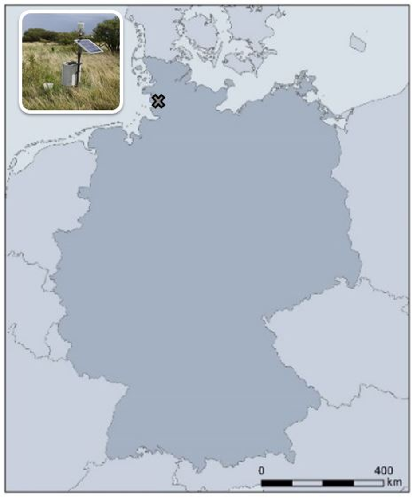
```

An diesem Standort wird von [Prof. Tim Mansfeldt; Universität zu  Köln](https://geographie.uni-koeln.de/forschung/arbeitsgruppen/bodengeographie-bodenkunde) seit 2010 eine vollautomatisierte Messstation betrieben, die seitdem auf stündlicher Basis eine Vielzahl an bodenkundlichen, meteorologischen und hydrologischen Daten aufzeichnet. Der Datensatz (Stand Januar 2021) ist als .csv Dtei 27 mb groß und umfasst 4,5 Millionen Messwerte. Warum die Auswertung dieses doch recht unhandlichen Datensatzes in R ein Kinderspiel ist möchte ich auf den folgenden Seiten hervorheben. Dieses Fallbeispiel werde ich vorallem für die Darstellung von Zeitreihen nutzen. 

```{r echo=F, fig.cap="Messprogramm"}
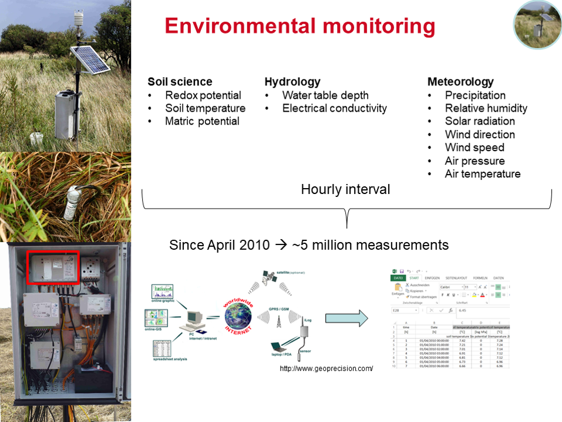
```

### `mtcars` Datensatz

R beinhaltet bereits interne Datensätze mit denen man explorative Datenanalyse betreiben kann. Einer davon ist der `mtcars` Datensatz. Es handelt sich dabei um Daten die aus dem 1974 erschienenen Magazin *Motor Trend US* veröffentlicht wurden. Es beinhaltet Informationen zu Treibstoffverbrauch und zehn weiteren Kennwerten von 32 Automobilen.  

* [, 1] 	mpg 	Miles/(US) gallon
* [, 2] 	cyl 	Number of cylinders
* [, 3] 	disp 	Displacement (cu.in.)
* [, 4] 	hp 	Gross horsepower
* [, 5] 	drat 	Rear axle ratio
* [, 6] 	wt 	Weight (1000 lbs)
* [, 7] 	qsec 	1/4 mile time
* [, 8] 	vs 	Engine (0 = V-shaped, 1 = straight)
* [, 9] 	am 	Transmission (0 = automatic, 1 = manual)
* [,10] 	gear 	Number of forward gears
* [,11] 	carb 	Number of carburetors 

## Über mich

Hi, ich bin Kristof und mit Leib und Seele Bodenkundler. Neben dreckigen Händen von der Geländearbeit mag ich das Hineindenken in große Datensätze. Während Studium, Promotion und auch in der Zeit danach als Wissenschaftlicher Mitarbeiter ist mein treuer Partner stets Excel (+xlstat), Origin und SPSS gewesen. Im Frühjahr 2020 war es dann soweit. Nach einigen flüchtigen Begegnungen hatte ich endlich einen intensiveren Kontakt mit R (besser gesagt RStudio) und habe mir Mühe gegeben Sie intensiver kennenzulernen. Excel habe ich das noch nicht erzählt, da ich Sie gelegentlich auch noch nutze 🤐 

R und ich haben also (Stand 09.04.2021) 1-jähriges und was soll ich sagen...😍 Ich hoffe wir werden noch viele schöne Jahre miteinander haben und ich kann den ein oder anderen überzeugen sich dieser Partnerschaft anzuschließen.

## Literatur 🔍

Diese Dokumentation orientiert sich stark an den folgenden Quellen, hinsichtlich Aufbau, Inhalt und Abbildungen. Quasi ein großer Kuchen mit vielen Inhaltsstoffen, die dem Leser hoffentlich schmecken werden. Als wesentliche Quellen zu nennen sind:

* [R for Data Science - Hadly Wickham](https://r4ds.had.co.nz/index.html)
* [YaRrr! The Pirate’s Guide to R - Nathaniel D. Phillips](https://bookdown.org/ndphillips/YaRrr/)
* [Computational Methods in der politischen Kommunikationsforschung - Julian Unkel ](https://bookdown.org/joone/ComputationalMethods/)
* [R Markdown: The Definitive Guide - Yihui Xie](https://bookdown.org/yihui/rmarkdown/)
* [Data Visualization in R - Claus Wilke](https://wilkelab.org/SDS375/)
* [A ggplot2 Tutorial for Beautiful Plotting in R - Cedric Scherer](https://www.cedricscherer.com/2019/08/05/a-ggplot2-tutorial-for-beautiful-plotting-in-r/#colors)
* [Illustrationen von Allison Horst](https://github.com/allisonhorst/stats-illustrations)


<!--chapter:end:index.Rmd-->

# Erste Schritte mit R

*Der Beitrag wurde das letzte mal am `r format(Sys.time(), '%d %B, %Y')` editiert*

```{r include=FALSE}
# define global options for chunks
knitr::opts_chunk$set(fig.align = "center", collapse = T, echo = TRUE, message = FALSE, warning = FALSE)

# With collapse = TRUE the Source and output lived together happily ever in knitr.
# https://github.com/yihui/knitr-examples/blob/master/039-merge.md

# loading multiple packages at once with `pacman`
# create a vector name
packages <- c("tidyverse", "markdown", "knitr", "matrixStats", "patchwork", "lubridate", "plotly",  "naniar", "stlplus", "gt", "dygraphs", "htmltools", "zoo", "xts", "ggpmisc", "forcats", "RColorBrewer", "Kendall", "rstudioapi", "multcompView", "plyr", "bookdown", "janitor")
 
# Load the packages vector 
pacman::p_load(packages, character.only = T)

# Load custom theme
my_theme <- theme(
  panel.background = element_rect(fill = "white", color = "black"),
  panel.grid.major = element_blank(), 
  panel.grid.minor = element_blank(), 
  panel.border = element_blank())

```

R ist eine Programmiersprache für Datenanalyse mit vielen Möglichkeiten der Darstellung. Es  hat sich als weit verbreitetes Hilfsmittel in der Wissenschaft aber auch Wirtschaft durchgesetzt und belegt unter den Standardsprachen (bspw. TIOBE-Index) Rang 9. Um die Benutzerfreundlichkeitt zu erhöhen wird weiterhin die Oberfläche RStudio angeboten. Das Desgin geht im Wesentlichen auf den Entwickler Ross Ihaka im Jahr 1993 zurück.

## Installation

Bevor wir starten müssen noch einige Dinge installiert werden. Ein Tutorial dazu findet ihr auch hier:

```{r echo=F}
knitr::include_url("https://www.youtube.com/watch?v=NZxSA80lF1I&t=53s")
```

### R

```{r echo=FALSE, fig.cap="R logo", fig.width=6, out.width="50%"}
knitr::include_graphics("images/004.png")
```

R kann unter CRAN (comprehensive R archive network) heruntergeladen werden. CRAN setzt sich aus weltweit verteilten  Servern zusammen, welche die Verteilung von R mit den dazugehörigen packages ermöglicht. Jedes Jahr gibt es ein größeres Update von R mit einigen kleineren. Man sollte daher regelmäßig R aktualisieren. Um base-R zu installieren bitte den folgenden Link klicken und den Instruktionen folgen.


|Betriebssystem|Link|
|:--|:--|
|Windows|[http://cran.r-project.org/bin/windows/base/](http://cran.r-project.org/bin/windows/base/)|
|Mac|[http://cran.r-project.org/bin/macosx/](http://cran.r-project.org/bin/macosx/)|

### RStudio

```{r echo=FALSE, fig.cap="RStudio logo", fig.width=6, out.width="50%"}
knitr::include_graphics("images/005.png")
```

RStudio ist eine integrierte Benutzeroberfläche (IDE), welches das Arbeiten mit R vereinfacht. RStudio kann unter dem folgenden Link heruntergeladen werden: [https://www.rstudio.com/products/rstudio/download/](https://www.rstudio.com/products/rstudio/download/)


### Packages - das tidyverse

```{r echo=FALSE, fig.cap="Tidyverse logo", fig.width=6, out.width="50%"}

```

Unter dem Begriff tidyverse ist eine Ansammlung von packages zu finden, welche vorallem vom RStudio Chefentwickler Hadly Wickham aufgesetzt wurden. Diese bilden die Grundlage zum Ausführen der Übungen in diesem Buch. Mit dem folgenden Befehl kann das tidyverse installiert werden. Dazu einfach in die Konsole eintippen und mit enter bestätigen
        
```{r eval = FALSE}
install.packages(tidyverse)
```

Um die Funktionen eines Packages jedoch zu nutzen muss es explizit aktiviert werden mit der Funktion library()
        
```{r eval = FALSE}
library(tidyverse)
```

💡 Ein package ist eine Ansammlung von Funktionen, Daten und einer Dokumentation, welche das Arbeiten mit R vereinfachen. Bevor man sich an eine aufwändige Analyse begibt sollte man überprüfen, ob es nicht ein Package gibt das einem das Problem direkt löst.

## RStudio Benutzeroberfläche

Die Benutzeroberfläche besteht aus vier wesentlichen Fenstern. 

```{r echo=FALSE, fig.cap = "Benutzeroberfläche RStudio. Source: https://bookdown.org/ndphillips/YaRrr/", fig.align='center'}
knitr::include_graphics("images/007.png")
```

### Source

Im source Fenster kann ein Skript geschrieben oder editiert werden. Die Befehle in diesem Fenster werden jedoch nicht explizit ausgeführt, sondern erst nachdem sie durch Run aktiviert werden. Es ist dabei möglich einen Befehl pro Zeile auszuführen oder aber auch das komplette Skript durchlaufen zu lassen. 
Es gibt drei verschiedene Methoden Code aus dem Source Fenster in der Console auszuwerten
        - Copy+Paste des Befehls von dem source Fenster in die Konsole
        - Den Befehl im source Fenster markieren und mit "run" ausführen
        - Mit dem Hotkey "command + enter" wird die entsprechende Zeile direkt ausgeführt 
        
💡 Die Hotkey Variante ist empfohlen. 

### Konsole

Die Konsole ist das Herzstück von R. Code der hier geschrieben wird, wird auch direkt ausgeführt. Wenn man bspw. `1+1` in die Konsole tippt und mit enter bestätigt, so bekommt man als direkte Antwort `2` ausgegeben. 
    
```{r}
1+1
```

💡 Versuche so viel wie möglich im source Fenster zu arbeiten und nicht in der Konsole. Der Grund ist einfach: Code im source Fenster kann gespeichert werden und die Dokumentation bei mehreren Schritten ist übersichtlicher. 

### Environment 

Im Environment (Arbeitsumgebung) sind deine lokal gespreicherten R Objekte gespeichert. Dazu gehören, Vektoren, Matrizen oder spezielle Formate in R wie data frames oder tibbles. Weiterhin sind Daten hinterlegt wie groß das Objekt ist und wie die Anzahl an Variablen und Beobachtungen ist. 

```{r echo=FALSE, fig.cap="Tidyverse logo", fig.width=6, out.width="100%"}
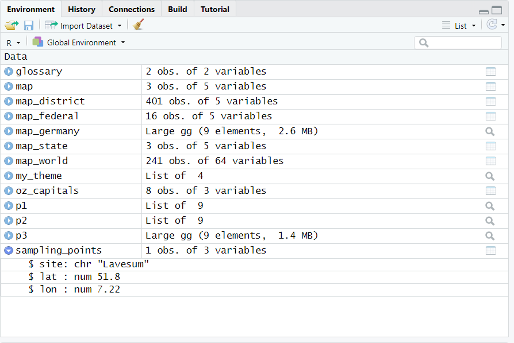
```

### Files / Plots / Packages / Help

Unter Files werden die Dateien in deinem Projektordner angezeigt. Man kann hier ebenfalls Einstellungen an der Arbeitsumgebung durchführen. Wenn Abbildungen erstellt werden können diese optional unter deinem Code chunk angezeigt (siehe Abb. links) oder im Fenster "plots" (siehe Abb. rechts). Ich bevorzuge es die Abbildungen in einem seperaten Fenster angezeigt zu bekommen, da man Änderungen im code unmittelbar sieht. Falls der code nämlich sehr lang ist muss man immer aufwendig runterscrollen. 

```{r echo=FALSE,out.width="49%", out.height="20%", fig.cap="caption", fig.show='hold'}
knitr::include_graphics(c("images/009.png","images/010.png"))
```

Wenn R das erste mal heruntergeladen wird erscheinen nur packages die von den Entwicklern geschrieben wurden, bspw. die `mean()` und `hist()` Funktion. Möchte man jedoch auf Funktionen von anderen Autoren zurückgreifen ist es notwendig, dass man zuerst deren package herunterlädt. 

```{r echo=FALSE, fig.cap="Ein R package ist wie eine Glühbirne. Du musst sie mit install.packages() reindrehen, mit library() jedoch bei jeder neuen R Sitzung anschalten um sie zu nutzen. Source: https://bookdown.org/ndphillips/YaRrr/", fig.width=6, out.width="100%"}
knitr::include_graphics("images/011.png")
```

Es gibt eine Möglichkeit ein heruntergeladenes Package temporär zu nutzen, und zwar durch die Notation `Package::Funktionsname()`. Ein Vorteil dieser Schreibweise ist es, dass dem Leser direkt die Möglichkeit gegeben wird zu erkennen von welchen package die Funktion stammt. Ein Nachteil ist jedoch, dass dies immer wieder von neuem geschrieben werden muss wenn das package nicht explizit mit `library("Package")` geladen wird.

Eine der wichtigsten Dinge ist das Hilfefenster. Hier kann man in den Dokumentationen zu den Packages nachlesen, welche Besonderheiten es gibt und was die Argumente bedeuten. In jeder Dokumentation gibt es auch eine Rubrik mit Beispielen. 

💡 Wenn man vor einen Befehl ein "?" schreibt und die Zeile ausführt erscheint automatisch die Dokumentation/Hilfe im Help Fenster.

```{r eval=FALSE}
?mean
```

```{r echo=FALSE, fig.cap = "Dokumentation zur Funktion mean() um einen Mittelwert zu bilden", fig.width=6, out.width="100%"}
knitr::include_graphics("images/012.png")
```

## Code lesen und schreiben 

Code chunks sind eine großartige Sache (grau hinterlegte Box) und beinhalten *Code*, *Kommentare* und das *Ergebnis*. Kommentare werden mit einer Raute ("#") kenntlich gemacht und werden beim Ausführen des chunks nicht von R erkannt. Dies hat sehr große Vorteile! Der wichtigste ist, dass man seine Gedanken vor jeden Befehl schreibt, um noch nach Jahren (im besten Fall 😄) nachzuvollziehen was man eigentlich damit gemeint hat. Für Kollegen und einen selbst entsteht dadurch eine roadmap die zum Ziel führt. 

```{r echo=T}
# Definiere einen Vektor mit der Länge 1 bis 5 
vektor_a <- 1:5
# Zeige mir vektor_a
vektor_a
# Wie lautet der Mittelwert von vektor_a?
mean(vektor_a)
```

Der Inhalt eines code chunks sollte ohne Probleme in die eigene R Konsole kopiert und ausgeführt werden können. 

💡 Falls eine Fehlermeldung auftritt wurde ein vorausgehendes package oder eine Datenquelle vermutlich nicht geladen.

### Die Konsole

R code kann in jedem Texteditor oder Skriptfenster geschrieben werden. Um den Code auszuführen ist es jedoch wichtig ihn an die Kommandozeile (command-line; console) von R zu senden. 

```{r echo = F, fig.cap = "Die Konsole mit der Kommandozeile von R. Source: https://bookdown.org/ndphillips/YaRrr/", fig.width=6, out.width="100%"}
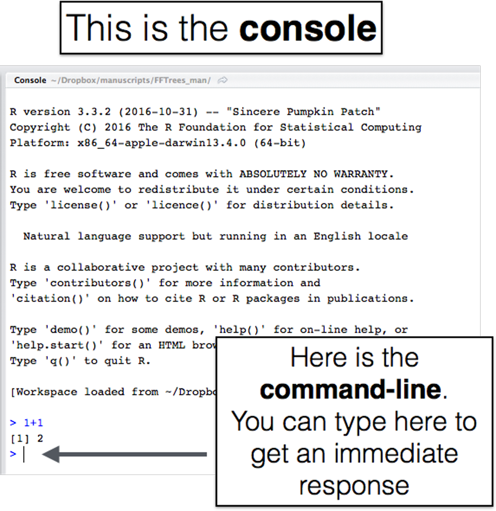
```

Die Kommandozeile in R startet mit dem `>` Symbol, auch *prompt* genannt. Prompt leitet sich von prompting (auffordern) ab. Man wird also dazu aufgefordert einen Befehl einzutippen. `1+1` gibt also direkt `## [1] 2` wieder. Die `[1]` steht dabei für den Index (mehr dazu später). 

### R Skript

Für einfache Befehle macht es Sinn direkt in die Konsole zu tippen. Code den man speichern möchte und komplexere Anfragen sollten jedoch in ein R script geschrieben haben (hat die Dateiendung `.R`). Ein R Skript ist eine Zusammenfassung an code welches in einer Datei zusammengefasst wurde. 
Um ein neues Skript zu speichern schreibe:

File - New file - R script

Um code in einem Skript auszuwerten muss es explizit an die Konsole gesendet werden. 

```{r echo = F, fig.cap = "Code vom Skript an die Konsole senden. Source: https://bookdown.org/ndphillips/YaRrr/", fig.width=6, out.width="100%"}
knitr::include_graphics("images/014.png")
```

💡 Der shortcut strg+Enter wird euer bester Freund werden und ist meine bevorzugte Art.

### Good practice Code zu schreiben

Einen klaren Gedanken auf das Papier zu bringen ist nicht so einfach. Beim Schreiben von Code verhält es sich natürlich ähnlich. Damit anderen Menschen ebenfalls Freude daran haben den Weg zum Ziel zu verstehen, sollte man es Ihnen so einfach wie möglich machen. Hier sind ein paar Regeln:

* **#** = Kommentiere code so häufig wie möglich mit der Raute #. Mehr ist mehr!
* **Leerzeichen** = Findestduesbesserwennichsoschreibe oder wenn ich wieder normal schreibe?
* **Zeilenumbrüche** = Eine 100-seitige Abschlussarbeit in einem Absatz zu schreiben ist fürchterlich und würde keiner tun. Bei code verhält es sich ähnlich. 

💩 Beispiel

```{r echo=T, eval=F}
library(tidyverse)
df<-read.csv("data/data.csv", sep = ";")
ggplot2::ggplot(df, aes(wt,EH100b))+geom_point()
cor(df$wt, df$EH100a, use = "complete", method = "pearson")
```

💪 Beispiel

```{r echo=T, eval=F}
# Lade das package tidyverse
library(tidyverse)
# Lese den Datensatz "data" vom Speicherkoog ein
# Das Trennzeichen ist Semikolon
df <- read.csv("data/data.csv", sep = ";")
# Stelle den Grundwasserstand (wt; in cm) und das Redoxpotenzial in 100 cm Tiefe dar (in mV)
ggplot(data = df, aes(x = wt)) + 
    geom_histogram()
# Berechne Pearson Korrelationskoeffizient zwischen Grundwasserstand und Redoxpotenzial in 100 cm Tiefe.
# Entferne vorher fehlende Werte
cor(df$wt, df$EH100a, use = "complete", method = "pearson")
```

## Objekte und Funktionen

R arbeitet fast ausschließlich mit zwei Dingen: Objekte und Funktionen. Im Folgenden Beispiel definieren wir ein Objekt (5 gemessene Werte der Lufttemperatur) mit der Funktion `c()`.

```{r}
# Erstelle ein Objekt Lufttemperatur
lt <- c(13.5, 16.7, 18.3, 21.9, 3.9)
# Berechne die mittlere Lufttemperatur 
mean(lt)
```

Ein Objekt in R kann alles sein, bspw. ein 

* Datensatz (data frames im Englischen; eine Sonderform des data frame ist ein tibble aber dazu später mehr)
* statistische Zusammenfassung des Datensatzes
* statistischer Test
* Einfache Nummern
* Vektoren (wie in unserem Beispiel die 5 Messungen der Lufttemperatur)
* Buchstaben und Wörter
* Faktoren

Diese Objekte können verschiedene **Attribute** aufweisen, bspw. ein Längenattribut unseres `lt` Vektors oder bei einem T-Test alle statistischen Parameter.

Was ist eine Funktion?

Eine Funktion greift meist auf ein oder mehrere Objekte zurück (input), führt etwas mit diesen durch, um dann etwas neues dadurch auszugeben (output). Ein Beispiel ist die Funktion um den Mittelwert von einem Vektor auszurechnen mit der Funktion `mean()`. 

### Neue Objekte erstellen

Einer der wichtigsten Kommandos in R ist der Befehl ein bestimmtes Objekt zuzuweisen mit `<-`. 

```{r}
# Erstelle ein Objekt mit dem Namen a und weisen ihm einen Satz zu
a <- "Beste Norddeutschland Exkursion der Welt"
```

Schaue was passiert wenn du `a` in die Konsole eintippst. 

```{r}
a
```

Was passiert wenn du `aa` eintippst?

```{r eval=F}
aa
```

**Fehler: Objekt 'aa' nicht gefunden**

Richtig, wir haben das Objekt `aa` noch nicht definiert und daher kann es in unserer Arbeitsumgebung (Environment) auch nicht gefunden werden.

Objekte können auch miteinander verbunden werden:

```{r}
a <- 1
b <- 100
# Was ist a + b?
a+b
# Weise die Berechnung a + b dem Objekt c zu 
c <- a + b
# Was passiert wenn du c in die Konsole eintippst?
c
```

Bei der Bennenung von Objekten gibt es auch Fehlerpotentzial:

```{r echo = T, eval = F}
# Dies sind falsch benannte Objekte
Luft temperatur <- 23 # Hat ein Leerzeichen
5lufttemperatur <- 23 # Beginnt mit einer Zahl
lufttemperatur! <- 23 # Nicht gültiger character "!"
```

Darüber hinaus ist es wichtig zu wissen, dass R seeeeEeehr sensibel gegenüber Groß- und Kleinschreibung ist. Die folgenden Objekte sind alle individuell:

```{r echo = T}
# Dies sind drei verschiedene Objekte
test <- 1
TEST <- 100
tEsT <- 1000
```

💡 Große Buchstaben sollten bei der Benennung von Objekten nach Möglichkeit vermieden werden. Es dauert einfach länger `MYDATA` oder `MyData` zu tippen als `mydata` ohne Umschalttaste. 

Einige Dinge die man bei der Benennung von Objekten berücksichtigen sollte:

```{r eval = F}
# Gute Objektnamen
mittelwert <- 2.5
mein_alter <- 32
groesse_in_cm <- 175

# Schlechte Objektnamen
x1 <- 2.5
var2 <- 32
asdasdasd <- 175
```

Ich persönlich bevorzuge **snake_case** Wörter. Später lernen wir noch, dass sich diese Wörter durch ein Argument - den Namen Separator `name_sep` - trennen lassen. Dies wird beim Umstrukturieren von Daten wichtig. Egal welches Schema man auch wählt, einheitlich vorzugehen ist das Wichtigste.

💡 Gute Objektnamen sollten kurz und prägnant sein! Lange Namen sind nicht intuitiv und Buchstaben alleine sagen auch nichts aus. Als Beispiel: Die durchschnittliche Lufttemperatur im Speicherkoog für März kann man mit `airtemp_march_koog` abkürzen.

```{r echo=F, fig.cap="Illustration von @allison_horst: https://twitter.com/allison_horst", fig.width=6, out.width="100%"}
knitr::include_graphics("images/016.png")
```

### Beispiel: Umrechnen von °C in K

Der Mittelwert der Jahresdurchschnittstemperatur im Speicherkoog beträgt 10.14 °C. Mit Skalaren kann man einfache Rechenoperationen durchführen. 

```{r}
# Mittelwert der Lufttemperatur in °C
mittel_at <- 10.14
# Lasst uns die Lufttemperatur umrechnen von °C in K
# 0 °C sind 273.15 K
mittel_at + 273.15
```

Das Jahresmittel der Lufttemperatur beträgt also 283,3 K. 

```{r}
mittel_at
```

Ups....wieso wird `mittel_at` denn trotzdem in °C angezeigt ?! Denke daran: 

🚨 **Um ein Objekt zu ändern, muss es neu zugewiesen werden!**

```{r}
# Zuweisung des Jahresmittels der Lufttemperatur in K anstelle von °C
mittel_at_k <- mittel_at + 273.15
mittel_at_k
```

Wenn ihr bis hierhin gekommen seid, dann habt ihr schon eine ganze Menge verinnerlicht. Nicht das wir uns schon zurücklehnen wollen, aber ein ein wenig Grund zum Feiern ist es dennoch 🎉🍻. 

## Cheatsheets

Je öfter man mit bestimmten Funktionen, Befehlen und Argumenten in R arbeitet, desto leichter fällt es einem sie anzuwenden. Sich alle zu merken ist jedoch unmöglich und auch nicht zielführend. Was jedoch hilfreich ist sind sogenannte Cheatsheets oder auf gut deutsch gesagt **Spickzettel**. Eine Zusammenfassung von sinnvollen Cheats ist hier zu finden:

|Beschreibung|Link|
|:--|:--|
|Rstudio cheatsheets|[https://www.rstudio.com/resources/cheatsheets](https://www.rstudio.com/resources/cheatsheets/)|
|Rstudio Benutzeroberfläche|[https://raw.githubusercontent.com/rstudio/cheatsheets/master/rstudio-ide.pdf](https://raw.githubusercontent.com/rstudio/cheatsheets/master/rstudio-ide.pdf)|
|Rmarkdown|[https://www.rstudio.com/wp-content/uploads/2016/03/rmarkdown-cheatsheet-2.0.pdf](https://www.rstudio.com/wp-content/uploads/2016/03/rmarkdown-cheatsheet-2.0.pdf)
|Daten einlesen; readr::() und tidyr::()|[https://raw.githubusercontent.com/rstudio/cheatsheets/master/data-import.pdf](https://raw.githubusercontent.com/rstudio/cheatsheets/master/data-import.pdf)|
|Arbeiten mit Faktoren; forcats::()|[https://raw.githubusercontent.com/rstudio/cheatsheets/master/factors.pdf](https://raw.githubusercontent.com/rstudio/cheatsheets/master/factors.pdf)|
|Arbeiten mit Zeit und Datum; lubridate::()|[https://raw.githubusercontent.com/rstudio/cheatsheets/master/lubridate.pdf](https://raw.githubusercontent.com/rstudio/cheatsheets/master/lubridate.pdf)|
|Buchstabenmanipulation; stringr::()|[https://raw.githubusercontent.com/rstudio/cheatsheets/master/strings.pdf](https://raw.githubusercontent.com/rstudio/cheatsheets/master/strings.pdf)|
|Daten transformieren; dplyr::()|[https://raw.githubusercontent.com/rstudio/cheatsheets/master/data-transformation.pdf](https://raw.githubusercontent.com/rstudio/cheatsheets/master/data-transformation.pdf)|
|Dokumente erstellen; rmarkdown::()|[https://raw.githubusercontent.com/rstudio/cheatsheets/master/rmarkdown-2.0.pdf](https://raw.githubusercontent.com/rstudio/cheatsheets/master/rmarkdown-2.0.pdf)|
|Datenvisualisierung; ggplot2::()|[https://raw.githubusercontent.com/rstudio/cheatsheets/master/data-visualization-2.1.pdf](https://raw.githubusercontent.com/rstudio/cheatsheets/master/data-visualization-2.1.pdf)|
|Erstellen von Karten I; sf::()|[https://raw.githubusercontent.com/rstudio/cheatsheets/master/cartography.pdf](https://raw.githubusercontent.com/rstudio/cheatsheets/master/cartography.pdf)|
|Erstellen von Karten II; sf::()|[https://raw.githubusercontent.com/rstudio/cheatsheets/master/sf.pdf](https://raw.githubusercontent.com/rstudio/cheatsheets/master/sf.pdf)|
|shiny app|[https://raw.githubusercontent.com/rstudio/cheatsheets/master/shiny.pdf](https://raw.githubusercontent.com/rstudio/cheatsheets/master/shiny.pdf)|


<!--chapter:end:02-Erste-Schritte.Rmd-->

# Grundlagen

*Der Beitrag wurde das letzte mal am `r format(Sys.time(), '%d %B, %Y')` editiert*

```{r include=FALSE}

knitr::opts_chunk$set(fig.align = "center", collapse = T, echo = TRUE, message = FALSE, warning = FALSE)

# With collapse = TRUE the Source and output lived together happily ever in knitr.
# https://github.com/yihui/knitr-examples/blob/master/039-merge.md

# loading multiple packages at once with `pacman`
# create a vector name
packages <- c("tidyverse", "markdown", "knitr", "matrixStats", "patchwork", "lubridate", "plotly",  "naniar", "stlplus", "gt", "dygraphs", "htmltools", "zoo", "xts", "ggpmisc", "forcats", "RColorBrewer", "Kendall", "rstudioapi", "multcompView", "plyr", "bookdown", "janitor")
 
# Load the packages vector 
pacman::p_load(packages, character.only = T)


my_theme <- theme(
  panel.background = element_rect(fill = "white", color = "black"),
  panel.grid.major = element_blank(), 
  panel.grid.minor = element_blank(), 
  panel.border = element_blank())

```

Im folgenden lernen wir mehr zu Datentypen in R und welche Rolle sie spielen. Ganz grundlegend lassen sich verschiedene Strukturen unterscheiden [Zusammenfassung](https://statsandr.com/blog/variable-types-and-examples/):

```{r echo=FALSE, fig.cap="Grundlegende Datenstruktur"}

```

* **Quantitative Variablen** sind nummerisch und können gemessen werden
    + **Diskret** zählbar mit einer finiten Anzahl an Möglichkeiten
        -   Anzahl Kinder einer Familie
        -   Studenten in einem Klassenzimmer
        -   Brötchen in einer Tüte
    + **Kontinuierlich** nicht-zählbar mit einer infiniten Anzahl an Möglichkeiten
        -   Alter (e.g. ein 28-jähriger Mann kann spezifischer ausgedrückt 28 Jahre, 7 Monate, 16 Tage, 3 Stunden, 4 Minuten, 5 Sekunden, 31 Milisekunden, ... alt sein. Alle Messungen stoppen per Konvention bei einem gewissen Level an Präzision, was uns aber nicht stoppen muss höherauflösend zu messen. Dies bedingt das unser Messwert eine infinite Anzahl an Möglichkeiten aufweisen kann.
        - Gewicht
        - Größe

* **Qualitative Variable** oder kategorische Variable (factor in R) sind nicht-numerisch und die Werte passen in eine Kategorie
    + **Nominal** keine Hierarchie oder Ordnung in den Werten (e.g. Geschlecht (männlich/weiblich) hat keine interne Struktur
    + **Ordinal** hat eine interne Ordnung (e.g. Gesundheitsstatus differenziert nach schlecht/mäßig/gut/hervorragend)
    
```{r echo=F, fig.cap="Illustration von @allison_horst: https://twitter.com/allison_horst"}
knitr::include_graphics("images/018.png")
```

```{r echo=F, fig.cap="Illustration von @allison_horst: https://twitter.com/allison_horst"}

```

## Datentypen

Im folgenden werden die vier grundlegenden **Datentypen** (*atomic vectors*) behandelt:

* `logical` (TRUE, FALSE)
* `integer` (c(1, 2.4, 4.678))
* `double` (auch als `numeric` bezeichnet; c(1L, 2L, 3L))
* `character` (c("these are", "some strings"))

```{r echo=FALSE, fig.cap="Atomic vectors, source: https://adv-r.hadley.nz/vectors-chap.html"}
knitr::include_graphics("images/079.png")
```


Diese Datentypen können in Form bestimmter Datenstrukturen miteinander verknüft werden. In R ist dies über die Dimensionalität der Daten definiert mit den fünf häufigsten Strukturen:

|  |Homogen|Heterogen|
|:--|:--|:--|
|1d|Atomic vector|List|
|2d|Matrix|Data frame|
|nd|Array||

Table: Datenstrukturen in R

🔍 [Advanced R by Hadly Wickham](https://adv-r.hadley.nz/)

### Numerische Objekte

Zahlenwerte in R werden als `numeric` bezeichnet mit der Unterteilung in `integer` (ganze Zahlen) oder `double` (Dezimalzahlen). Die Zuweisung von R, selbst wenn ich eine ganze Zahl zuweise, ist jedoch vom Typ double. 

```{r}
a <- 4
typeof(a)
```

💡 Mit der Funktion `typeof()` kann der Objekttyp erfragt werden.

Um eine ganze Zahl wiederzugeben muss ein L hinter die Zahl gesetzt werden. 

```{r}
a <- 4L
typeof(a)
```

### Textobjekte 

Ein `character` Objekt sind Namen wie `"Kristof"`, `"Tim"`, `"Beste Norddeutschland Exkursion der Welt"` (Textvariablen werden auch als *string* bezeichnet). Um ein `character` Objekt zu definieren sind die Anführungsstriche als einfache `' '` oder doppelte `" "` Anführungszeichen wichtig!

```{r}
# Dies sind alles character Objekte 
"Kristof"
"Tim"
"Beste Norddeutschland Exkursion der Welt"
```

Bestimmte Funktionen brauchen einen numerical input, wohingegen andere einen character input benötigen. Schaue was passiert:

```{r eval = F}
mean(c("5", "1"))
```

**Warnmeldung:In mean.default(c("5", "1")) :Argument ist weder numerisch noch boolesch: gebe NA zurück**

Lasse ich die Anführungsstriche weg, dann ist wieder alles im Lot:

```{r}
mean(c(5, 1))
```

### Logicals 

Der dritte wichtige Objekttyp in R lautet `logical` und dieser kann zwei Werte annehmen: `TRUE` (wahr) und `FALSE` (falsch). Logicals entstehen durch den logischen Vergleich zwischen zwei Werten oder den Elementen eines Vektors. Operatoren die für diese Anfrage genutzt werden können lauten:

|Operator | Bedeutung | Beispiel |
|:---|:---|:---|
| == | ist gleich                       | 1==1 (ergibt `TRUE`) "a"=="b" (ergibt `FALSE`) |
| != | ist nicht gleich                 | 1 != 1 (ergibt `FALSE`) "a" != "b" (ergibt `TRUE`) |
| <  | ist kleiner als                  | 1 < 2 (ergibt `TRUE`) 2 < 2 (ergibt `FALSE`) |
| >  | ist größer als                   | 2 > 1 (ergibt `TRUE`) 2 > 2 (ergibt `FALSE`) |
| <= | ist kleiner gleich               | 1 <= 2 (ergibt `TRUE`) 2 <= 2 (ergibt `TRUE`) |
| >= | ist größer gleich                | 2 >= 1 (ergibt `TRUE`) 2 >= 2 (ergibt `TRUE`) |

Table: Logische Operatoren in R.

### Fehlende Werte

In R werden fehlende Werte mit `NA` für `not available` gekennzeichnet. Für bestimmte Funktionen und Anwendungen ist es wichtig, falls ein `NA` Wert in einer Zeitreihe auftritt (🤯 ...leider ist dies in langen Zeitreihen fast immer der Fall), R explizit zu sagen was mit diesen Werten getan werden soll. 

```{r}
# Ich habe einen Vektor mit einem fehlenden Wert NA
a <- c(1,2,3,4,NA,5)
mean(a)
```
Hm...der Mittelwert von 1,2,3,4,NA und 5 ist NA und nicht eine Zahl? Wie kommt das bloß. In dem Fall ist es nützlich in die Dokumentation der Funktion `mean()` nachzuschauen. 

```{r eval = F}
?mean
```

**Default S3 method: mean(x, trim = 0, na.rm = FALSE, ...)**

Die default Argumente der Funktion lauten `na.rm = FALSE`, was soviel bedeutet **na** Werte nicht zu entfernen sondern in die Berechnung mit einzubeziehen. 

💡 na steht für fehlende Werte (NA) und rm ist die Kurzform für remove, also entfernen. 

Damit unsere Rechnung funktioniert müssen wir in der `mean()` Funktion das Argument `na.rm = TRUE` setzen, also erst die fehlende Werte entfernen und dann den Mittelwert berechnen:

```{r}
mean(a, na.rm = TRUE)
```
💪 Es funktioniert! Dies ist tatsächlich einer der häufigsten Fehler und egal wie häufig man daran denkt, es kommt immer wieder vor das dies einer der Gründe ist warum man sich Stunden den Kopf über ein nicht funktionierendes Skript zerbricht 🤯

### Weitere Objekttypen

Neben den drei vermeintlich wichtigsten Objekttypen (`numeric`, `character`, `logical`) gibt es in R noch die Typen für 

* Kategoriale Variablen `factor`
* Datumsangaben `date`
* Datumsangaben + Zeit `datetime` 
* ... und weitere

Wenn man Daten in R einliest muss man R jedoch einen Schubser geben, damit eine Spalte bspw. auch als `date`erkannt wird und nicht als `character` oder `numeric`. Wie man dies berücksichtigt lernen wir in dem Kapitel **Daten einlesen**. 

#### S3 Objekte

Vektoren in R weisen verschiedene Attribute auf. Die zwei wichtigsten Attribute sind:

* dimension (wandelt einen Vektor in eine Matrix oder Liste um)
* class (bedient S3 Objekte, bspw. `factor`, `date` und `POSIXct`)

Wenn ein Objekt in R ein *class* Attribut besitzt wird es automatisch in ein **S3 object** umgewandelt und unterscheidet sich dadurch von einem normalen Vektor. 

```{r echo=F, fig.cap="S3 atomic vectors, source: https://adv-r.hadley.nz/vectors-chap.html#s3-atomic-vectors"}
knitr::include_graphics("images/080.png")
```

`factor` sind bspw. aufgebaut aus den Attributen `class` und `levels` um kategorische Daten zu speichern. 

### Objekttypen ändern

Die Syntax in R um Objekte umzuwandeln lautet `as.[Objekttyp]`.

```{r}
a <- "25"
typeof(a)
a <- as.numeric(a)
typeof(a)
```

Dies klappt allerdings nur, insofern die Umwandlung logisch ist. In allen anderen Fällen gibt es eine Warnmeldung unter Erzeugung von `NA`s anstelle der Werte. 

```{r eval = F}
a <- as.numeric("Beste Norddeutschland Exkursion der Welt")
```

**## Warning: NAs introduced by coercion**

## Datenstrukturen

```{r echo=F, fig.cap="Vergleich eines Skalars und eines Vektors", out.width="50%"}

```

Der einfachste Datentyp in R ist ein Skalar ([Mathematische Größe, die allein durch die Angabe eines *Zahlen*wertes charakterisiert ist](https://de.wikipedia.org/wiki/Skalar_(Mathematik))). Im Gegensatz zu der mathematischen Beschreibung, kann in R ein Skalar jedoch `character` sein und muss nicht zwangsläufig als `numeric` definiert sein. Mathematische Operationen sind mit `numerischen` Skalaren möglich, nicht jedoch wenn diese in R als `character` gespeichert sind. 

```{r eval = F}
a <- "1"
b <- "2"
a + b
```

**Fehler in a + b : nicht-numerisches Argument für binären Operator**

Bisher haben wir einfache Objekte in R erzeugt, wie eben genau Skalare oder kürzere Vektoren. Es gibt jedoch noch weitere Datenstrukturen, die sich hinsichtlich der Dimensionalität unterscheiden (1D und 2D) und ob die Objekttypen homogen (nur ein Objekttyp) und heterogen (unterschiedliche Objekttypen) beinhalten:

|Datenstruktur |	Dimensionalität |	Objekttypen|
|Vektor |	eindimensional |	homogen|
|Liste |	eindimensional 	|heterogen|
|Matrix |	zweidimensional |	homogen|
|Dataframe |	zweidimensional 	|heterogen|

Table: Datenstrukturen in R. 

### Vektor 

Ein Vektor ist eine Ansammlung von Skalaren, die als ein R Objekt gespeichert wurden. Die Zahlen von 1 bis 10 bspw. bilden einen numerischen Vektor mit der Länge 10. Die Buchstaben im Alphabet sind ein Vektor mit der Länge 26. 

🚨 Vektoren können nur `numeric` **oder** `character` sein...nicht beides!

Es gibt verschiedene Möglichkeiten einen Vektor selber zu bilden. 


| Funktion| Beispiel|Ergebnis|
|:--|:--|:--|
|`c(a, b, ...)`|`c(1, 5, 9)`|`r c(1, 5, 9)`|
|`a:b`|`1:5`|`r 1:5`|
|`seq(from, to, by, length.out)`|`seq(from = 0, to = 6, by = 2)`|`r seq(from = 0, to = 6, by = 2)`|
|`rep(x, times, each, length.out)`|`rep(c(7, 8), times = 2, each = 2)`|`r rep(c(7, 8), times = 2, each = 2)`|

Table: Funktionen um einen Vektor zu erzeugen.

Die einfachste Möglichkeit einen Vektor zu erzeugen ist mit der `c()` Funktion. "c" leitet sich von dem englischen Wort concatenate ab und lässt sich frei übersetzen mit "zusammenbringen" oder "zusammenführen". 

```{r echo = T}
# Speichere einen Vektor mit den Zahlen von 1 bis 10 
a <- c(1,2,3,4,5,6,7,8,9,10)
# Stelle die Zahlen dar
a
```

Man kann auch Vektoren miteinander verknüpfen:

```{r echo = T}
a <- c(1,2,3,4,5)
b <- c(6,7,8,9,10)
x <- c(a, b)
x
```

😎 Yeah! Das hat ja gut geklappt. 

Man kann auch `character` Vektoren erstellen mit demselben Prinzip

```{r echo = T}
wort_vec <- c("Beste", "Exkursion", "der", "Welt")
wort_vec
```

Wenn ihr allerdings einen Vektor von 1:1000 erstellen wollt... 🤯
Aber keine Sorge! Auch hierfür gibt es Funktionen in R um das Leben zu erleichtern. 

#### a:b

Die Vektoren werden in Inkrementen von 1 aufgefüllt 

```{r echo = T}
1:10
# Das ganze geht auch Rückwärts
10:1
# Oder mit nicht runden Zahlen (non-integers)
2.5:8.5
```

#### seq()

Diese Funktion musste ich für Zeitreihenuntersuchungen schon öfter verwenden und ist ein wahrer Retter in der Not.

| Argument| Definition|
|:-------------------------|:-----------------------------|
|     `from`|    Beginn der Sequenz |
|     `to`|     Ende der Sequenz |
|     `by`|    Die Inkremente|
|     `length.out`|   Die gewünschte Länge der Sequent (nur wichtig wenn `by` festgelegt wurde)|

```{r echo = T}
# Erstelle Nummer von 1 bis 10 in einer Schritten
seq(from = 1, to = 10, by = 1)
# Erstelle ganze Zahlen von 0 bis 100 in 10er Schritten
seq(from = 0, to = 100, by = 10)
```

Wenn das Argument `length.out` verwendet wird, entspricht die Länge des Vektors dem Wert von `length.out`. 

```{r echo = T}
# Erstelle 10 Zahlen von 1 bis 5
seq(from = 1, to = 5, length.out = 10)
# Erstelle 3 Zahlen von 0 bis 100
seq(from = 0, to = 100, length.out = 3)
```

#### rep()

| Argument| Definition|
|:-------------------------|:-----------------------------|
|     `x`               | Ein Skalar oder Vektor der wiederholt werden soll |
|     `times`           | Die Anzahl wie häufig `x` wiederholt werden soll |
|     `each`            | Die Anzahl wie häufig jeder Wert in `x` wiederholt werden soll|
|     `length.out`      | Die gewünschte Länge der Sequenz|

Die rep() Funktion erlaubt es also einen Skalar oder Vektor beliebig oft zu wiederholen. 

```{r echo = T}
rep(x = 3, times = 10)
rep(x = c(1, 2), each = 3)
rep(x = 1:3, length.out = 10)
```

💡 Man kann eine `a:b` Funktion mit einer `rep()` Funktion verknüpfen.
💡 Sogar das `times` und `each` Argument lassen sich in die `rep()` Funktion integrieren

```{r echo = T}
rep(x = 1:3, each = 2, times = 2)
```

#### Vektorelemente auswählen

Um auf eine Zahl in einem Vektor zuzugreifen können wir dies über eine eckige Klammer `[]` tun. 

```{r}
a <- c(1,2,3,4,5)
a[2]
a[5]
```

Wenn wir mehrere Elemente des Vektors auswählen möchten, dann müssen wir einen neuen Vektor über die Positionen erzeugen, beispielsweise um das erste, dritte und fünfte Element des Vektors auszugeben:

```{r}
a[c(1,3,5)]
```

Eine weitere Möglichkeite die ersten drei Elemente eines Vektors auszuwählen ist mit dem Doppelpunkt `:` was so viel bedeutet wie *von bis*. 

```{r}
a[1:4]
```

Elemente in einem Vektor können auch mit `=` benannt werden. Bei der Benennung von Spaltennamen in einer Tabelle (dataframe oder Matrix in R) ist der Befehl ähnlich. 

```{r}
namen <- c(eins = "Dies", zwei = "ist", drei = "ein", vier = "Test")
namen
namen["vier"]
```

### Liste

Listen ähneln Vektoren und können über die Funktion `list()` erzeugt werden. Beispielsweise der Standort Speicherkoog kann als Liste wie folgt erzeugt werden:

```{r}
koog <- list(country = "Germany", state = "Schleswig-Holstein", city = "Meldorf", name = "Speicherkoog")
koog
```

Die Darstellung gegenüber Vektoren ist jedoch eine andere. Anstelle der Darstellung nebeneinander werden die Listen Elemente untereinander dargestellt. 

### Matrix und dataframe

```{r echo=F, fig.cap="Darstellung von Datenstrukturen", out.width="50%"}
knitr::include_graphics("images/020.png")
```


#### Matrix

Eine Matrix ist eine zweidimensionale Struktur und kann mit der Funktion `matrix()` erzeugt werden. 

```{r}
# Erstelle einen Vektor von 1 bis 10
a <- c(1:10)
# Teile den Vektor auf zwei Spalten auf
b <- matrix(a, ncol = 2)
b
# Teile den Vektor auf zwei Zeilen auf
c <- matrix(a, nrow = 2)
c
```

Mit der Funktion `rbind()` (row = Zeile) oder `cbind()` (column = Spalte) können wir mehrere Vektoren auch zusammenführen. 

```{r}
a <- c(1:10)
b <- c(11:20)
c <- c(21:30)
# Erstelle eine Matrix mit drei Spalten
cbind(a,b,c)
# Erstelle eine Matrix mit drei Zeilen
rbind(a,b,c)
```

Die Spalten- oder Zeilennamen einer Matrix können auch benannt oder umbenannt werden mit der Funktion `colnames()` oder `rownames()`.

```{r}
mat <- rbind(a,b,c)
mat
rownames(mat) <- c("Zeile 1", "Zeile 2", "Zeile 3")
mat
```

Eine nützliche Funktion lautet `t()` um eine Matrix oder dataframe zu **transponieren**, also umzuwandeln und um 90° zu vertauschen.

```{r}
# Transponiere die Matrix mat 
t(mat)
```

Unsere Zeilennamen machen jetzt natürlich keinen Sinn mehr 🙃 Versuche mal die Spaltennamen richtig zu beschriften. 

#### Dataframe

Eine Matrix ähnelt der Datenstruktur wie man sie aus Excel, SPSS etc. kennt. Großer Unterschied ist aber, dass eine Matrix nur **einen** Datentyp erlaubt und ein dataframe **mehrere** Typen. Mit der Funktion `data.frame()` können wir gleich lange Vektoren unterschiedlichen Typs kombinieren.

```{r}
# Erstelle einen dataframe
beatles_data <- data.frame(
  name = c("John", "Paul", "George", "Ringo"),
  surname = c("Lennon", "McCartney", "Harrison", "Starr"),
  born = c(1940, 1942, 1943, 1940)
)
beatles_data
```

Die händische Eingabe von tabellarischen Daten wäre natürlich umständlich. In R gibt es einfache Möglichkeiten diese aus externen Datenquellen (z.B. CSV, Excel, txt, ...) einzulesen und zu verarbeiten. 

#### tibble

`tibble` haben dieselbe Datenstruktur wie `data.frame`, nur das Attribut `class` in einem tibble ist länger:

```{r}
# create a data frame
df1 <- data.frame(
  x = c("a", "b", "c"),
  y = c(1,2,3)
)
typeof(df1)
attributes(df1)

# create a tibble
df2 <- tibble(
  x = c("a", "b", "c"),
  y = c(1,2,3)
)
typeof(df2)
attributes(df2)

```


## Zufallszahlen erzeugen

R ist eine Statistiksprache und da wäre es doch verwunderlich wenn es nicht auch Funktionen gibt, um Zufallszahlen zu erzeugen. Für Vektoren ist dies die Funktion `sample()`:

| Argument| Definition|
|:---------|:---------------------------------------------|
|     `x`|    Ein Vektor (character oder numeric) von dem die Zufallszahlen erzeugt werden.|
|     `size`|     Die Anzahl der Zufallszahlen. Der Standard (default) ist die Länge des Vektors `x`.|
|     `replace`|    Standard ist `FALSE`. Bei `TRUE` kann die Zahl mehrmals vorkommen.|
|     `prob`|   Ein Vektor der Möglichkeiten für `x` mit der Wahrs `x` is. The vector of probabilities you give as an argument should add up to one. If you don't specify the `prob` argument, all outcomes will be equally likely.|

```{r echo = T}
# Die Zahlen 1 bis 5 treten nur einmal auf
sample(x = 1:5, size = 5)
# Die Zahlen 1 bis 5 können ggf. mehrmals auftreten hei replace = TRUE
sample(x = 1:5, size = 5, replace = T)
```

```{r echo=F, fig.cap="Illustration von @allison_horst: https://twitter.com/allison_horst"}
knitr::include_graphics("images/017.png")
```


Die erzeugten Zufallsvariablen können dabei **normalverteilt** oder **nicht-normalverteilt** sein. Es gibt jedoch noch eine Vielzahl weiterer Funktionen in R, die mit dem help Befehl aufgerufen werden können

```{r eval = F, echo = T}
?Distributions
```

Die normale Standardverteilung (auch bekannt unter Gausssche Normalverteilung) kann mit der Funktion `rnorm` erzeugt werden. Es können dabei die folgenden Argumente gesetzt werden. 

| Argument| Definition|
|:---------|:---------------------------------------------|
|     `n`|     Stichprobenanzahl.|
|     `mean`|      Mittelwert der Verteilung.|
|     `sd`|     Standardabweichung der Verteilung.|

```{r echo = T}
# Erstelle 100000 Zahlen mit dem Mittelwert 10 und der Standardverteilung 3
a <- rnorm(n = 100000, mean = 10, sd = 3)
a <- as.data.frame(a)
# Erstelle zwei weitere Spalten. Selber Mittelwert aber unterschiedliche SD 
# Keine Sorge! Was das komische Symbol %>% bedeutet lernen wir später
colnames(a) <- c("norm_3")
a <- a %>%
    mutate(norm_1 = rnorm(n = 100000, mean = 10, sd = 1)) %>%
    mutate(norm_0.5 = rnorm(n = 100000, mean = 10, sd = 0.5)) %>%
    pivot_longer(cols = everything())
# Erstelle die Abbildung mit ggplot...keine Sorge. Die Power von ggplot lernt ihr später kennen. 
a %>%
    ggplot(aes(x = value, color = fct_reorder(.f = name, .x = value, .fun = max))) +
    geom_density(alpha = 0.1) +
    scale_color_discrete(name = "Standardabweichung") +
    my_theme
```

Das Erzeugen der Daten ist spielend leicht. Plotten der Daten vermittelt weiterhin einen Eindruck davon, wie die Dichteverteilung der Daten variiert bei gleichem `mean()` aber unterschiedlicher `sd()`. 
Was sagt euch die Stichprobenanzahl über das Aussehen der Kurve aus?

```{r echo = T}
# Normalverteilung bei 10 Zufallszahlen
a <- rnorm(n = 10, mean = 10, sd = 3) %>% as.data.frame()
p1 <- a %>%
    ggplot(aes(x = .)) +
    geom_density(alpha = 0.1) +
    labs(
        title = "n = 10"
    ) +
    geom_vline(aes(xintercept = mean(.)), color = "red") +
    my_theme
# Normalverteilung bei 100 Zufallszahlen
a <- rnorm(n = 100, mean = 10, sd = 3) %>% as.data.frame()
p2 <- a %>%
    ggplot(aes(x = .)) +
    geom_density(alpha = 0.1) +
    labs(
        title = "n = 100"
    ) +
    geom_vline(aes(xintercept = mean(.)), color = "red") +
    my_theme
# Normalverteilung bei 100.000 Zufallszahlen
a <- rnorm(n = 100000, mean = 10, sd = 3) %>% as.data.frame()
p3 <- a %>%
    ggplot(aes(x = .)) +
    geom_density(alpha = 0.1) +
    labs(
        title = "n = 100.000"
    ) +
    geom_vline(aes(xintercept = mean(.)), color = "red") +
    my_theme

p1 + p2 + p3
```

🚨 Jedes mal wenn das Skript neu ausgeführt wird, ändern sich auch die Zufallszahlen. 

## Rechnen mit Vektoren

Es lassen sich mit Vektoren mathematische Operationen und zusammenfassende Statistiken durchführen. Im folgenden wollen wir Redoxpotenziale umrechnen, welche mit einer Silber-Silberchlorid Elektrode gemessen wurden. Für die Vergleichbarkeit und korrekte Nomenklatur sollten die Werte jedoch immer gegen die Standardwasserstoffelektrode (SHE) angegeben werden. Das Potenzial der SHE ist bei 25 °C um +207 mV größer, als das der Ag-AgCl Elektrode. Was müssen wir also tun? Wir müssen auf jeden Wert +207 mV addieren. Kein Problem in R:

```{r echo = T}
# Ein Vektor mit gemessenen Redoxpotenzialen einer Ag-AgCl Elektrode
# Die Funktion `runif()` erzeugt Werte mit einer stetigen Gleichverteilung zwischen min() und max()
e_agcl <- runif(n = 100, min = 400, max = 500)
# Addition von +207 mV auf jeden Wert des Vektors 
eh <- e_agcl + 207
# Erstelle einen data frame aus den beiden Vektoren 
df <- data.frame(e_agcl, eh) 
df <- df %>%
    mutate(n = seq(from = 1, to = nrow(df))) %>% 
    pivot_longer(cols = c("e_agcl", "eh"))
# Plotte die Darstellung
df %>%
    ggplot(aes(n, value, color = name)) +
    geom_line() +
    labs(
        title = "Verlauf der Redoxpotenziale (korrigiert und unkorrigiert)", 
        x = "Zeit", 
        y = expression(paste("E"[H], " (mV)"))
    ) +
    coord_cartesian(ylim = c(0, 800)) +
    my_theme
```

Wenn wir mathematische Berechnungen mit einem Skalar an einem Vektor durchführen (in unserem Fall +207 mV), dann führt R die Berechnung für jedes Element des Vektors durch. Es ist nicht nur Addition möglich, sondern auch Subtraktion, Multiplikation und Division. Selbst logarithmieren und entlogarithmieren etc. ist kein Problem. 

Eine Zusammfassung der möglichen Operationen seht ihr unten:

| Funktion| Beispiel|Ergebnis |
|:-------------------|:----------------------|:-----------------------|
|     `sum(x), product(x)`|    `sum(1:10)` |`r sum(1:10)`     |
|     `min(x), max(x)`|    `min(1:10)`|`r min(1:10)`    |
|     `mean(x), median(x)`|    `mean(1:10)`     | `r mean(1:10)` |
|     `sd(x), var(x), range(x)`|    `sd(1:10)` | `r sd(1:10)` |
|     `quantile(x, probs)`|    `quantile(1:10, probs = .2)`|`r quantile(1:10, probs = .2)`     |
|     `summary(x)`|    `summary(1:10)`|`Min = 1.00. 1st Qu. = 3.25, Median = 5.50, Mean = 5.50, 3rd Qu. = 7.75, Max = 10.0`     |

Table: Statistik Funktionen in R.

Lasst uns den Mittelwert und die Standardabweichung des Redoxpotentziales der Zeitreihe berechnen (wenn nicht explizit erwähnt beziehe ich mich immer auf den E~H~ Wert in mV gemessen). 

```{r echo = T}
# Mittelwert 
mean(eh)
# SD
sd(eh)
```

Kein Problem mehr für uns 😎

Vektoren sind simple 1-dimensionale Objekte in R. Wir haben jedoch auch schon Objekte wie Matrix, dataframe oder Listen kennengelernt. Eine grundlegende Sache einer Matrix oder eines dataframe ist es, dass die Vektoren **diesselbe** Länge haben müssen! Dies lässt sich mit der Funktion `length()` überprüfen. Wie lang war nochmal unser `eh` Vektor?

```{r}
length(eh)
```

Die `length()` Funktion ist nicht die einzige wichtige Funktion um mit Vektoren oder Daten im Allgemeinen zu arbeiten. Für eure Arbeit mit R sind folgende wichtig:

| Funktion| Beschreibung | Beispiel|Ergebnis |
|:------------|:------------------|:-------------------------|:----------|
|     `round(x, digits)`|  Runde Elemente in x zu `digits` Stellen |   `round(c(2.231, 3.1415), digits = 1)` |`r round(c(2.231, 3.1415), digits = 1)`     |
|     `ceiling(x), floor(x)`|  Runde Elemente in x Auf (oder ab) zur nächsten ganzen Zahl |  `ceiling(c(5.1, 7.9))`| `r ceiling(c(5.1, 7.9))`|
|     `x %% y`|  Ganzzahlige Division (ie. x durch y) |  `7 %% 3`|`r 7 %% 3` |

## str() Funktion

Eine wichtige Funktion um Informationen über einen Datensatz oder ein Objekt zu bekommen ist die Funktion `str()`, kurz für **structure**. Diese Funktion lässt sich auf alle Datenstrukturen in R anweden, also für Vektoren, Listen, Matrix und dataframes. 

```{r}
# Erkunden eines Vektors mit 100 Zufallszahlen
str(eh)
```

Hier kann man folgende Informationen draus ablesen:

* Es handelt sich um ein `numeric` Datenformat
* Der Vektor hat 100 Elemente von 1 bis 100
* Die ersten fünf Zahlen lauten ...

Haben wir ein komplizierteres Objekt wie den mtcars Datensatz wird die `str()` Auflistung etwas komplexer:

```{r}
# Erkunden des Datensatzes mtcars
str(mtcars)
```

Wir können an der Datenstruktur erkennen, dass es sich um einen `data.frame` handelt mit 32 observations von 11 Variablen. Alle haben den Datentyp `numeric`. Die Liste ist jedoch so lang, dass sie nicht komplett dargestellt wird. Wollen wir nur die ersten fünf Einträge anzeigen geht dies mit der `head()` Funktion und die letzten fünf Einträge mit der `tail()` Funktion:

```{r}
head(mtcars, n = 5)
tail(mtcars, n = 5)
```

Wenn man den Namen des Datensatzes / Objektes in die Funktion `View()` - V dabei groß geschrieben - eingibt, dann kann man sich den Datensatz auch im Viewer Fenster von R ansehen. 

```{r eval = F}
View(mtcars)
```

## Selektion von Spalten/Zeilen in dataframes 

Man kann auf einen einzelnen Vektor des `mtcars` dataframes zugreifen, indem man den Namen des Datensatzes mit dem `$` und weiterhin mit dem Spaltennamen verknüpft:

```{r}
# Zeige mit die Pferdestärken (hp) der Fahrzeuge an
mtcars$hp
```

Das Ergebnis ist ein Vektor, mit dem wir die bekannten Vektorfunktionen anwenden können. Die eckige Zahl zu Beginn der Zeile steht dabei für das `i`te Element des Vektors. Die Zahl 110 steht also auf der Position (dem Index) [1] und die Zahl 245 and Position [24]. Die Darstellung erleichert es einen Überblick über die Anzahl an Elementen zu bekommen.  

```{r}
mean(mtcars$hp)
```

Die Autos haben im Mittel also 146 PS, bereits 1974 😎

Auch mit `[]` kann auf Vektoren in einem dataframe zugegriffen werden. Der Spaltenname muss hierbei jedoch in `""` gesetzt werden. 

```{r}
head(mtcars["hp"], 5)
```

Wenn wir die Position der Spalte `hp` kennen genügt aber auch die Zahl 

```{r}
head(mtcars[4], 5)
```

Last but not least, eine letzte Möglichkeit Daten zu spezifizieren ist durch das Setzen eines Kommas:

```{r}
# Wähle die ersten zwei Zeilen aus aber ALLE Spalten
head(mtcars[1:2, ], 5)
# Wähle die ersten zwei Spalten aus aber ALLE Zeilen
head(mtcars[ ,1:2], 5)
```

Der Abschnitt vor dem `,` bezieht sich also auf die *Zeilen* und danach auf die *Spalten*. 

Mit `subset()` kann man noch spezifischer auf den Inhalt eines dataframes zugreifen und auch mit logischen Operatoren arbeiten. Es ist eine der wichtigsten Funktionen um auf Daten zurückzugreifen. 

| Argument| Beschreibung| 
|:------------------------|:-----------------------------|
|     `x`| Name des dataframes| 
|     `subset`| Ein logischer Vektor der Werte die man behalten möchte | 
|     `select`| Die Spalten die man behalten möchte | 

```{r}
# Wähle nur Autos mit mehr als 5 Zylinder aus
head(subset(mtcars,
       subset = cyl > 5), 5)
# Wähle nur Autos mit mehr als 5 Zylinder & > 100 PS aus
head(subset(mtcars,
       subset = cyl > 5 &
                hp > 100), 5) 
# Wähle nur Autos mit mehr als 5 Zylinder & > 100 PS aus & dabei weniger als 15 Meilen pro Gallone fahren
head(subset(mtcars,
       subset = cyl > 5 &
                hp > 100 &
                mpg < 15), n = 5)
```

Wenn ihr also mit richtigen (unter heutigen Gesichtspunkten) Drecksschleudern rumfahren wollt, dann habt ihr durch logisches Filtern eine gute Auswahl getroffen. Diese fünf Autos erfüllen unsere drei gesetzten Kriterien. 

Hier findet ihr eine Auflistung der logischen Operatoren in R:

|Logischer Operator | Bedeutung|
|:--|:--|
|`==`   |Gleich|
|`!=`   |Nicht gleich|
|`<`    |Kleiner als|
|`<=`   |Kleiner als oder gleich|
|`>`    |Größer als|
|`>=`   |Größer als oder gleich|
|`|`    |Oder|
|`!`    |Nicht|
|`%in%` |Durchsuche in|

Mit der Hilfe von `&` (**UND**), `|` (**ODER**), `%in%` (**VIELE ODER ARGUMENTE**) können Abfragen wie `>` oder `<` ergänzt werden. 

## Erstellen von eigenen Funktionen

Wie wir einzelne Funktionen (bspw. `mean()` und `sd()`) anwenden haben wir bereits gelernt. Wir können aber auch selber eine Anwendung oder Funktion schreiben, in der mehrere Funktionen gebündelt sind. Viele Schritte in der Datenaufbereitung und Analyse wiederholen sich ständig. Daher ist es sinnvoll bestimmte Schritte zu "automatisieren". Wollen wir zum Beispiel statistische Werte zum `mtcars` Datensatz haben, so können wir jeden Wert einzeln abfragen mit 

```{r}
length(mtcars$hp) # Anzahl der Werte
mean(mtcars$hp) # Arithmetisches Mittel
sd(mtcars$hp) # Standardabweichung
min(mtcars$hp) # Minimum
max(mtcars$hp) # Maximum
median(mtcars$hp) # Median
```

Eine Möglichkeit wiederholte Abfragen zu ermöglichen ist das Ablegen in einen einzelnen Vektor:

```{r}
mtcars_hp_descriptives <- c(
  n = length(mtcars$hp),
  mean = mean(mtcars$hp),
  sd = sd(mtcars$hp),
  min = min(mtcars$hp),
  max = max(mtcars$hp),
  median = median(mtcars$hp)
)

mtcars_hp_descriptives
```

Et voila 🎉 Eingabe des Objektes `mtcars_hp_descriptives` ermöglicht es uns die statistischen Kennwerte direkt auszugeben. Im `mtcars` Datensatz gibt es aber noch weitere Kenndaten. Wie können wir den code so anpassen, dass wir nicht jedes mal alles wieder neu abtippen müssen. Es wäre doch zu schön wenn so etwas in R möglich ist. Zwei Argumente warum ihr euch bei diesen Schritten gut überlegen solltet eine Funktion zu schreiben:

* Anstatt mehrerer Codezeilen ist in Zukunft für dasselbe Ergebnis eine Codezeile – der Funktionsaufruf – erforderlich.
* Der Code bzw. euer Skript wird weniger redundant und übersichtlicher
* Fehlerkorrekturen und Anpassungen werden vereinfacht, da ihr nur die Funktion ändern müsst und nicht jedes mal die Stellen wo die Funktion auftritt. 

Funktionen in R sind Objekte und werden ebenfalls mit dem `<-` zugewiesen. Das Schema ist dabei immer das folgende mit drei zentralen Komponenten:

* Funktionsargumente, wie bei unseren bisherigen Funktionen auch (bspw. `na.rm = TRUE`)
* Body der Funktion, welcher den Code zum Ausführen enthält
* environment, beinhaltet die Datenstruktur damit die Funktion einen Wert mit dem Namen assoziieren kann


```{r eval = F}
funktionsname <- function(argument_1, argument_2) {
  # Body: Code, der ausgeführt wird
}
```

Mit der Funktion `function()` weisen wir einem Objektnamen ein Funktionsobjekt zu. Um den Code auf eine andere Variable anzuwenden, müssten wir jeweils `mtcars$hp` ersetzen – z. B. durch `mtcars$cyl` oder eine Variable aus einem anderen Datensatz. Wir möchten diesen Teil also durch einen Platzhalter ersetzen, den wir dann als Funktionsargument übergeben können. Mit einem generischen Platzhalter, den wir der Einfachheit halber als x bezeichnen, sähe der Code also wie folgt aus:

```{r}
descriptives <- function(x) { # Wir definieren 'x' als Argument
  descriptives_vector <- c(
    n = length(x),
    mean = mean(x),
    sd = sd(x),
    min = min(x),
    max = max(x),
    median = median(x)
  )
}
```

Die Funktionsargumente werden in eine runde Klammer geschrieben `()` und der body in eine eckige `[]`. Unter **Environment** taucht unsere Funktion `descriptives` nun bei der Rubrik Funktionen auf und kann im Folgenden eingesetzt werden. 

```{r}
descriptives(mtcars$disp)
```

Komisch das uns die Werte noch nicht angezeigt werden. Dies liegt daran, dass wir abschließend noch definieren müssen, was die Funktion mit der Anfrage durchführen soll. Vereinfacht gesagt, die Werte sollen angezeigt werden.

```{r}
descriptives <- function(x) { # Wir definieren 'x' als Argument
  descriptives_vector <- c(
    n = length(x),
    mean = mean(x),
    sd = sd(x),
    min = min(x),
    max = max(x),
    median = median(x)
  )
  return(descriptives_vector) # oder nur descriptives_vector
}

descriptives(mtcars$cyl)  # Zusammenfassung der Zylinder
descriptives(mtcars$mpg)  # Zusammenfassung des Verbrauchs
descriptives(mtcars$gear) # Zusammenfassung Anzahl der Gänge
```

Falls wir jedoch fehlende Werte `NA`s in unserem Datensatz haben müssen wir die Funktion anpassen, da dies in den Funktionsargumenten momentan noch fehlt. 

```{r}
descriptives <- function(x, na.rm = TRUE) { # Default-Wert für 'na.rm' = TRUE
  descriptives_vector <- c(
    n = length(x),
    mean = mean(x, na.rm = na.rm), 
    sd = sd(x, na.rm = na.rm),     
    min = min(x, na.rm = na.rm),   
    max = max(x, na.rm = na.rm),
    median = median(x, na.rm = na.rm)
  )
  return(descriptives_vector)
}

a <- c(3,6,12,4,NA)
descriptives(a)
```

💡 Anstelle von `TRUE` oder `FALSE` erkennt R auch ein einfaches `T` oder `F`.  

Viele Funktionen haben `default` als vordefinierte Argumente. Diese könnten wir auch in unserer Funktion ergänzen indem wir na.rm `=` setzen:


Dieser Default-Wert wird nun also immer verwendet, wenn wir das Argument nicht angegeben haben. Unsere Funktion ist somit noch flexibler geworden.

### Speziellere Anwendungen von Funktionen

Lasst uns diese Kenntnisse erweitern und unsere Daten mit Statistikparametern plotten:

```{r}
spezialplot <- function(x = rnorm(100),
                        y = rnorm(100),
                        add.mean = FALSE,
                        add.regression = FALSE,
                        p.threshold = .05,
                        add.modeltext = FALSE,
                        ...  # Weitere Argumente die ergänzt werden sollen
                           ) {
# Erstelle den Plot
# und setze ggf. weitere Argumente wie `main` für Titel
  plot(x, y, ...)

# Erstelle Referenzlinie vom Mittelwert wenn add.mean = TRUE
if(add.mean == TRUE) {

  abline(h = mean(y), lty = 2)
  abline(v = mean(x), lty = 2)
}

# Erstelle Regressionlinie wenn add.regression = TRUE
if(add.regression == TRUE) {

  model <- lm(y ~ x) # Erstelle Regression mit `lm` linear model

  p.value <- anova(model)$"Pr(>F)"[1] # Ziehe den p Wert aus dem Objekt p.value

  # Definiere die Farbe in Abhängigkeit von p.value und p.threshold
  if(p.value < p.threshold) {line.col <- "red"}
  if(p.value >= p.threshold) {line.col <- "black"}

  abline(lm(y ~ x), col = line.col, lwd = 2) # Füge die Regressionlinie hinzu

}

  # Add regression equation text if add.modeltext is TRUE
if(add.modeltext == TRUE) {

  # Erstelle Regressionsdaten
  model <- lm(y ~ x)

  # Extrahiere die Koeffizienten vom Objekt `model`
  coefficients <- model$coefficients
  a <- round(coefficients[1], 2)
  b <- round(coefficients[2], 2)

  # Create text
  model.text <- paste("Regression Equation: ", a, " + ", b, " * x", sep = "")

  # Add text to top of plot
  mtext(model.text, side = 3, line = .5, cex = .8)

}
}
```

Jetzt können wir in unsere Beispielfunktion Daten einsetzen aus dem `mtcars` Datensatz:

```{r}
spezialplot(x = mtcars$mpg, 
            y = mtcars$hp)
# Das sieht danach aus, dass der Verbrauch größer ist je mehr PS das Auto hat
# Wir können das Überprüfen indem wir die zusätzlichen Argumente in unserer Funktion setzen
spezialplot(x = mtcars$mpg, 
            y = mtcars$hp, 
            add.mean = TRUE, 
            add.regression = TRUE, 
            add.modeltext = TRUE, 
            p.threshold = .05, 
            xlab = "Miles per gallon",
            ylab = "Horsepower")

# Und wie schaut das ganze für Gewicht und Verbrauch aus
spezialplot(x = mtcars$mpg, 
            y = mtcars$wt, 
            add.mean = TRUE, 
            add.regression = TRUE, 
            add.modeltext = TRUE, 
            p.threshold = .05, 
            xlab = "Miles per gallon",
            ylab = "Weight (1000 lbs)")
```

Schnelle Analyse: Je mehr Pferdestärken und je größer das Gewicht, desto größer ist auch der Verbrauch des Autos. 

💡 Anstelle eine Funktion immer wieder aufs neue zu schreiben empfiehlt es sich ein R Skript anzulegen unter File -> New File -> R script. Hier könnt ihr eure Funktionen reinschreiben, in eurem Projektordner hinterlegen und mit der Funktion `source` automatisch in eure aktuelle R session hineinladen. Das spart Platz und beschleunigt eure explorative Datenanlyse erheblich. 

```{r}
# Evaluiere den Code in meinem `custom_function` script zu Beginn meiner Session
source(file = "custom_functions.R")
```

### Nutze `...` als Platzhalter

Wenn man nicht alle Argumente in einer Funktion definieren möchte, sich dieses aber noch für später offen lassen möchte:

```{r}
descriptives <- function(x, ...) { # Here is where the additional arguments go
  descriptives_vector <- c(
    n = length(x),
    mean = mean(x, ...), # and here
    sd = sd(x, ...),     
    min = min(x, ...),   
    max = max(x, ...),
    median = median(x, ...)
  )
  return(descriptives_vector)
}

a <- c(3,6,12,4,NA)
descriptives(a, na.rm = T)
```

<!--chapter:end:03-Datentypen.Rmd-->

# Wie lese ich Daten ein

*Der Beitrag wurde das letzte mal am `r format(Sys.time(), '%d %B, %Y')` editiert*

```{r include=FALSE}

knitr::opts_chunk$set(fig.align = "center", collapse = T, echo = TRUE, message = FALSE, warning = FALSE)

# With collapse = TRUE the Source and output lived together happily ever in knitr.
# https://github.com/yihui/knitr-examples/blob/master/039-merge.md

# loading multiple packages at once with `pacman`
# create a vector name
packages <- c("tidyverse", "markdown", "knitr", "matrixStats", "patchwork", "lubridate", "plotly",  "naniar", "stlplus", "gt", "dygraphs", "htmltools", "zoo", "xts", "ggpmisc", "forcats", "RColorBrewer", "Kendall", "rstudioapi", "multcompView", "plyr", "bookdown", "janitor")
 
# Load the packages vector 
pacman::p_load(packages, character.only = T)


my_theme <- theme(
  panel.background = element_rect(fill = "white", color = "black"),
  panel.grid.major = element_blank(), 
  panel.grid.minor = element_blank(), 
  panel.border = element_blank())

```

Wir sind immer noch nicht ganz bei dem Punkt angekommen, was es mit dem Begriff *tidy* auf sich hat. Soviel soll aber gesagt sein: Daten in der "freien Laufbahn" sind immer **dreckig** und NICHT **tidy**.

```{r echo = F, fig.cap="Schema der Datenanalyse in R"}
knitr::include_graphics("images/001.png")
```

Anwenden lässt sich das Paretoprinzip auf dieses Schema. 

> Bei der Datenanalyse werden 80% der Ergebnisse mit 20% des Aufwandes erreicht, die verbleibenden 20% mit 80% des Aufwandes.

In der Datenanylse wird sehr viel Zeit zu Beginn verwendet

* Daten zu erheben
* zu finden
* zu importieren
* zu säubern
* zu transformieren
* zu modifizieren
* zu analysieren

Die echte Analyse der Daten ist dann verhältnismäßig schnell erledigt. 

## Tidy data

Daten in Tabellen können auf eine Vielzahl strukturiert und angezeigt werden. Das Konzept von **tidy data** is fundamental für das Arbeiten und die Visualisierung in R. Weiterhin sind konsistent aufbereitete Daten leichter zu lesen, zu verarbeiten, zu laden und zu speichern.

```{r echo = F, fig.cap="Konzept tidy data [R for Data Science](https://r4ds.had.co.nz/tidy-data.html)"}
knitr::include_graphics("images/021.png")
```

1. Jede *Variable* hat eine eigene Spalte
2. Jede *Beobachtung* steht in einer eigenen Zeile
3. Jeder *Wert* steht in einer eigenen Zelle

## Dateiformate 

Es gibt eine Vielzahl von Dateiformaten, um nur wenige zu nennen: `.xls`, `.xlsx`, `.sav`, `.csv`, `.txt` ... 
Bei Dateien mit der Endung .xlsx von Microsoft oder .sav von SPSS handelt es sich um *proprietäre* Dateien, welche im Eigentum von Unternehmen stehen. Der Austausch zwischen diesen Formaten ist häufig problematisch, da Formatierungen verloren gehen können und eben nur spezfisch für das Dateiformat ist. Ein *offenes* und weit verbreitetes Format sind `.csv` Dateien für comma-separated-values. 

🚨 Im deutschsprachigen Raum wird auch `;` als Trennzeichen verwendet. 

```{r echo = F, fig.show='hold', fig.align='center', out.width="25%", fig.cap="Tidyverse Logos"}
knitr::include_graphics(c("images/022.png","images/023.png","images/024.png","images/025.png",
                          "images/026.png","images/027.png","images/028.png","images/029.png"))
```

Das Herzstück des tidyverse sind die packages mit dem dazugehörigen Namen im Logo. Es hat sich mit Bezug zum Datenhandling durchgesetzt. Das Designprinzip in den jeweiligen packages baut dabei aufeinander auf. 

> The tidyverse is an opinionated collection of R packages designed for data science. All packages share an underlying design philosophy, grammar, and data structures.

|Package|Beschreibung|
|:--|:--|
|ggplot2|Erstellen von Abbildungen basierend auf der *Grammar of Graphics*|
|dyplr|Stellt Funktionen bereit um Daten zu manipulieren, bspw. `filter()`|
|tidyr|Funktionen um *tidy data* zu erzeugen, bspw. `pivot_longer()`|
|readr|Schnelle und  effiziente Art Daten einzulesen und zu transformieren|
|tibble|Eine effektivere Darstellung eines dataframe|
|stringr|Vereinfacht das Arbeiten mit Textobjekten|
|forcats|Vereinfacht das Arbeiten mit Faktoren, bspw. `relevel()`|

Alle packages können automatisch heruntergeladen werden mit dem folgenden Befehl:

```{r eval = F}
install.packages("tidyverse") # Muss man nur einmal durchführen
library(tidyverse)            # Muss jedes mal wieder neu "angeschaltet" werden
``` 

## readr::read_delim()

Nun wollen wir lernen, einen großen Datensatz einzulesen. Dazu verwenden wir die Daten aus dem Speicherkoog. Es handelt sich um eine .csv Datei, die entweder mit der Funktion 

* `read_csv()` (liest CSV-Dateien, die ein Komma `,` als Spalten- und einen Punkt `.` als Dezimaltrennzeichen verwenden)
* `read_csv2()` (liest CSV-Dateien, die ein Semikolon `;` als Spalten- und das Komma `,` als Dezimaltrennzeichen verwenden)

eingelesen werden können. Dazu geben wir den Dateipfad relativ zu unserem Arbeitsverzeichnis an. Ich habe bspw. meine Daten zum einlesen in einem Unterordner `data`. Von der Datei selber wird der Pfad durch `/` getrennt angegeben. 

```{r}
# Laden der Daten mit der Funktion read_csv
koog_raw <- readr::read_csv("data/data.csv")
koog_raw
```

Ui, hier ist aber etwas schief gelaufen. Wir haben die Datei erfolgreich in unserer Arbeitsumgebung laden können aber 94537 observations bei nur einer Variable?! Schaut euch den Datensatz `koog_raw` mal genauer an, indem ihr auf das Symbol (rot umrandet) klickt: 

```{r echo = F, fig.cap="Environment"}

```

Richtig, wir haben vergessen den Zahlenseparator richtig zu setzen. read_csv() und read_csv2 sind Spezialformen der Funktion `read_delim()`. Zukünftig werden wir `read_delim()` verwenden wenn nicht klar ist, wie die Trennzeichen in unseren Rohdaten hinterlegt sind. Bei uns ist es ein `;` und kein `,`. 

```{r}
koog_raw <- readr::read_delim("data/data.csv", delim = ";")
```

💡 Wenn ihr in der Klammer von read_delim() den Tab drückt (siehe unten) dann bekommt ihr einen Vorschlag, welche Argumente in der Funktion belegt werden können. 

```{r echo = F, fig.cap="Tab Taste"}
knitr::include_graphics("images/030.png")
```

Schauen wir uns den Datensatz `koog_raw` etwas genauer an. 

```{r}
head(koog_raw, n = 10)
```

Wir haben ja bereits gesagt, dass es praktischer ist ausschließlich die Spalten mit Kleinbuchstaben (*snake_case*) zu belegen. Es gibt eine einfache Funktion mit `janitor::clean_names()`, welche automatisch die Spalten kohärent umcodiert und individuell vergibt:

```{r echo = F, fig.cap="Illustration von @allison_horst: https://twitter.com/allison_horst"}
knitr::include_graphics("images/034.png")
```

```{r}
koog_raw <- janitor::clean_names(koog_raw)
head(koog_raw, n = 5)
```

Tritt eine Variable 2x auf wie bspw. `pp`, so wird der zweite `pp` Eintrag um `pp_2` ergänzt. 

Wofür stehen die einzelnen Spalten also: 

|Spaltenname | Beschreibung| Einheit|
|:--|:--|:--|
|time   |Zeilennummer der observation (stündliches Messinterval| |
|date   |Datum + Zeitangabe der Messung | |
|st10:st150     |Bodentemperatur pro Tiefe (einfache Wiederholung)| °C |
|mp10:mp150     |Matrixpotenzial pro Tiefe (einfache Wiederholung)|log hPa|
|eh10a:eh150c   |Redoxpotentzial pro Tiefe (dreifache Wiederholung) |mV|
|wd |Windrichtung |°|
|ws |Windgeschwindigkeit |m s^-1^|
|at |Lufttemperatur |°C|
|rh |Relative Luftfeuchte |%|
|ap |Luftdruck |hPa|
|pp |Niederschlag |mm h^-1^|
|sr |Solarstrahlung |W m^-2^|
|wt |Grundwasserflurabstand |cm u GOK|
|ec |Elektrische Leitfähigkeit |mS cm^-1^|
|bat |Akkuleistung der Schaltschranks |V|
|lt |Loggertemperatur | °C|
|oxy10:oxy150 |Sauerstoffgehalt |%-Luftsättigung|


## Arbeiten mit Zeiten

In der Spalte `time` stehen die Zeilennummern und unter `date` finden wir das Datum, allerdings als `character` hinterlegt. Beim Einlesen der Daten denkt R, dass es sich um Text handelt aber wir wissen es besser. Wir müssen R nun explizit mitteilen wie unser Zeitstempel `date` codiert ist, nämlich mit `%Tag.%Monat.%Jahr %Stunde:%Minute`. In R wird ein Datum jedoch mit `r Sys.time()` angegeben. Wir tun also folgendes:

```{r}
koog_raw <- readr::read_delim("data/data.csv", delim = ";", 
                          col_types = readr::cols(
                            # date = überschreibt die Spalte mit der neuen Spezifikation
                            date = readr::col_datetime(format = "%d.%m.%Y %H:%M") 
  ))
head(koog_raw, n = c(5,2))
```

Super...nun haben wir ein sogenanntes `POSIXct` Objekt. Dies ist eine Datum+Zeitangabe in R und lässt sich mit einfachen Funktionen in eine andere Darstellungsform codieren. Welche Möglichkeiten es gibt Zeiten zu codieren könnt ihr unter `?strptime` nachlesen. Die gängisten Kürzel findet ihr aber hier aufgelistet:

* "%" is used as a separator between dates 🚨
* **%y** Year without century (00--99).
* **%Y** Year with century.
* **%m** Month as decimal number (01--12).
* **%d** Day of the month as decimal number (01--31).
* **%H** Hours as decimal number (00--23).
* **%M** Minute as decimal number (00--59).
* **%T** Equivalent to %H:%M:%S.


💡 Mit der Funktion `Sys.time()` könnt ihr euch das aktuell Datum + Uhrzeit anzeigen lassen

```{r echo = F, fig.cap="Illustration von @allison_horst: https://twitter.com/allison_horst"}

```

```{r echo = F, fig.cap="Illustration von @allison_horst: https://twitter.com/allison_horst"}
knitr::include_graphics("images/036.png")
```

Aus dem Zeitstempel `date`können wir mit dem package `lubridate::` und den Funktionen ganz einfach aus dem `POSIXct` Objekt das Jahr, Monat, Tag, Stunde, Minute, ... extrahieren:

```{r}
# Jahr
koog_raw %>%
  select(date) %>%
  mutate(date = year(date)) %>% # Extrahiere das Jahr mit der Funktion `year()`
  head(n = 5)
# Monat
koog_raw %>%
  select(date) %>%
  mutate(date = month(date)) %>% # Extrahiere das Jahr mit der Funktion `month()`
  head(n = 5)
```

```{r echo = F}
koog_raw <- janitor::clean_names(koog_raw)
```


<!--chapter:end:04-Daten-Einlesen.Rmd-->

# Daten manipulieren

*Der Beitrag wurde das letzte mal am `r format(Sys.time(), '%d %B, %Y')` editiert*

```{r include=FALSE}

knitr::opts_chunk$set(fig.align = "center", collapse = T, echo = TRUE, message = FALSE, warning = FALSE)

# With collapse = TRUE the Source and output lived together happily ever in knitr.
# https://github.com/yihui/knitr-examples/blob/master/039-merge.md

# loading multiple packages at once with `pacman`
# create a vector name
packages <- c("tidyverse", "markdown", "knitr", "matrixStats", "patchwork", "lubridate", "plotly",  "naniar", "stlplus", "gt", "dygraphs", "htmltools", "zoo", "xts", "ggpmisc", "forcats", "RColorBrewer", "Kendall", "rstudioapi", "multcompView", "plyr", "bookdown", "janitor")
 
# Load the packages vector 
pacman::p_load(packages, character.only = T)


my_theme <- theme(
  panel.background = element_rect(fill = "white", color = "black"),
  panel.grid.major = element_blank(), 
  panel.grid.minor = element_blank(), 
  panel.border = element_blank())

```

```{r echo = F}
# Daten Speicherkoog einlesen
koog_raw <- readr::read_delim("data/data.csv", delim = ";", 
                          col_types = readr::cols(
                            # date = überschreibt die Spalte mit der neuen Spezifikation
                            date = readr::col_datetime(format = "%d.%m.%Y %H:%M") 
  ))
koog_raw <- janitor::clean_names(koog_raw)

# Daten Speicherkoog einlesen
koog_raw <- readr::read_delim("data/data.csv", delim = ";", 
                          col_types = readr::cols(
                            # date = überschreibt die Spalte mit der neuen Spezifikation
                            date = readr::col_datetime(format = "%d.%m.%Y %H:%M") 
  ))
koog_raw <- janitor::clean_names(koog_raw)
koog <- koog_raw %>%
  dplyr::mutate(across(contains("eh"), ~. + 207))
# Erstelle neue Spalten mit Zeitstempeln
koog <- koog %>%
  mutate(year = lubridate::year(date),
         month = lubridate::month(date),
         day = lubridate::day(date),
         hour = lubridate::hour(date), 
         daily = format(date, "%Y-%m-%d"),
         monthly = format(date, "%Y-%m"))

# Tagesmittelwerte
koog_day <- koog %>%
  group_by(daily) %>%
  summarise_if(is.numeric, mean, na.rm = T) %>%
  mutate(daily = as.Date(daily))

# Monatsmittelwerte
koog_month <- koog %>%
  group_by(monthly) %>%
  summarise_if(is.numeric, mean, na.rm = T)

# Jahresmittelwerte
koog_year <- koog %>%
  group_by(year) %>%
  summarise_if(is.numeric, mean, na.rm = T)
```

Mit Daten Manipulation meinen wir nicht unsere Daten so zu frisieren, dass etwas rauskommt was wir gerne hätten. Es bedeutet vielmehr die Daten so auszuwählen, dass wir aus einer großen Menge Daten selektieren können, um damit besser zu Arbeiten. Einer der wichtigsten Operatoren um eine Vielzahl an Auswahlmöglichkeiten zu treffen ist der `%>%` Operator (pipe). Ausgesprochen lautet die Funktion soviel wie "und dann". Mit dem `%>%` Operator können Daten in eine Funktion überführt werden oder zwei aufeinander aufbauende Funktionen miteinander verknüpft werden. 

```{r eval = F}
# Die folgenden Zeilen sind identisch
f(x)
x %>% f()
# Anhand einer Funktion
mean(x)
x %>% mean()
```

Für die Strukturierung und Transformation der Daten sind zwei packages ganz entscheidend, nämlich `dplyr::` und `tidyr::`. 

Die wichtigsten Funktionen aus dem `dplyr::` package lauten: 

* select()
* filter()
* arrange()
* mutate()
* transmute()
* summarize()
* group_by()
* across()
* joins

Die wichtigsten Funktionen aus dem `tidyr::` package lauten:

* pivot_longer()
* pivot_wider()

```{r echo = F, fig.cap="Illustration von @allison_horst: https://twitter.com/allison_horst"}
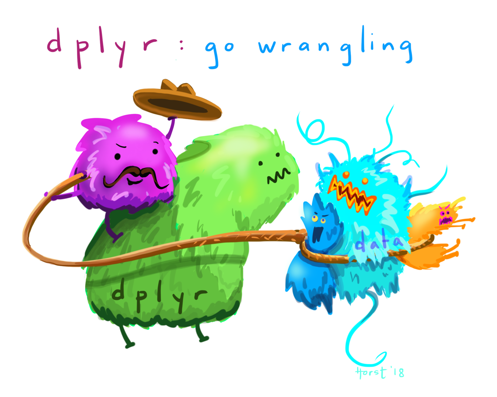
```

## select() - Variablen auswählen (spaltenweise)

```{r echo = F, fig.cap="Illustration von C.Wilke: https://wilkelab.org/SDS375/"}
knitr::include_graphics("images/037.png")
```

Um aus unserem Speicherkoog Datensatz nur die Variablen der Bodentemperatur auszugeben, geben wir folgenden Befehl ein:

```{r}
koog_raw %>%
  select(date, st10, st20, st30, st60, st100, st150) %>%
  head(n = 5)
```

Die Variablen werden dazu ohne `""` ausgeschrieben und durch `,` getrennt. Möchte ich aus dem Datensatz nur eine Variable entfernen so genügt ein es ein `-` vor den Namen der Variable zu setzen:
 
```{r}
koog_raw %>%
  select(-date) %>%
  head(n = 5)
```
 
 In dem `select()` Aufruf kann ich auch direkt Variablen umbenennen:
 
```{r}
koog_raw %>%
  select(-date, wärmste_messtiefe = st10) %>%
  head(n = 5)
```
 
Alle Messtiefen immer auszuschreiben benötigt Zeit und ist fehleranfällig. Es gibt bei `dplyr::select()` sogenannte *helper functions*. Diese lauten `starts_with()`, `ends_with()` und `contains()`. Da wir einen string aus unseren Variablennamen (die Namen der Spalten) auswählen muss dieser Befehl allerdings in `""` gesetzt werden. In Kurz lautet die Auswahl der Bodentemperatur also:

```{r}
koog_raw %>%
  select(contains("st")) %>%
  head(n = 5)
```

Wollen wir eine bestimmte Abfolge auswählen, bspw. die Meteorologischen Parameter die in den Spalten `wd` bis `sr` stehen, dann geht dies über den folgenden Befehl:

```{r}
koog_raw %>%
  select(wd:sr) %>% # ":" bedeutet soviel wie "von bis"
  head(n = 5)
```

## filter() - Filtern von Variablen (zeilenweise)

```{r echo = F, fig.cap="Illustration von @allison_horst: https://twitter.com/allison_horst"}
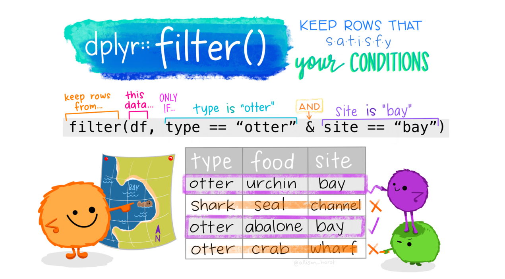
```

Mithilfe der logischen Operatoren können wir aus dem Datensatz E~H~ Werte filtern die > 400 mV sind, also oxidierend. 

```{r}
# Redoxverlauf in 10 cm Tiefe
koog_raw %>%
  ggplot(aes(date, eh10a)) +
  geom_line() +
  coord_cartesian(ylim = c(100, 800))
# Lasst uns nur Werte filtern und darstellen > 400 mV
koog_raw %>%
  filter(eh10a > 400) %>%
  ggplot(aes(date, eh10a)) +
  geom_line() +
  coord_cartesian(ylim = c(100, 800))
```

`filter` Anfragen können auch miteinander verknüpft werden durch `!` für `NICHT`, `&` für `UND`, `|` für `ODER`. Die Bedingungen lassen sich durch ein `,` voneinander trennen. 

```{r}
# Lasst uns nur Werte filtern und darstellen zwischen 350 und 450 mV & bis 2012
koog_raw %>%
  filter(eh10a > 350 & eh10a < 450 & date < as.POSIXct("2012-12-31 23:00:00")) %>%
  ggplot(aes(date, eh10a)) +
  geom_line() +
  coord_cartesian(ylim = c(100, 800))
```
💡 Da es sich bei unserer Spalte date um ein `POSIXct` Objekt handelt müssen wir in dem `filter()`Befehl dies auch explizit angeben.

## arrange() - Sortieren des Datensatzes

```{r echo = F, fig.cap="Illustration von C.Wilke: https://wilkelab.org/SDS375/"}
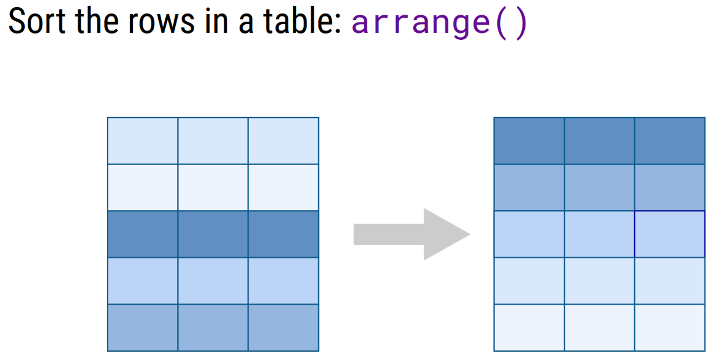
```

```{r}
# Sortiere in aufsteigender Reihenfolge
koog_raw %>%
  arrange(st10) %>%
  select(date, st10) %>%
  head(5)
# Sortiere in absteigender Reihenfolge
koog_raw %>%
  arrange(desc(st10)) %>%
  select(date, st10) %>%
  head(5)
```

Wenn man mehrere Argumente angibt, dann wird zuerst nach der ersten Variable sortiert, dann innerhalb der ersten Variable nach der zweiten, usw. ...

## mutate() - Erstelle neue Variablen

```{r echo = F, fig.cap="Illustration von @allison_horst: https://twitter.com/allison_horst"}
knitr::include_graphics("images/040.png")
```

Mit `mutate()` können neue Variablen dem Datensatz hinzugefügt werden. Wollen wir bspw. die gemessenen Redoxpotenziale gemessen mit der Silber-Silberchlorid Elektrode gegen die Standardwasserstoffelektrode korrigieren, dann müssen wir auf jede Variable in unserem Datensatz die den string "eh" enthält + 207 mV addieren. Es gibt eine kurze Version die dieses übernimmt:

```{r}
# Stelle die eh Werte in allen Tiefen dar
koog_raw %>%
  select(contains("eh")) %>%
  head(n = 5)

# Mit across() kann man eine Funktion auf die Variablen anwenden die in der Beschreibung
# das Kürzel "eh" tragen
koog <- koog_raw %>%
  dplyr::mutate(across(contains("eh"), ~. + 207)) 

# Stelle die korrigierten eh Werte da
koog %>%
  dplyr::select(contains("eh")) %>%
  head(n = 5)
```

Vielleicht ist es euch aufgefallen, dass wir unsere Datei `koog_raw` nun umbenannt haben zu `koog`. Dies hat folgenden Grund. **Rohdaten sollten Rohdaten bleiben**. Wenn wir die Daten komplexer umstrukturieren oder eben auch korrigieren (+207 mV) dann kann man immer wieder Bezug zu den Rohdaten nehmen. Ändern wir diese ist es nicht mehr möglich. Weiterer fun fact: Weisen wir mit der Funktion +207 mV nicht ein neues Objekt zu sondern überschreiben das bestehende, dann addieren wir immer wieder aufs neue 207 mV und der E~H~ steigt ins unendliche 🙃 

Wir können nicht nur Spalten hinzufügen durch Berechnungen, sondern auch indem wir aus bestehenden Vektoren Informationen extrahieren. Wenn wir im nächsten Kapitel Mittelwerte berechnen und Daten gruppieren wird dies besonders nützlich. Als Beispiel wollen wir aus dem date das Jahr, Monat, Tag, etc. in eine neue Spalte überführen und benennen diese neu:

```{r}
# Erstelle neue Spalten mit Zeitstempeln
koog <- koog %>%
  mutate(year = lubridate::year(date),
         month = lubridate::month(date),
         day = lubridate::day(date),
         hour = lubridate::hour(date), 
         daily = format(date, "%Y-%m-%d"),
         monthly = format(date, "%Y-%m"))

koog %>%
  select(date, year, month, day, hour, daily, monthly) %>%
  head(n = 5)
```

🚨 Die neue Spalten Jahr, Monat, etc, sind nach der Transformation keine `POSIXct` Objekt! 

Wir können in unserem Datensatz auch bestehende Variablen überschreiben, bspw. alle Werte der Bodentemperatur <= 6 °C. Dazu müssen wir nicht jede Spalte einzeln durchgehen sondern können den folgenden Befehl annwenden:

```{r}
koog_clean <- koog_day %>%
  filter(daily < as.Date("2010-04-05")) %>%
  select(daily, starts_with("st"))
head(koog_clean)

# Bereinige den Datensatz
koog_clean %>% 
  mutate_at(vars(contains("st")), ~ifelse(. <=6, NA, .))

```

Die `~` gibt an, welche Operation mit den Variablen zur Linken (alle die "st" im Namen tragen) durchgeführt werden soll. Die Funktion `ifelse()` ist ähnlich wie in Excel: *WENN* X = Y, *DANN*, *SONST* Z. Der `.` ist ein Platzhalter für die Variablen auf die das Kriterium "st" zutrifft. Mit diesem Befehl haben wir also alle Werte in 100 und 150 cm gelöscht. 

Einen Mittelwert aus mehrere Variablen pro Zeile zu generieren ist auch kein Problem:

```{r}
koog_day <- koog_day %>%
  rowwise() %>% # führe die folgende Berechnung Zeilenweise durch
  mutate(eh10_mean = mean(c(eh10a, eh10b, eh10c), na.rm = T),
         eh20_mean = mean(c(eh20a, eh20b, eh20c), na.rm = T),
         eh30_mean = mean(c(eh30a, eh30b, eh30c), na.rm = T),
         eh60_mean = mean(c(eh60a, eh60b, eh60c), na.rm = T),
         eh100_mean = mean(c(eh100a, eh100b, eh100c), na.rm = T),
         eh150_mean = mean(c(eh150a, eh150b, eh150c), na.rm = T)) 

koog_day %>%
  select(daily, contains("eh") & contains("mean")) %>%
  head(n = 5)
```

## summarize() - Zusammenfassung von Variablen

Mit `summarize()` können Daten zusammengefasst werden, indem wir eine Funktion auf eine beliebige Anzahl von Spalten anwenden. Schauen wir uns also den Verlauf der Bodentemperatur für den Speicherkoog in den unterschiedlichen Tiefen an:

```{r}
# Bodentemperatur für 2011
koog %>%
  filter(year == "2011") %>%
  pivot_longer(contains("st")) %>%
  mutate(name = fct_relevel(name, "st10","st20","st30","st60","st100","st150")) %>%
  ggplot(aes(date, value, color = name)) +
  geom_line() +
  scale_color_viridis_d()
```

Aus dem Verlauf der Daten können wir noch nicht viel ablesen. Eine zusammenfassende Statistik kann jedoch schnell und einfach unter Verwendung von `summarize()` erfolgen. 

```{r}
# Berechne den Mittelwert der Temperatur und speicher ihn in ein neues Objekt st_sum
st_sum <- koog %>%
  filter(year == "2011") %>%
  summarise(mean_10 = mean(st10, na.rm = T), # Nicht vergessen das Argument na.rm = T zu setzen!
            mean_20 = mean(st20, na.rm = T),
            mean_30 = mean(st30, na.rm = T),
            mean_60 = mean(st60, na.rm = T),
            mean_100 = mean(st100, na.rm = T),
            mean_150 = mean(st150, na.rm = T))
# Runde die Werte in st_sum auf die dritte Nachkommastelle
round(st_sum, 2)
```

Super. Mit diesen Werten können wir etwas anfangen und weiter arbeiten. Möchten man diese beschreibende Statistik für Variablen in einem dataframe mit einem bestimmten Merkmal durchführen gibt es auch shortcuts kürzere Befehle:

```{r}
# Mittelwert für die Spalten st10 und st20
koog %>%
  summarise_at(vars(st10, st20), mean, na.rm = T) 

# Mittelwert für die Spalten st10 bis st150
koog %>%
  summarise_at(vars(contains("st")), mean, na.rm = T)

# Mittelwert und SD für die Spalten st10 bis st150
# fn1 steht dabei für Funktion 1 = mean und fn2 für sd
koog %>%
  summarise_at(vars(contains("st")), list(mean, sd), na.rm = T) # Wir schreiben die Funktionen mean und sd in eine Liste 

# Umbenennen geht natürlich auch 
koog %>%
  summarise_at(vars(contains("st")), list(mean = mean, sd = sd), na.rm = T)
```

Erinnert ihr euch noch an unsere selbst geschriebene Funktion `descriptives`? Zusammen mit dem Verben aus dem tidyverse entstehen so unendlich viele Möglichkeiten mit mächtigen Werkzeugen der Datenanalyse:

```{r}
descriptives <- function(x, na.rm = TRUE) { # Default-Wert für 'na.rm' = TRUE
  descriptives_vector <- c(
    n = length(x),
    mean = mean(x, na.rm = na.rm), 
    sd = sd(x, na.rm = na.rm),     
    min = min(x, na.rm = na.rm),   
    max = max(x, na.rm = na.rm),
    median = median(x, na.rm = na.rm)
  )
  return(descriptives_vector)
}
# Wende unsere Funktion descriptives auf die Spalten Bodentemperatur an
koog %>%
  summarise_at(vars(st10), descriptives)
```

🤯 Mit diesem kurzen Befehl haben wir mit einem Streich `n`, `mean`, `sd`, `min`, `max`, und `median` berechnet für alle Tiefen! Stark. 

## group_by - Gruppiere Variablen 

```{r echo = F, fig.cap="Illustration von C.Wilke: https://wilkelab.org/SDS375/"}
knitr::include_graphics("images/041.png")
```

Mit der Funktion `group_by()` können wir unsere Daten nach einer oder mehrerer Variablen gruppieren. zusammen mit der Funktion `summarise()` entstehen so sehr elegante Möglichkeiten explorative Datenanalyse zu betreiben. Möchten wir bspw. wissen wie die Bodentemperaturen in den Jahren sind können wir erst nach der Variable `year` gruppieren gefolgt von `summarise`:

```{r}
# Gruppiere nach Jahr und berechne den Mittelwert für st10
koog %>%
  dplyr::group_by(year) %>%
  dplyr::summarise(mean_st10 = round(mean(st10, na.rm = T), 2)) # Die Funktion round() rundet die Zahlen
```

2010 war also das wärmste Jahr im Mittel aber Vorsicht...wir haben in dem Jahr auch erst im April angefangen zu messen. Wir können die Gruppierung auch noch spezieller gestalten, indem wir uns ausschließlich den April in jedem Jahr ansehen:

```{r}
koog %>%
  dplyr::filter(month == "4") %>% # Zuerst suchen wir uns nur die Zeilen aus dem April raus
  dplyr::group_by(year, month) %>% # Dann gruppieren wir nach Jahr und Monat
  dplyr::summarise(mean_st10 = round(mean(st10, na.rm = T), 2)) # Mittelwert berechnen
```

April 2014 war überdurchschnittlich warm im Vergleich zu den anderen Jahren ☀️

Mit der Kombination aus `group_by()` und `summarize()` können wir aus einem SEHR großen Datensatz von stündlichen Messungen (n = 94537) einen kompakteren Datensatz auf Tagesbasis, Monatsbasis, und Jahresbasis bilden:

```{r}
# Tagesmittelwerte
koog_day <- koog %>%
  group_by(daily) %>%
  summarise_if(is.numeric, mean, na.rm = T)

koog_day %>%
  select(daily, st10) %>%
  head(n = 5)

# Monatsmittelwerte
koog_month <- koog %>%
  group_by(monthly) %>%
  summarise_if(is.numeric, mean, na.rm = T)

koog_month %>%
  select(monthly, st10) %>%
  head(n = 5)

# Jahresmittelwerte
koog_year <- koog %>%
  group_by(year) %>%
  summarise_if(is.numeric, mean, na.rm = T)

koog_year %>%
  select(year, st10) %>%
  head(n = 5)

```


## across() - Anwenden von Funktionen auf Spalten

```{r echo = F, fig.cap="Illustration von @allison_horst: https://twitter.com/allison_horst"}
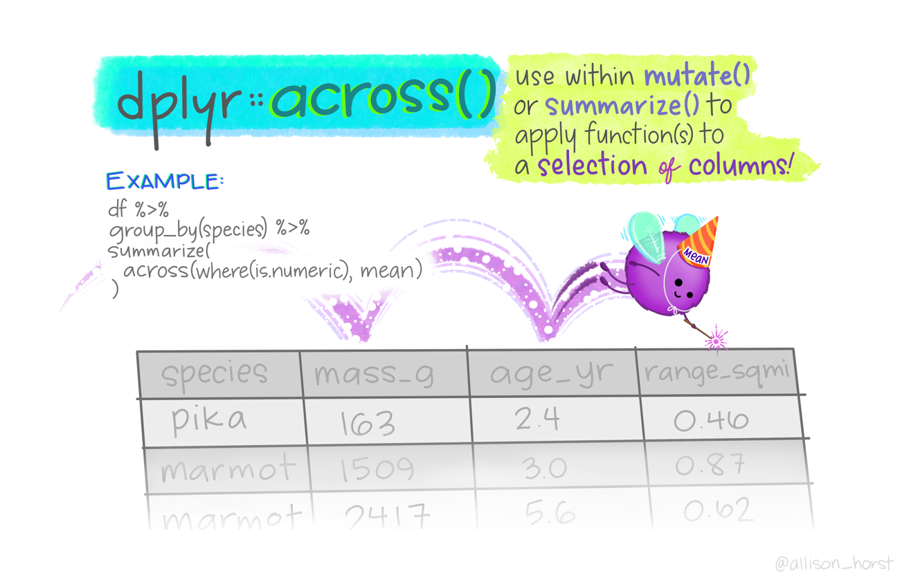
```

Schöner als die graphische Darstellung der Funktion `across` durch [Allison Horst](https://twitter.com/allison_horst?lang=de) kann man es nicht in Worte fassen. Ein Beispiel dieser um den Mittelwert aus allen Spalten des Speicherkoog zu bilden, die numerisch sind (also quasi auf alle):

```{r}
koog %>%
  dplyr::summarize(
    dplyr::across(where(is.numeric), mean, na.rm = T)
    )
```

## joins

Es kann vorkommen, dass bestehende Datensätze miteinander verknüpft werden müssen. Dies kann mit den Funktionen 

* left_join()
* right_join()
* inner_join()
* full_join()

umgesetzt werden. 

```{r echo = F, fig.cap="Illustration von C.Wilke: https://wilkelab.org/SDS375/"}
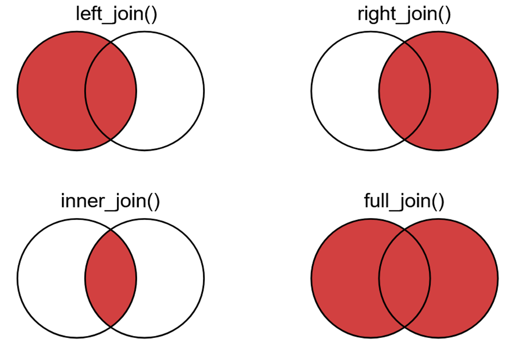
```

```{r}
# Bandmitglieder
band_members <- tibble(
  name = c("Mick", "John", "Paul"), 
  band = c("Stones", "Beatles", "Beatles")
)

# Instrumente von Bandmitgliedern
band_instruments <- tibble(
  name = c("John", "Paul", "Keith"), 
  plays = c("guitar", "bass", "guitar")
)

band_members

band_instruments

# Verknüpfe Table rechts mit links
left_join(band_members, band_instruments)

# Verknüpfe Table links mit rechts
right_join(band_members, band_instruments)

# Verknüpfe die Schnittmengen
inner_join(band_members, band_instruments)

# Verknüpfe alle Fälle
full_join(band_members, band_instruments)

```

Es gibt auch eine Möglichkeit viele data.frames in R in Form einer Liste zu verknüpfen. Dazu wird das package `plyr::` benötigt und die FUnktion `join_all()` 

```{r eval = F}
# x,y,z sind die Dateinamen die verknüpft werden sollen
# by = ist die Spalte die verknüpft werden soll
# type = left bedeutet, dass alle neuen Spalten an data..frame x angepasst werden
plyr::join_all(list(x,y,z), by='Flag', type='left') 
```


## pivot_longer() - Long data format

```{r echo = F, fig.cap="Illustration von C.Wilke: https://wilkelab.org/SDS375/"}
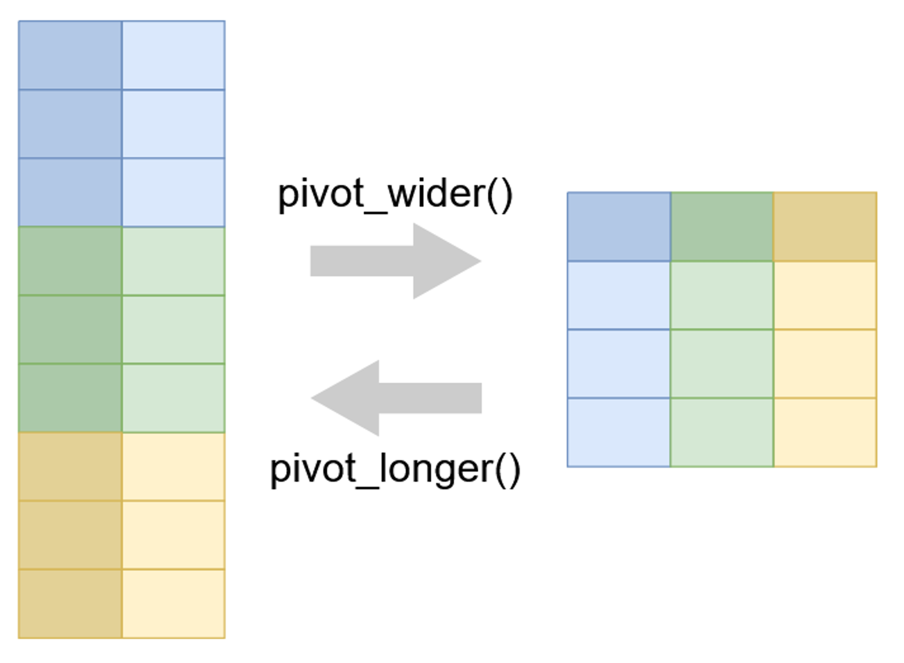
```

Aktuell steht derselbe Wertetyp, nämlich die Bodentemperatur, nebeneinander. Man bezeichnet dies als  *wide format*. 

```{r}
koog %>%
  select(date, contains("st")) %>%
  head(n = 10)
```

Um Daten graphisch darzustellen und zu analysieren ist einer der häufigsten Schritte sie in eine bestimmte Art und Weise umzustrukturieren. Ein häufiger Schritt ist dabei das aneinanderknüpfen/verketten/vektorisieren (you name it) von Variablen. Dies kann mit dem Befehl `pivot_longer()` erfolgen. 

```{r}
koog %>%
  select(date, contains("st")) %>%
  pivot_longer(cols = contains("st"), names_to = "depth", values_to = "value", names_prefix = "st") %>%
  head(n = 10)
```

Welche Spalten man für `pivot_longer()` nutzen möchte muss nicht explizit geschrieben werden, sondern kann durch die helper functions contains(), starts_with(), ends_with() einfacher gestaltet werden. Ein paar Worte zu den Argumenten:

* `cols` definiert die Variablen, die verlängert werden sollen. Das Argument kann durch die select() helper Funktionen contains(), starts_with(), ends_with() erweitert werden. 
* `names_to` definiert den neuen Spaltennamen basierend auf den alten Bezeichnungen. Bezeichnet man diesen Wert nicht explizit ist der `default` Name *name*
* `values_to` analog zu `names_to`
* `names_prefix` ermöglicht es die Spaltennamen von bestimmten Buchstaben zu befreien. So wird durch unseren Befehl oben aus "st10" nun "10". 

Wir haben es also fast geschafft. Unsere Spalte `depth` ist allerdings vom Typ `character` und es wäre praktischer diesen in einem numerischen Format zu haben. Dies geht durch das zusätzliche Argument `names_transform`, wo in Form eine Liste angegeben werden kann wie der Objekttyp definiert werden soll. 

```{r}
koog %>%
  select(date, contains("st")) %>%
  pivot_longer(cols = contains("st"), names_to = "depth", values_to = "value", names_prefix = "st", names_transform = list(depth = as.integer)) %>%
  head(n = 10)
```

## pivot_wider() - wider data format

Die Syntax ist ähnlich wie bei `pivot_longer` aufgebaut, mit den Argumenten 

* data
* id_cols
* names_from
* names_prefix
* names_sep
* ...

```{r}
# Daten in einem long format
mtcars %>%
  rownames_to_column("name") %>%
  head(n = 5)
# Daten in einem wide format
mtcars %>%
  rownames_to_column("name") %>%
  select(name, mpg) %>%
  pivot_wider(names_from = name, values_from = mpg)
```

<!--chapter:end:05-Daten-Manipulieren.Rmd-->

# Explorative-Datenanalyse

*Der Beitrag wurde das letzte mal am `r format(Sys.time(), '%d %B, %Y')` editiert*

```{r include=FALSE}

knitr::opts_chunk$set(fig.align = "center", collapse = T, echo = TRUE, message = FALSE, warning = FALSE)

# With collapse = TRUE the Source and output lived together happily ever in knitr.
# https://github.com/yihui/knitr-examples/blob/master/039-merge.md

# loading multiple packages at once with `pacman`
# create a vector name
packages <- c("tidyverse", "markdown", "knitr", "matrixStats", "patchwork", "lubridate", "plotly",  "naniar", "stlplus", "gt", "dygraphs", "htmltools", "zoo", "xts", "ggpmisc", "forcats", "RColorBrewer", "Kendall", "rstudioapi", "multcompView", "plyr", "bookdown", "janitor", "rstatix", "ggpubr", "moments")
 
# Load the packages vector 
pacman::p_load(packages, character.only = T)

my_theme <- theme(
  panel.background = element_rect(fill = "white", color = "black"),
  panel.grid.major = element_blank(), 
  panel.grid.minor = element_blank(), 
  panel.border = element_blank())

```

```{r echo = F}
# Daten Speicherkoog einlesen
koog_raw <- readr::read_delim("data/data.csv", delim = ";", 
                          col_types = readr::cols(
                            # date = überschreibt die Spalte mit der neuen Spezifikation
                            date = readr::col_datetime(format = "%d.%m.%Y %H:%M") 
  ))
koog_raw <- janitor::clean_names(koog_raw)
koog <- koog_raw %>%
  dplyr::mutate(across(contains("eh"), ~. + 207))
# Erstelle neue Spalten mit Zeitstempeln
koog <- koog %>%
  mutate(year = lubridate::year(date),
         month = lubridate::month(date),
         day = lubridate::day(date),
         hour = lubridate::hour(date), 
         daily = format(date, "%Y-%m-%d"),
         monthly = format(date, "%Y-%m"))

# Tagesmittelwerte
koog_day <- koog %>%
  group_by(daily) %>%
  summarise_if(is.numeric, mean, na.rm = T)

# Monatsmittelwerte
koog_month <- koog %>%
  group_by(monthly) %>%
  summarise_if(is.numeric, mean, na.rm = T)

# Jahresmittelwerte
koog_year <- koog %>%
  group_by(year) %>%
  summarise_if(is.numeric, mean, na.rm = T)

```

Bevor wir uns an das vermeintlich schönste Thema reinstürzen - der Datenvisualisierung - gehen wir in diesem Kapitel auf die explorative Datenanalyse (EDA) ein. 

🔍 Besser als in [r4ds](https://r4ds.had.co.nz/exploratory-data-analysis.html) lässt es sich eigentlich nicht zusammenfassen

EDA ist kein strikt vorwärtsgerichteter Prozess mit bestimmten Regeln. Vielmehr geht es darum mit dem Datensatz zu spielen, Ideen zu erkunden, diese für gut oder schlecht zu befinden, um die vielversprechendsten Ansätze dem Publikum näher zu bringen. Was man hierbei nicht vergessen darf ist auch die Überprüfung der *Datenqualität*, bspw. ob die Daten mit derselben Methoden erhoben wurden, bezieht man sich auf dieselben Einheiten und gibt es Fehlwerte (`NA`s), die eine Analyse des Datensatzes in ein zweifelhaftes Licht rücken. 

> “There are no routine statistical questions, only questionable statistical routines.” — Sir David Cox

> “Far better an approximate answer to the right question, which is often vague, than an exact answer to the wrong question, which can always be made precise.” — John Tukey

Zentrales Ziel der EDA ist es, ein Verständnis für die Daten zu erlangen auf einem möglichst kreativen Weg. 

## Fehlende Werte

Elektroden und Gerätschaften im Gelände sind wie Menschen - sie wollen gut gepflegt werden aber auch bei bester Pflege machen sie nicht immer das was sie tun sollen. Starten wir also damit zu erkunden, wieviele Fehlwerte wir in unserem Speicherkoog Datensatz haben. Der erste Weg wäre zu erkunden, ob überhaupt `NA`s in unserem Datensatz auftreten:

```{r}
# Tritt ein NA in unserem Vektor auf
any_na(koog$st10)
```

Es befinden sich also Fehlwerte in st10. 

```{r}
# Mit are_na bekommen wir einen Vektor mit TRUE und FALSE über NA Werte angezeigt
are_na(koog$st10) %>%
  head(n = 10)
```

Wir können uns auch eine Prozentzahl angeben lassen, indem wir die Anzahl der NA Werte in unserem Vektor durch die Länge des Vektors teilen:

```{r}
n_miss(koog$st10) / nrow(koog) * 100
```
Es fehlen also 2.5% Der Daten. Das ist erstmal nicht viel. Mithilfe des `vis_dat` packages kann man schnell und leicht überprüfen wie die zeitliche Verteilung der Werte ist. Es spielt schließlich schon eine Rolle, ob ich jeden Tag einen systematischen Fehlwert habe oder die Fehlwerte en block während einer bestimmten Periode auftreten. 

```{r}
koog %>%
  select(st10) %>%
  visdat::vis_miss()
```

Wir sehen also, dass 2,5% des Datensatzes keine Werte enthalten und für nur kurze Perioden auftreten. Für die elektrische Leitfähigkeit `ec` ist dies leider nicht der Fall. Speziell zu Beginn der Untersuchung gab es immer wieder Ausfälle. Diese Werte sind also im Allgemeinen mit Vorsicht zu bewerten. 

```{r}
koog %>%
  select(ec) %>%
  visdat::vis_miss()
```

Tabellarisch kann man sich die Daten natürlich auch angeben lassen:

```{r}
koog %>%
  select(!contains("oxy")) %>%
  miss_var_summary(order = T) %>%
  head(n = 5)
```

<!--chapter:end:06-Explorative-Datenanalyse.Rmd-->

# Datenvisualisierung

*Der Beitrag wurde das letzte mal am `r format(Sys.time(), '%d %B, %Y')` editiert*

```{r include=FALSE}

knitr::opts_chunk$set(fig.align = "center", collapse = T, echo = TRUE, message = FALSE, warning = FALSE)

# With collapse = TRUE the Source and output lived together happily ever in knitr.
# https://github.com/yihui/knitr-examples/blob/master/039-merge.md

# loading multiple packages at once with `pacman`
# create a vector name
packages <- c("tidyverse", "markdown", "knitr", "matrixStats", "patchwork", "lubridate", "plotly",  "naniar", "stlplus", "gt", "dygraphs", "htmltools", "zoo", "xts", "ggpmisc", "forcats", "RColorBrewer", "Kendall", "rstudioapi", "multcompView", "plyr", "bookdown", "janitor", "rstatix", "ggpubr", "moments", "tweetrmd", "ggthemes", "hexbin", "ggridges", "ggstream", "openair", "treemapify", "MBA", "akima", "PlotSvalbard")
 
# Load the packages vector 
pacman::p_load(packages, character.only = T)


my_theme <- theme(
  panel.background = element_rect(fill = "white", color = "black"),
  panel.grid.major = element_blank(), 
  panel.grid.minor = element_blank(), 
  panel.border = element_blank())

```

```{r echo = F}
# Daten Speicherkoog einlesen
koog_raw <- readr::read_delim("data/data.csv", delim = ";", 
                          col_types = readr::cols(
                            # date = überschreibt die Spalte mit der neuen Spezifikation
                            date = readr::col_datetime(format = "%d.%m.%Y %H:%M") 
  ))
koog_raw <- janitor::clean_names(koog_raw)
koog <- koog_raw %>%
  dplyr::mutate(across(contains("eh"), ~. + 207))
# Erstelle neue Spalten mit Zeitstempeln
koog <- koog %>%
  mutate(year = lubridate::year(date),
         month = lubridate::month(date),
         day = lubridate::day(date),
         hour = lubridate::hour(date), 
         daily = format(date, "%Y-%m-%d"),
         monthly = format(date, "%Y-%m"))

# Tagesmittelwerte
koog_day <- koog %>%
  group_by(daily) %>%
  summarise_if(is.numeric, mean, na.rm = T) %>%
  mutate(daily = as.Date(daily))

# Monatsmittelwerte
koog_month <- koog %>%
  group_by(monthly) %>%
  summarise_if(is.numeric, mean, na.rm = T)

# Jahresmittelwerte
koog_year <- koog %>%
  group_by(year) %>%
  summarise_if(is.numeric, mean, na.rm = T)

```

🚨 Das folgende Kapitel mit Vorsicht genießen! Wenn ich meine Sache gut mache, dann ergibt sich ein großes Suchtpotenzial!

```{r echo = F, fig.cap="Source from: https://xkcd.com/523/", out.width="100%"}
knitr::include_graphics("images/050.png")
```

🔍 Wie immer ist jedem die Literatur von Hadly Wickham ans Herz gelegt [ggplot2: Elegant Graphics for Data Analysis](https://ggplot2-book.org/introduction.html)

Über die Möglichkeiten eine Basis-Abbildung aufzupimpen ist dieser [Blogbeitrag](https://www.cedricscherer.com/2019/05/17/the-evolution-of-a-ggplot-ep.-1/) und dieser [Blogbeitrag](https://www.cedricscherer.com/2019/08/05/a-ggplot2-tutorial-for-beautiful-plotting-in-r/#colors) ans Herz gelegt. 

```{r echo = F, fig.cap="Source from: https://www.cedricscherer.com/", out.width="100%"}
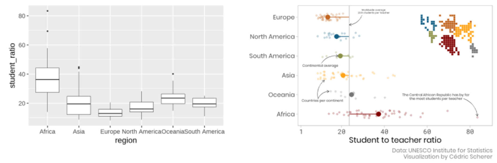
```

## ggplot2 - grammar of graphics

ggplot2 basiert auf der **g**rammar of **g**raphics und ist ein statistisches Paket um Daten zu visualisieren. Es bietet extrem viele Möglichkeiten, Daten auf verschiedenste Weise darzustellen und auch zu transformieren, ohne etwas an den Rohdaten zu verändern. Der Workflow bei ggplot2 folgt dabei einer Logik und Reihenfolge die es einem erlaubt, in einem iterativen Ansatz identische Abbildungen für ähnliche Probleme zu gestalten. 

Die Grammatik hinter `ggplot` zu verstehen ist dabei hilfreich um noch effektiver, schneller und anschaulicher Abbildungen zu erstellen. Das Prinzip sind **Layer**, also verschiedene Ebenen, die eine Abbildung aufbauen. 

```{r echo = F, fig.cap="Source from: http://bloggotype.blogspot.com/", out.width="100%"}
knitr::include_graphics("images/051.png")
```

Alle Abbildungen bestehen aus **data** mit den Informationen, welche dargestellt werden und **mapping**, eine Beschreibung wie die Daten durch Aesthetics dargestellt werden. Es gibt fünf Komponenten für das mapping von Daten:

* **Layer** beinalten geometrische Elemente (**geom**s), bspw. `point`, `line`, `bar`, `boxplot`, ... und statistische Transformationen (**stat**s). 
* **Scales** beschreiben Werte im Datenraum und setzen sie zu den Aesthetics in Bezug. Dazu gehören die Verwendung von Farbe, Form, Größe. Scales beeinflussen ebenfalls die Legende und Achsen. 
* **Coord** beinhaltet das Koordinatensystem, bspw. ob Hilfslinien gezogen werden sollen oder ob neben dem klassischen Kartesischen Koordinatensystem Polar oder andere Kartenprojektionen verwendet werden. 
* **Facet** beschreibt wie Gruppen anhand der Daten verteilt und differenziert dargestellt werden sollen. 
* **Theme** modifiziert die Abbildungen um Textgröße, Position, Farbhintergrund und vieles vieles mehr.

### Schlüsselkomponenten

Jeder ggplot2 Aufruf benötigt drei Komponenten. 

1. **data**
2. **aesthetics** die beschreiben, wie die Daten im Koordinatenraum platziert werden. 
3. **geoms** zur Darstellung der Daten. 

Der Datensatz sollte und liegt in den meisten Fällen tabular vor, also mit Zeilen (= observations) und Spalten (=variables), wobei jede Zelle einen eigenen Wert codiert (= value). Das Datenobjekt in R nennt sich `data.frame` oder neuerdings auch als eine etwas besser verknüpfte Variante im tidyverse `tibble`. 

Hier ein simples Beispiel unter Verwendung des Speicherkoog Datensatzes:

```{r}
# Verwende den Speicherkoogdatensatz auf Tagesbasis
ggplot(data = koog_day)
```

Komisch? Wieso ist die Abbildung denn leer? 🤯 Ach ja, wir müssen bei den Aestehtics noch festlegen, welche Variablen auf welche Achse geplottet werden sollen. Dazu setzen wir das Argument `aes()` was x = und was y = sein soll. Nehmen wir mal Das Datum auf Tagesbasis und die Bodentemperatur in 10 cm:

```{r}
ggplot(data = koog_day, aes(x = daily, y = st10))
```

Häää? Immer noch leer. 

ggplot fehlt der **geom** Layer um zu wissen, wie die Daten in das Koordinatensstem übertragen werden sollen:


```{r}
ggplot(data = koog_day, aes(x = daily, y = st10)) +
  geom_point()
```

🎉 Herzlichen Glückwunsch zu deiner ersten ggplot Abbildung! Wir können diesen Abschnitt auch als eigenes Objekt speichern `ggplot(data = koog_day, aes(x = daily, y = st10))` und fortlaufend editieren. 

```{r}
p <- ggplot(data = koog_day, aes(x = daily, y = st10))
# Erstelle ein Liniendiagram
p + geom_line()
# Boxplotdiagram
p + geom_boxplot()
# Säulendiagram
p + geom_col()
# Flächendiagram
p + geom_area()
```

... und viele weitere. Man kann dabei auch mehrere geoms in einem Plot erstellen:

```{r}
p + geom_line() + geom_boxplot(aes(group = year))
```

O, viel kann man jetzt nicht erkennen. Der Layer mit dem Boxplot liegt über unserem Liniendiagramm. Was passiert wenn wir die Abfolge der Layer ändern?

```{r}
p + geom_boxplot(aes(group = year)) + geom_line()
```

Wir können das farblich noch etwas besser darstellen:

```{r}
ggplot(data = koog_day, aes(x = daily, y = st10, group = year)) +
  geom_boxplot(fill = "grey") +
  geom_line() +
    geom_point(data = koog_year, mapping = aes(as.Date(paste(year, 06, 15, sep = "-")), st10), shape = 21, fill = "white", size = 6) +
  theme_bw()
```

🚨 Alles was von den Daten visualisiert werden soll MUSS in den aes() Aufruf geschrieben werden.  

🚨 Die Reihenfolge der Layer ist entscheident, wie der Plot später aussieht. 

Das Jahr 2013 war also relativ kalt und das Jahr 2014 das wärmste in der Zeitreihe. 

Wollen wir bspw. die Bodentemperatur >= 10 °C in einer anderen Farbe darstellen, dann muss dies in den aes() Aufruf hinterlegt werden, da wir diese Informationen von den Daten extrahieren:

```{r}
# Das funktioniert nicht
ggplot(data = koog_day, aes(x = daily, y = st10), color = st10 > 10) +
  geom_point()
# Das funktioniert
ggplot(data = koog_day, aes(x = daily, y = st10, color = st10 > 10)) +
  geom_point()
```

Ähnlich verhält es sich bei der farblichen Darstellung einer Variable. Möchte ich der Bodentemperatur den fixen Wert einer Farbe blau zuordnen, dann MUSS dies außerhalb des aes() Aufrufes erfolgen:

```{r}
# Das funktinoert nicht
ggplot(data = koog_day, aes(x = daily, y = st10)) +
  geom_point(aes(color = "blue"))
# Das funktioniert
ggplot(data = koog_day, aes(x = daily, y = st10)) +
  geom_point(colour = "blue")
```

### Aesthetics (color, size, shape)

Um zusätzliche Informationen einem plot hinzuzufügen, kann man im `aes()` Argument folgende Befehle setzen:

```{r}
# Farbe
ggplot(koog_day, aes(daily, st10, color = st10)) +
  geom_point()
# Größe
koog_day %>%
  filter(daily < "2010-06-30") %>%
  ggplot(aes(daily, st10, size = st10)) +
  geom_point()

```

Die Form (**shape**) kann man auch beeinflussen, allerdings nicht mit einer kontinuierlichen Variable wie Bodentemperatur. Daher schauen wir uns den `mtcars` Datensatz an:

```{r}
# Stelle Allrad, Front- und Heckantriebler in unterschiedlichen Formen dar
ggplot(mpg, aes(displ, hwy, shape = drv)) + 
  geom_point()
```

### Smoothers and models

Manchmal ist ein Trend aus den Daten nicht unbedingt gut zu erkennen. Nehmen wir das Beispiel Grundwasserstand und E~H~ in 60 cm Tiefe:

```{r}
koog_day  %>%
  ggplot(aes(wt, eh100a)) +
  geom_point()
```

Die Funktion `geom_smooth()` plottet als default eine Loess Kurve, welches eine lokale Regression der Daten ist:

```{r}
koog_day  %>%
  ggplot(aes(wt, eh60a)) +
  geom_point(alpha = 0.1) + # Durch den Alpha Wert können wir den Punkten Transparenz geben
  geom_smooth(size = 2)
```

So lässt sich besser erkennen und filtern, dass bei 75 cm im Mittel das E~H~ beginnt abzusinken. Wollen wir anstelle der Loess Kurve eine lineare Regression verwenden müssen wir das als Argument definieren:

```{r}
koog_day  %>%
  ggplot(aes(wt, eh60a)) +
  geom_point(alpha = 0.1) + # Durch den Alpha Wert können wir den Punkten Transparenz geben
  geom_smooth(size = 2, method = "lm") # lm = linear model
```

E~H~ und Grundwasserstand sind also negativ korreliert. 

### Labels

```{r echo = F, fig.cap="Source from: https://xkcd.com/833/", out.width="100%"}
knitr::include_graphics("images/052.png")
```

Bisher haben wir gesehen, dass ggplot als `default` die Achsenbezeichnung (Spaltenname) in den aesthetics benutzt, um die Achsen zu beschriften. 

```{r}
koog_day  %>%
  ggplot(aes(wt, eh60a)) +
  geom_point(alpha = 0.1) + # Durch den Alpha Wert können wir den Punkten Transparenz geben
  geom_smooth(size = 2, method = "lm") # lm = linear model
```

`wt` kann jedoch alles bedeuten und welche Einheit dahintersteckt erschließt sich auch nicht. Eine gute Achsenbeschriftung ist extrem wichtig und kann wie folgt umgesetzt werden:

```{r}
p <- koog_day  %>%
  ggplot(aes(wt, eh60a)) +
  geom_point(alpha = 0.1) + # Durch den Alpha Wert können wir den Punkten Transparenz geben
  geom_smooth(size = 2, method = "lm") +# lm = linear model
  labs(
    title = "Eine klasse Abbildung",
    x = "Grundwasserflurabstand (cm u. GOK)", 
    y = expression(paste(E[H], " (mV)"))
  )
```

Mit der Funktion `expression()` können wir Sonderzeichen setzen aber auch Zahlen hoch oder tiefstellen. Durch das Setzen der Zahl in eine eckige Klammer `[]` tiefstellen und durch `^` hochstellen. Wollen wir diese Sonderzeichen mit normalem Text verknüpfen, dann behelfen wir uns mit der Funktion `paste()`. Die Einzelnen Bauteile des Satzes werden durch `,` getrennt. 

🔍 [http://rchaeology.blogspot.com](http://rchaeology.blogspot.com/2012/11/combining-superscripts-subscripts-and.html)

### Themes

`ggplot2` hat bereits eine Vielzahl integrierter themes. Ein theme beeinflusst das Erscheinungsbild der Abbildung.

```{r}
# schwarz/weiß
p + theme_bw()
# klassisch
p + theme_classic()
# Cleveland
p + theme_cleveland()
# Komplett ohne Achsen etc. 
p + theme_void()
# Für die Excel Nostalgie
p + theme_excel()
```

Und noch eine weitere Vielzahl. Wir sind auf diese themese aber nicht begrenzt, sondern können alles editieren. Wollen wir die Farbe des Textes in rot ändern, müssen wir folgendes tun:

```{r}
p + theme(text = element_text(color = "red"))
```

Auf diese Art können wir alle Bestandteile einer Abbildung verändern:

```{r}
# Plotfarbe
p + theme(panel.background = element_rect(fill = "lightblue",
                                colour = "lightblue",
                                size = 0.5, linetype = "solid"))

# Hintergrundfarbe 
p + theme(plot.background = element_rect(fill = "lightblue",
                                colour = "lightblue",
                                size = 0.5, linetype = "solid"))
```

Zu Beginn einer R Session oder eines Skriptes kann man sich auch ein modifiziertes theme speichern und auf diese einfach zurückgreifen:

```{r}
# Setze das theme
kristofs_theme_des_jahres <- theme(
  panel.background = element_rect(fill = "yellow", color = "red"),
  panel.grid.major = element_blank(), 
  panel.grid.minor = element_blank(), 
  panel.border = element_blank())
# Wende es auf unseren Plot an
p + kristofs_theme_des_jahres
```

### Facets

Facets sind *multi-panel-plots* und lassen sich am besten auf diskrete Variablen übertragen. 

💡 Facets sind großartig um plots überschaulicher zu gestalten. 

```{r}
# Plotte Farbe zu den Daten
mtcars %>%
  ggplot(aes(hp, mpg, color = cyl)) +
  geom_point()
# Erstelle facets nach der Variable cyl (Zylinder)
mtcars %>%
  ggplot(aes(hp, mpg, color = cyl)) +
  geom_point() +
  facet_wrap(~cyl)
```

So ist es direkt ersichtlich, je mehr Zylinder desto mehr PS und desto höher ist der Verbrauch. Mit einem 8-Zylinder muss man beim Tanken schon etwas tiefer in die Tasche greifen. Die Variable nach der das facetting stattfindet wird mit der Tile `~` verknüpft. `facet_grid` ist am besten für viele Variablen in Form einer Matrix (m x n) und `facet_wrap` für eine Variable wobei die Anzahl der Spalten (`ncol`) und Zeilen (`nrow`) definiert werden kann. Auch ob die Skala an die Zahlen des facets angepasst werden sollen. 

```{r}
# Erstelle facets nach der Variable cyl (Zylinder)
mtcars %>%
  ggplot(aes(hp, mpg, color = cyl)) +
  geom_point() +
  facet_wrap(~cyl, nrow = 3, scales = "free_y") # Arrangiere die Plots untereinander und Autoskalierung
```

💡 Um die Variablennamen nach denen das facetting stattfindet nicht in den Rohdaten durchzuführen, gibt es das Argument `labbeler =`. Das ist praktisch um die Plot zu annotieren:

```{r}
# Erstelle einen Vektor (col_name) mit den Namen, die geändert werden sollen
col_name <- c("4" = "gut", "6" = "besser", "8" = "am besten")

# Erstelle facets nach der Variable cyl (Zylinder)
mtcars %>%
  ggplot(aes(hp, mpg, color = cyl)) +
  geom_point() +
  facet_wrap(~cyl, nrow = 3, scales = "free_y", labeller = as_labeller(col_name)) 
# Füge den col_name vector dem labeller Argument hinzu
```


### Coordinate system

Fast ausschließlich arbeitet man mit dem klassichen kartesischen Koordinatensystem. Ein Trick die Achsen zu vertauschen geht mit `coord_flip()`:

```{r}
# Normal
mtcars %>%
  ggplot(aes(mpg, hp)) +
  geom_point()
# Achsen tauschen
mtcars %>%
  ggplot(aes(mpg, hp)) +
  geom_point() +
  coord_flip()
```

Man kann auch in einen Teil des plots "zoomen", wobei mit `coord_cartesian()` keine Neuberechnung stattfindet gegenüber scale limits oder xlim:

```{r}
p <- ggplot(mpg, aes(displ, cty)) + geom_point() + geom_smooth()
p + geom_vline(xintercept = 4, linetype = 2) + geom_vline(xintercept = 6, linetype = 2)
p + xlim(c(4, 6)) + ggtitle("xlim")
p + scale_x_continuous(limits = c(4, 6)) + ggtitle("scale limits")
p + coord_cartesian(xlim = c(4, 6)) + ggtitle("coord_cartesian")
```

### Annotations

Die Funktion `annotate()` ist hilfreich, um Dinge hervorzuheben und dem Leser einen schnelleren Zugang zu der Hauptaussage einer Abbildung zu geben:

```{r}
ggplot(mpg, aes(displ, hwy)) +
  geom_point(data = subset(mpg, manufacturer == "subaru"), 
             colour = "orange",
             size = 3) +
  geom_point() + 
  annotate(geom = "curve", 
           x = 4, y = 35, xend = 2.65, yend = 27, 
           curvature = 0.3, arrow = arrow(length = unit(2, "mm"))) +
  annotate(geom = "text", x = 4.1, y = 35, label = "subaru", hjust = "left")
```

Farben über facets zu colorieren mit den Daten in grau als Hintergrund ist ebenfalls möglich:

```{r}
ggplot(mpg, aes(displ, hwy)) +
  geom_point(data = mpg[c("displ", "hwy")], color = "grey") +
  geom_point(aes(colour = factor(cyl))) +
  facet_wrap(~cyl)
```

## Verknüfpen von tidyverse und ggplot

`ggplot2::` ist ein package aus dem tidyverse und die ähnliche Syntax erlaubt es, Befehle der Datenmanipulation direkt mit der graphischen Darstellung in ggplot umzusetzen. Um die Befehle in einem ggplot Aufruf zu verknüpfen wird das `+` verwendet, welches anders ist als im restlichen tidyverse wo der pipe Operator verwendet wird (`%>%`). Wollen wir also unseren Datensatz der Bodentemperatur nur auf das Jahr 2011 begrenzen, geht dies folgendermaßen:

```{r}
# Filter für das Jahr 2011
koog_day %>%
  filter(daily > "2011-01-01" & daily < "2011-12-31") %>%
  ggplot(aes(daily, st10)) +
  geom_line()
```

Für manche Abbildung macht es Sinn die Datenbereinigung im Vorfeld durchzuführen und dies als eigenes Objekt zu speichern (bspw. `koog_day_2011` für das Jahr 2011; speziell wenn man auf diesen Datensatz häufiger zurückgreift) oder man verknüpft es immer wieder aufs Neue mit dem `%>%`. 

## Arbeiten mit Zeiten

Man hätte dieses Kapitel auch bei dem Kapitel Daten manipulieren bringen können. Habe ich aber nicht. Warum? Zeiten sind nicht nur wichtig um Daten zu gruppieren und Statistik damit zu betreiben, sondern auch die Darstellung bei einer Abbildung muss adäquat dargestellt werden. Das wichtigste package um mit Zeiten zu arbeiten lautet `lubridate::`. Schauen wir uns ein subset vom Speicherkoog an:

```{r}
time <- readr::read_delim("data/data.csv", delim = ";")
time <- time %>%
  select(date, ST10) %>%
  clean_names()

head(time, 5)
class(time$date)
```

Wir sehen, dass der Zeitstempel in unserem Objekt `time` `character` ist. In R ist dies kein gültiges Zeitformat, obwohl Zeitstempel in Rohdaten fast immer als `string` angegeben werden. Die drei grundlegenden Objekttypen für Zeiten in R lauten:

* `date` = Angabe als "<date>" in einem tibble. 
* `time` = Angabe als "<time>" in einem tibble.
* `date-time` = Angabe als "<dttm>" in einem tibble. Auch `POSIXct` genannt. 

💡 Verwende immer den einfachsten Zeittyp, der deine Voraussetzungen erfüllt. 

Es gibt drei Möglichkeiten, wo die Umwandlung zu einen `date` Objekt eine Rolle spielt. (i) Umwandlung von einem string, (ii) von individuellen Komponenten und (iii) von einem bestehenden date/time Objekt:

### strings

Im deutschen wäre eine Zeitangabe `01.04.2010` aber die internationale und in R codierte Art dieses wiederzugeben lautet `2010-04-01`. Die einfachste Art dies wiederzugeben lautet:

```{r}
time_char <- "01.04.2010"
class(time_char)

time_date <- lubridate::as_date(time_char, format = "%d.%m.%Y")
class(time_date)
```

Bei dem Argument `format = ...` haben wir angegeben, wie das Datum hinterlegt ist und nun haben wir erfolgreich ein `date` Objekt erstellt.

```{r}
time_char <- "01.04.2010 01:00:00"
class(time_char)

time_date <- lubridate::as_datetime(time_char, format = "%d.%m.%Y %H:%M:%S")
class(time_date)
```

Falls wir zursätzliche Zeitangaben zum Datum haben lautet die Funktion `as_datetime`. 

Die Liste wie Datumsangaben codiert sein können findet sich unter:

```{r eval = F}
?strptime
```

Ein shortcut in lubridate geht über das Arrangement von "y", "m", "d", um automatisch ein Datum zu erstellen. Die Position von y, m, d in Kombination mit einem Zeitstempel h, m, s, lässt sich flexibel verschieben:

```{r}
dmy_hms("01.04.2010 01:00:00")
#> [1] "2017-01-31"
mdy("January 31st, 2017")
#> [1] "2017-01-31"
dmy_h("31-Jan-2017 01")
#> [1] "2017-01-31"
```

Die Angabe einer Zeitzone ist auch möglich:

```{r}
ymd(20170131, tz = "UTC")
#> [1] "2017-01-31 UTC"
```

Falls in unseren Daten nur eine Jahreszahl als `character` angegeben wird, gibt es einen Trick ein dennoch gültiges Datum daraus zu formen. Mit dem Argument `truncated` lässt sich dennoch ein vollständiges Datum erstellen:

```{r}
yrs <- c(2001, 2002, 2002, 2002, 2003, 2005)
lubridate::ymd(yrs, truncated = 2L)
```

### Von individuellen Komponenten

Manachmal sind die Zeitangaben auch auf verschiedene Spalten verteilt. Eine Möglichkeit ist `make_date()` für Datum oder `make_datetime()` für zusätzliche Zeitangabe:

```{r}
time_char <- tibble(
  year = 2010,
  month = 4,
  day = 1, 
  hour = 1,
  minute = 0
)
time_char
# Erstelle ein Datum aus den einzelnen Spalten
time_char <- time_char %>%
  mutate(datetime = make_datetime(year,month,day,hour,minute))
time_char
```

### Ein bestehendes Objekt

Das ganze lässt sich natürlich auch Rückwärts gestalten, sodass ich aus einem bestehenden Objekt 

* year()
* month()
* mday() (day of the month)
* yday() (day of the year)
* wday() (day of the week)
* hour()
* minute()
* second()

extrahieren kann.

```{r}
datetime <- ymd_hms("2016-07-08 12:34:56")

year(datetime)
#> [1] 2016
month(datetime)
#> [1] 7
mday(datetime)
#> [1] 8

yday(datetime)
#> [1] 190
wday(datetime)
#> [1] 6
```

Für month() und wday() gibt es das Argument `label = T`, um den Namen anzuzeigen und mit `abbr = F` kann dieser  ausgeschrieben angezeigt werden. 

```{r}
month(datetime, label = TRUE)
#> [1] Jul
#> 12 Levels: Jan < Feb < Mar < Apr < May < Jun < Jul < Aug < Sep < ... < Dec
wday(datetime, label = TRUE, abbr = FALSE)
#> [1] Friday
#> 7 Levels: Sunday < Monday < Tuesday < Wednesday < Thursday < ... < Saturday
```

Zeiten können auch gerundet werden mit den Funktionen `floor_date()`, `round_date()` und `ceiling_date()`

```{r}
# Runden zur nächstmöglichen Einheit
x <- ymd_hms("2009-08-03 12:01:59.23")
round_date(x, "minute")
#> [1] "2009-08-03 12:01:00 UTC"

# Abrunden zur angegebenen Einheit
x <- ymd_hms("2009-08-03 12:01:59.23")
floor_date(x, "minute")
#> [1] "2009-08-03 12:01:00 UTC"

# Aufrunden 
x <- ymd_hms("2009-08-03 12:01:59.23")
ceiling_date(x, "minute")
#> "2009-08-03 12:02:00 UTC"
```

### Darstellung in Abbildungen

Im Folgenden schauen wir uns nun den Verlauf der Bodentemperatur in 10 cm Tiefe an. Die X Achse ist lesbar, lässt sich aber besser darstellen:

```{r}
p <- koog %>%
  filter(date < as.POSIXct("2010-04-30 23:00")) %>%
  ggplot(aes(date, st10)) +
  geom_line()
p
```

Die Funktion die wir dafür benötigen lautet 

* `scale_x_date`
* `scale_x_datetime`
* `scale_x_time`

```{r eval = F}
p + scale_x_date(date_breaks = "1 week")
# Fehler: Invalid input: date_trans works with objects of class Date only
```

🤯 Warum geht es nicht...richtig! Unsere Spalte `date` ist ein `datetime` Objekt und daher muss der Funktionsaufruf lauten:

```{r}
# Setze die breaks wöchentlich
p + scale_x_datetime(date_breaks = "1 week")
# Wöchentliche Skalierung und KW des Jahres
p + scale_x_datetime(date_breaks = "1 week", date_labels = "%W")
# Tagesbasis
p + scale_x_datetime(date_breaks = "1 day", date_labels = "%m-%d")
# Tagesbasis und jetzt auch lesbar
p + scale_x_datetime(date_breaks = "4 day", date_labels = "%m-%d")
# Tagesbasis und jetzt auch lesbar mit minor breaks auf Tagesbasis
p + scale_x_datetime(date_breaks = "4 day", date_labels = "%m-%d", minor_breaks = "1 day")
```

Für alle Jahre geht dies natürlich auch:

```{r}
# Default plot
koog_day %>%
  ggplot(aes(daily, st10)) +
  geom_line()
# Customized plot with proper labeling
koog_day %>%
  ggplot(aes(daily, st10)) +
  geom_line() +
  scale_x_date(date_breaks = "1 year", date_labels = "%Y", minor_breaks = "1 year")
```


## pivoting to longer format

Aktuell befindet sich jede Variable in **einer Spalte** und jede Messung entspricht einer Zeile. Was müssen wir also tun, wenn wir die Bodentemperatur aus allen Tiefen in **einer** Abbildung darstellen wollen und nicht in mehreren?!

💡 R basiert auf einer *long-format* Datendarstellung (auch gestapelt genannt), wohingegen Excel auf einem *wide-format* basiert. Das Transformieren zu einem *long-format* ist eine der häufigsten Datentransformationen um den Datensatz *tidy* zu bekommen.

Wir brauchen einen langen Vektor aller Bodentemperaturen, um diesen darzustellen und erreichen es mit der Funktion `pivot_longer()` aus dem `tidyr::` package. 

```{r}
# Erstelle einen langen Vektor der Bodentemperatur
koog_day %>%
  pivot_longer(cols = starts_with("st")) %>% # Durch helper functions können wir alle Spalten auswählen, die mit "st" beginnen
  ggplot(aes(daily, value, color = name)) +
  geom_line()
# Wähle nur die 10 und die 150 cm Tiefe aus durch Angabe der Spaltennamen
koog_day %>%
  pivot_longer(cols = c("st10", "st150")) %>% # Durch helper functions können wir alle Spalten auswählen, die mit "st" beginnen
  ggplot(aes(daily, value, color = name)) +
  geom_line()
```

Beim pivoting können wir uns Informationen in den Zeilennamen auch zunutze machen, um diese in den Neuen Variablenbezeichnungen zu integrieren. Dabei empfiehlt sich eine Spaltenbeschriftung zu wählen, die auf dieses Schema leicht übernommen werden kann. Eine Möglichkeit die Bodentemperatur in 10 cm Tiefe zu codieren wäre `st_10`. 

```{r}
# Erstelle ein tibble im wide format
test <- tibble(
  st_10 = rnorm(n = 10, mean = 10, sd = 1), 
  st_20 = rnorm(n = 10, mean = 9, sd = 1), 
  st_30 = rnorm(n = 10, mean = 8, sd = 1) 
)
test
# Erstelle tibble test_long im long format
test_long <- test %>%
  pivot_longer(cols = contains("st"), names_to = c("Parameter", "Depth"), values_to = "Wert", names_sep = "_") # Gebe an wie die Informationen im Spaltenname getrennt sind
test_long
```

## Good practices

🔍 [Fundamentals of Data Visualization - Claus O. Wilke](https://clauswilke.com/dataviz/index.html)

Ein nicht unerheblicher Teil der Menschen hat eine rot-grün Schwäche und darum ist es gut, diese Farben nicht explizit zu verwenden. Die [viridis](https://www.thinkingondata.com/something-about-viridis-library/) Farbpalette bietet tolle Farben die für ästhetische Abbildungen zusammengestellt wurden. Eine andere Möglichkeit ist das package `RColorBrwer`. 

```{r}
# default Farben
mtcars %>%
  ggplot(aes(hp, mpg, color = as.factor(gear))) +
  geom_point()
# Manuell gesetzte Farben (schlechte Farbwahl)
mtcars %>%
  ggplot(aes(hp, mpg, color = as.factor(gear))) +
  geom_point() +
  scale_color_manual(values = c("green", "orange", "red"))
# Benutze das viridis package
mtcars %>%
  ggplot(aes(hp, mpg, color = as.factor(gear))) +
  geom_point() +
  scale_color_viridis_d()
```

> “There are three fundamental use cases for color in data visualizations: (i) we can use color to distinguish groups of data from each other; (ii) we can use color to represent data values; and (iii) we can use color to highlight.” - Claus Wilke, Fundamentals of Data Visualization

🚨 Sei konsistent bei der Farbwahl in deinem Projekt, Manuskript, Abschlussarbeit. Das erleichtert es dem Leser deine Story oder die Aussage deiner Arbeit zu verstehen. 

🚨 Coloriere nur wenn es auch wirklich wichtig ist und es eine Bedeutung in der Abbildung hat. 

```{r echo = F, fig.cap="Source from: https://clauswilke.com/dataviz/index.html"}
knitr::include_graphics("images/054.png")
```

> “Even if with a lot of effort we can figure out exactly which state is which, this visualization defeats the purpose of coloring. We should use color to enhance figures and make them easier to read, not to obscure the data by creating visual puzzles.”

## Speichern eines plots

`ggplot` Objekte sind wie alle Objekte in R anzusehen und können ebenfalls gespeichert werden. Die Funktion um eine Abb. (oder anderes Objekt) zu speichern ist `ggsave()`. 

```{r}
# Speichere die Abbildung als Objekt p
p <- mtcars %>%
  ggplot(aes(hp, mpg, color = as.factor(gear))) +
  geom_point()
# Speichere das Objekt p unter dem Pfad "images/temp/"
# Achte auf den "/" slash
ggsave(filename = "images/temp/test.png", plot = p, width = 5, height = 3)
```

Um zu sehen wie sich eine Abbildung entwickelt mag ich es auch, eine Ordner `temp` (für temporary) anzulegen und jede editierte Abbildung abzuspeichern. Das kann man auch automatisieren mit dem Zeitstempel des Computers als fortlaufenden Dateinamen.

```{r}
ggsave(paste0("images/temp/Title_of_file_", format(Sys.time(), "%Y-%m-%d_%H-%M-%S"), ".png"))
```

## Formen der Darstellung

### Overplotting

Bei mittleren bis großen Datensätzen läuft man Gefahr des "overplottings". Eine Möglichkeit ist es durch die Form oder Transparenz die Aussagekraft zu erhöhen:

```{r}
# Example from https://ggplot2-book.org/statistical-summaries.html#overplotting
df <- data.frame(x = rnorm(4000), y = rnorm(4000))
norm <- ggplot(df, aes(x, y)) + 
  labs(x = NULL, y = NULL) 

norm + geom_point()
norm + geom_point(shape = 1) # Hollow circles
norm + geom_point(shape = ".") # Pixel sized
norm + geom_point(alpha = 0.1) # Pixel sized
```

Hat man sehr großen Daten kann ein 2D Geometrien nützlich sein: 

```{r}
norm + geom_bin2d() + ggtitle("bin2d")
norm + geom_hex() + ggtitle("hex")
norm + geom_hex(bins = 10) + ggtitle("hex (bins = 10)")
norm + geom_density2d() + ggtitle("density2d")

# Für den Speicherkoog könnte ein overlay wie folgt aussehen:
koog_day %>%
  ggplot(aes(wt, eh60a)) +
  geom_point(alpha = 0.1) +
  geom_density_2d(bins = 10) +
  my_theme

```

### Positions Argument

Jedes `geom` hat auch ein Argument zur Auskunft der Position. Schauen wir es uns am Beispiel eines Säulendiagrams an:

```{r}
base <- ggplot(mpg, aes(cty, fill = class)) + 
  xlab(NULL) + ylab(NULL) + theme(legend.position = "none")

base + geom_bar() + ggtitle("stack") # the default
base + geom_bar(position = "dodge") + ggtitle("dodge")
base + geom_bar(position = "fill") + ggtitle("fill")
base + geom_bar(position = "identity") + ggtitle("identity") +
  theme(panel.background = element_rect(fill = "gray"))
```

Für Punkte gibt es nochmal speziellere Argumente, `identity`, `nudge`, `jitter`. 

```{r}
base <- ggplot(mpg, aes(displ, cty, color = class)) + 
  xlab(NULL) + ylab(NULL) + theme(legend.position = "none")

base + geom_point() + ggtitle("identity") # the default
base + geom_point(position = position_nudge(x = 2, y = -2)) + ggtitle("nudge")
base + geom_point(position = "jitter") + ggtitle("jitter")
```

`position_nudge()` verschiebt unsere Daten um -2 auf der y Achse und +2 auf der x Achse. 

🔍 [https://rpubs.com/bpbond/727258](https://rpubs.com/bpbond/727258)

### Inspirationen

🔍 [https://r-charts.com/](https://r-charts.com/)

Die folgenden Abbildungen spiegeln alle dasselbe wieder, unterscheiden sich jedoch durch das `geom` in der Darstellung:

```{r}
base <- ggplot(mpg, aes(fill = class)) +
  labs(x = NULL, y = NULL) +
  theme(legend.position = "none")

base + geom_histogram(aes(x = displ)) + ggtitle("histogram")
base + geom_density(aes(x = displ)) + ggtitle("density")
base + geom_freqpoly(aes(x = displ)) + ggtitle("freqpoly")
base + geom_boxplot(aes(x = class, y = displ)) + ggtitle("boxplot")
base + geom_violin(aes(x = class, y = displ)) + ggtitle("violin")
base + geom_dotplot(aes(x = class), stackratio = 0.35) + ggtitle("dotplot")
```

#### Linien 

Für quasi kontinuierliche Darstellungen eignen sich Liniendiagramme:

```{r}
koog_day %>%
  filter(daily > "2011-01-01" & daily < "2011-12-31") %>%
  ggplot(aes(daily, st10)) +
  geom_line()
```

#### Boxplot

Man kann die monatliche Variabilität aber auch als boxplot darstellen. Dazu setzen wir in dem Aufruf `geom_boxplot(aes(group = month))` um ggplot mitzuteilen, dass jede einzelne Box für den individuellen Monat in 2011 gezeigt werden soll. 

```{r}
koog_day %>%
  filter(daily > "2011-01-01" & daily < "2011-12-31") %>%
  ggplot(aes(daily, st10)) +
  geom_boxplot(aes(group = month))
```

Fehlt dieser Aufruf macht die Darstellung weniger Sinn 😎

```{r}
koog_day %>%
  filter(daily > "2011-01-01" & daily < "2011-12-31") %>%
  ggplot(aes(daily, st10)) +
  geom_boxplot()
```

#### Ridgeline plots

Auf der X Achse wird der numerische Wert geplottet und auf der Y Achse die Faktor Variable (in unserem Fall die Bodentemperatur in den Tiefen)

```{r}
p <- koog_day %>%
  pivot_longer(contains("st")) %>%
  mutate(name = factor(name, levels = c("st10","st20","st30","st60","st100","st150"))) %>%
  ggplot(aes(x = value, y = fct_rev(name))) +
  labs(
    x = "Bodentemperatur in °C", 
    y = "Bodentiefe"
  )

# Offene Dichteverteilung der Daten
p + geom_density_ridges()
# Geschlossene Dichteverteilung der Daten
p + geom_density_ridges2()
# Beschränke die Darstellung auf min und max der Tiefe
p + geom_density_ridges(rel_min_height = 0.01)
# Mit einheitlicher Farbe
p + geom_density_ridges(fill = "lightblue", alpha = 0.5)
# Farbe nach Gruppen
koog_day %>%
  pivot_longer(contains("st")) %>%
  mutate(name = factor(name, levels = c("st10","st20","st30","st60","st100","st150"))) %>%
  ggplot(aes(x = value, y = fct_rev(name), fill = name)) +
  labs(
    x = "Bodentemperatur in °C", 
    y = "Bodentiefe"
  ) +
  geom_density_ridges()
# Farbe nach Gradient
koog_day %>%
  pivot_longer(contains("st")) %>%
  mutate(name = factor(name, levels = c("st10","st20","st30","st60","st100","st150"))) %>%
  ggplot(aes(x = value, y = fct_rev(name), fill = stat(x))) +
  labs(
    x = "Bodentemperatur in °C", 
    y = "Bodentiefe"
  ) +
  geom_density_ridges_gradient() +
  scale_fill_viridis_c(option = "B")
```

#### Streamline plots

Streamline plots sind sinnvoll um Trends über die Zeit darzustellen oder 

```{r}
# Daten Aufbereitung
stream <- koog_day %>%
  mutate(day_of_year = yday(daily)) %>%
  filter(year == "2011") %>%
  pivot_longer(contains("st")) %>%
  mutate(name = factor(name, levels = c("st10","st20","st30","st60","st100","st150")))
p <- stream %>%
  ggplot(aes(x = day_of_year, y = value, fill = name))
# Default stream plot
p + geom_stream()

```

#### Lollipop charts

Diese Abbildung eignet sich für numerische Variablen die gegen eine kategorische geplottet werden sollen:

```{r}
# Data preparation
lolli <- koog_day %>%
  filter(daily < "2010-12-31") %>%
  summarise_at(vars(contains("eh")), mean, na.rm = T) %>%
  pivot_longer(everything())

col_names <- rev(c("eh10a","eh10b","eh10c",
                   "eh20a","eh20b","eh20c",
                   "eh30a","eh30b","eh30c",
                                           "eh60a","eh60b","eh60c",
                                           "eh100a","eh100b","eh100c",
                                           "eh150a","eh150b","eh150c"))
  


# Plot the data
p <- lolli %>%
  ggplot(aes(value, fct_relevel(name, col_names))) + # order the electrode names by the col_names vector
  geom_point() +
  geom_segment(aes(x = -300, xend = value, y = name, yend = name))
p
# Customization 
p <- p + geom_point(shape = 21, size = 8, fill = "white")
p
# Mithilfe von geom_text kann auch der Wert in den Kreis geplottet werden
p + geom_text(aes(label = round(value, 0)), size = 2)
# Mit fct_relevel aus dem forcats package kann nach Größe sortiert werden
lolli %>%
  ggplot(aes(value, fct_reorder(name, value))) + # order the electrode names by the col_names vector
  geom_point(shape = 21, size = 8, fill = "white") +
  geom_segment(aes(x = -300, xend = value, y = name, yend = name))

```

Speziell das sortieren von kategorischen Variablen ist häufig wichtig, um sofort einzusehen das der höchste E~H~ die Elektrode eh20c aufweist und der niedrigste Wert bei eh150b gemessen wurde. 

#### Windrose (radar chart)

🔍 [openair package](https://davidcarslaw.github.io/openair/reference/windRose.html)

In der Meteorologie werden auch Windrosen verwendet, um neben der Windrichtung auch die Geschwindigkeit zu codieren mit der im jährlichen Mittel der Wind weht. Das `openair::` package bietet Möglichkeiten dies umzusetzen. Alles was man braucht ist ein data frame mit einer Variable für die WIndrichtung (default `wd`) und der Windgeschwindigkeit (default `ws`). Durch das Argument `type = ` kann man ähnlich wie beim facetting angeben, wie die Daten aufgebrochen werden sollen (bspw. pro Jahr):

```{r}
# Restructure data
koog_wind <- koog_day %>%
  select(ws, wd, year) %>%
  filter(year < 2020 & year > 2011)

# Plot the data
koog_wind %>%
  windRose(ws = "ws", wd = "wd")

```

#### Treemaps

Treemaps visualisieren Beobachtungen durch Kacheln, wobei die Fläche der Kachel proportional zu dem Wert der Variable ist. Das package `treemapify::` kann dazu genutzt werden:

```{r}
# Create test data
df <- tibble(
  group = paste("Group", 1:9),
  subgroup = c("A", "C", "B", "A", "A","C", "C", "B", "B"),
  value = c(7, 25, 50, 5, 16,18, 30, 12, 41)
)

# Plot the data
df %>%
  ggplot(aes(area = value, fill = group)) +
  treemapify::geom_treemap()

# Fülle mit numerischen Daten
df %>%
  ggplot(aes(area = value, fill = value)) +
  treemapify::geom_treemap() +
  scale_fill_viridis_c()
 
# Label den plot mit Gruppenname und Wert
ggplot(df, aes(area = value, fill = value, label = paste(group, value, sep = "\n"))) +
  geom_treemap() +
  geom_treemap_text(colour = c(rep("white", 2),
                               1, rep("white", 6)),
                    place = "centre", size = 15) +
  scale_fill_viridis_c()

```

#### Contour plots

🔍 [https://fishandwhistle.net/post/2019/depth-time-heatmaps/](https://fishandwhistle.net/post/2019/depth-time-heatmaps/)

🔍 [https://theoceancode.netlify.app/post/odv_figures/](https://theoceancode.netlify.app/post/odv_figures/)

Die Messtiefen im Speicherkoog sind nahe an der Bodenoberfläche in einer höheren Auflösung und es kann auch zu Messausfällen kommen. Lücken in den Datensätzen vermitteln deswegen nicht unbedingt das räumliche und zeitliche Kontinuum, welches in naturwissenschaftlichen Datensätzen zu finden ist. Eine Möglichkeit dies wiederzuspiegeln bieten contour plots / heatmaps / Rasterabbildungen oder weitere Synonyme.  

```{r}

# Verlauf aller Elektroden
koog_day %>%
  pivot_longer(cols = contains("eh")) %>%
  filter(year == "2012") %>%
  ggplot(aes(daily, value, color = name, group = name)) +
  geom_line()
# Mittelwert bilden pro Tiefe
koog_day <- koog_day %>%
  rowwise() %>% # führe die folgende Berechnung Zeilenweise durch
  mutate(eh10_mean = mean(c(eh10a, eh10b, eh10c), na.rm = T),
         eh20_mean = mean(c(eh20a, eh20b, eh20c), na.rm = T),
         eh30_mean = mean(c(eh30a, eh30b, eh30c), na.rm = T),
         eh60_mean = mean(c(eh60a, eh60b, eh60c), na.rm = T),
         eh100_mean = mean(c(eh100a, eh100b, eh100c), na.rm = T),
         eh150_mean = mean(c(eh150a, eh150b, eh150c), na.rm = T))
# Verlauf der Mittelwerte 
koog_day %>%
  pivot_longer(contains("eh") & contains("mean")) %>%
  filter(year == "2012") %>%
  ggplot(aes(daily, value, color = name, group = name)) +
  geom_line()

```

Mit den Mittelwerten sieht es schon etwas aufgeräumter aus, wir sind aber immer noch nicht am Ziel. Unser Ziel ist es zum Erstellen der Konturabbildung die fehlenden Werte "aufzufüllen". Räumlich also alle Werte die zwischen den Elektroden 10 und 20 liegen (also hypothetische Messwerte in 11, 12, 13, ... cm Tiefe) und zeitlich die `NA`s im Dezember 2012. 

🚨 Die interpolierten Messwerte sollten nicht (!) für weitere statistische Verrechnungen genutzt werden, da E~H~ Messungen kleinräumig sehr variabel sind und wir keine Informationen über den Bereich zwischen den Messtiefen geben können. Nichtsdestotrotz sind Konturabbildungen ein tolles Tool um Daten ansprechend zu visualisieren und auch Trends hervorzuheben.

```{r}
# create data frame for interpolating
# The column names should be date, depth, value (e.g. redox data)
# NA, NaN, Inf values must be removed from the data frames
koog_contour <- koog_day %>%
  # separate by "_" and remove "eh"
  pivot_longer(contains("eh") & contains("mean"), names_to = c("depth", "mean"), names_sep = "_", names_prefix = "eh") %>% 
  filter(year == "2012") %>%
  mutate(date = daily) %>%
  select(date, depth, value) %>% 
  # remove NaN values from the data to NA values
  mutate(value = na_if(value, "NaN")) %>% 
  # remove all rows that contain a missing value, otherwise an error occurs during interpolation 
  drop_na() 

# Write function to interpolate between depths 
estimate_value_by_date <- function(target_date, target_depth) {
  data_for_date <- koog_contour %>% 
    filter(date == target_date) %>%
    arrange(depth)
  
  # approx() is one way to do a linear interpolation
  approx(data_for_date$depth, data_for_date$value, xout = target_depth)$y
}

# Test the function for four arbitraily set depths
estimate_value_by_date(ymd("2012-05-13"), c(0, 1, 1.5, 10, 21))


value_interp_depth <- crossing(
  # the same dates as koog_contour
  tibble(date = unique(koog_contour$date)),
  # depths can now be any value
  tibble(depth = seq(10, 150, length.out = 100)) # The depths must be specified according to the data
) %>%
  group_by(date) %>%
  dplyr::mutate(value = estimate_value_by_date(date[1], depth))


estimate_value_by_depth <- function(target_depth, target_date) {
  data_for_depth <- value_interp_depth %>% 
    filter(depth == target_depth) %>%
    arrange(date)
  approx(data_for_depth$date, data_for_depth$value, xout = target_date)$y
}


estimate_value_by_depth(
  target_depth = c(10,12), 
  target_date = seq(ymd("2012-05-12"), ymd("2012-05-15"), by = 1)
)


value_raster <- crossing(
  # dates can now be any value
  tibble(date = seq(ymd("2012-01-01"), ymd("2012-12-31"), by = 1)),
  # depths must be the same as in temp_interp_depth
  tibble(depth = unique(value_interp_depth$depth))
) %>%
  group_by(depth) %>%
  dplyr::mutate(value = estimate_value_by_depth(depth[1], date))

# Create a color palette
colours <- c("#feb483", "#d31f2a", "#ffc000", "#27ab19", "#0db5e6", "#7139fe", "#d16cfa")

p1 <- value_raster %>%
  ggplot(aes(date, depth, fill = value)) +
  geom_raster() +
  geom_contour(aes(z = value), breaks = 300, colour = "black") + # Label EH >= 300 mV with black
  coord_cartesian(ylim = c(150, 0), expand = 0) + # expand = 0 setzt die Grenze der Abbildung direkt an den Rand
  scale_fill_gradientn(colours = rev(colours), 
                       name = expression(E[H]),
                       breaks = seq(from = -400, to = 800, by = 200)) +
  scale_x_date(date_breaks = "1 month", date_labels = "%m", minor_breaks = "1 month") +
  labs(
    title = "Konturabbildung der Redoxpotenziale",
    subtitle = "Speicherkoog für das Jahr 2012",
    caption = "*Schwarze Linie trennt oxidierende (> 300 mV)\n und reduzierende Bedingungen",
    x = "Monat des Jahres",
    y = expression(paste(E[H], " (mV)"))
  ) + 
  my_theme

p2 <- koog_day %>%
  pivot_longer(contains("eh") & contains("mean")) %>%
  filter(year == "2012") %>%
  ggplot(aes(daily, value, color = name)) +
  geom_line()  +
  scale_x_date(date_breaks = "1 month", date_labels = "%m", minor_breaks = "1 month") +
  labs(
    title = "Verlauf der Redoxpotenziale",
    subtitle = "Speicherkoog für das Jahr 2012",
    x = "Monat des Jahres",
    y = expression(paste(E[H], " (mV)"))
  ) + 
  my_theme

p3 <- koog_day %>%
  filter(year == "2012") %>%
  ggplot(aes(daily, wt_2)) +
  geom_line() +
  scale_x_date(date_breaks = "1 month", date_labels = "%m", minor_breaks = "1 month") +
  labs(
    x = "Monat des Jahres",
    y = "Grundwasserflurabstand\n(cm u. GOK)"
  ) + 
  my_theme

p1 / p3  

ggsave("images/results/new_school.png", height = 6, width = 6)

p2 / p3

ggsave("images/results/old_school.png", height = 6, width = 6)

```

#### Warming stripes

🔍 [https://dominicroye.github.io/en/2018/how-to-create-warming-stripes-in-r/](https://dominicroye.github.io/en/2018/how-to-create-warming-stripes-in-r/)

Warming stripes haben in letzter Zeit größere Beliebtheit bekommen, um den Anstieg der globalen Durchschnittstemperatur zu visualisieren. Quasi erfunden wurden sie von Ed Hawkins:

```{r echo = F}
include_tweet("https://twitter.com/ed_hawkins/status/999242147135188993")
```

Als Beispieldatensatz schauen wir uns die Bodentemperatur in 5 cm Tiefe für eine Messstation des DWD in NRW an. Es handelt sich um die Station *Essen-Bredeney*. 

```{r}
# read data for the 5 cm soil depth
dh_005 <- readr::read_delim("data/data_TE05_MN002.csv", delim = ",")

# Define special theme for the plot
theme_strip <- theme_minimal()+
                 theme(axis.text.y = element_blank(),
                       axis.line.y = element_blank(),
                       axis.title = element_blank(),
                       panel.grid.major = element_blank(),
                       legend.title = element_blank(),
                       axis.text.x = element_text(vjust = 3),
                       panel.grid.minor = element_blank(),
                        plot.title = element_text(size = 14, face = "bold")
                       )

# Define colors to use for the plot
col_strip <- brewer.pal(11, "RdBu")

# For the final graphic we use the geometry geom_tile( ). Since the data does not have a specific value for the Y axis, we need a dummy value, here I used 1. Also, I adjust the width of the color bar in the legend.
dh_005 %>%
  ggplot(aes(x = as.Date(year), y = 1, fill = st)) +
  geom_tile() +
  scale_x_date(date_breaks = "5 years",
               date_labels = "%Y",
               expand = c(0, 0)) +
  scale_y_continuous(expand = c(0, 0)) +
  scale_fill_gradientn(colors = rev(col_strip)) +
  guides(fill = guide_colorbar(barwidth = 1)) +
  labs(
    title = "Entwicklung der Jahresmittelwerte der Bodentemperatur",
    subtitle = "In 5 cm Bodentiefe für die Station Essen-Bredeney",
    caption = "Quelle: Climate Data Center DWD", 
    y = NULL) +
  theme_strip

```

## Farbauswahl 

R bietet eine gigantische Auswahl an Farben, wo man schnell den Überblick verlieren kann. 
Das einfachste ist man wählt die Name über den Namen direkt aus, rot ist bspw. `"red"`. 

Eine große Auswahl gibt es über das Paket `RColorBrewer`, wo man auch das Argument setzen kann ausschließlich Farben zu wählen für Farbblinde:

```{r}
display.brewer.all(colorblindFriendly = T)
```

Ein weiteres Standardpaket ist `viridis`, wobei diese Farben alle für Farbblinde erstellt wurden. 

```{r echo = F, fig.cap="Source from: https://cran.r-project.org/web/packages/viridis/vignettes/intro-to-viridis.html"}
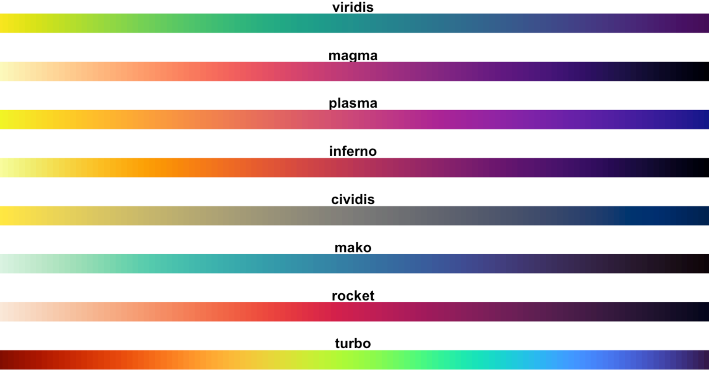
```

Eine weitere Möglichkeit Farben aus einem Bild, bspw. einem Luftbild, zu extrahieren geht mit dem package `earthtones`. 

```{r echo = F, fig.cap="Source from: https://cran.r-project.org/web/packages/earthtones/index.html"}
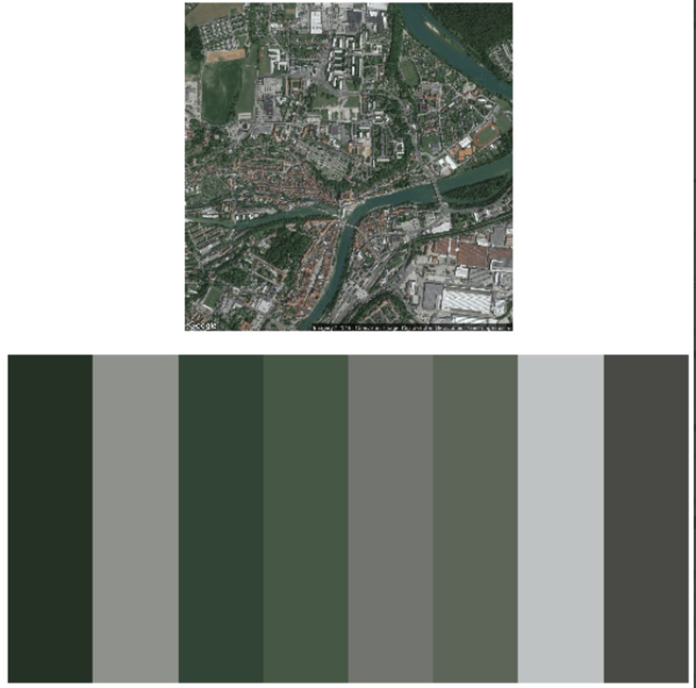
```

Richtig spannend ist auch das package `palleteR`, um Farben aus einem Bild zu extrahieren und zu verwenden. 

```{r echo = F, fig.cap="Source from: https://github.com/AndreaCirilloAC/paletter"}
knitr::include_graphics("images/063.png")
```

Wer selber Hand anlegen möchte um Farben zu generieren, dem ist diese Seite wärmstens ans Herz gelegt [https://projects.susielu.com/viz-palette](https://projects.susielu.com/viz-palette). 

```{r echo = F, fig.cap="Source from: https://projects.susielu.com/viz-palette"}
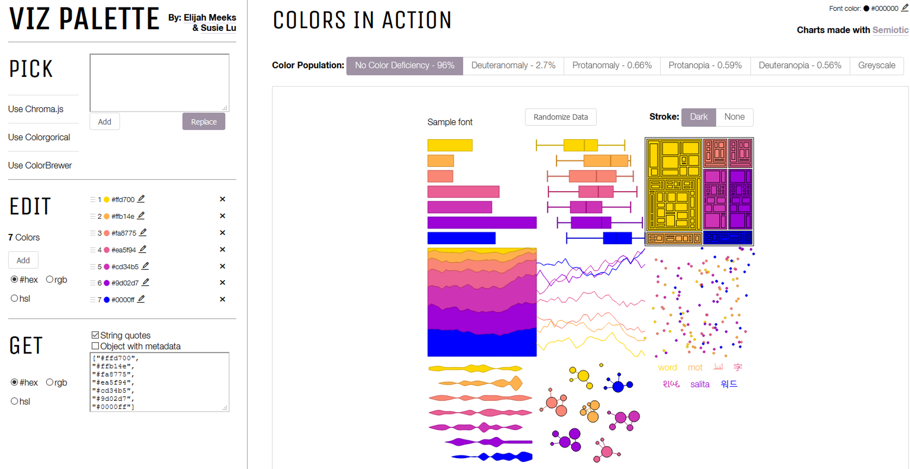
```

### Beispiele für unterschiedliche Farben

```{r}
# select the data
lolli <- koog_day %>%
  pivot_longer(contains("eh") & !contains("mean"))

# create a name vector to sort the depth variables
col_names <- rev(c("eh10a","eh10b","eh10c",
                   "eh20a","eh20b","eh20c",
                   "eh30a","eh30b","eh30c",
                                           "eh60a","eh60b","eh60c",
                                           "eh100a","eh100b","eh100c",
                                           "eh150a","eh150b","eh150c"))
  
# Plot the data with default color
lolli %>%
  ggplot(aes(value, fct_relevel(name, col_names), color = name)) + 
  geom_boxplot() +
  labs(
    x = expression(paste("E" [H], " (mV)")),
    y = "Elektrode"
  ) +
  my_theme +
  theme(legend.position = "none")

# Plot the data with manual color
lolli %>%
  ggplot(aes(value, fct_relevel(name, col_names))) + 
  geom_boxplot(color = "red", fill = "blue") +
  labs(
    x = expression(paste("E" [H], " (mV)")),
    y = "Elektrode"
  ) +
  my_theme +
  theme(legend.position = "none")

# Plot the data with scale_fill_brewer and various palletes
lolli %>%
  ggplot(aes(value, fct_relevel(name, col_names), fill = name)) + 
  geom_boxplot() +
  labs(
    x = expression(paste("E" [H], " (mV)")),
    y = "Elektrode"
  ) +
  scale_fill_brewer(palette = "PuBu") +
  my_theme +
  theme(legend.position = "none")

# Plot the data with viridis color
lolli %>%
  ggplot(aes(value, fct_relevel(name, col_names), fill = name)) + 
  geom_boxplot() +
  labs(
    x = expression(paste("E" [H], " (mV)")),
    y = "Elektrode"
  ) +
  scale_fill_viridis_d() +
  my_theme +
  theme(legend.position = "none")


```


<!--chapter:end:07-Datenvisualisierung.Rmd-->

# Karten erstellen in R 🌍

*Der Beitrag wurde das letzte mal am `r format(Sys.time(), '%d %B, %Y')` editiert*

```{r include=FALSE}

knitr::opts_chunk$set(fig.align = "center", collapse = T, echo = TRUE, message = FALSE, warning = FALSE)

# With collapse = TRUE the Source and output lived together happily ever in knitr.
# https://github.com/yihui/knitr-examples/blob/master/039-merge.md

# loading multiple packages at once with `pacman`
# create a vector name
packages <- c("tidyverse", "markdown", "knitr", "matrixStats", "patchwork", "lubridate", "plotly",  "naniar", "stlplus", "gt", "dygraphs", "htmltools", "zoo", "xts", "ggpmisc", "forcats", "RColorBrewer", "Kendall", "rstudioapi", "multcompView", "plyr", "bookdown", "janitor", "rstatix", "ggpubr", "moments", "tweetrmd", "ggthemes", "hexbin", "ggridges", "ggstream", "openair", "treemapify", "MBA", "akima", "PlotSvalbard", "sf", "rnaturalearth", "rnaturalearthdata", "rgeos", "ggspatial")
 
# Load the packages vector 
pacman::p_load(packages, character.only = T)


my_theme <- theme(
  panel.background = element_rect(fill = "white", color = "black"),
  panel.grid.major = element_blank(), 
  panel.grid.minor = element_blank(), 
  panel.border = element_blank())

```


R beinhaltet zahlreiche Funktionen um räumliche Informationen darzustellen und zu analysieren. Aktuell sind > 180 packages auf CRAN zu finden die sich explizit mit der räumlichen Datenanalyse beschäftigen, Tendenz steigend. Eine Zusammenfassung ist [HIER](https://cran.r-project.org/web/views/Spatial.html) zu finden, wobei die wichtigsten sind:

* `rgdal` um Koordinaten zu transformieren
* `sp` und `sf` für Vektordatenanalyse
* `raster` und `rastervis` für fortgeschrittene Analyse von Rasterdaten
* `spatstat` für Mustererkennung

🔍 Dieses Kapitel basiert auf den folgenden Quellen:

* [Sebastian Sauer](https://sebastiansauer.github.io/unemp-map/)
* [FU Berlin](https://www.geo.fu-berlin.de/en/v/soga/Introduction-to-R/Spatial-Data/index.html)
* [r-spatial](https://www.r-spatial.org/r/2018/10/25/ggplot2-sf-2.html)
* [slcladal](https://slcladal.github.io/maps.html)

## Datenquellen

Für Deutschland ist die wohl wichtigste Quelle das [Bundesamt für Kartographie und Geodäsie](https://www.bkg.bund.de/DE/Home/home.html). Die Verwaltungsgebiete können als kostenfreies *shape* Format [hier](https://gdz.bkg.bund.de/index.php/default/open-data/verwaltungsgebiete-historisch-vg-hist.html) heruntergeladen werden. Shape Dateien sind das gängige Format für Geodaten. 


## Packages

### `rgdal` package

Beinhaltet wichtige Funktionen um Koordinaten zu transformieren, bspw. von Geographische Länge (longitude) und Breite (latitude) zu kartesischen Koordinaten wie UTM mit dem Referenzsystem ETRS89 für Deutschland. 


## Übungen

### Erstelle eine Karte der Bundesrepublik

Als erstes Laden wir unsere [Geodaten](https://gdz.bkg.bund.de/index.php/default/digitale-geodaten/verwaltungsgebiete/verwaltungsgebiete-1-2-500-000-stand-01-01-vg2500.html) der Verwaltungsgebiete im Maßstab 1:2.500.000  herunter und extrahieren sie in unseren Projektordner. "Der Datensatz umfasst sämtliche Verwaltungseinheiten der hierarchischen Verwaltungsebenen vom Staat bis zu den Kreisen mit ihren Grenzen, dem Regionalschlüssel und dem Namen der Verwaltungseinheit."

```{r}

# Als erstes müssen die wichtigen packages geladen werden
library(sf)
library(tidyverse)

# Laden der Geodaten und als Objekt speichern mit `st_read`
map_state <- sf::st_read("data/vg2500_01-01.utm32s.shape/vg2500/vg2500_sta.shp")

# Ein Riesenvorteil des sf packages ist die Kompatibilität mit dem tidyverse. Daher hat man alle Funktionalitäten im Zusammenhang mit ggplot und auch m Daten zu transformieren oder zu filtern
map_state %>%
  ggplot() +
  geom_sf()

```

Das sieht aber merkwürdig aus?! Zeile 1 in eurem erstellten Objekt steht für das Seeeinzugsgebiet Deutschlands. Wir können die erste Zeile mit `slice` und dem pipe operator `%>%` einfach entfernen:

```{r}

p1 <- map_state %>%
  slice(2:3) %>%  # Zeile 1 codiert das Seeeinzugsgebiet. Mit `slice` entfernt man die erste Zeile in dem man bestätigt Zeile 2 bis 3 zu behalten
  ggplot() +
  geom_sf()

p1

```

Sehr schön 😄 Sylt ist wieder zu erkennen! Falls die Farbe nicht gefällt kann man das `theme` einfach anpassen. 

```{r}

map_state %>%
  slice(2:3) %>%
  ggplot() +
  geom_sf(fill = "grey40") +
  theme_void()

```

Falls uns aber nicht die Bundesgrenzen interessieren sondern die Landes- oder sogar Kreisgrenzen, so können wir diese aus unseren Daten ebenfalls einlesen. Die Codierung der Datei lautet:

* Land (`lan`)
* Regierungsbezirk (`rbz`)
* Kreis (`krs`)

```{r}

# Einlesen der Daten
map_federal <- sf::st_read("data/vg2500_01-01.utm32s.shape/vg2500/vg2500_lan.shp")

# Darstellen der Landesgrenzen
p2 <- map_federal %>%
  ggplot() + 
  geom_sf()

p2

```

```{r}

# Einlesen der Daten
map_district <- sf::st_read("data/vg2500_01-01.utm32s.shape/vg2500/vg2500_krs.shp")

# Darstellen der Landesgrenzen
p3 <- map_district %>%
  ggplot() + 
  geom_sf()

p3

```

Es ist Zeit zu feiern! Wir haben unsere erste vektorbasierte Karte mit R erstellt  👍

Man kann weiterhin einzelne Verwaltungsbezirke auswählen und darstellen. Die Objektstruktur eines `sf` Objektes ermöglicht dies.

```{r}

# Stelle die ersten 5 Zeilen des Objektes map_district dar
head(map_district, 5)

```

In der Spalte **GEN** sind die Namen der Bezirke codiert wohingegen die Geometrien (Formen) in der Spalte daneben gelistet sind. 

```{r}

map_district %>%
  filter(GEN == "Berlin") %>% # mit filter() durchsuchen wir die Spalte GEN nach dem Wort Berlin
  ggplot() +
  labs(
    title = "Berlin"
  ) +
  geom_sf()

```

### Erstelle eine Weltkarte

Shape Daten der Ländergrenzen sind im package `rnaturalearth` enthalten. 

```{r}

# Laden der Daten und speichern als Objekt map_world
map_world <- rnaturalearth::ne_countries(scale = "medium", returnclass = "sf")
  
map_world %>%
  ggplot() +
  geom_sf(fill = "white", color = "black") +
  labs(
    title = "World map", 
    subtitle = paste0("(", length(unique(map_world$admin)), " countries)"), # Die Funktion length() zählt die Länge des Vektors und damit die Anzahl der Länder
    x = "Longitude",
    y = "Latitude"
    )

```

### Manuelles Hinzufügen von Punkten

Es ist möglich Punktinformationen in die Karte zu übernehmen. `geom_sf` verhält sich dabei wie jedes geom das verwendet wird. Dazu ist es am einfachsten einen neuen data.frame zu erstellen.

```{r eval = F}

sampling_points <- tibble::tribble(
  ~site, ~lat, ~lon,
  "Lavesum", 51.814589, 7.216471
)

head(sampling_points)
str(sampling_points)

map_germany +
  geom_point(data = sampling_points, mapping = aes(x = lon, y = lat), color = "red", size = 2)

```

<!--chapter:end:09-Karten-erstellen.Rmd-->

# Statistische Auswertungen

*Der Beitrag wurde das letzte mal am `r format(Sys.time(), '%d %B, %Y')` editiert*

```{r include=FALSE}

knitr::opts_chunk$set(fig.align = "center", collapse = T, echo = TRUE, message = FALSE, warning = FALSE)

# With collapse = TRUE the Source and output lived together happily ever in knitr.
# https://github.com/yihui/knitr-examples/blob/master/039-merge.md

# loading multiple packages at once with `pacman`
# create a vector name
packages <- c("tidyverse", "markdown", "knitr", "matrixStats", "patchwork", "lubridate", "plotly",  "naniar", "stlplus", "gt", "dygraphs", "htmltools", "zoo", "xts", "ggpmisc", "forcats", "RColorBrewer", "Kendall", "rstudioapi", "multcompView", "plyr", "bookdown", "janitor", "rstatix", "ggpubr", "moments", "tweetrmd", "ggthemes", "hexbin", "ggridges", "ggstream", "openair", "treemapify", "MBA", "akima", "PlotSvalbard", "sf", "rnaturalearth", "rnaturalearthdata", "rgeos", "ggspatial", "factoextra", "FactoMineR")
 
# Load the packages vector 
pacman::p_load(packages, character.only = T)


my_theme <- theme(
  panel.background = element_rect(fill = "white", color = "black"),
  panel.grid.major = element_blank(), 
  panel.grid.minor = element_blank(), 
  panel.border = element_blank())

```

```{r echo = F}
# Daten Speicherkoog einlesen
koog_raw <- readr::read_delim("data/data.csv", delim = ";", 
                          col_types = readr::cols(
                            # date = überschreibt die Spalte mit der neuen Spezifikation
                            date = readr::col_datetime(format = "%d.%m.%Y %H:%M") 
  ))
koog_raw <- janitor::clean_names(koog_raw)
koog <- koog_raw %>%
  dplyr::mutate(across(contains("eh"), ~. + 207))
# Erstelle neue Spalten mit Zeitstempeln
koog <- koog %>%
  mutate(year = lubridate::year(date),
         month = lubridate::month(date),
         day = lubridate::day(date),
         hour = lubridate::hour(date), 
         daily = format(date, "%Y-%m-%d"),
         monthly = format(date, "%Y-%m"))

# Tagesmittelwerte
koog_day <- koog %>%
  group_by(daily) %>%
  summarise_if(is.numeric, mean, na.rm = T)

# Monatsmittelwerte
koog_month <- koog %>%
  group_by(monthly) %>%
  summarise_if(is.numeric, mean, na.rm = T)

# Jahresmittelwerte
koog_year <- koog %>%
  group_by(year) %>%
  summarise_if(is.numeric, mean, na.rm = T)

```

## Verteilung der Daten

Auf die verschiedenen Darstellungsformen gehen wir noch nicht ein, aber die Verteilung der Daten spielt für statistische Tests eine große Rolle. Sich die Verteilung optisch anzusehen bietet sich durch ein Histogram oder eine Dichteverteilung der Häufigkeiten:

```{r}
# Als Histogram mit der Anzahl der observations
koog %>%
  ggplot(aes(st10)) +
  geom_histogram(bins = 100) # Die Anzahl der bins spiegelt die Klassen wieder. Default sind 30 

# Oder als Dichteverteilung
koog %>%
  ggplot(aes(st10)) +
  geom_density()
```

Optisch sieht es nach einer bimodalen Verteilung aus. Statistische Tests wie Korrelation, Regression, t-Test und Varianzanalyse setzen aber eine Normalverteilung voraus. Man nennt diese Tests auch **parametrische Tests**, da sie von der Verteilung der Daten abhängig sind. Eine reine visuelle Untersuchung ist häufig aber irreführend und sollte daher durch einen Test untermauert werden. Mit dem Shapiro-Wilk Test können wir in R untersuchen, ob die Daten normalverteilt sind. 

🚨 Test auf Normalität sind abhängig von der Stichprobengröße. Bei kleiner Stichprobenanzahl wird der Test besser bestanden als bei großer.

Die Null-Hypothese des Test besagt, dass die Probenverteilung normal ist. Ist der Test also signfikant, ist die Verteilung **nicht-normalverteilt**. 

```{r}

library(rstatix)
rstatix::shapiro_test(koog_day$at)

```
Die Daten der Lufttemperatur sind nicht normalverteilt, da der p Wert signfikant ist (p < 0.001). Wir müssen die Null-Hypothese also zurückweisen. Es gibt aber Möglichkeiten dennoch bestimmte Tests durchzuführen, auch wenn die Daten keine Normalverteilung aufweisen. Das Zauberwort lautet:

💡 **Datenfransformation**

## Datentransformation

🔍 Das folgende Kapitel bezieht sich auf [datanovia.com](https://www.datanovia.com/en/lessons/transform-data-to-normal-distribution-in-r/)

Um parametrische Tests (bspw. t-Test) durchzuführen, müssen die Daten normalverteilt vorliegen. Häufig liegen Daten aber auch links- oder rechtsschief vor. 

```{r echo=F, fig.cap="Schiefe einer Verteilung"}
knitr::include_graphics("images/045.png")
```

Zuerst wollen wir uns die Dichteverteilung der Daten für die Lufttemperatur im Speicherkoog ansehen. Die rote Kurve spiegelt die perfekte Normalverteilung wieder. 

```{r}
koog_day %>%
  ggdensity(x = "at", fill = "lightgray", title = "Air temperature") +
  stat_overlay_normal_density(color = "red", linetype = "dashed")

```

Die Schiefe der Daten kann mit der Funktion `skewness` aus dem `moments::` package analysiert werden. Positive Schiefe (rechtsschief) Median < Mean und Negative Schiefe (linksschief) Median > Mean

```{r}
skewness(koog_day$at, na.rm = T)
```

* Eine **0** bedeutet keine Schiefe und Normalverteilung
* Negative Werte = negative Schiefe = linksschief
* Positive Werte = positive Schiefe = rechtsschief

Die Daten der Lufttemperatur haben also eine leichte linksschiefe. 

Häufig verwendet man eine Log-Transformation der Daten, um eine Normalverteilung zu erreichen. Dazu erstellen wir einen neuen Vektor und nennen ihn `at_log` 

```{r}
# Quadratwurzel für moderate Schiefe
#at_transform <- sqrt(koog_day$at) # Positive Schiefe
at_transform <- sqrt(max(koog_day$at + 1) - koog_day$at) # Negative Schiefe

# log für stärkere Schiefe
#at_transform <- log10(koog_day$at)
at_transform <- log10(max(koog_day$at+1, na.rm = T) - koog_day$at) 

# Invers für sehr starke Schiefe
at_transform <- 1/koog_day$at
at_transform <- (max(koog_day$at+1) - koog_day$at)


at_transform %>%
  ggdensity(fill = "lightgray", title = "Air temperature") +
  stat_overlay_normal_density(color = "red", linetype = "dashed")

skewness(at_transform, na.rm = T)

```

🚨 Wichtig! Eine Transformation ist nicht immer erfolgreich. In diesem Beispiel hat keine Methode zu einer Verbesserung geführt. 

Falls die Normalverteilung nicht gegeben ist und auch die Transformation keine Verbesserung bringt, kann man einen parametrischen Test an der transformierten und der nicht-transfomrierten Variante durchführen. Wenn beide Varianten zu dem selben Ergebniss kommen, ist das Arbeiten mit nicht transformierten Variablen zu bevorzugen. Die Vergelichbarkeit wird bei der Transfomration nämlich schlechter, bspw. bei dem Vergleich von zwei Gruppen kann man nach der Transformation nicht mehr ohne weiteres sagen, dass der Mittelwert von Gruppe 1 > Gruppe 2 ist. 

💡 Wenn die Stichprobenanzahl groß genug ist (> 30 - 40), ist die Wahrscheinlichkeit für Normalverteilung meist gegegeben oder zumindest nah genug dran, um mit parametrischen Tests weiterzuarbeiten ([Zentraler Grenzwertsatz](https://de.wikipedia.org/wiki/Zentraler_Grenzwertsatz))

## Korrelationen

🔍 [https://towardsdatascience.com/](https://towardsdatascience.com/eveything-you-need-to-know-about-interpreting-correlations-2c485841c0b8)

Eine Korrelation gehört zu den weit verbreitesten statistischen Maßen. Die Anwendung muss jedoch mit besonderem Augenmaß erfolgen, andernfalls gibt es auch Fehlerquellen. Eine vermeintliche Korrelation aus einer Population kann auch Zufall sein und muss nicht unbedingt durch das Prinzip Ursache-Wirkung verursacht sein. Daher sollte eine Korrelation immer mit einem Signifikanztest verknüpft werden. 

Korrelation beschreiben, wie sich Variablen in Abhängigkeit einer anderen Variable verhalten. Beispielsweise 

* Bildung und Einkommen
* Jahr des Tages und Lufttemperatur 
* Bierkonsum und Bauchumfang

```{r echo=F, fig.cap="Illustration von Z. Jaadi: https://towardsdatascience.com"}

```

**Positive Korrelation**: Zwei Variablen gehen in diesselbe Richtung.
**Negative Korrelation**: Zwei Variablen bewegen sich in gegengesetzte Richtung.
**Neutrale Korrelation**: Es gibt keinen Zusammenhang zwischen den Variablen.

Die Form einer Korrelation kann unterschiedlich ausgeprägt sein:

```{r echo=F, fig.cap="Illustration von Z. Jaadi: https://towardsdatascience.com"}

```

**Lineare Korrelation**: Variablen verändern sich in konstanter Rate und erfüllen die Gleichung Y = aX + b (Die Beziehung lässt sich als Gerade beschreiben).
**Nicht-lineare Korrelation**: Variablen verändern sich nicht in konstanter Rate. Die Form kann parabolisch, hyperbolisch, ... etc. sein. 
**Monotone Korrelation**: Die Variablen tendieren in diesselbe Richtung, jedoch nicht in gleicher Rate. Alle lineare Korrelationen sind also monoton, der umgekehrte Prozess muss jedoch nicht unbedingt richtig sein. 

Scatterplots oder Punktdiagramme sind sinnvoll, um visuell einen Überblick über die Verteilung der Daten zu bekommen. Nehmen wir mal das Beispiel Batteriespannung der Station im Speicherkoog und gemessene Solarstrahlung:

```{r}
koog_day %>%
  ggplot(aes(sr, bat)) +
  geom_point() +
  labs(
    x = "Solarstrahlung (W/m²)",
    y = "Batteriespannung (V)"
  )
```

### Pearson's Korrelationkoeffizient (r)

Dieses Maß wird verwendet um Stärke und Richtung eines linearen Zusammenhanges zwischen zwei Variablen vorherzusagen. Mathematisch lässt ausgedrückt teilt man die Co-Varianz von zwei Variablen mit dem Produkt der Standardabweichung:

```{r echo=F, fig.cap="Illustration von Z. Jaadi: https://towardsdatascience.com"}

```

Die Werte von r variieren zwischen -1 und 1, wobei 1 einen perfekten positiven Zusammenhang darstellt und -1 einen einen perfekten negativen. Die Größe von Pearson's r könnnte wie folgt eingeteilt werden:

```{r echo=F, fig.cap="Illustration von Z. Jaadi: https://towardsdatascience.com"}

```

In R können wir Pearson's r mit der Funktion `stats::cor()` berechnen:

```{r}
cor(koog_day$sr, koog_day$bat, use = "complete.obs", method = "pearson")
```

Mit dem Argument `method = ` können wir die drei Optionen nach Spearman, Pearson oder Kendall's Tau angeben. Falls wir fehlende Werte in unserem Datensatz haben, was bei uns der Fall ist, dann müssen wir dies im Argument angeben. Wir setzen das Argument `complete.obs` um Zeilenweise fehlende Werte aus dem Datensatz zu werfen und von der Korrelation auszuschließen.

### Signifikanztest

Die Beziehung zwischen zwei Variablen zu quantifizieren ist nur ein Teil der Geschichte. Häufig stellt man Korrelationen zwischen verschiedenen Variablen auf, wobei sich die Population dabei unterscheiden kann. Was wir wollen ist also ein Nachweis, dass unsere Beobachtung innerhalb der Population wahr oder falsch ist, welches wir durch aufstellen einer Testhypothese erreichen. 

Formulierung:

* Unsere Stichprobe ist n groß mit zwei Variablen x und y
* Der Korrelationskoeffizient r ist bekannt und kann berechnet werden
* Der Korrelationskoefffizient der Population ρ (Griech. Buchstabe “rho”) zwischen x und y ist unbekannt
* Ziel: Wir wollen eine Aussage über ρ anhand von r treffen

Der Hypothesen-Test lässt uns erkennen, ob ρ nah an 0 ist (kein signfikanter linearer Zusammenhang zwischen x und y in der Population) oder signifikant unterschiedlich von 0 (es gibt einen signfikanten linearern Zusammenhang zwischen x und y in der Population). 

**Schritt 1** 

Die *alternative Hypothese* ist immer das, was wir versuchen nachzuweisen (also in unserem Fall das der Zusammenhang signifikant ist mit ρ ≠ 0). Die *Null Hypothese* versuchen wir zurückzuweisen, also das es keinen signfikanten Zusammenhang gibt mit ρ = 0. 

**Schritt 2**

Wir wenden einen T-Test (auch Student's T-Test genannt) an um anhang des Stichprobenumfangs n Rückschlüsse über die Gesamte Population zu treffen. Der Wert t des Tests erhalten wir durch:

```{r echo=F, fig.cap="Illustration von Z. Jaadi: https://towardsdatascience.com"}
knitr::include_graphics("images/059.png")
```

mit n = Stichprobenumfang und r = Korrelationskoeffizient. Je größer der T-Wert ist, desto wahrscheinlicher ist es das die Korrelation wiederholbar und damit signifikant ist. Aber wie groß ist groß genug? Das ist der nächste Schritt.

**Schritt 3**

Jeder T-Wert hat einen assoziierten p-Wert. Der p-Wert ist die Wahrscheinlichkeit, dass die Null-Hypothese wahr ist. In unserem Beispiel also die Wahrscheinlichkeit, dass die Korrelation zwischen x und y zufällig ist. Ein p-Wert von 0.05 bedeutet, dass die Wahrscheinlichkeit für eine zufällige Korrelation nur 5% beträgt, ein Wert von 0.01 sogar nur 1%. In den meisten Studien wird die Grenze zwischen signifikant und nicht-signfikant bei einem p-Wert von 0.05 gesetzt oder kleiner. Dieser Bereich ist der Signifikanzbereich α. Wir können unser Signfikanzlevel bei 0.05 setzen (α = 0.05) und den p-Wert finden. Dazu benötigen wir (i) den T-Wert (Schritt 2) und die Anzahl der Freiheitsgrade die berechnet werden können mit df = n - 2. Aus diesen beiden Werten kann der p-Wert mit einer Software oder durch nachschlagen in T-Tabellen erfolgen. 

* Wenn der p-Wert kleiner als das Signifikanzlevel (α = 0.05) ist, dann wird die Null-Hypothese zurückgewiesen. Die Korrelation ist also statistisch signifkant!
* Wenn der p-Wert größer ist, können wir die Null-Hypothese nicht zurückweisen und es gibt keinen signfikanten Zusammenhang zwischen den Variablen. 

In R können wir den p-Wert mit der Funktion `cor.test()` berechnen:

```{r}
cor.test(koog_day$sr, koog_day$bat, method = "pearson", na.action = "na.omit")
```

Unser p-Wert ist < 2.2e-16 und damit niedriger als unser Signfikanzlevel bei 0.05 (α = 0.05). Wir können die Null-Hypothese also zurückweisen es gibt einen signfikanten linearen Zusammenhang in unseren Variablen Solarstrahlung und Batteriespannung. 

### Korrelation vs. Regression

```{r echo=F, fig.cap="Illustration von Z. Jaadi: https://towardsdatascience.com"}
knitr::include_graphics("images/060.png")
```

Diese Begriffe werden häufig durcheinander geworfen. Korrelation ist ein statistisches Maß um die Richtung und Stärke eines Zusammenhanges wiederzugeben. Regression ist eine Technik um die abhängige Variable y vorherzusagen basierend auf der bekannten Variable x und der Gleichung y = a + bx. 

## PCA

🔍 [sthda.com](http://www.sthda.com/english/articles/31-principal-component-methods-in-r-practical-guide/112-pca-principal-component-analysis-essentials/)

Eine Hauptkomponentenanalyse (engl. Principal component analysis; PCA) ist ein Verfahren der multivariaten Statistik. Dadurch können große Datensätze strukturiert und vereinfacht werden, durch eine möglichst geringe Zahl aussagekräftiger Linearkombinationen (**Hauptkomponenten**). PCA wird verwendet um Informationen von einer Vielzahl (inter-korrelierten) quantitativen Variablen zu extrahieren. Diese Informationen werden reduziert zu den genannten wenigen Hauptkomponenten (= principal components = PC). 

Das Ziel einer PCA ist es die Hauptachsen (PC) so zu arrangieren, dass die Variation der Daten maximiert wird. Einfach ausgedrückt kann man eine PCA als Rotation des Koordinatensystems verstehen:

```{r echo=F, fig.cap="Illustration von C.Wilke: https://wilkelab.org/SDS375/"}
knitr::include_graphics("images/046.png")
```

💡 Eine PCA ist besonders dann nützlich, wenn die Variablen in einem Datensatz stark korreliert sind. Korrelation bedeutet Redundanz und wegen dieser Redundanz kann eine PCA viele Variablen in eine geringere Anzahl an neuen Variablen (= PC) umwandeln, welche möglichst viel Varianz der ursprünglichen Daten erklären. 

In R gibt es mehrere Möglichkeiten eine PCA durchzuführen

* prcomp() and princomp() [built-in R stats package]
* PCA() [FactoMineR package]
* dudi.pca() [ade4 package]
* epPCA() [ExPosition package]

Egal welches package man verwendet, die Daten der PCA können auch mit dem `factoextra` package verarbeitet werden. Dies hat den Vorteil, dass die Visualisierung `ggplot2`-basiert ist. 


```{r}
# Laden des Datensatzes 
df_ec <- readr::read_delim("data/data_ecuador.csv", delim = ";", col_types = 
                          cols(
                            wsc = col_double(),
                            wsc_ma = col_double(),
                            wsc_som = col_double(),
                            hwsc = col_double(),
                            hwsc_ma = col_double(),
                            hwsc_som = col_double(),
                            wsc_hwsc_som = col_double(),
                            Fed = col_double(),
                            Feo = col_double(),
                            Feo_Fed = col_double(),
                            Fepyro = col_double(),
                            Mno = col_double(),
                            Alo = col_double(),
                            Sio = col_double(),
                            Alpyro = col_double()
                          )
                        )

# Laden der packages
library(factoextra)
library(FactoMineR)

```

### Datenauswahl

Zuerst wählen wir die Daten aus, welche wir in der PCA berücksichtigen wollen. 

```{r}
# Create one data frame with the data
df_pca <- df_ec %>%
  select(site_name, depth, som:P2O5, -mat_amorph, -index) %>%
  na.omit() # Mit dem Befehl werden NA Werte aus den Daten entfernt...wichtig (!) bevor die PCA durchgeführt werden kann

# Create one data frame 
df_var <- df_pca %>%
  select(site_name, depth)

head(df_pca, n = 5)

```

### Daten Standardisieren

Bei einer PCA werden die Daten häufig standardisiert, also skaliert. Dies ist besonders wichtig wenn die Einheiten stark unterschiedlich sind, bspw. in %, mg kg^-1^, etc. 

💡 Wenn man die Funktion `PCA()` im FactoMineR verwendet, gibt es das Argument die Daten zu standardisieren. Dies muss also nicht im Vorfeld durchgeführt werden. 

```{r}

pca <- PCA(df_pca[,-c(1:2)], scale.unit = T, ncp = 5, graph = F) # Makes the PCA but without the site_name and depth grouping value
pca

```

Das Ergebnis der Funktion `PCA()` ist eine Liste mit verschiedenen Komponenten. 

Wichtige FUnktionen in dem factoextra package lauten:


* get_eigenvalue(res.pca): Extrahiert Eigenvalues/Varianz der PC
* fviz_eig(res.pca): Visualisiert die Eigenvalues
* get_pca_ind(res.pca), get_pca_var(res.pca): Extrahiert das Ergenis spezieller Variablen
* fviz_pca_ind(res.pca), fviz_pca_var(res.pca): Visualisiert das Ergenis spezieller Variablen
* fviz_pca_biplot(res.pca): Biplot individueller Variablen

### Eigenvalues

Eigenvalues messen die Stärke der Variation jeder PC. 

```{r}

eig.val <- get_eigenvalue(pca)
eig.val %>%
  head(n = 5)

```

Für den Ecuador Datensatz erklären die Eigenvalues der ersten zwei PCs 83% der Varianz (das ist viel). Wieviele PCs für die Auswahl der PCA wichtig sind lässt sich nicht objektiv sagen. Eine Möglichkeit ist es einen Wert festzulegen, mit dem man selber zufrieden ist:

> You can also limit the number of component to that number that accounts for a certain fraction of the total variance. For example, if you are satisfied with 70% of the total variance explained then use the number of components to achieve that. (Kaiser 1961)

Eine graphische Darstellung der Eigenvalue ist auch eine Möglichkeit:

```{r}

fviz_eig(pca, addlabels = T, ylim = c(0,60))

```

In der Darstellung sind die EIgenvalues absteigend sortiert und man wählt den Punkt aus, wo die vebleibenden Eigenvalues gleichbleibend klein bleiben (in unserem Fall ab der dritten PC). 

### Darstellen der Ergebnisse

Die einfachste Methode ist mit der Funktion `get_pca_var()`. 

```{r}

var <- get_pca_var(pca)
var

```

Die vier verschiedenen Komponenten von `get_pca_var()` können genutzt werden um die Ergebnisse auf verschiedenen Art darzustellen:

```{r}
# Coordinates
head(var$coord)
# Cos2: Quality on the factore map
head(var$cos2)
# Contribution to the PCA
head(var$contrib)
```

#### Darstellung im Koordinatensystem

Um die Variablen im Koordinatensystem darzustellen eignet sich der folgende Befehl:

```{r}

fviz_pca_var(pca, repel = T)

```

Dieser Plot wird auch als **Variable correlation plot** bezeichnet und zeigt die Beziehung zwischen den Variablen:

* Positiv korrelierte Variablen clustern zusammen * Negativ korrelierte Variablen sind gegenüber positioniert (gegenüberliegende Quadranten)
* Der Abstand der Variable zum Zentrum des Kreises stellt die Qualität der Variable auf der factor map da. Weit entfernte Variablen werden auf der factor map besser dargestellt. 

Die Qualität der Darstellung wird über **cos2** definiert (quadrierter Cosinus, quadrierte Koordinaten). Darstellen kann man den Zusammenhang als barplot:

```{r}

fviz_cos2(pca, choice = "var")

```

Ein großer cos2 Wert bedeutet eine gute Repräsentation der Variable auf der PC. In diesem Fall ist die Variable nah am Kreisumfang positioniert. 
Ein niedriger co2 Wert bedeutet, dass die Variable nicht perfekt dargestellt wird, wobei die Variable näher am Zentrum des Kreises liegt. Die Summe des cos2 einer Variable auf allen PCs ist = 1. 
Wenn eine Variable also perfekt durch nur zwei PCs dargestellt wird, dann ist der cos2 Werte ~1 und die Variable liegt nah am Kreisumfang. Wozu ist der cos2 also wichtig?

* Beschreibt die QUalität der Darstellung
* Je näher die Variable am Kreisumfang desto besser wird diese Variable auf der factor map dargestellt. 
* Variablen nahe des Kreiszentrums tragen wenig zur ersten PC bei

Die QUalität der Variable kann auch farblich dargestellt werden:

```{r}

fviz_pca_var(pca, col.var = "cos2", gradient.cols = c("#00AFBB", "#E7B800", "#FC4E07"), 
             repel = TRUE # Avoid text overlapping
             )
```

#### Beitrag einer Variable zur PCA

Der Beitrag einer Variable für die Variabilität einer PC wird in % angegeben. 

* Variablen die mit PC1 (Dim.1) und PC2 (Dim.2) korreliert sind haben die größte Bedeutung um die Variabilität im Datensatz zu erklären. 
* Variablen die mit keiner PC korrelieren haben den geringsten Beitrag

💡 Um die Aussage einer PCA zu verstärken können Variablen mit einem geringen Beitrag von der Analyse ausgeschlossen werden. 

```{r}
# Show the variables contributing to PC1
fviz_contrib(pca, choice = "var", axes = 1)

# Show the variables contributing to PC2
fviz_contrib(pca, choice = "var", axes = 2)

# Show the variables contributing to PC1 AND PC2
fviz_contrib(pca, choice = "var", axes = 1:2)

```

SOM, pH und hwsc tragen am meisten zu PC1 und PC2 bei, die mineralogischen Kennwerte des Eisens spielen eine untergeordnete Rolle. 

```{r}

fviz_pca_var(pca, col.var = "contrib", repel = T, gradient.cols = c("#00AFBB", "#E7B800", "#FC4E07"))

```

Je näher der Pfeil am Kreisumfang positioniert ist, desto größer ist der Beitrag einer Variable für die Separierung der Daten. 

#### Darstellen der Individuen in der PCA

Die Informationen der Individuen können mit der Funktion `get_pca_ind()` abgerufen werden. 

```{r}

ind <- get_pca_ind(pca)

# Coordinates of individuals
head(ind$coord)
# Quality of individuals
head(ind$cos2)
# Contributions of individuals
head(ind$contrib)
```

Plots: Quality and contribution 

```{r}

fviz_pca_ind(pca, repel = T)

```

Individuen können auch nach dem cos2 Wert gruppiert werden

```{r}

# Group by color
fviz_pca_ind(pca, col.ind = "cos2", 
             gradient.cols = c("#00AFBB", "#E7B800", "#FC4E07"),
             repel = TRUE # Avoid text overlapping (slow if many points)
             )

```

💡 Individuen mit ähnlichen Eigenschaften werden zusammen gruppiert.

Um den Anteil (contribution) der ersten zwei PC (DIM.1 und DIM.2) darzustellen schreibe:

```{r}

fviz_contrib(pca, choice = "ind", axes = 1:2)

```

Die Proben 39,42,36,37 tragen am meisten für die Separierung der Daten bei, die Proben 2,3,5 am wenigsten. 

#### Farbliche Darstellung

Wie für Variablen können auch Individuen farblich dargestellt werden, bspw. nach Kategorien gruppiert werden (Standort, Tiefe). Argument `habillage` oder `col.ind` kann genutzt werden um Individuen nach Gruppen darzustellen. Um eine Ellipse zu erzeugen kann `addEllipses = T` gesetzt werden:

```{r}
# Create one data frame with the data
df_pca <- df_ec %>%
  select(site_name, depth, som:P2O5, -mat_amorph, -index) %>%
  na.omit() # Mit dem Befehl werden NA Werte aus den Daten entfernt...wichtig (!) bevor die PCA durchgeführt werden kann

# Create one data frame only for the grouping variable
df_var <- df_pca %>%
  select(site_name, depth)

pca <- PCA(df_pca[,-c(1:2)], scale.unit = T, ncp = 5, graph = F) # Makes the PCA but without the site_name and depth grouping value

# Gruppieren nach Standort
fviz_pca_ind(pca,
             col.ind = df_var$site_name, # color by site_name
             addEllipses = TRUE, # Concentration ellipses
             label= "var",
             legend.title = "Plot",
             repel = TRUE # to not have overlapping text in the figure
             )

# Gruppieren nach Tiefe
fviz_pca_ind(pca,
             geom.var = "arrow",
             col.ind = df_var$depth, # color by depth
             addEllipses = TRUE, # Concentration ellipses
             label= "var",
             legend.title = "Plot",
             repel = TRUE # to not have overlapping text in the figure
             )

```

In diese Darstellung fließen ALLE numerischen Variablen des Datensatzes ein. Die Paramo-Standorte clustern sehr schön zusammen und es gibt eine Separierung von AC1 und AC2. Besonders AC2 unterscheidet sich signifikant. Ein sehr schönes Ergebnis, dass den Einfluss von 100 Jahren landwirtschaftliche Nutzung hervorhebt.

#### Figure

```{r}

# Gruppieren nach Standort
p1 <- fviz_pca_ind(pca,
             col.ind = df_var$site_name, # color by site_name
             addEllipses = TRUE, # Concentration ellipses
             label= "var",
             legend.title = "Plot",
             repel = TRUE # to not have overlapping text in the figure
             )

# Gruppieren nach Tiefe
p2 <- fviz_pca_ind(pca,
             geom.var = "arrow",
             col.ind = df_var$depth, # color by depth
             addEllipses = TRUE, # Concentration ellipses
             label= "var",
             legend.title = "Depth",
             repel = TRUE # to not have overlapping text in the figure
             )

p1 + p2 + plot_annotation(tag_levels = "A")

ggsave("images/results/PCA_1.png", width = 12, height = 5)


fviz_pca_biplot(pca, repel = TRUE,#to not have overlapping text
                #variables
                col.var = "contrib",# colour variables according to their contribution to the variance between the axes
                gradient.cols = c("#00AFBB", "#E7B800", "#FC4E07"),
               #individuals
                geom.ind = "point",#using point shape for our indidividual data points
                fill.ind = df_var$site_name, col.ind = "black", #group and colour according to plot and black border of points
                pointshape = 21, pointsize = 2,#pointshape 21 is the circel with 2 differing colours important for visibility, pointsize can be adjusted if you want
                palette = c("red", "orange", "#c7e9c0","#41ab5d","#006d2c"),# maybe adjust the colour setting here, I tried to take similar colours to before
                addEllipses = TRUE,# addinf ellipses to our group of individual data points
               #supplements
                legend.title = list(fill="Plot",color = "Contribution"))#customizing our legend

ggsave("images/results/PCA_2.png", width = 9, height = 9)

```


<!--chapter:end:10-Statistische-Auswertungen.Rmd-->

# Datenmanagement

*Der Beitrag wurde das letzte mal am `r format(Sys.time(), '%d %B, %Y')` editiert*

```{r include=FALSE}

knitr::opts_chunk$set(fig.align = "center", collapse = T, echo = TRUE, message = FALSE, warning = FALSE)

# With collapse = TRUE the Source and output lived together happily ever in knitr.
# https://github.com/yihui/knitr-examples/blob/master/039-merge.md

# loading multiple packages at once with `pacman`
# create a vector name
packages <- c("tidyverse", "markdown", "knitr", "matrixStats", "patchwork", "lubridate", "plotly",  "naniar", "stlplus", "gt", "dygraphs", "htmltools", "zoo", "xts", "ggpmisc", "forcats", "RColorBrewer", "Kendall", "rstudioapi", "multcompView", "plyr", "bookdown", "janitor", "rstatix", "ggpubr", "moments", "tweetrmd", "ggthemes", "hexbin", "ggridges", "ggstream", "openair", "treemapify", "MBA", "akima", "PlotSvalbard", "sf", "rnaturalearth", "rnaturalearthdata", "rgeos", "ggspatial", "factoextra", "FactoMineR")
 
# Load the packages vector 
pacman::p_load(packages, character.only = T)


my_theme <- theme(
  panel.background = element_rect(fill = "white", color = "black"),
  panel.grid.major = element_blank(), 
  panel.grid.minor = element_blank(), 
  panel.border = element_blank())

```

```{r echo = F}
include_tweet("https://twitter.com/vsbuffalo/status/323638476153167872")
```

🔍 [https://swcarpentry.github.io/r-novice-gapminder/02-project-intro/index.html](https://swcarpentry.github.io/r-novice-gapminder/02-project-intro/index.html)

Über den Satz bin ich kürzlich gestolpert und es steckt seeeehr viel Wahrheit darin. Eins meiner ersten Projekte in R hat sich mit der Entwicklung von Bodentemperaturen in NRW beschäftigt. Hier ein Screenshot über die Ordnerstruktur:

```{r echo = F, fig.cap="Datenstruktur in R"}
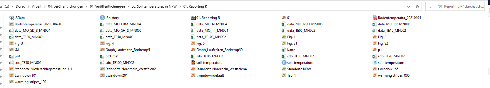
```

Es geht mit Sicherheit noch schlimmer, es geht aber mit Sicherheit auch besser! Im Laufe der Zeit wachsen die Dateien in einem Projekt und man verliert schnell den Überblick. Die wichtigsten Gründe warum man so ein Chaos vermeiden sollte:

1. Man kann nicht sagen, welche Daten Rohdaten sind und welche neu generiert wurden. 
2. Es wird sehr unübersichtlich, da verschiedene Dateitypen gemixt werden.
3. Es dauert lange die richtige Datei zu finden und/oder einer Analyse zuzuordnen. 

Die Vorteile einer guten Projektstruktur bietet also:

* Ein seriöseres Projektmanagement mit höheren Anspruch an die Daten
* Code oder Informationen mit Kollegen zu teilen geht schneller
* Nach einer Pause an dem Projekt gelingt es einem schneller wieder hereinzufinden

Eins der wichtigsten tools in RStudio ist das Anlegen eines **Projektes**. 

File -> New Project -> New Directory -> Klick New Project -> Vergebe einen Projektnamen -> Klick Create Project

Der einfachste Weg ein R Projekt zu öffnen (mit der Endung **.Rproj**) ist Doppelklick in dem Ordner in dem das Projekt hinterlegt wurde. 

💡 Alle Daten, Abbildunge, Skripte, ... werden mit diesem R Projekt verknüpft sein, dass bedeutet sie sind unabhängig von dem individuellen Pfad (bspw. `C:\Dorau\Arbeit\04. Veröffentlichungen\01. Veröffentlichungen\06. Soil temperatures in NRW\01. Reporting R`) sondern alles ist relativ zu der .Rproj Datei. 

Tipps für eine gutes Projektmanagement sind die folgenden:

* **read only** Excel oder andere Austauschformate sind Interaktiv und können manipuliert werden, bspw. durch Verknüpfungen in den Zellen. 
* **Daten bereinigen** ist ein wichtiger und zeitaufwändiger Schritt. Wenn man eine grobe Datenaufbereitung auch in Excel durchgeführt hat empfiehlt es sich, den ursprünglichen Datensatz als zweite Datei abzuspeichern die nur zum Einlesen der Daten in R verwendet wird. 
* **Analysen in einem Skript sollten reproduzierbar sein** Beim Schreiben von Skripten ist es das Ziel, Abbildungen und generell Metadaten zu erzeugen. Dieser Output sollte von jedem externen anwendbar sein, nur bei Bereitstellung des Skriptes und der Rohdaten. 
* Jedes Projekt sollte einen eigenen Ordner haben, der nach dem Projekt benannt ist. 
* Erstelle Unterordner in dem Projekt, bspw. um Abbildungen in ein Skript zu laden (`images`), Daten (`data`), Literatur (`doc`) und Ergebnisse der Analyse in einen Ergebnisordner (`results`). 
* Benenne alle Dateien so, dass sie einen Inhalt oder eine Funktion wiederspiegeln. 

Nun haben wir eine schöne Ordnerstruktur und können diese Nutzen, um Daten einzulesen. Unsere Daten sind relativ zu dem .Rproj abgespeichert. Wollen wir nun die Daten einlesen mit dem Namen `data.csv`, die im Ordner `data` abgespeichert sind müssen wir nur angeben:

```{r}
# Erstelle ein Objekt df mit den Daten data.csv
df <- read_delim("data/data.csv", delim = ";")
```

Viel Besser und reproduzierbarer im Gegensatz zu:

```{r eval = F}
df <- read_delim("C:\Dorau\Arbeit\04. Veröffentlichungen\01. Veröffentlichungen\06. Soil temperatures in NRW\01. Reporting R/data.csv", delim = ";")
```

Beim zweiten sind Fehlermeldungen vorprogrammiert und Herr oder Frau XY können auch nichts damit anfangen, da ihr Computer mit Sicherheit nicht *Dorau* heißt und auch die weiteren Pfade quatsch sind. 

<!--chapter:end:11-Datenmanagement.Rmd-->

# Reporting in Rmarkdown

*Der Beitrag wurde das letzte mal am `r format(Sys.time(), '%d %B, %Y')` editiert*

```{r include=FALSE}

knitr::opts_chunk$set(fig.align = "center", collapse = T, echo = TRUE, message = FALSE, warning = FALSE)

# With collapse = TRUE the Source and output lived together happily ever in knitr.
# https://github.com/yihui/knitr-examples/blob/master/039-merge.md

# loading multiple packages at once with `pacman`
# create a vector name
packages <- c("tidyverse", "markdown", "knitr", "matrixStats", "patchwork", "lubridate", "plotly",  "naniar", "stlplus", "gt", "dygraphs", "htmltools", "zoo", "xts", "ggpmisc", "forcats", "RColorBrewer", "Kendall", "rstudioapi", "multcompView", "plyr", "bookdown", "janitor", "rstatix", "ggpubr", "moments", "tweetrmd", "ggthemes", "hexbin", "ggridges", "ggstream", "openair", "treemapify", "MBA", "akima", "PlotSvalbard", "sf", "rnaturalearth", "rnaturalearthdata", "rgeos", "ggspatial", "factoextra", "FactoMineR")
 
# Load the packages vector 
pacman::p_load(packages, character.only = T)


my_theme <- theme(
  panel.background = element_rect(fill = "white", color = "black"),
  panel.grid.major = element_blank(), 
  panel.grid.minor = element_blank(), 
  panel.border = element_blank())

```

## Mathematische Befehle

In einem Textblock kann man sich mathematische Notationen anzeigen lassen, indem man die Gleichung mit einem `$` Zeichen umrandet für *inline equations* und zwei `$$` für Gleichungen in einer eigenen Zeile. 

🚨 Kein Leerzeichen zwischen dem `$` und der Gleichung lassen

💡 Gleichungen in LaTeX zu setzen basiert auf TeX, namentlich nach Leslie Laport benannt. 

Beispiel 1: `$\sum_{n=1}^{10} n^2$` wird zu $\sum_{n=1}^{10} n^2$ 

Beispiel 2: `$$\sum_{n=1}^{10} n^2$$` wird zu $$\sum_{n=1}^{10} n^2$$

Zwei `$$` um die Gleichung resultieren, dass die Gleichung nicht in der Zeile eingebettet ist sondern frei steht. 

Eine tolle Gleichung $E=mc^2$ 😎

### Brüche

`$\frac{1}{2}$` ergibt $\frac{1}{2}$

### Hoch- und Tiefstellung

`$Y = X_1 + X_2$` ergibt $Y = X_1 + X_2$

`$a^2 + b^2 = c^2$` ergibt $a^2 + b^2 = c^2$

### Quadratwurzel 

`$\sqrt{p}$` ergibt $\sqrt{p}$

`$x = \frac{-b \pm \sqrt{b^2 - 4ac}}{2a}$` ergibt $x = \frac{-b \pm \sqrt{b^2 - 4ac}}{2a}$

<!--chapter:end:12-Reporting-Rmarkdown.Rmd-->

# Github

*Der Beitrag wurde das letzte mal am `r format(Sys.time(), '%d %B, %Y')` editiert*

```{r include=FALSE}

knitr::opts_chunk$set(fig.align = "center", collapse = T, echo = TRUE, message = FALSE, warning = FALSE)

# With collapse = TRUE the Source and output lived together happily ever in knitr.
# https://github.com/yihui/knitr-examples/blob/master/039-merge.md

# loading multiple packages at once with `pacman`
# create a vector name
packages <- c("tidyverse", "markdown", "knitr", "matrixStats", "patchwork", "lubridate", "plotly",  "naniar", "stlplus", "gt", "dygraphs", "htmltools", "zoo", "xts", "ggpmisc", "forcats", "RColorBrewer", "Kendall", "rstudioapi", "multcompView", "plyr", "bookdown", "janitor", "rstatix", "ggpubr", "moments", "tweetrmd", "ggthemes", "hexbin", "ggridges", "ggstream", "openair", "treemapify", "MBA", "akima", "PlotSvalbard", "sf", "rnaturalearth", "rnaturalearthdata", "rgeos", "ggspatial", "factoextra", "FactoMineR")
 
# Load the packages vector 
pacman::p_load(packages, character.only = T)


my_theme <- theme(
  panel.background = element_rect(fill = "white", color = "black"),
  panel.grid.major = element_blank(), 
  panel.grid.minor = element_blank(), 
  panel.border = element_blank()) 

```

Github ist ein sogenanntes *version control system*, freeware und wird vorallem bei der Softwareentwicklung genutzt. Der Vorteil ist, dass eine Vielzahl von Leuten an ein und demselben Projekt gleichzeitig arbeiten kann. Die Weiterentwicklung von Dateien und Projekten lassen sich mit github reproduzierbar nachvollziehen. Abgelegt werden Projekte in **repositories**, kurz **repos**. 

> Git manages the evolution of a set of files -- called a **repository** -- in a sane, highly structured way (such as "Track Changes" features from Microsoft Word on steroids)

Schritt 1:

- Installiere git für windows [here](https://gitforwindows.org/)
    -   NOTE: When asked about "Adjusting your PATH environment", make
        sure to select "Git from the command line and also from
        3rd-party software". Otherwise, we believe it is good to accept
        the defaults.
    -   Note that RStudio for Windows prefers for Git to be installed
        below C:/Program Files and this appears to be the default. This
        implies, for example, that the Git executable on my Windows
        system is found at C:/Program Files/Git/bin/git.exe. Unless you
        have specific reasons to otherwise, follow this convention.
-   Now: Introduce yourself to Git

```{r eval=F, echo=T}
# library(usethis)
## What user name should you give to Git? This does not have to be your GitHub user name, although it can be. Another good option is your actual first name and last name.

## What email should you give to Git? This must be the email associated with your GitHub account.
#use_git_config(user.name = "XY", user.email = "XY@gmx.de")

## Create a github tokken for secure access to github. Then, you don't need to access all the time your personal item
# usethis::create_github_token()

## Activate your tokken PAT = Personal Access Tokken
# library(gitcreds)
# gitcreds_set()
```

-   Use a Git client

    -   "Git" is really just a collection of individual commands you
        execute in the shell (Appendix A). This interface is not
        appealing for everyone. Some may prefer to do Git operations via
        a client with a graphical interface. Git and your Git client are
        not the same thing, just like R and RStudio are not the same
        thing. A Git client and an integrated development environment,
        such as RStudio, are not necessary to use Git or R,
        respectively.
    -   Sourcetree is a recommended option

-   The most basic commands are listed below:

    -   pwd (print working directory). Shows directory or "folder" you
        are currently operating in. This is not necessarily the same as
        the R working directory you get from getwd().

    -   ls (list files). Shows the files in the current working
        directory. This is equivalent to looking at the files in your
        Finder/Explorer/File Manager. Use ls -a to also list hidden
        files, such as .Rhistory and .git.

    -   cd (change directory). Allows you to navigate through your
        directories by changing the shell's working directory. You can
        navigate like so: go to subdirectory foo of current working
        directory: cd foo go to parent of current working directory: cd
        .. go to your "home" directory: cd \~ or simply cd go to
        directory using absolute path, works regardless of your current
        working directory: cd /home/my_username/Desktop. Windows uses a
        slightly different syntax with the slashes between the folder
        names reversed, , e.g. cd C:\Users\MY\_USERNAME\Desktop. - Pro
        tip 1: Dragging and dropping a file or folder into the terminal
        window will paste the absolute path into the window. - Pro tip
        2: Use the tab key to autocomplete unambiguous directory and
        file names. Hit tab twice to see all ambiguous options.

        -   Use arrow-up and arrow-down to repeat previous commands. Or
            search for previous commands with CTRL + r.

-   A few Git commands:

    -   git status is the most used git command and informs you of your
        current branch, any changes or untracked files, and whether you
        are in sync with your remotes.
    -   git remote -v lists all remotes. Very useful for making sure git
        knows about your remote and that the remote address is correct.
    -   git remote add origin GITHUB_URL adds the remote GITHUB_URL with
        nickname origin.
    -   git remote set-url origin GITHUB_URL changes the remote url of
        origin to GITHUB_URL. This way you can fix typos in the remote
        url.

-   Clone the new GitHub repository to your computer via RStudio

    -   In RStudio, start a new Project:
    -   File \> New Project \> Version Control \> Git.
    -   In "Repository URL", paste the URL of your new GitHub
        repository. It will be something like this
        <https://github.com/jennybc/myrepo.git>.


## Projekt erstellen

🚨 Wir erstellen ein Projekt in der Reihenfolge **"GitHub first, then
    RStudio"** Dadurch kopieren wird das Projekt von Github direkt auf den Computer und schalten `pulling` und `pushing` frei (äquivalent zu git clone).

Nachdem wir einen Github account für uns erstellt haben, fügen wir unserem account ein neues repository hinzu.

```{r echo=F, fig.cap="Neues repository erstellen", fig.width=6, out.width="100%"}
knitr::include_graphics("images/077.PNG")
```

```{r echo=F, fig.cap="Kurze und prägnante Namen sind gut", fig.width=6, out.width="100%"}
knitr::include_graphics("images/078.PNG")
```

In unserem repo klicken wir auf Code und kopieren den Link (siehe unten).

```{r echo=F, fig.cap="Kopieren der URL für das Verknüpfen des Projektes", fig.width=6, out.width="100%"}
knitr::include_graphics("images/068.png")
```

Dann öffnen wir ein neues Projekt mit File --> New Project --> Version control --> Git. Dann kopieren wir die URL in das Feld **Repository URL** und et voila...mit create project ist unser repo bei github mit unserem lokalen Projekt in R verknüpft. 

```{r echo=F, fig.cap="Kopieren der URL für das Verknüpfen des Projektes", fig.width=6, out.width="100%"}
knitr::include_graphics("images/069.png")
```

### Workflow

Unser Schema lautet absofort 

> **Make local changes, save, commit and push to github**

So sollte man immer vorgehen wenn man wichtige Dinge umgesetzt hat. Vorzugsweise mehrmals am Tag. Ein commit ist dabei wie ein snapshot aller Dateien, die editiert wurden. 

🚨 Der Text eines commits sollte daher individuell und nicht mehrmals vergeben werden, da es sonst zu Fehlermeldungen führen kann. 

🚨 Viele 100-1000 Dateien können zu abstürzen bei der RStudio Oberfläche führen. 

🚨 Dateien bei github dürfen nicht > 100 mb sein!

🚨 Auch Dateiendungen bei github pages sind case sensitive. `.png` ist also was anderes als `.PNG`

💡 Unter C: einen Ordner Bilder erstellen, dort alle Bilder reinkopieren. Dann in der Kommandoaufforderung von windows den Pfad der Bilder festlegen mit `cd c:\Bilder` und als nächstes mit `ren *.PNG *.png` automatisch alle Endungen umbenennen. 

### Synchronisieren vieler Dateien

Bei vielen 100 Dateien folgender Tipp: Markieren aller Einträge mit "strg + A" und dann strg gedrückt halten und ein freies Kästchen auswählen. 🎉

```{r echo = F, fig.cap="Commit von vielen Dateien", fig.width = 6, out.width = "100%"}
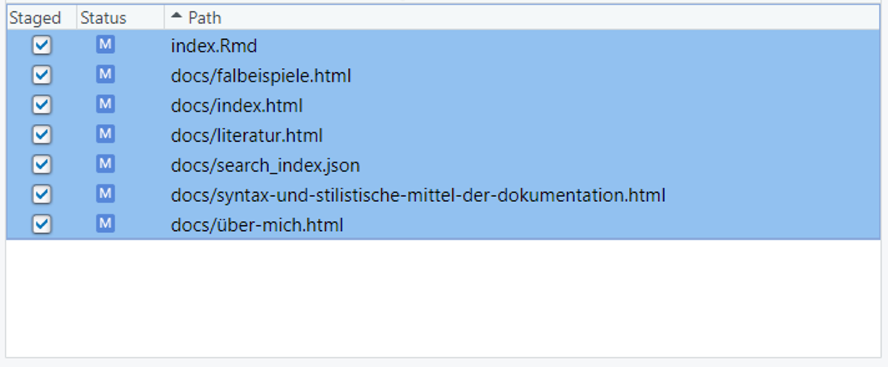
```

Eine andere Möglichkeit ist im Terminal einzugeben 

- `git add --all` 
- `git commit -m "TEXT"`
- `git push`

Falls Dateinamen zu lang sind können ebenfalls Probleme entstehen [stackoverflow](https://stackoverflow.com/questions/52699177/how-to-fix-filename-too-long-error-during-git-clone/52699496). Dann empfiehlt sich:

- `git clone -c core.longpaths=true <repo-url>` 

einzugeben. Dann wird die Option "lange Dateinnamen" für das spezielle repository deaktiviert. 

Falls Systemdateien sich auf dem lokalen Ordner befiden (bspw. `nul`) kann man diese entfernen mit:

- rechtsklick und "Git Bash Here"
- Schreibe: "rm nul" (oder die jeweilige *Dateiname.Dateiendung*...falls keine Dateiendung vorhanden wie bei diese MS-DOS Datei dann weglassen)

### Ordner lokal behalten aber auf Git löschen

Dazu kann man im Terminal eingeben `git rm -r --cached FOLDERNAME`. 

## Cache säubern 

[https://stackoverflow.com/questions/13716658/how-to-delete-all-commit-history-in-github](https://stackoverflow.com/questions/13716658/how-to-delete-all-commit-history-in-github)

Beispielsweise wenn eine Datei > 100 mb groß ist und dadurch eine commit Fehlermeldung auftritt. 

```{r eval = F}
# Type in Terminal
# Checkout
git checkout --orphan latest_branch
# Add all the files
git add -A 
# Commit the changes
git commit -am "commit message"
# Delete the branch
git branch -D main
# Rename the current branch to main
git branch -m main
# Finally, force update your repository
git push -f origin main
#PS: this will not keep your old commit history around
```


<!--chapter:end:13-Github.Rmd-->

# Bookdown

*Der Beitrag wurde das letzte mal am `r format(Sys.time(), '%d %B, %Y')` editiert*

```{r include=FALSE}

knitr::opts_chunk$set(fig.align = "center", collapse = T, echo = TRUE, message = FALSE, warning = FALSE)

# With collapse = TRUE the Source and output lived together happily ever in knitr.
# https://github.com/yihui/knitr-examples/blob/master/039-merge.md

# loading multiple packages at once with `pacman`
# create a vector name
packages <- c("tidyverse", "markdown", "knitr", "matrixStats", "patchwork", "lubridate", "plotly",  "naniar", "stlplus", "gt", "dygraphs", "htmltools", "zoo", "xts", "ggpmisc", "forcats", "RColorBrewer", "Kendall", "rstudioapi", "multcompView", "plyr", "bookdown", "janitor", "rstatix", "ggpubr", "moments", "tweetrmd", "ggthemes", "hexbin", "ggridges", "ggstream", "openair", "treemapify", "MBA", "akima", "PlotSvalbard", "sf", "rnaturalearth", "rnaturalearthdata", "rgeos", "ggspatial", "factoextra", "FactoMineR")
 
# Load the packages vector 
pacman::p_load(packages, character.only = T)


my_theme <- theme(
  panel.background = element_rect(fill = "white", color = "black"),
  panel.grid.major = element_blank(), 
  panel.grid.minor = element_blank(), 
  panel.border = element_blank())

```

```{r echo = F, fig.cap="Source from: https://github.com/rstudio/bookdown"}
knitr::include_graphics("images/065.png")
```

🔍 [https://bookdown.org/yihui/bookdown/](https://bookdown.org/yihui/bookdown/)

Bookdown wurde von Yihui Xie geschrieben und findet immer weiter Verbreitung. Es ist ein package um technische Reports, Bücher, Artikel etc. zu schreiben und mit Leichtigkeit zu formatieren (🤐 Frustpotenzial ist aber auch hier gegeben, da wie bei allen Dingen nichts auf Anhieb klappt). 

Das package basiert auf RMarkdown Dokumenten welches bedeutet, dass man Text als auch Code und den Output von Code (bspw. visualisiert als Abbildung oder Tabelle) nutzen kann. Das fertige book kann dabei in die Dateiformate *PDF*, *HTML*, *Word*, ... exportiert werden. Die Printversion als auch die Onlineversion des erstellten Buches sehen dabei sehr professionell aus. Beispiele von Büchern die mit `bookdown` geschrieben wurden findet ihr unter [https://bookdown.org/](https://bookdown.org/).

## Vorbereitung

Herunterladen von `pandoc`, `tinytex` und `bookdown`. `pandoc` und `tinytex` (Abwandlung von LaTeX) werden benötigt, um das book als .pdf file zu exportieren. 

```{r eval=F}
# installing/loading the package:
if(!require(installr)) { install.packages("installr"); require(installr)} #load / install+load installr
# Installing pandoc
install.pandoc()
# Download tinytex package
tinytex::install_tinytex()
# Download bookdown package
install.packages("bookdown")
```

Um alle `.Rmd` Dateien zu einem book zu binden muss der Befehl `render_book()` in die Konsole eingegeben werden. 

## Github pages

🔍 https://bookdown.org/yihui/bookdown/github.html
🔍 https://docs.github.com/en/pages/getting-started-with-github-pages/configuring-a-publishing-source-for-your-github-pages-site

Als Vorbereitung für die Veröffentlichung als eigenständige github pages müssen wir einige Anpassungen treffen. Die Dateien beim Rendering des Buches (alle `.html` Dateien) müssen in den Ordner `docs` verschoben werden. Dazu ergänzt man in der `_bookdown.yml` Datei den Befehl ergänzen:

```{r echo = F, fig.cap="Einstellungen in welchem Ordner das Book veröffentlicht werden soll"}
knitr::include_graphics("images/073.png")
```

Als nächstes erstellen wir eine `.nojekyll` Datei und verschieben diese nach dem rendering des books in den `docs` Ordner. Dazu in der Konsole `file.create(".nojekyll")` eingeben.

Unsere Dokumentation mit bookdown besteht aus vielen .html Dateien und kann daher über das feature github pages als eigenständige website veröffentlicht werden. Dazu müssen wir in unserem repository folgendes tun:

Settings --> Pages --> Im drop down Menü *main* und als Ordner */docs* wählen --> save

```{r echo = F, fig.cap="Einstellungen für GitHub Pages"}
knitr::include_graphics("images/072.png")
```

Falls sich github pages nicht aktualisiert kann es daran liegen, dass die `index.html` Datei aktualisiert werden muss (bei GitHub website zu finden). Das sollte das Problem beheben. 

Note: It can take up to 20 minutes for changes to your site to publish after you push the changes to GitHub. If your don't see your changes reflected in your browser after an hour, see "About Jekyll build errors for GitHub Pages sites."


## Emojiys

Emojiys können einfach in Bücher oder reports eingebunden werden. Eine große Übersicht ist [HIER](https://github.com/hadley/emo) zu finden. Für Literaturtipps bietet sich die Lupe an (🔍) oder für Tipps die Glühbirne (💡). Weitere emojiys die ich gerne verwenden sind:

* 🤐 (secret)
* 😎 (cool)
* 🚨 (alert)
* 💡 (tipp)
* 💩 (bad example)
* 💪 (good example)
* ⌚️ (time)
* 🍻 (time to celebrate)
* 🎉 (time to celebrate)
* 💯% (100%)
* 🤯 (shocked)
* 🙃
* ☀️
* 🔍 (literature)


<!--chapter:end:14-Bookdown.Rmd-->

# Blogdown

*Der Beitrag wurde das letzte mal am `r format(Sys.time(), '%d %B, %Y')` editiert*

```{r include=FALSE}

knitr::opts_chunk$set(fig.align = "center", collapse = T, echo = TRUE, message = FALSE, warning = FALSE)

# With collapse = TRUE the Source and output lived together happily ever in knitr.
# https://github.com/yihui/knitr-examples/blob/master/039-merge.md

# loading multiple packages at once with `pacman`
# create a vector name
packages <- c("tidyverse", "markdown", "knitr", "matrixStats", "patchwork", "lubridate", "plotly",  "naniar", "stlplus", "gt", "dygraphs", "htmltools", "zoo", "xts", "ggpmisc", "forcats", "RColorBrewer", "Kendall", "rstudioapi", "multcompView", "plyr", "bookdown", "janitor", "rstatix", "ggpubr", "moments", "tweetrmd", "ggthemes", "hexbin", "ggridges", "ggstream", "openair", "treemapify", "MBA", "akima", "PlotSvalbard", "sf", "rnaturalearth", "rnaturalearthdata", "rgeos", "ggspatial", "factoextra", "FactoMineR")
 
# Load the packages vector 
pacman::p_load(packages, character.only = T)


my_theme <- theme(
  panel.background = element_rect(fill = "white", color = "black"),
  panel.grid.major = element_blank(), 
  panel.grid.minor = element_blank(), 
  panel.border = element_blank())

```

# Setup a homepage with Hugo and blogdown

* A great read is from the developer of blogdown (Allison Horst) [How
    to build a Hugo page with
    blogdown](https://alison.rbind.io/post/new-year-new-blogdown/#pre-requisites)
* Pre-requisites you need
    -   R and RStudio
    -   GitHub [What is Github](https://happygitwithr.com/).

## Github

-   Git is a version control system.
-   Its original purpose was to help groups of developers work
    collaboratively on big software projects. Git manages the evolution
    of a set of files -- called a **repository** -- in a sane, highly
    structured way (such as "Track Changes" features from Microsoft Word
    on steroids)
-   Install git for windows [here](https://gitforwindows.org/)
    -   NOTE: When asked about "Adjusting your PATH environment", make
        sure to select "Git from the command line and also from
        3rd-party software". Otherwise, we believe it is good to accept
        the defaults.
    -   Note that RStudio for Windows prefers for Git to be installed
        below C:/Program Files and this appears to be the default. This
        implies, for example, that the Git executable on my Windows
        system is found at C:/Program Files/Git/bin/git.exe. Unless you
        have specific reasons to otherwise, follow this convention.
-   Now: Introduce yourself to Git


-   Use a Git client

    -   "Git" is really just a collection of individual commands you
        execute in the shell (Appendix A). This interface is not
        appealing for everyone. Some may prefer to do Git operations via
        a client with a graphical interface. Git and your Git client are
        not the same thing, just like R and RStudio are not the same
        thing. A Git client and an integrated development environment,
        such as RStudio, are not necessary to use Git or R,
        respectively.
    -   Sourcetree is a recommended option

-   The most basic commands are listed below:

    -   pwd (print working directory). Shows directory or "folder" you
        are currently operating in. This is not necessarily the same as
        the R working directory you get from getwd().

    -   ls (list files). Shows the files in the current working
        directory. This is equivalent to looking at the files in your
        Finder/Explorer/File Manager. Use ls -a to also list hidden
        files, such as .Rhistory and .git.

    -   cd (change directory). Allows you to navigate through your
        directories by changing the shell's working directory. You can
        navigate like so: go to subdirectory foo of current working
        directory: cd foo go to parent of current working directory: cd
        .. go to your "home" directory: cd \~ or simply cd go to
        directory using absolute path, works regardless of your current
        working directory: cd /home/my_username/Desktop. Windows uses a
        slightly different syntax with the slashes between the folder
        names reversed, , e.g. cd C:\Users\MY\_USERNAME\Desktop. - Pro
        tip 1: Dragging and dropping a file or folder into the terminal
        window will paste the absolute path into the window. - Pro tip
        2: Use the tab key to autocomplete unambiguous directory and
        file names. Hit tab twice to see all ambiguous options.

        -   Use arrow-up and arrow-down to repeat previous commands. Or
            search for previous commands with CTRL + r.

-   A few Git commands:

    -   git status is the most used git command and informs you of your
        current branch, any changes or untracked files, and whether you
        are in sync with your remotes.
    -   git remote -v lists all remotes. Very useful for making sure git
        knows about your remote and that the remote address is correct.
    -   git remote add origin GITHUB_URL adds the remote GITHUB_URL with
        nickname origin.
    -   git remote set-url origin GITHUB_URL changes the remote url of
        origin to GITHUB_URL. This way you can fix typos in the remote
        url.
    -   

-   HTTPS remotes look like <https://github.com/><OWNER>/<REPO>.git.

-   SSH remotes look like
    [git\@github.com](mailto:git@github.com){.email}:<OWNER>/<REPO>.git.

    -   

-   Clone the new GitHub repository to your computer via RStudio

    -   In RStudio, start a new Project:
    -   File \> New Project \> Version Control \> Git.
    -   In "Repository URL", paste the URL of your new GitHub
        repository. It will be something like this
        <https://github.com/jennybc/myrepo.git>.

-   We create a new Project, with the preferred **"GitHub first, then
    RStudio"** sequence. Why do we prefer this? Because this method of
    copying the Project from GitHub to your computer also sets up the
    local Git repository for immediate pulling and pushing. Under the
    hood, we are doing git clone.

-   Click "Create Project" to create a new directory, which will be all
    of these things:

    -   a directory or "folder" on your computer
    -   a Git repository, linked to a remote GitHub repository
    -   an RStudio Project

-   **Make local changes, save, commit**

    -   Do this every time you finish a valuable chunk of work, probably
        many times a day.
    -   A commit functions like a snapshot of all the files in the repo,
        at a specific moment.
    -   Every time you make a commit you must also write a short commit
        message. Ideally, this conveys the motivation for the change.
    -   PNG is the "no brainer" format in which to store figures for the
        web.

## Domain name

-   [See](https://bookdown.org/yihui/blogdown/domain-name.html#domain-name)
-   While you can use the free subdomain names like those provided by
    GitHub or Netlify, it may be a better idea to own a domain name of
    your own. The cost of an apex domain is minimal (typically the
    yearly cost is about US\$10), and you will enter a much richer world
    after you purchase a domain name. For example, you are free to point
    your domain to any web servers, you can create as many subdomain
    names as you want, and you can even set up your own email accounts
    using the domain or subdomains. In this appendix, we will explain
    some basic concepts of domain names, and mention a few (free)
    services to help you configure your domain name.

## Homepage

-   max. of 5 links in the header

    -   startpage (Biography with images as slideshow, e.g. recent
        posts)

    -   blog (posts)

    -   redox with widgets

        -   projects (with categories:
            Distributors/Applications/Interpretation/literature
        -   timeline/history of EH measurements ()

    -   publications (recent publications)

    -   about

## "wowchemy/starter-academic"

```{r eval = F, echo = T}
# The whole setup can be condensed into the following part:
remotes::install_github("rstudio/blogdown")
usethis::create_project()
blogdown::new_site(theme = "wowchemy/starter-academic")
blogdown::serve_site()
blogdown::new_post(title = "Hi Hugo", 
                     ext = '.Rmarkdown', 
                     subdir = "post")
usethis::use_git()
usethis::use_github() # requires a GitHub PAT
```

-   Information are taken from
    -   Xie, Y., Thomas, A., Presmanes Hill, A., 2018. blogdown -
        Creating Websites with R Markdown. CRC Press, Boca Raton.
    -   [Allison Hill
        blog](https://alison.rbind.io/post/new-year-new-blogdown/#pre-requisites)
-   Setup a profile for the page with
    -   `blogdown::config_Rprofile()`this will execute a special setup
        at every beginning

```{r eval = FALSE, echo = T}

options(
  # to automatically serve the site on RStudio startup, set this option to TRUE
  blogdown.serve_site.startup = FALSE,
  # to disable knitting Rmd files on save, set this option to FALSE
  blogdown.knit.on_save = FALSE,     #<- change
  blogdown.author = "Alison Hill",  #<- add
  blogdown.ext = ".Rmarkdown",      #<- add
  blogdown.subdir = "post"          #<- add
)

```

-   `config.toml`= Global settings for the page
-   `blogdown::serve_site` = LiveReload is implemented and the site is
    built. You can preview in the viewer pane (the function is analogue
    to `blogdown::build_site()`)
    -   This blocks the console, meaning that you will not be able to
        use your R console once you start this local web server.
-   publishing directory (by default, public/ ). Your website will
    be generated to this directory, meaning that you do not need to
    manually add any files to this directory.
-   All files are written in R markdown and knitted to a markdown
    document. Hugo is a static site generator and does not know how to
    transform **.Rmd** or **.Rmarkdown** documents into **.HTML**

## Where to adjust the Homepage

-   `rstudioapi::navigateToFile("content/authors/admin/_index.md")`
    Biographie
    -   Change your profile pic, place it in the same folder and rename
        it with **avatar.jpg**
-   `rstudioapi::navigateToFile("config/_default/menus.toml")` Rename or
    change the order of the top navbar

## Workflow

-   Workflow
    -   Open the RStudio project for the site.
    -   Start the Hugo server using blogdown::serve_site() (only once
        due to the magic of LiveReload).
    -   View site in the RStudio viewer pane, and open in a new browser
        window while I work.
    -   Select existing files to edit using the file pane in RStudio.
    -   After making changes, save if a plain .md file, or if working
        with an .Rmd or an .Rmarkdown document, knit to preview! You can
        now use the Knit button to knit to the correct output format.
        You can also use the keyboard shortcut Cmd+Shift+K (Mac) or
        Ctrl+Shift+K (Windows/Linux).
    -   The console will detect the change (it will print Change
        detected, rebuilding site.), the viewer pane will update, and
        (in a few seconds) your local view in your browser will also
        refresh. Try to avoid hitting the refresh button in your
        browser.
    -   When happy with changes, add/commit/push changes to GitHub.
    -   Having blogdown::serve_site running locally with LiveReload is
        especially useful as you can immediately see if you have totally
        screwed up. For example, in editing my about.md file, this error
        popped up in my console after making a change and I was able to
        fix the error right away:
-   If you want a featured image to accompany your post and show up on
    your listing page (the clickable list of all your posts), you'll
    want to add an image with the word featured in the filename:

## YAML metadata

-   Each page should start with YAML metadata specifying information
    like the title, date, author, categories, tags, and so on. Depending
    on the specific Hugo theme and templates you use, some of these
    fields may be optional.
-   Among all YAML fields, we want to bring these to your attention:
-   **draft**: You can mark a document as a draft by setting draft: true
    in its YAML metadata. Draft posts will not be rendered if the site
    is built via blogdown::build_site() or blogdown::hugo_build(), but
    will be rendered in the local preview mode (see Section D.3).
-   **publishdate**: You may specify a future date to publish a post.
    Similar to draft posts, future posts are only rendered in the local
    preview mode.
-   **weight**: This field can take a numeric value to tell Hugo the
    order of pages when sorting them, e.g., when you generate a list of
    all pages under a directory, and two posts have the same date, you
    may assign different weights to them to get your desired order on
    the list.
-   **slug**: A character string as the tail of the URL. It is
    particularly useful when you define custom rules for permanent URLs
    (see Section 2.2.2).

<!--chapter:end:15-Blogdown.Rmd-->

# Shiny

*Der Beitrag wurde das letzte mal am `r format(Sys.time(), '%d %B, %Y')` editiert*

```{r include=FALSE}

knitr::opts_chunk$set(fig.align = "center", collapse = T, echo = TRUE, message = FALSE, warning = FALSE)

# With collapse = TRUE the Source and output lived together happily ever in knitr.
# https://github.com/yihui/knitr-examples/blob/master/039-merge.md

# loading multiple packages at once with `pacman`
# create a vector name
packages <- c("tidyverse", "markdown", "knitr", "matrixStats", "patchwork", "lubridate", "plotly",  "naniar", "stlplus", "gt", "dygraphs", "htmltools", "zoo", "xts", "ggpmisc", "forcats", "RColorBrewer", "Kendall", "rstudioapi", "multcompView", "plyr", "bookdown", "janitor", "rstatix", "ggpubr", "moments", "tweetrmd", "ggthemes", "hexbin", "ggridges", "ggstream", "openair", "treemapify", "MBA", "akima", "PlotSvalbard", "sf", "rnaturalearth", "rnaturalearthdata", "rgeos", "ggspatial", "factoextra", "FactoMineR", "gapminder", "ggforce", "gh", "globals", "openintro", "profvis", 
  "RSQLite", "shiny", "shinycssloaders", "shinyFeedback", 
  "shinythemes", "testthat", "thematic", "tidyverse", "vroom", 
  "waiter", "xml2", "zeallot", "shiny", "rsconnect")
 
# Load the packages vector 
pacman::p_load(packages, character.only = T)

my_theme <- theme(
  panel.background = element_rect(fill = "white", color = "black"),
  panel.grid.major = element_blank(), 
  panel.grid.minor = element_blank(), 
  panel.border = element_blank())

```

```{r echo = F}
# Daten Speicherkoog einlesen
koog_raw <- readr::read_delim("data/data.csv", delim = ";", 
                          col_types = readr::cols(
                            # date = überschreibt die Spalte mit der neuen Spezifikation
                            date = readr::col_datetime(format = "%d.%m.%Y %H:%M") 
  ))
koog_raw <- janitor::clean_names(koog_raw)
koog <- koog_raw %>%
  dplyr::mutate(across(contains("eh"), ~. + 207))
# Erstelle neue Spalten mit Zeitstempeln
koog <- koog %>%
  mutate(year = lubridate::year(date),
         month = lubridate::month(date),
         day = lubridate::day(date),
         hour = lubridate::hour(date), 
         daily = format(date, "%Y-%m-%d"),
         monthly = format(date, "%Y-%m"))

# Tagesmittelwerte
koog_day <- koog %>%
  group_by(daily) %>%
  summarise_if(is.numeric, mean, na.rm = T) %>%
  mutate(daily = as.Date(daily))

# Monatsmittelwerte
koog_month <- koog %>%
  group_by(monthly) %>%
  summarise_if(is.numeric, mean, na.rm = T)
  
# Jahresmittelwerte
koog_year <- koog %>%
  group_by(year) %>%
  summarise_if(is.numeric, mean, na.rm = T)

```

🔍 [Mastering Shiny - Build interactive apps, reports, dashboards](https://mastering-shiny.org/index.html)

🔍 [https://www.youtube.com/watch?v=tfN10IUX9Lo](https://www.youtube.com/watch?v=tfN10IUX9Lo)

Shiny ist ein R package um interaktive web apps, reports und dashbords zu bauen. Shiny kann dabei die Daten online so zur verfügung stellen (bspw. über einen web browser), dass jeder darauf zugreifen kann.

😎 Mit shiny können 100 Seiten auf eine einzige Seite komprimiert werden, sodass der Nutzer individuell auf eine spezielle Seite zugreifen kann. Die Übersichtlichkeit steigt dadurch extrem. 

```{r echo=FALSE, fig.cap="Shiny Prinzip, source: https://blog.efpsa.org/wp-content/uploads/2019/04/pic6.jpg"}

```

Die zwei Hauptkomponenten einer shiny app sind **UI** (für User Interface; definiert wie die App aussehen soll) und **server function** (definiert wie die App arbeiten soll). 

```{r eval = F}
# lade shiny
library(shiny)
# create UI
ui <- fluidPage(
  "Hello, world!"
)
# create server
server <- function(input, output, session) {
}
# run the app
shinyApp(ui, server)
```

Die vier Schritte können zusammengefasst werden mit:

* Laden des shiny packages
* UI = Definiere die HTML Webpage mit der Menschen interagieren können (**frontend**)
* Wie soll sich die App verhalten durch definieren einer `server()` Funktion (ist momentan leer; **backend**)
* Ausführen der App durch die Funktion `shinyApp(ui, server)

Um ein shiny Projekt zu beginnen gibt es zwei Möglichkeiten:

* Ein neues directory anlegen durch File -> New Project -> New Directory -> Shiny Web Application 

Dadurch wird eine `app.R` Datei erstellt, in der die shiny app definiert wird. 

🎉 Damit hast du deine erste web app gebaut!

## UI Benutzeroberfläche

Als nächste gestalten und modifizieren wir die UI Oberfläche:

```{r eval = F}
ui <- fluidPage(
  selectInput("dataset", label = "Dataset", choices = ls("package:datasets")),
  verbatimTextOutput("summary"),
  tableOutput("table")
)
```

* `fluidPage()` ist eine layout Funktion um die Allgemeinen visuellen Strukturen der App festzulegen. 
* `selectInput()` lässt den Nutzer mit der App interagieren, indem eine Box bereitgestellt wird mit dem Label "Dataset".
* `verbatimTextOutput()` und `tableOutput()` sind Funktionen um shiny zu vermitteln, wo und wie der Output dargestellt werden soll. 

```{r eval = F}
# run the shinyapp again
shinyApp(ui, server)
```

## Welche Befehle sollen ausgeführt werden

Shiny verwendet *reactive programming*, dass bedeutet wir müssen shiny vermitteln **wie** eine Berechnung oder Darstellung durchgeführt wird und nicht **die** eine Berechnung durchzuführen. 

```{r eval = F}
# define server function
server <- function(input, output, session) {
  output$summary <- renderPrint({
    dataset <- get(input$dataset, "package:datasets")
    summary(dataset)
  })
  
  output$table <- renderTable({
    dataset <- get(input$dataset, "package:datasets")
    dataset
  })
}
# run the app
shinyApp(ui, server)


```

Das Objekt `server` kann noch besser definiert werden durch eine *reactive expression*. Dadurch muss man Objekte (in diesem Beispiel `get(input$dataset, "package:datasets")`) nur einmal definieren. Eine reactive expression wird dabei wie ein Funktionsaufruf genutzt:

```{r eval = F}
server <- function(input, output, session) {
  # Create a reactive expression
  dataset <- reactive({
    get(input$dataset, "package:datasets")
  })

  output$summary <- renderPrint({
    # Use a reactive expression by calling it like a function
    summary(dataset())
  })
  
  output$table <- renderTable({
    dataset()
  })
}

shinyApp(ui, server)
```

## Beispiel Speicherkoog

```{r eval = F}
# Transform the data to long format to filter by id and display value in the app
data <- koog_day %>%
  select(daily, contains("st")) %>%
  pivot_longer(cols = contains("st"), names_to = "id")

str(data)

```


<!--chapter:end:15a-shiny.Rmd-->

---
output: html_document
editor_options: 
  chunk_output_type: console
---

# Diverses 

*Der Beitrag wurde das letzte mal am `r format(Sys.time(), '%d %B, %Y')` editiert*

```{r include=FALSE}

knitr::opts_chunk$set(fig.align = "center", collapse = T, echo = TRUE, message = FALSE, warning = FALSE)

# With collapse = TRUE the Source and output lived together happily ever in knitr.
# https://github.com/yihui/knitr-examples/blob/master/039-merge.md

# loading multiple packages at once with `pacman`
# create a vector name
packages <- c("tidyverse", "markdown", "knitr", "matrixStats", "patchwork", "lubridate", "plotly",  "naniar", "stlplus", "gt", "dygraphs", "htmltools", "zoo", "xts", "ggpmisc", "forcats", "RColorBrewer", "Kendall", "rstudioapi", "multcompView", "plyr", "bookdown", "janitor", "rstatix", "ggpubr", "moments", "tweetrmd", "ggthemes", "hexbin", "ggridges", "ggstream", "openair", "treemapify", "MBA", "akima", "PlotSvalbard", "sf", "rnaturalearth", "rnaturalearthdata", "rgeos", "ggspatial", "factoextra", "FactoMineR", "gapminder", "calendR")

# Load the packages vector 
pacman::p_load(packages, character.only = T)

my_theme <- theme(
  panel.background = element_rect(fill = "white", color = "black"),
  panel.grid.major = element_blank(), 
  panel.grid.minor = element_blank(), 
  panel.border = element_blank())

```

### Entfernen aller packages

* Falls es beim arbeiten mit R und den dazugehoerigen packages zu Problemen kommt hilft der folgende Befehl diese zu loeschen: 

[R bloggers](https://www.r-bloggers.com/2016/10/how-to-remove-all-user-installed-packages-in-r/)

```{r eval=F, echo=T}

# create a list of all installed packages
 ip <- as.data.frame(installed.packages())
 head(ip)
# if you use MRO, make sure that no packages in this library will be removed
 ip <- subset(ip, !grepl("MRO", ip$LibPath))
# we don't want to remove base or recommended packages either\
 ip <- ip[!(ip[,"Priority"] %in% c("base", "recommended")),]
# determine the library where the packages are installed
 path.lib <- unique(ip$LibPath)
# create a vector with all the names of the packages you want to remove
 pkgs.to.remove <- ip[,1]
 head(pkgs.to.remove)
# remove the packages

 sapply(pkgs.to.remove, remove.packages, lib = path.lib)


```

### Shortcuts

Was wäre das Leben ohne shortcuts. Für viele Anwendungen spart es wahnsinnig viel Zeit. 

Informationen koennen auf der [RStudio Homepage gefunden werden](https://support.rstudio.com/hc/en-us/articles/200711853-Keyboard-Shortcuts) oder direkt unter Tools -> Keyboard shortcuts help. 

💡 Der shortcut für die shortcuts lautet **Alt + shift + K**

```{r echo = F}
# Daten Speicherkoog einlesen
koog_raw <- readr::read_delim("data/data.csv", delim = ";", 
                          col_types = readr::cols(
                            # date = überschreibt die Spalte mit der neuen Spezifikation
                            date = readr::col_datetime(format = "%d.%m.%Y %H:%M") 
  ))
koog_raw <- janitor::clean_names(koog_raw)
koog <- koog_raw %>%
  dplyr::mutate(across(contains("eh"), ~. + 207))
# Erstelle neue Spalten mit Zeitstempeln
koog <- koog %>%
  mutate(year = lubridate::year(date),
         month = lubridate::month(date),
         day = lubridate::day(date),
         hour = lubridate::hour(date), 
         daily = format(date, "%Y-%m-%d"),
         monthly = format(date, "%Y-%m"))

# Tagesmittelwerte
koog_day <- koog %>%
  group_by(daily) %>%
  summarise_if(is.numeric, mean, na.rm = T) %>%
  mutate(daily = as.Date(daily))

# Monatsmittelwerte
koog_month <- koog %>%
  group_by(monthly) %>%
  summarise_if(is.numeric, mean, na.rm = T)
  
# Jahresmittelwerte
koog_year <- koog %>%
  group_by(year) %>%
  summarise_if(is.numeric, mean, na.rm = T)

```

## FAQs

### Kalender erstellen

🔍 [https://r-coder.com/calendar-plot-r/](https://r-coder.com/calendar-plot-r/)

Als erstes laden wir das `calendR` package:  

```{r}
# Load the package
library(calendR)

# Display the current year
calendR()

# Specifiy the year you prefer
calendR(year = 2020)

# start with monday
calendR(year = 2021, 
        start = "M")

# change the language compared with the operating system 
Sys.setlocale("LC_ALL", "English")
calendR(year = 2021, 
        start = "M", 
        special.days = c(9, 21,300, 365),
        special.col = "lightblue"
        )

# highlight all the weekends
calendR(year = 2021,
        start = "M",
        special.days = "weekend") # Color all weekends


```


### RStudio 

🔍 [https://community.rstudio.com/t/plots-not-showing-up-in-the-plots-pane-in-rstudio/3981/5](https://community.rstudio.com/t/plots-not-showing-up-in-the-plots-pane-in-rstudio/3981/5)

Falls die Plots nicht in im plots Fenster oder im Viewer der RStudio Benutzeroberfläche angezeigt werden, sondern aussschließlich unter dem code chunk, dann müssen die folgenden Einstellungen gesetzt werden:

```{r echo=F, fig.cap="Lage Standort Speicherkoog"}
include_graphics("images/047.png")
```

### Datenmanipulation

#### Create decadal data

Ein schneller Schritt eine Spalte pro Dekade zu erstellen geht folgendermaßen:

```{r}
# Example with the gapminder data 
gapminder %>%
  select(year, country, pop) %>%
  head(n = 5)

# Use floor() and round to the nearest border
gapminder %>%
  mutate(
    decade = floor(year / 10),  
    decade = decade * 10, 
    decade = factor(decade)
  ) %>%
  select(year, decade, country, pop) %>%
  head(n = 5)


```


#### String manipulation 

🔍 [http://www.endmemo.com/r/gsub.php](http://www.endmemo.com/r/gsub.php)
🔍 [https://bookdown.org/rdpeng/rprogdatascience/r-nuts-and-bolts.html#summary](https://bookdown.org/rdpeng/rprogdatascience/r-nuts-and-bolts.html#summary)

Die wichtigsten R Funktionen um Strings zu bearbeiten sind:

* `grep()` und `grepl()`: Sucht nach einem regulären Ausdruck in einem String
* `regexpr()`, `gregexpr()` und `regexec()`: Sucht nach Treffern in einem regulären Ausdruck und geben die Indizes wieder, wo der Treffer auftrifft. 
* `sub()` und `gsub()`: Sucht nach einem regulären Ausdruck in einem String und ersetzt diesen

Das Muster ist dabei *pattern* - *replacement*: 

gsub(pattern, replacement, x, ignore.case = FALSE, perl = FALSE, fixed = FALSE, useBytes = FALSE)

```{r}
x <- "Eine tolle Exursion"
gsub("Eine tolle", "Die weltbeste", x)

```

#### Split a single column into multiple columns

🔍 [https://cmdlinetips.com/2018/03/how-to-split-text-in-a-column-in-data-frame-in-r/](https://cmdlinetips.com/2018/03/how-to-split-text-in-a-column-in-data-frame-in-r/)

Beim Anlegen von Variablennamen kann man Informationen in dem jeweiligen Namen bereits hinterlegen. Zum Beispiel die Codierung `01_10_st` kann vom Standort **01** in **10** cm Tiefe der Parameter **Bodentemperatur** sein. Möchte ich diese Spalteninformationen nun auf mehrer Spalten Verteilen eignet sich die Funktion `separate`. 

```{r}

x <- tibble(
  id = "01_10_st",
  value = 10.3
)
x

# Create new columns with the information from the id column
y <- x %>%
  separate(id, into = c("study_site", "depth", "parameter"))
y

```

Aber Achtung. R ist auch hier Anfällig gegenüber Groß- Kleinschreibung. 

```{r}
x <- "Eine tolle Exursion"
gsub("Eine Tolle", "Die weltbeste", x)
```

Ich kann aber auch das Argument setzen, dass Kleinschreibung egal ist mit:

```{r}
x <- "Eine tolle Exursion"
gsub("Eine Tolle", "Die weltbeste", x, ignore.case = T)
```

## Visualisation 

### Superscripts and subscripts

Um Zahlen an Plot labels hoch- oder tiefzustellen, bspw. Achsenbeschriftung oder Titel, kann man die Befehlen èxpression` und `paste` verwenden. Expression ermöglicht die Verwendung von Sonderzeichen und paste ermöglicht die Sonderzeichen mit *normalem* Text zu verknüpfen.

```{r}
# Erstelle willkürlich Daten a mit vier Gruppen in b
x <- tibble(
  a = rnorm(n = 100, mean = 50, sd = 2),
  b = rep(x = c("a","b","c","d"), 25)
)

x %>%
  ggplot(aes(a, b, group = b)) +
  geom_boxplot()

# [] Tiefstellen
x %>%
  ggplot(aes(a, b, group = b)) +
  geom_boxplot() +
  labs(
    title = "Eine tolle Überschrift",
    x = "Einheit (XY)",
    y = expression(E[H])
  )

# ^ Hochstellen
x %>%
  ggplot(aes(a, b, group = b)) +
  geom_boxplot() +
  labs(
    title = "Eine tolle Überschrift",
    x = "Einheit (XY)",
    y = expression(m^2)
  )

# Kombination + normaler Text
x %>%
  ggplot(aes(a, b, group = b)) +
  geom_boxplot() +
  labs(
    title = "Eine tolle Überschrift",
    x = "Einheit (XY)",
    y = expression(paste("Ca" ^"2+", " Verteilung (g ", cm^-3, ")"))
  )

# Bei langen Beschriftungen eignen sich auch Zeilenumbrüche, die mit "\n" erzeugt werden
x %>%
  ggplot(aes(a, b, group = b)) +
  geom_boxplot() +
  labs(
    title = "Eine tolle \nÜberschrift",
    x = "Einheit (XY)",
    y = expression(paste("Ca" ^"2+", " Verteilung (g ", cm^-3, ")"))
  )

```

### Modifying labels in faceted plots

🔍 [https://biostats.w.uib.no/modifying-labels-in-faceted-plots/](https://biostats.w.uib.no/modifying-labels-in-faceted-plots/)

```{r echo=F, fig.cap="@Henry Wang taken from: https://henrywang.nl/ggplot2-theme-elements-demonstration/"}
include_graphics("images/048.png")
```


```{r}
# Darstellung des gesamten Zeitraums
koog_day %>%
  filter(year > "2010" & year < "2013") %>%
  ggplot(aes(daily, st10)) +
  geom_line()

# Darstellen pro Jahr
p <- koog_day %>%
  filter(year > "2010" & year < "2013") %>%
  ggplot(aes(daily, st10)) +
  geom_line() +
  facet_wrap(~year, scales = "free_x")

p

```

Ändern der Hintegrundfarbe 

```{r}
p + theme(strip.background = element_rect(fill="lightblue", size=1, color="darkblue"))
```

Ändern der Schriftfarbe

```{r}
p + theme(strip.text.x = element_text(size=12, face="italic", color="darkblue"))
```

Ändern der Beschriftung ist nicht ganz unkompliziert, da die Beschriftung von den Variablennamen der Spalten genommen wird. Möglichkeit 1 wäre, die Beschriftung im Datensatz direkt zu ändern. Möglichkeit zwei ist einen neuen Namensvektor zu erstellen und die Funktion `labeller = labeller()` zu verwenden. 
```{r}
# Erstelle Namensvektor
new_name <- c("2011" = "Gute Zeiten", "2012" = "Schlechte Zeiten")

# Nutze die Funktion labeller
koog_day %>%
  filter(year > "2010" & year < "2013") %>%
  ggplot(aes(daily, st10)) +
  geom_line() +
  facet_wrap(~year, scales = "free_x", labeller = labeller(year = new_name))

```

Auch der Abstand zwischen den Panels kann verändert werden mit `theme(panel.spacing = unit())`. 

```{r}
# Hm....es gibt immer noch einen overlap bei der X-Achse
p + theme(panel.spacing.x = unit(.25, "cm"))
```

```{r}
# JA :) Besser
p + theme(panel.spacing.x = unit(1.25, "cm"))
```

## Glossary

-   [Shell](https://de.wikipedia.org/wiki/Shell_(Betriebssystem))

    -   In der Informatik wird als Shell die Software bezeichnet,
        mittels derer ein Benutzer mit einem Betriebssystem interagiert
        -- eine Mensch-Maschine-Schnittstelle. Während Kernel den Kern
        eines Betriebssystems bezeichnet, ist die Shell (englisch für
        „Schale", „Hülle" oder „Außenhaut") anschaulich dessen
        Außenschicht und damit Schnittstelle (englisch Interface) zum
        Benutzer.
    -   Synonym = "terminal", "command line", and "console"

-   [GUI](https://de.wikipedia.org/wiki/Grafische_Benutzeroberfl%C3%A4che)

    -   Grafische Benutzeroberfläche oder auch grafische
        Benutzerschnittstelle oder Bedienoberfläche (Abk. GUI von
        englisch graphical user interface) bezeichnet eine Form von
        Benutzerschnittstelle eines Computers. Sie hat die Aufgabe,
        Anwendungssoftware auf einem Rechner mittels grafischer Symbole,
        Steuerelemente oder auch Widgets genannt, bedienbar zu machen.

-   [Clipboard](https://de.wikipedia.org/wiki/Zwischenablage)

    -   Ein Clipboard ist der englischsprachige Begriff für eine
        Zwischenablage in der elektronischen Datenverarbeitung, d. h.
        ein virtueller Zwischenspeicher

<!--chapter:end:16-Diverses.Rmd-->

