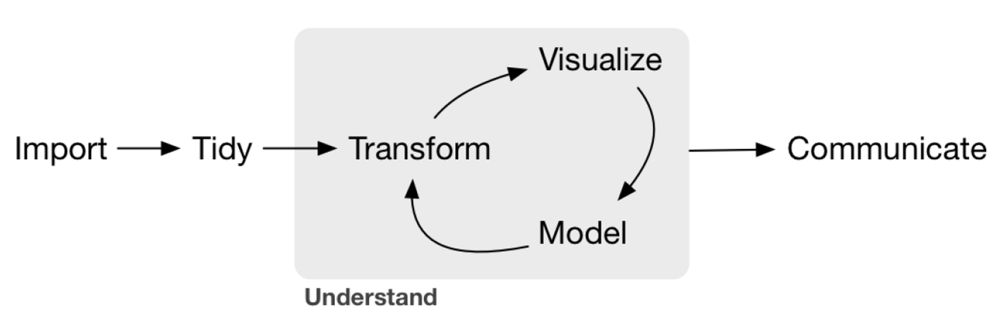
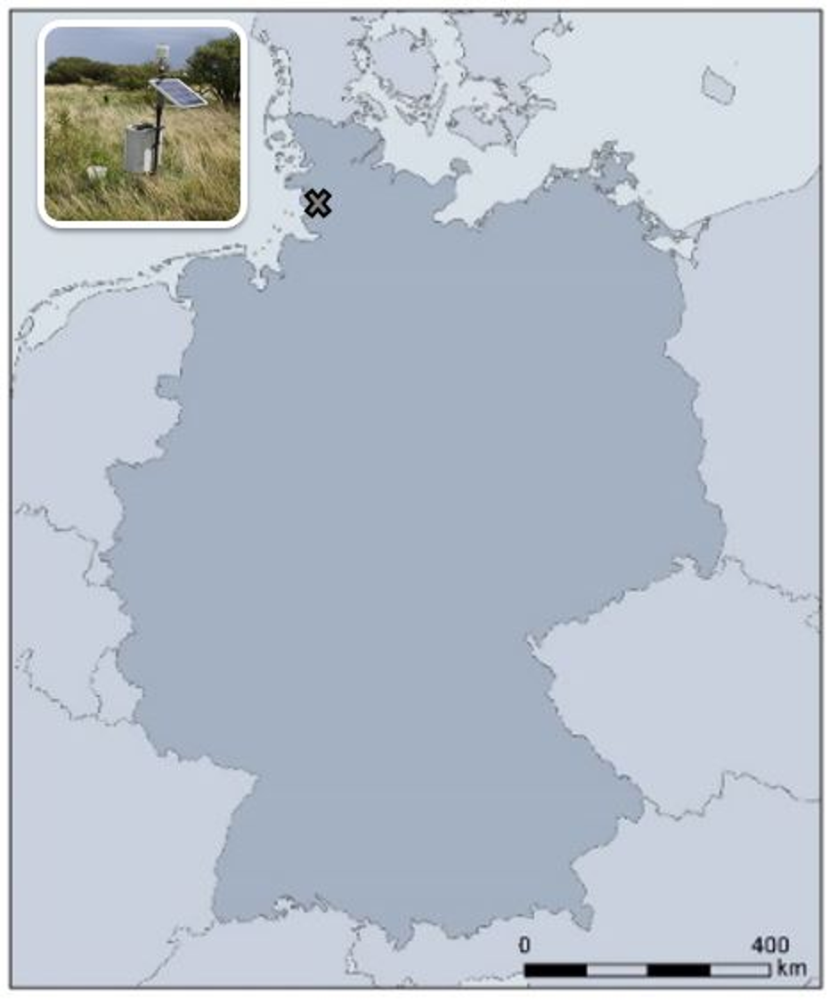
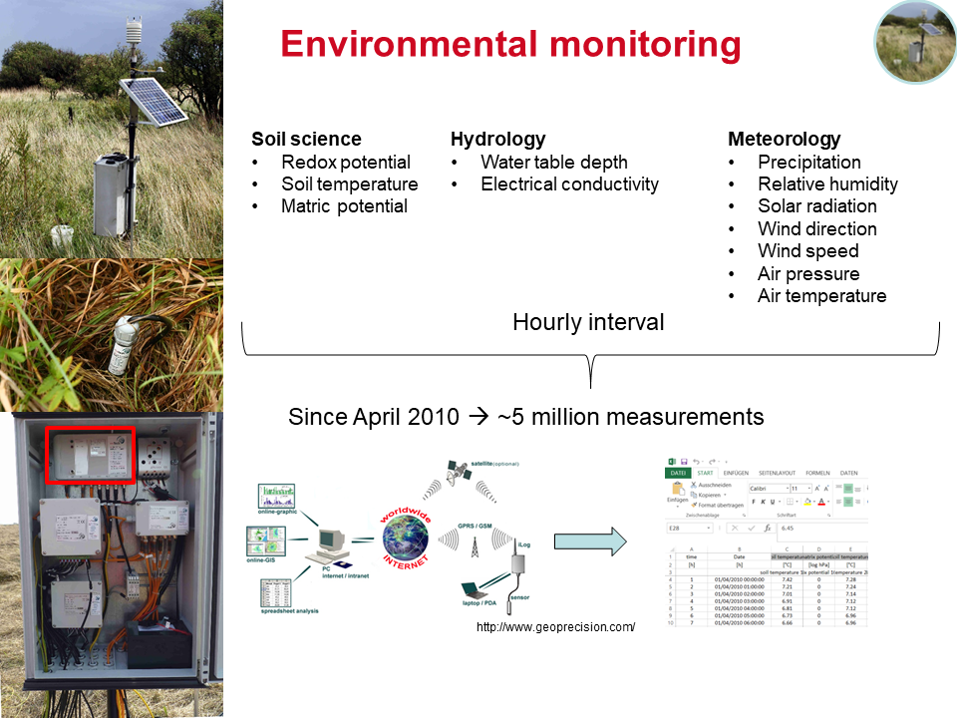

--- 
title: "Daten Analyse mit RStudio - Dokumentation"
author: "Dr. Kristof Dorau"
date: "Aktualisiert am: `r Sys.time()`"
site: bookdown::bookdown_site
description: "Explorative Datenanalyse in den Geowissenschaften"
---

```{r include=FALSE}

knitr::opts_chunk$set(fig.align = "center", collapse = T, echo = TRUE, message = FALSE, warning = FALSE, fig.width=6, out.width="100%")

# With collapse = TRUE the Source and output lived together happily ever in knitr.
# https://github.com/yihui/knitr-examples/blob/master/039-merge.md

# loading multiple packages at once with `pacman`
# create a vector name
packages <- c("tidyverse", "markdown", "knitr", "matrixStats", "patchwork", "lubridate", "plotly",  "naniar", "stlplus", "gt", "dygraphs", "htmltools", "zoo", "xts", "ggpmisc", "forcats", "RColorBrewer", "Kendall", "rstudioapi", "multcompView", "plyr", "bookdown", "janitor")
 
# Load the packages vector 
pacman::p_load(packages, character.only = T)


my_theme <- theme(
  panel.background = element_rect(fill = "white", color = "black"),
  panel.grid.major = element_blank(), 
  panel.grid.minor = element_blank(), 
  panel.border = element_blank())

```

# Einleitung

Die folgende Anleitung soll eine Schritt-für-Schritt Hilfe für das erfolgreiche Arbeiten mit R geben. Die Abfolge der Kapitel basieren dabei auf den nötigen Schwerpunkten, wie sie für den täglichen Gebrauch der Datenanalyse in den Geowissenschaften nützlich ist. Grundlage dieser Dokumentation und quasi die Bibel für Datenanalysten ist das Buch: H. Wickham and Grolemund, **R for Data Science** - Import, Tidy, Visualize, and Model Data, O'Reilly, Sebastopol, CA, USA, 2016. In der Literatur wird auch häufig das Akronym "r4ds" verwendet, was eine Anspielung auf den Titel des Buches und dessen Inhalt ist.   

```{r echo=F, fig.cap="Schema Datenanalyse", fig.width=6, out.width="100%"}

```

## Syntax und stilistische Mittel der Dokumentation

Die Kapitel beinhalten verschiedene Rubriken und werden durch graphische Hilfsmittel hervorgehoben: 

* Sogenannte code chunks (wir lernen später was dies ist) sind grau hinterlegt und beinhalten Kommentare (**#**), code (in diesem Fall die Rechnung 1+1; ja...R kann wie ein Taschenrechner benutzt werden) und das dazugehörige Ergebnis (**##**; zwei Rauten und keine Sorge, wir klären noch was die [1] bedeutet).

```{r eval=TRUE, echo=TRUE}
# Dies ist ein Kommentar 
1+1 
```

* 🔍️ Hier werden Literaturtipps gegeben 

* 💡 Nützliche Informationen und Tipps

* 🚨 Wichtig zu merken

> Dies ist ein Zitat

* lubridate::() Das Wort zusammen mit "::" gibt den Namen des verwendeten packages wieder

* Funktionsnamen + Klammer werden im Fließtext grau hinterlegt, wie bspw. `sum()` oder `mean()`

## Falbeispiele 

### Speicherkoog

Ein Datensatz mit dem ich mich in dieser Dokumentation beschäftige stammt vom Polder Speicherkoog, einer 1978 eingedeichten Fläche an der Nordwestküste von Schleswig-Holstein. Es ist damit der jüngste Koog und aus den Salzwiesen - die sich auch noch heute vor dem Deich befinden - haben sich in den letzten Jahrzehnten Kalkmarschen entwickelt. Mit > 90 Bodenpunkten gehören diese Böden zu den fruchtbarsten die es in Deutschland zu finden gibt. 

```{r echo=F, fig.cap="Lage Standort Speicherkoog"}

```

An diesem Standort wird von [Prof. Tim Mansfeldt; Universität zu  Köln](https://geographie.uni-koeln.de/forschung/arbeitsgruppen/bodengeographie-bodenkunde) seit 2010 eine vollautomatisierte Messstation betrieben, die seitdem auf stündlicher Basis eine Vielzahl an bodenkundlichen, meteorologischen und hydrologischen Daten aufzeichnet. Der Datensatz (Stand Januar 2021) ist als .csv Dtei 27 mb groß und umfasst 4,5 Millionen Messwerte. Warum die Auswertung dieses doch recht unhandlichen Datensatzes in R ein Kinderspiel ist möchte ich auf den folgenden Seiten hervorheben. Dieses Fallbeispiel werde ich vorallem für die Darstellung von Zeitreihen nutzen. 

```{r echo=F, fig.cap="Messprogramm"}

```

### `mtcars` Datensatz

R beinhaltet bereits interne Datensätze mit denen man explorative Datenanalyse betreiben kann. Einer davon ist der `mtcars` Datensatz. Es handelt sich dabei um Daten die aus dem 1974 erschienenen Magazin *Motor Trend US* veröffentlicht wurden. Es beinhaltet Informationen zu Treibstoffverbrauch und zehn weiteren Kennwerten von 32 Automobilen.  

* [, 1] 	mpg 	Miles/(US) gallon
* [, 2] 	cyl 	Number of cylinders
* [, 3] 	disp 	Displacement (cu.in.)
* [, 4] 	hp 	Gross horsepower
* [, 5] 	drat 	Rear axle ratio
* [, 6] 	wt 	Weight (1000 lbs)
* [, 7] 	qsec 	1/4 mile time
* [, 8] 	vs 	Engine (0 = V-shaped, 1 = straight)
* [, 9] 	am 	Transmission (0 = automatic, 1 = manual)
* [,10] 	gear 	Number of forward gears
* [,11] 	carb 	Number of carburetors 

## Über mich

Hi, ich bin Kristof und mit Leib und Seele Bodenkundler. Neben dreckigen Händen von der Geländearbeit mag ich das Hineindenken in große Datensätze. Während Studium, Promotion und auch in der Zeit danach als Wissenschaftlicher Mitarbeiter ist mein treuer Partner stets Excel (+xlstat), Origin und SPSS gewesen. Im Frühjahr 2020 war es dann soweit. Nach einigen flüchtigen Begegnungen hatte ich endlich einen intensiveren Kontakt mit R (besser gesagt RStudio) und habe mir Mühe gegeben Sie intensiver kennenzulernen. Excel habe ich das noch nicht erzählt, da ich Sie gelegentlich auch noch nutze 🤐 

R und ich haben also (Stand 09.04.2021) 1-jähriges und was soll ich sagen...😍 Ich hoffe wir werden noch viele schöne Jahre miteinander haben und ich kann den ein oder anderen überzeugen sich dieser Partnerschaft anzuschließen.

## Literatur 🔍

Diese Dokumentation orientiert sich stark an den folgenden Quellen, hinsichtlich Aufbau, Inhalt und Abbildungen. Quasi ein großer Kuchen mit vielen Inhaltsstoffen, die dem Leser hoffentlich schmecken werden. Als wesentliche Quellen zu nennen sind:

* [R for Data Science - Hadly Wickham](https://r4ds.had.co.nz/index.html)
* [YaRrr! The Pirate’s Guide to R - Nathaniel D. Phillips](https://bookdown.org/ndphillips/YaRrr/)
* [Computational Methods in der politischen Kommunikationsforschung - Julian Unkel ](https://bookdown.org/joone/ComputationalMethods/)
* [R Markdown: The Definitive Guide - Yihui Xie](https://bookdown.org/yihui/rmarkdown/)
* [Data Visualization in R - Claus Wilke](https://wilkelab.org/SDS375/)
* [A ggplot2 Tutorial for Beautiful Plotting in R - Cedric Scherer](https://www.cedricscherer.com/2019/08/05/a-ggplot2-tutorial-for-beautiful-plotting-in-r/#colors)
* [Illustrationen von Allison Horst](https://github.com/allisonhorst/stats-illustrations)


